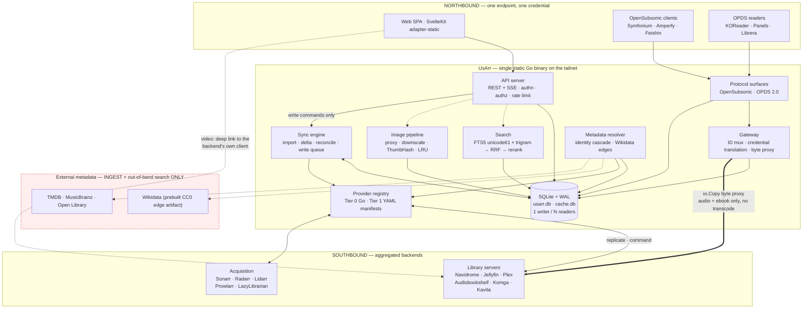

# UsArr — Architecture

**Status:** design document, pre-alpha. One slice of it is now built — the §8.5 Search-and-Grab path
over Prowlarr and the §14 security floor beneath it. §16 is authoritative for which milestone owns a
thing; whether a thing is built is read off the tree (`web/src/routes`, `internal/`), not off this
document.
**Last revised:** 2026-08-16 (revision 2, after a three-way adversarial review —
[`REVIEW-LOG.md`](./REVIEW-LOG.md) records what was applied and what was rebutted).
**Evidence:** [`RESEARCH.md`](./RESEARCH.md). **Decisions:** [`DECISIONS.md`](./DECISIONS.md).
**Mostly deferred ideas and the seams that keep them cheap — unless the heading says *Declined*:**
[`FUTURE.md`](./FUTURE.md).

This is the document a contributor reads start to finish: principles, shapes, invariants, reasons.
Reference detail — full DDL, endpoint tables, normalisation matrices, provider inventories — lives
in [`reference/`](./reference/) and is linked per section.

| Reference | Contents |
|---|---|
| [`reference/schema.md`](./reference/schema.md) | Complete DDL and the invariant behind every index |
| [`reference/sync.md`](./reference/sync.md) | Import, delta, reconcile, the write queue, SQLite pragmas |
| [`reference/search.md`](./reference/search.md) | FTS5 query construction, escaping, RRF, re-rank weights |
| [`reference/gateway.md`](./reference/gateway.md) | OpenSubsonic/OPDS endpoint map, ID codec, byte proxy, write-back |
| [`reference/crossmedia.md`](./reference/crossmedia.md) | Wikidata artifact, scoring ladder, Train Dreams worked example |
| [`reference/tags.md`](./reference/tags.md) | Tag vocabulary, implications, inheritance, filtering |
| [`reference/providers.md`](./reference/providers.md) | Provider interface, manifest grammar and its limits |
| [`reference/arr-apis.md`](./reference/arr-apis.md) | \*Arr API facts: normalisation, enums, paths, gotchas |
| [`reference/security.md`](./reference/security.md) | Encryption, key rotation, SSRF classes, redaction |

Facts about upstream APIs were read from a shipped OpenAPI spec or from source. Judgements say so.
⚠️ = **unverified**. 🔍 = **inference** from verified facts, not itself verified.
✅ = **verified**: checked against the artefact that would falsify the claim — a primary source or a
live run for an external fact, the code itself for a claim about this tree. **Never another document
agreeing**: two statements of the same thing are one source in two hats. This extends
`RESEARCH.md`'s legend onto this tree and states that exclusion; it does not depart from it.
🚩 = **correction**: a clause struck by a later ADR, or a fact that contradicts the assumption a
reader would otherwise make. ℹ️ = **aside**, detail or derivation that changes nothing above it.
📌 = **pin**, kept so a later reader does not narrow it.
🚩 **Sites below use ✅ where this definition does not reach — for build state, that a migration
landed or something shipped, and for one part of this design agreeing with another.** LS-390 in
`REVIEW-LOG.md` tracks the follow-on motion that re-words them and retires this note; they are known
non-conformances, not a second sense.
🔍 **Those four entries are a reconstruction, not a recovery (2026-08-20):** the wording is inferred
from how this document already uses each glyph, not restored from the lost commit that defined them.

---

## 1. Vision and non-goals

### 1.1 What UsArr is

A **self-hosted aggregation gateway**: one unified, searchable catalogue over everything you own and
everything you might want, that plugs into the players you already use.

- **Northbound** — protocol surfaces existing clients already speak (OpenSubsonic, OPDS): one
  endpoint, one credential, the union of every backend library.
- **Southbound** — the services UsArr aggregates: Navidrome, Jellyfin, Audiobookshelf, Komga/Kavita
  for libraries; Sonarr, Radarr, Lidarr, Prowlarr and the post-Readarr book tools for acquisition.
  **The two roles are separate bindings, and that is the normal case** (§8.3): Navidrome catalogues
  music and Lidarr or Prowlarr takes the request; Komga and Kavita catalogue comics and nothing
  downstream of them accepts a release at all.

Between them: **one canonical library database** across six media types — movies, TV, music, ebooks,
audiobooks and comics — with cross-media links, one tag vocabulary, one search box, one request flow,
and **user-defined libraries that are UsArr's organisation rather than a copy of upstream's** (§6.5).
Media type is the navigation axis and a library is a scope; the two are never merged (§17.2).

> **UsArr coexists with the ecosystem; it does not replace it.** Sonarr keeps doing acquisition,
> Jellyfin keeps doing playback, Navidrome keeps being an excellent music server. UsArr is the layer
> that makes them one catalogue. Every design decision that follows is downstream of that: features
> that would move UsArr toward *replacing* a neighbour (a transcoder, a player) are permanent
> non-goals, and features that make the neighbours easier to live with are the point.

| # | Property | Concretely |
|---|---|---|
| 1 | **Fast** | Every user-facing read is a local SQLite query. No screen waits on an upstream call (§13). |
| 2 | **A gateway, not a player** | No in-app player, no transcoding, ever. UsArr does carry bytes for its own OpenSubsonic/OPDS surfaces, because those protocols have no link-out affordance (§5.4). Video links out. |
| 3 | **Pluggable** | Runs over any single **library-bearing** service, a full stack, or a service nobody wrote Go code for. With only Prowlarr it runs in **Search-and-Grab mode** (§8.5) — a defined configuration, not an empty app. |
| 4 | **One library** | One canonical `work` table. Instances are replication sources, not the model. One work maps to rows in many instances at once. |
| 5 | **Requests are a pillar** | Owned and unowned in one result set with clear availability state; one Add that routes (§8.3). |
| 6 | **Cross-media + provenance** | "Train Dreams" surfaces the 2025 film **and** the Denis Johnson novella, joined by a typed evidence-carrying edge (§9). Acquisition source is a first-class indexed attribute, never a string in a release name (§10). |

**The honest floor.** UsArr requires **at least one library-bearing service** to present a library.
Prowlarr alone has no library; what it supports is Search-and-Grab mode. Stated because the
alternative is a user seeing a working install with nothing in it and no way to know why.

### 1.2 Deployment assumption: a tailnet

UsArr assumes a Tailscale tailnet or equivalent overlay. The network is authenticated at the
transport layer before UsArr sees a packet, so the threat model is "people I deliberately let onto
my tailnet" — a small trusted group, **not zero adversaries**: a kids account, a guest's laptop and a
compromised TV are all on it. Because the backend is Go, `tailscale.com/tsnet` can embed a tailnet
node directly in the binary (§12.3). ⚠️ tsnet specifics are from research notes and must be verified.

What the tailnet does **not** buy: it does not authenticate a backend to UsArr (§11.3), does not make
a leaked backend credential harmless, and does not authorize anything. Internet exposure is a
supported hardened secondary mode; credential encryption and the SSRF policy apply identically.

### 1.3 Single-user first, multi-user schema from day one

v0.1 ships single-user: one implicit owner, user-management UI hidden. Two hard rules from migration
0001:

1. **Every table that should be user-scoped carries `user_id`:** `request`, `tag_assignment`,
   `playback_state`, `play_history`, `playlist`, `saved_filter`, `client_credential`, `session`,
   `audit_log`, `write_queue`, **`library`** and **`library_override`** (§6.5). Retrofitting
   multi-tenancy touches every query; hiding a UI is free. The two library tables are named
   explicitly because they arrived after this list was written and the two statements of the same
   rule had drifted apart. `library.user_id` is the **owner**; `user_library_access` (§12.2, v1.0)
   is a **grant to a different user**, and the two are not alternatives — DDL and the reasoning in
   [`reference/schema.md`](./reference/schema.md) §13.1.
2. **Every read path that aggregates across instances takes an access-scope parameter** — in the
   query signature, not bolted on later, defaulting in v0.1 to the owner's full scope. This covers
   the grid, search, the client prefix index, the availability rollup and every northbound surface. A
   rollup computed across instances a user cannot see is an existence oracle; the scope parameter is
   what stops multi-user becoming a redesign.

### 1.4 Non-goals

**Permanent refusals.** These are not deferrals and never will be:

- **A video transcoder.** No FFmpeg command lines from user input, no hardware-acceleration
  backends, no patched FFmpeg fork (ADR-0006). ~7–12 engineer-months to reach a *worse* result than
  Jellyfin, plus a permanent High-severity CVE class — Jellyfin shipped FFmpeg argument injection
  twice, and CVE-2025-31499 was a bypass of a fix shipped in 10.8.13.
- **An in-app media player.** Playback is the backend's job and the client app's job.
- **Any FFmpeg dependency**, in any form, for any purpose.
- **Reimplementing the \*Arr download/import engines.**
- **A required sidecar** — no Postgres, no Redis, no search server. Optional backends may exist; none
  may ever be required.
- **Being a dashboard.** Homarr occupies that niche well.

**Scope decisions, not refusals** — deferred with their seams recorded in
[`FUTURE.md`](./FUTURE.md): WASM plugins, an external search engine, typo tolerance, OIDC/passkeys/
TOTP/forward-auth, the cross-media fuzzy ladder, a Jellyfin-compatible surface, video byte-proxying,
release calendars, and per-user statistics.

Two things worth stating precisely because they are easy to misread:

- **UsArr does not carry video bytes.** Video links out to the backend's own client. UsArr *does*
  proxy bytes for its own OpenSubsonic and OPDS surfaces (§5.4) — a plain `io.Copy` with `Range`
  handling and **no transcoding, ever**.
- **UsArr will not put an external metadata API on a *blocking* render path.** Providers are
  ingest-time. The one qualified exception is unowned search (§8.6): a remote query runs **out of
  band**, off the handler, streamed into an already-rendered page over SSE, never persisted until
  requested.

---

## 2. The replica-not-proxy principle

> **UsArr is not a proxy. UsArr is a replica.** Every user-facing read renders from local SQLite. No
> browser request ever *awaits* an outbound call. Upstream services are **replication sources** and
> **command sinks**, never request-time dependencies.

Once synced, with every service offline UsArr still browses, searches, sorts and filters at full
speed. Two honest caveats: this holds only **after a completed initial sync** (a first run against an
offline stack shows nothing), and posters not yet cached show their placeholder until a service
returns, because \*Arr cover art requires the instance's API key (§4.4).

### 2.1 The failure modes this eliminates

| Mechanism | Observed in | Killed? |
|---|---|---|
| Live third-party API on the render path | DroppedNeedle (MusicBrainz @ 1 req/s → ~50 min per 10k albums, first-party docs) | **Yes** |
| All-or-nothing page load | Homarr's dominant complaint | **Yes** |
| Fan-out search as slow as the deadest indexer (30 s+) | Prowlarr#712 | **Partly** — catalogue search is local; *release* search is remote, behind progressive disclosure (§8.4) |
| Background jobs stall the request path | Overseerr#2030 (open 2021 → archive) | **No** — needs bounded pools and an explicit writer scheduler (§7.6) |
| Heap blowup on large \*Arr payloads | arr-dashboard retrofitted streaming parse | **No** — needs streaming ingest (§7.2) |

**SQLite is not the bottleneck** — Seerr users report 82k items at ~1.5 s cold load with zero tuning.
Spend the budget on scheduling, I/O and **images** (§4.4: posters are 5–9 MB per screenful against
~30 KB of JSON).

### 2.2 What it costs, and where it stops

The price is cache coherency, and one conflict rule — **stated on three axes, because an
unqualified form of it is wrong** (ADR-0026 narrows ADR-0004 here, and this is the section that owns
the rule, so the narrowing lives here rather than only in the ADR):

> **The \*Arr owns the truth about the \*Arr's own state. It never owned the truth about the user's
> organisation.** On divergence with no in-flight write, the \*Arr wins **on the state axis**, and
> only there.

| Axis | Owner | Wins on divergence |
|---|---|---|
| **State** — does the remote item exist, is it monitored, is there a file, which quality profile, which root folder | The \*Arr / backend | **Upstream, always. No override tier exists.** These are the inputs to the write queue (§7.6); a user-editable copy means the UI claims "monitored" while Sonarr disagrees, the queue issues commands against a fiction, and the sweep fights the user forever. |
| **Organisation** — which library a work is in, what it is called, what kind it is, what feeds it, where its requests go | **UsArr (the user)** | **UsArr, always.** Upstream never had an opinion about this, or had a bad one (§6.5). |
| **Display identity** — title, sort title, year, cover, and "is this link really this work" | Upstream by default | **An explicit user correction**, then §6.3's authority rule. Both values are retained; the override never writes back upstream. |

Unambiguity on the state axis prevents a category of flip-flopping bugs — and makes two guards
mandatory, because "the \*Arr always wins" is dangerous when the \*Arr is lying (§7.4).

| Concern | Model |
|---|---|
| Metadata, browse, sort, filter; catalogue search over **owned** items; availability; cross-media edges | **Replicated.** Local SQLite. |
| Tags, requests, users, playback position, **library organisation and display-identity corrections** | **Owned outright.** Nobody upstream has this, or upstream has it and is wrong. |
| **Search over unowned items** | **Not replicated.** Live, out of band, SSE-streamed, not persisted (§8.6). UsArr does not and will not hold a copy of TMDB. |
| **Media bytes** | **Live pass-through.** Video: link out. Audio/ebook on UsArr's own surfaces: `io.Copy` proxy (§5.4). |
| **Release search across indexers** | **Live**, behind progressive disclosure (§8.4). |

The unifying rule: **UsArr replicates everything a screen renders from its own library, never a byte
stream, and never a third party's catalogue.** A replica that can be more correct than its source is
still a replica — it is one with an owned overlay, and the overlay is the two rows above plus the
organisation axis.

### 2.3 Two rules that make it non-negotiable in code

1. **No HTTP handler serving the browser may hold an outbound HTTP client.** Enforced by package
   boundary: `api` imports `store`, never `provider`. Unowned search (§8.6) obeys this literally —
   the handler writes to a channel; a worker owns the client.
2. **Degraded ≠ blocked.** With a breaker open, rows return `"stale": true, "degraded_services":
   [...]` behind a small non-modal banner. No grey-out, no spinner.

---

## 3. System diagram



1. Solid lines into `DB` are the render path; every dashed line is off it. `API` has **no solid line
   to any southbound service** — replica-not-proxy as topology.
2. The thick line is the byte proxy, and it exists **only** for UsArr's own surfaces. Video is a
   dashed deep link from the SPA; UsArr never carries it.
3. The red `ext` box is reachable only from `META`, only in the background, never from a handler
   blocking a response.

⚠️ **The three OpenSubsonic clients named in the diagram are not an implemented client matrix, and
two of them cannot connect.** Verified from source: **Amperfy** has zero occurrences of `apiKey` in
its entire Swift source and builds `u` + `t`/`s` only; **Feishin**'s Subsonic controller has no
`apiKey` path either. Both implement salt/token exclusively, so **neither can authenticate to an
`apiKey`-only server**. The policy is still right — the alternative is storing recoverable passwords
— but the consequence belongs in the milestone rather than in a demo. **Symfonium** is the reference
client, and ⚠️ **its own `apiKeyAuthentication` support is unverified**: its documentation does not
mention API keys and it is closed-source (§16, v0.4).

There is **no Jellyfin-compatible northbound surface** in the diagram or the roadmap (deferred —
FUTURE.md §6). An earlier draft deferred it in the text and drew it as first-class here; diagrams are
read as commitments.

---

## 4. Components

### 4.1 API server

Go, `net/http` plus a light router. `/api/v1/*` (keyset-paginated, ETagged, JSON); `/api/events`
(one **SSE** stream — plain HTTP, survives reverse proxies, auto-reconnects with `Last-Event-ID`,
and UsArr's push traffic is one-directional); `/img/{cache_key}?w={allowlisted}` (§4.4); `/rest/*`
and `/opds/*` (§5.2); `/stream/{usarr_id}` (§5.4); `/` (the embedded SPA).

**`/img/*` is authenticated** like the rest of the API, authorized against the owning item, and
served `Cache-Control: private, max-age=31536000, immutable`. A content-derived key justifies
*immutability*, not *publicness*; `public` on a per-user-authorized resource tells shared caches to
re-serve it across users. Genuinely public provider artwork lives at `/img/public/*` so the
distinction is structural, not conditional.

⚠️ **"Content-derived" is loose, and the imprecision matters to what `immutable` promises.**
`cache_key` is `sha256(credential-stripped source_url)[:16]` — derived from the **URL**, not from
the bytes (§4.4's own bullet says so). One key therefore names one `source_url` for the life of the
row, which is what carries the immutability claim, and `image_asset.source_url` being UNIQUE is
where that property actually lives. What it does **not** promise: if an upstream replaces the bytes
at a URL it has already served, the key does not change and a client keeps the old picture until the
year is up. Acceptable — cover art is decoration whose staleness is visible and harmless — but it is
a consequence of the key being URL-derived, and an argument that leans on "content-derived" is
leaning on something that is not true of this key. **The same is true of `image_asset.id`**, so the
key shape is not what earns the directive; the uniqueness of `source_url` is.
`reference/http-api.md` §9 states the limit to a consumer.

**Health.** `live` = process up. **`ready` = migrations applied and the listener accepting** — the
app can serve from an empty or partial library. **Sync state is not a readiness signal**; it is
reported at `/api/v1/system/sync` and on the Services screen (§17.3). Gating readiness on initial
sync produces a first-run restart loop under Docker's defaults (`start-period=0s`, `retries=3`) that
looks exactly like a crash.

The API server owns authn, authz filtering, CSRF and rate limiting, and no outbound HTTP client.

### 4.2 Sync engine and metadata resolver

The sync engine runs three channels plus a write queue (§7) on bounded worker pools, never a request
goroutine, and owns the single SQLite writer and the scheduler in front of it.

The metadata resolver does identity resolution (§6.4) and cross-media linking (§9), both off any
blocking path, and owns provider rate budgets: MusicBrainz **1 req/s per IP** (hard, enforced with
503s, contact `User-Agent` mandatory), Open Library 1/s anonymous or 3/s with an identifying UA,
Hardcover 60/min, Metron 20/min burst. TMDB's real limit is **⚠️ unpublished** (the repeated
"~40 req/s" is a forum claim); AniList's "90 req/min" is **⚠️ unconfirmed** — `docs.anilist.co` 403s
automated fetches and AniList has run degraded at a lower limit for long periods. For both: read
`X-RateLimit-Remaining` where present and back off adaptively on 429 rather than trusting a constant.

### 4.3 Provider registry

**Two tiers** over one interface (§11): compiled-in Go, and declarative YAML manifests. Providers are
resolved from a **registry of factories** and the sync engine never names a concrete provider type —
that is the seam that makes a third tier (FUTURE.md §1) an added factory rather than a rewrite.

### 4.4 Image pipeline

⚠️ **Amended 2026-08-19 by [ADR-0050](./DECISIONS.md#adr-0050): the base output format is stdlib
JPEG, and AVIF is deferred.** This section named AVIF as the only output codec and **never named a
base format at all**, which left the pipeline with no declared encoding for the bytes it stores —
the gap ADR-0050 exists to close. The "AVIF encoded lazily off the request path" sentence below is
kept as written, because the *lazy, off-the-request-path* shape is what survives; the codec in it is
not what ships. AVIF is buildable here (`gen2brain/avif`, MIT, cgo-free) and is deferred on a
measured trade — one dependency plus a **second** WASM runtime against bytes on the wire — with the
condition that reopens it named in the ADR. `image_asset.format` (migration
`00008_image_asset_format.sql`) is the seam that keeps the switch cheap.
**One consequence lands in this section rather than in the ADR only: `format` is one column per
`image_asset` row, while this section stores up to SEVEN widths per asset** — so ADR-0050 clause 1
makes it a rule that every stored width, **`orig` included**, is produced by UsArr's own encoder in
that one codec. **There is no passthrough width**, and `?w=orig` is a re-encode like the other six.
⚠️ **Input is a separate question and is the likelier revisit**: Kavita — v0.1's catalogue source —
writes covers as PNG by default and can be set to **WebP or AVIF**, neither of which the standard
library decodes.

Posters are the bottleneck: a 60-item viewport at 500×750 is ~5–9 MB per screenful against ~30 KB of
JSON. **Ingest-time downscale** to a **fixed width allowlist** (`92, 154, 200, 342, 500, 780, orig`;
arbitrary `?w=` is a cache-poisoning DoS and a live CVE class, GHSA-rrr6-mvwg-9pg9), **~~AVIF~~
JPEG (ADR-0050) encoded lazily off the request path** (~10–20× slower than WebP), **all transcoding
behind a
`min(NumCPU, 4)` semaphore** (jellyfin#9795 is exactly this failure), and **ThumbHash inline in every
list payload** (~25 B/item; chosen over BlurHash on decode cost, 503 µs vs 6.5 ms, because decode
runs on every page load and encode runs once). Three rules that are not obvious:

- **`cache_key` derives from the credential-stripped URL.** Provider keys (TMDB v3 uses `?api_key=`)
  are never stored in `image_asset.source_url` or the HTTP cache — they are attached at request time.
  That keeps keys out of every backup and support bundle, and means rotating a provider key does not
  invalidate the whole image cache.
- **Proxying is mandatory** — \*Arr `MediaCover.url` is instance-relative and requires the API key,
  which must never reach a browser. Path shapes differ per app
  ([`reference/arr-apis.md`](./reference/arr-apis.md) §6).
- **A URL read out of an upstream response body is its own SSRF class** — neither admin-configured
  nor a known provider. `image_asset` carries `origin_service_instance_id` and `origin_class`, and
  the fetcher selects policy from the **row**, not the URL string
  ([`reference/security.md`](./reference/security.md) §2).

**4.4.1 Cold start — the moment the speed opinion forms.** §13's first-paint and `/img` numbers are
**cache-hit** numbers. The real first run fetches 10k posters through UsArr, downscales at up to
seven widths, encodes ThumbHash and backfills the remaining widths behind a 4-way semaphore
(~~AVIF~~ — ADR-0050). On a Pi that is not 90
seconds, and if nothing is done the new user's first ten minutes are grey boxes — the exact
impression the architecture exists to avoid. Four rules:

1. **Viewport-prioritised fetching.** The SPA reports its current viewport window; those
   `image_asset` rows jump the queue and background backfill runs behind them. This single change is
   what makes cold start feel instant instead of alphabetical.
2. **Smallest size first.** Fetch 92px, encode ThumbHash and `dominant_color` from it immediately,
   defer larger widths ~~and AVIF~~ (ADR-0050) — ThumbHash coverage then races ahead of poster
   coverage by an order of magnitude.
3. **`dominant_color` is available before ThumbHash** (one average over the 92px fetch), so the empty
   card is title and year over a colour fill, never a grey box. **The foreground colour is chosen in
   the pipeline, not in CSS, and it is the one colour in the system that is data rather than a
   token** — so it needs a rule, and it did not have one:

   > **Pick the theme text token, light or dark, that scores the higher contrast ratio against the
   > computed `dominant_color`. If the winner is still below 4.5:1, adjust `dominant_color`'s
   > lightness — away from the text colour, in 2% steps in OKLCh, preserving hue and chroma — until
   > it clears 4.5:1. The fill is decoration; the title is content, and content wins.**

   Two supporting rules, because otherwise the ratio is not computable from what ships.
   **Neither the title nor the year may carry `opacity`** — a composited opacity changes the
   effective ratio (~0.45 on the measured pair) by a mechanism no contrast check sees, so the year
   uses a real colour token. And **12 px semibold is normal text under WCAG, not large** (large is
   ≥18.66 px bold or ≥24 px), so 4.5:1 applies to both lines with no 3:1 shortcut.
   **The assertion belongs where the colour is produced, and it is owed rather than written:**
   nothing recomputes the ratio today, because nothing emits `dominant_color` yet. Whoever lands the
   image pipeline owes `make check` a test that recomputes the ratio for every
   `(dominant_color, foreground)` pair the pipeline emits and fails below 4.5:1.
   The mockups' own sample data already contains a failing pair — `#16130e` on `#7d6a4f` is
   **3.57:1** for the title and 3.12:1 for the year — which is what a mid-luminance fill does: with
   an average taken over arbitrary cover art, mid-luminance is common and *both* black and white
   land near 3.5:1 on it. One bad swatch would be a nit; having no rule is the finding.
4. **Progressive rendering.** The grid paints from `work` rows as import phase A commits (§7.2);
   images fill in behind, and the grid is never blocked on the image queue.

Cost: a priority queue and a client-driven hint endpoint, roughly a day's work — the difference
between "fast" and "broken" on the only run most evaluators ever do. Budget rows are in §13.

### 4.5 Web client

SvelteKit `adapter-static`, embedded via `embed.FS`, no Node in production. UI philosophy in §17.1.
**Keyset-paginated "Load more" plus `content-visibility: auto` is the default list renderer**
(revised — see below); **never load full item records** (keyset windows of ~100, prefetching ±2
pages); **service worker** stale-while-revalidate for `/api/*` and cache-first for `/img/*`;
**prefetch on intent**; and **pending-write chips** keyed by the ULID idempotency key that resolve
from SSE — a chip, not an optimistic overlay (§7.6).

**List rendering, revised — this replaces "virtualize everything over ~200 rows" (ADR-0029).**
That earlier rule was written before anyone costed what virtualization takes away. Virtualization
removes off-screen rows from the DOM, and *"accessible landmark navigation, find in page, or
intra-page anchor navigation are based solely on DOM structure, and virtualized content is by
definition not in the DOM"* (<https://github.com/WICG/virtual-scroller>). **Ctrl+F for the album is
exactly what a power user does in a library browser**, so that is a functional regression, not a
theoretical one. `content-visibility: auto` skips *rendering* without removing content: *"the
skipped contents must still be available as normal to user-agent features such as find-in-page, tab
order navigation, etc."* (<https://developer.mozilla.org/en-US/docs/Web/CSS/content-visibility>,
Baseline September 2024). Infinite scroll is refused outright — NN/g finds it *"can be downright
harmful to usability — in particular, for search results"*, and Baymard measured "Load more" plus
lazy loading as the best-performing pattern. Three consequences, all normative:

1. **The default is "Load more" over keyset pages, with `content-visibility: auto` on rows.** The
   two positions are closer than they look: with ~100-row windows and ±2 pages prefetched the
   *mounted* set is small either way; what differs is whether unmounted rows are absent from the DOM
   or present-but-unpainted.
2. 🚩 **A UsArr list row is not a `<tr>`, and this constraint is the reason.** `content-visibility:
   auto` is defined entirely in terms of size, layout and paint containment, and **CSS Containment
   Module Level 2 excludes internal table boxes from all three**
   (<https://drafts.csswg.org/css-contain-2/>, fetched 2026-08-16): *"giving an element **size
   containment** has no effect if any of the following are true: … if its principal box is an
   **internal table box**"*, and the same exclusion for layout and paint containment *"other than
   table-cell"*. A `<tr>` is `display: table-row` — an internal table box, and not a table-cell — so
   the declaration is applied, reads back as `auto`, and does nothing. **Measured in Chromium at
   5,000 rows: document height 120,000 px with and without the declaration, identical; the same test
   on `<div>` rows produces the 185,000 px placeholder height, i.e. the mechanism works.** `<tbody>`
   is also an internal table box, so chunking does not rescue it, and `<td>` *can* take containment
   but collapses the cells to 9 px — visible corruption. **There is no element inside a `<table>`
   that `content-visibility` can usefully sit on.**

   Therefore the list primitive is named rather than assumed: **rows are `display: grid` elements
   carrying explicit `role="table"` / `role="row"` / `role="columnheader"` / `role="cell"`.** The
   responsive stacking fork below 760 px already builds half of this, so the cost is convergence
   rather than a new component.

   **This creates an accessibility obligation and it is not optional.** An ARIA grid must carry by
   hand everything a native `<table>` gives for free: the roles above on every element, header
   association, `aria-rowcount`/`aria-colcount` where the rendered set is a window onto a larger
   one, and — since the sticky header row is now a `role="row"` of `role="columnheader"` cells
   rather than a `<thead>` — a name for each column that survives the ≤760 px stacked view. **That
   is a required component test, not a review item.**
3. **Virtualization is an escalation, not a default, and its threshold is set from a benchmark that
   does not exist yet — but the benchmark must measure the operations that are actually expensive.**
   No number is chosen here, deliberately: the earlier "~200" had no measurement behind it and
   inventing a replacement would repeat the mistake. **`make bench` gains a required line**, and its
   scope is the correction: **scrolling a list costs 0.1–0.3 ms at every size and is not the
   constraint.** The two operations that are O(all loaded rows) are the **density toggle** and the
   **theme toggle**, because each sets an attribute on `<html>` and invalidates every element that
   reads a custom property — measured on desktop x86 Chromium against the real markup at **153 ms
   at 1,000 rows, 1,199 ms at 5,000 and 6,508 ms at 25,000** for density, and **1,356–4,514 ms at
   25,000** for theme. Both are top-bar controls present on every screen, both are pure-local
   no-data interactions, and both are therefore governed by **the design's *Controls* budget — target
   < 100 ms, hard fail at 400 ms** (`design/DESIGN-DIRECTION.md` §7.2). ⚠️ **This read *"Tier 0 by
   the design's own definition, whose hard fail is 100 ms"*, and §7.2 carried no such definition
   until it was given one.** Tier 0 is scoped to reads out of local SQLite, and a control that
   fetches nothing is not a read; the claim is replaced rather than re-pointed, because the citation
   was never the broken part. So the required line measures, at 1k / 5k /
   25k rows, in both themes and at all three densities, on the §13 reference hardware:
   **(a)** density-toggle wall clock, **(b)** theme-toggle wall clock, **(c)** filter and sort
   wall clock, **(d)** scroll frame time, and **(e)** scrollbar drift as
   `|scrollHeight after a full scroll − scrollHeight at load| / scrollHeight`, which must stay
   under 2%. Frame time alone cannot detect (e), and none of (a)–(c) is visible from a scroll test.

   🔍 **The honest DOM-row ceiling is in the high hundreds to low thousands, not the tens of
   thousands — inference, with the extrapolation shown.** The measured desktop cost is 0.15–0.26 ms
   per row for a density change. A Pi 5 is conservatively 3–5× slower at style recalculation and
   layout, which puts the **400 ms** *Controls* hard fail at roughly **400–1,200 rows in the DOM** as
   the markup stands, or **1,200–2,400** with `table-layout: fixed` and a working containment path.
   ℹ️ **Those are this paragraph's previous 100–300 and 300–600 multiplied by four, and that is the
   entire derivation** — the ceiling is a budget divided by a per-row cost, so it is linear in the
   budget, and moving the budget from 100 ms to 400 ms moves the ceiling by exactly 4×. Nothing was
   re-measured, and no per-row figure changed. **That number, not the scroll threshold, is what the
   benchmark exists to settle**, and the earlier text's implied 25,000-row ceiling was reading the
   wrong operation. ⚠️ **ADR-0029's amendments carry the current arithmetic**, including a measured
   cost for the shipped 200-row page; this paragraph is the shape of the reasoning, not the operative
   number.
4. ✅ **`contain-intrinsic-size` has measured values now, and the previously prescribed one was
   wrong three ways.** The browser uses it as the placeholder height for skipped elements; when it is
   wrong the scrollbar drifts as content scrolls in, which reads as *slowness*. The earlier
   prescription — `contain-intrinsic-size: auto var(--row-h)` — fails because: **(a)** `--row-h` is
   inert on the row it is meant to describe (`min-height` does not apply to `display: table-row`;
   forcing `--row-h: 100px` leaves the row at 28.0 px, and the density control works only through
   `--row-py` padding) — which the grid-row primitive in point 2 also fixes, since `min-height` does
   apply to a grid item; **(b)** even used correctly it is off by ~50%, because real rows are not
   one height — measured on the search screen at compact density there are **six distinct row
   heights (28, 30, 45, 47, 59, 62 px, mean 42.0)**, eighteen across the three densities, so
   estimating 25,000 rows at 28 px understates the scroll height by ~350,000 px (33%); and **(c)**
   `contain-intrinsic-size` sizes the **content box**, so padding and border are added on top — a
   24 px row with `auto 28px` produced a 37 px placeholder. **What ships is
   `contain-intrinsic-size: auto <measured content-box height>` per row shape**, relying on `auto`'s
   remembered-size behaviour for the rest, with (e) above as the assertion. The measured values are
   **28 / 32 / 36 px for a one-line row** and **45 / 49 / 53 px for a rich one**, at compact /
   standard / relaxed, with **0.76 / 0.70 / 0.65% drift against a 2% budget** — measured by the
   frontend thread's `pnpm bench:list`. ⚠️ **The one-line figure is uniform; the rich one is a
   bimodal population and `45 / 49 / 53` is its mean content box, which is also its modal border
   box** — see §7.4 before "correcting" it by a border width in either direction. Recorded in
   [`design/DESIGN-DIRECTION.md`](./design/DESIGN-DIRECTION.md)
   §7.4 and [ADR-0029](./DECISIONS.md#adr-0029), so **this is an implementable rule rather than a
   direction**. §7.4 also carries the rule that **a row-height change must invalidate the remembered
   intrinsic size**, which is required rather than advisory.

The one deliberate exception to "never load the whole library" is the **client-side prefix index,
over *top-level works only*** (`movie, series, artist, album, book, comic, game`) — never seasons,
episodes, tracks, comic issues **or `person` works** (ADR-0033: a credited author is not something
the user browses, and shipping every author and illustrator to the client would spend the byte budget
on rows with no destination). Fields `{id, title, year, kind, availability_state}` in a columnar
payload plus ThumbHashes as raw bytes in a side `ArrayBuffer` (~25 B each, not ~34 base64 chars),
at a realistic 110–160 B/item. **Hard cap 25,000 items.** Against §13's six-type reference library
that is **~27,500 top-level works — over the cap**, and the cap's failure mode is that the single
mechanism the whole perceived-speed story rests on turns itself off. So the degradation is specified
properly rather than left as "ship nothing":

- **Under the cap** the client ships the full index (~1.5–2.1 MB at 13k items, ~3.0–4.4 MB at 27.5k),
  and Tier 1 answers every top-level query locally.
- **Over the cap the client ships a *partial* index, not none**: every work in the currently scoped
  libraries (§17.2's `?lib=` chip, which is usually a small fraction of the corpus), plus the
  top-N by `popularity` from the remainder to fill the budget. **The UI says so** — the search box's
  hint line reads *"instant results cover your current library scope; press Enter to search
  everything"* — and Tier 2 server search is one keystroke away rather than a silent fallback.
  A partial index beats no index, and the seam already exists because the index is built per access
  scope and ETagged by `(user_id, access_scope_version)` (§1.3).
- **The cap is a byte budget, not a row count**, and 25,000 is the row figure that budget currently
  buys. When the six-type payload is measured rather than estimated, the cap moves with it.

---

## 5. The gateway

Endpoint-level detail: [`reference/gateway.md`](./reference/gateway.md).

### 5.1 The four problems

ID collision (clients cache IDs *indefinitely*, in playlists and offline downloads) →
§5.3; credential translation (the client has one UsArr credential, UsArr has N backend credentials,
and they must never meet) → §5.2; byte delivery → §5.4; capability skew → §5.5.

### 5.2 Northbound surfaces and credential translation

**OpenSubsonic** is the highest-leverage integration available: speaking it as a *server* means ~40
client apps work with no client work by UsArr.

> 🚩 **UsArr's OpenSubsonic surface implements `apiKeyAuthentication` ONLY and actively refuses
> salt/token auth.** Classic auth is `u`+`t`+`s` where `t = md5(password + salt)`, which
> **mathematically requires the server to hold the password recoverably**. Four wire rules, all
> required and all detailed in [`reference/gateway.md`](./reference/gateway.md) §2: the parameter is
> **`apiKey`**, a query parameter (✅ verified against the spec); `apiKey` together with `u` is
> **rejected**; `u`/`t`/`s`/`p` alone are **actively rejected with the spec's error code**, never
> silently ignored, because silent ignoring lets a client believe it authenticated; and since the
> spec does **not** require TLS, the key rides in the request line of every call — serve over TLS,
> warn otherwise, and redact (§14). The spec only *recommends* dropping salt/token, so the refusal
> is UsArr's own policy and must be a hard rejection rather than an omission. A minority of ancient
> clients will not work; that is correct. Reference client: **Symfonium**.

**OPDS 2.0 with 1.2 fallback** is cheap — JSON over a metadata table — and serves KOReader, Panels,
Librera and Moon+ Reader. **Auth is HTTP Basic**, the `client_credential` as the password, because
those readers predominantly speak Basic and nothing else. Consequences, all normative: serve over
TLS or warn, since the credential is sent on every request; **`Authorization` is stripped before any
redirect UsArr emits**, so a reader that forwards credentials across hops cannot leak the UsArr
credential to a backend; and acquisition links point at UsArr's own `/stream/{usarr_id}`, never at a
backend URL. ⚠️ Whether each reader forwards `Authorization` across redirects is unverified and is a
named test case.

**Credential translation.** The client presents a UsArr `client_credential`; UsArr presents
`service_instance.api_key_enc`, decrypted in memory only.

- **Client credentials are server-generated**, ≥128 bits from `crypto/rand`, stored as
  **HMAC-SHA256 under a server-side key**, looked up by `key_prefix`, compared with
  `subtle.ConstantTimeCompare`. **Not Argon2id, and this is not an oversight.** A `client_credential`
  is a high-entropy bearer token, not a password: a memory-hard KDF buys nothing against 128 random
  bits and costs everything. Subsonic clients authenticate *per request* — one Symfonium poster grid
  is ~60 `getCoverArt` calls, which at m=19 MiB is 1.1 GB of transient allocation and 60 sequential
  memory-hard runs on a Pi, and any unauthenticated caller could OOM the process with
  `GET /rest/ping?apiKey=garbage` in a loop. **Do not "fix" this back to Argon2id.**
- **Backend credentials are never returned to any client, in any form, ever** — not in a response,
  not in a redirect target, not in logs or a support bundle.
- **Northbound authorization is UsArr's own**, never delegated to a backend's.

### 5.3 Stable IDs

Clients cache IDs forever; an unstable scheme silently destroys user playlists.

```
usarr_id := crockford_base32( varint(instance_id) || kind_byte || enc_byte || native_id_bytes )
```

- `instance_id` is `service_instance.id`, assigned once and **never reused**.
- **`kind_byte` encodes the *remote* kind, not `work.kind`**, and that distinction is worth stating
  because the two vocabularies are not the same size: the map already carries `author` (LazyLibrarian's
  own remote kind) and `file`, neither of which is a `work.kind`. ADR-0033's new `work.kind = 'person'`
  therefore takes **`kind_byte` 13**, allocated in the same commit as `comic_issue`'s 12 and before any
  client caches an id, for services that report a creator entity under a name other than `author`;
  remote `author` keeps byte 10, and both resolve to `work.kind = 'person'`. The full map is in
  [`reference/gateway.md`](./reference/gateway.md) §3.
- **`kind_byte` is required, not decoration.** The only unique index on `service_item_link` is
  `(service_instance_id, remote_kind, remote_id)`; without the kind at lookup time SQLite uses only
  the leftmost column and every resolve degrades to a scan over one instance's links — ~400k rows for
  a 2k-series Sonarr. Indexing `(instance, remote_id)` instead is not available: `remote_id` is
  **not** unique per instance across kinds (Sonarr series 42 and episode 42 both exist).
- `enc_byte` records the encoding: `0x00` verbatim UTF-8; `0x01` a 32-hex or UUID identifier decoded
  to 16 raw bytes and re-hexed on the way out. There is no `0x00` *separator* — `varint` is
  self-delimiting, so a separator is decodable dead weight.

**Length, honestly.** Base32 expands 8/5: a 32-hex id is 19 B → **31 chars**; a verbatim 26-char ULID
is 29 B → **47 chars**; a verbatim 32-char non-hex id is 35 B → **56 chars**, over the ~48 target. The
length requirement is a **target the compaction rule meets for hex/UUID backends and misses for some
others**, stated rather than pretended. 🔍 Per-backend native-ID formats are inference and must be
checked against live instances **before the codec is frozen — it is unchangeable once clients cache
ids.**

**The ID addresses a `service_item_link`, not a `work`,** because a work can be merged or split by
the identity cascade, and merges must not corrupt a playlist. Two corrections to the earlier claim
that "nothing UsArr computes is in it": `instance_id` is assigned by UsArr, and *which* link is
addressed was driven by an admin-editable `priority`. The true invariant is narrower and pinned:

> The ID is stable for a fixed `(instance, kind, native id)`. **Once a link has been addressed
> northbound it is pinned** (`is_northbound_canonical = 1`) and priority changes do not move it. When
> a pinned instance is deleted, UsArr mints an alias row so old IDs still resolve; it never silently
> rebinds.

**Unguessability is not a property of this scheme** — base32 decodes in one line and \*Arr native ids
are small sequential integers, so the space is enumerable. The earlier "opaque to the client"
requirement was false and is struck. **Authorization must never depend on ID secrecy:** every
resolution — browse, metadata, `getCoverArt`, `stream`, OPDS acquisition — performs a
`user_library_access` + permission check **before any backend call**, returning the protocol-native
not-found (Subsonic 70) on failure, never a 403, which would confirm existence. Failures are
rate-limited and audit-logged so enumeration is visible.

### 5.4 Stream path: proxy for audio and ebooks, link out for video

**This reverses the earlier design, and the reason matters more than the conclusion.** The earlier
design defaulted to a `302` redirect and rested its safety case on "the backend mints a scoped
ephemeral token and UsArr puts *that* in the redirect". That premise is false:

- ✅ `jellyfin/jellyfin#10808` — *"Refactor 'Copy Stream URL' to not leak the user's session API
  key"* — is an **open issue proposing** per-object scoped keys, filed precisely because Jellyfin has
  no such thing today and its stream URLs carry the user's full session token.
- ✅ Navidrome does **not** support OpenSubsonic `apiKeyAuthentication` in any release or in `master`
  (v0.63.2 latest; two PRs open, neither merged) — so there is no Navidrome API key to mint either.

With no scoped token, a 302 hands the client a **backend-user-equivalent credential** usable outside
UsArr's authorization for its natural lifetime — un-doing library visibility and parental controls
wholesale, on a tailnet whose threat model includes a kids account. Two further unresolved problems:
a minutes-lived token breaks *seek*, because most Subsonic clients re-`Range` the same URL rather
than re-calling `stream`; and cookie-session backends cannot be redirected to at all.

| Item | Path | Why |
|---|---|---|
| Audio, ebook, comic on UsArr's own surfaces | **UsArr proxies the bytes** | These protocols have one acquisition verb and no safe way to send a client elsewhere |
| Video | **Link out** to the backend's own client; the northbound surfaces advertise no video stream endpoint | UsArr has no video northbound surface, and video is where the byte cost is ruinous |
| Images | Always proxied and cached (§4.4) | `MediaCover` requires the API key; a poster is ~30 KB |

**What the proxy is:** a plain `io.Copy`, with correct `Range` / `Content-Range` / `206` /
`If-Range` / `ETag` / `Accept-Ranges` handling, a bounded buffer, and the client's `Range` passed
through verbatim. **No transcoding, ever** — if a client asks Subsonic for a transcode, UsArr serves
the original and reports the real format.

**What it costs, plainly:** `Range` handling is a genuine source of subtle bugs and this puts UsArr
on the byte path for audio. Mitigations: audio is ~1–5 Mb/s, not a 60 Mb/s 4K remux; there is no
transcode; and the failure mode of getting it wrong is a client that cannot seek, not a leaked
credential. Given the choice between a bug-prone surface and handing tailnet clients a full backend
session token, the surface wins.

**The `/stream/{usarr_id}` token** is specified rather than gestured at, in
[`reference/gateway.md`](./reference/gateway.md) §4: HMAC-SHA256 over
`(user_id, client_credential_id, usarr_id, instance_id, expiry, nonce)` under a key derived with a
**distinct HKDF label from the credential KEK**, so the two rotate independently; **numeric TTL —
120 s default, 600 s maximum**; `client_credential_id` checked against `revoked_at` on **every**
redemption, so revoking a credential really does kill outstanding links; a nonce replay cache; ±60 s
skew tolerance; `no-store` and `no-referrer`. A short TTL does not break seek here, because the bytes
come from UsArr: the client re-`Range`s the same URL and UsArr re-authorizes.

### 5.5 Capability negotiation and degradation

`getOpenSubsonicExtensions` returns what **UsArr** implements, a fixed set determined by UsArr's
code. Per-backend capabilities come from `Provider.Capabilities`, which **probes the live instance**
rather than assuming from `kind`. Unsupported operations return the protocol's own error (70/50),
never a 500. When a backend is down, **browse and search still list everything** from the replica;
stream requests fail individually after a short deadline; the breaker means a down instance is
*known* down and is skipped rather than re-timed-out on; the Services screen (§17.3) and a non-modal
banner name it. The catalogue never greys out.

---

## 6. The data model

Full DDL and the invariant behind every index: [`reference/schema.md`](./reference/schema.md).

SQLite, `STRICT` throughout. **Minimum SQLite is 3.43, not 3.37**: `STRICT` needs 3.37, but the FTS5
`contentless_delete=1` option that makes search deletable arrived in **3.43.0**, and without it
deleted works stay in the search index forever (§8.2).

### 6.1 The three-layer core

> **The film *Train Dreams* and the novella *Train Dreams* are two different `work` rows connected by
> a typed edge — NOT one `work` with two editions.**

Two mature bibliographic systems converged on this (Open Library: *"if a work has been adapted or
retold, it is considered a unique work"*; Wikidata models adaptation as `P144 based on`, a link
*between* works). Practically: the film has a director and a Radarr row, the novella an author and a
book-service row; one table would be mostly nulls and would destroy "monitor the movie but not the
book". And the UI can say **"Based on the novella by Denis Johnson"** instead of silently merging.

`work` (the abstract work, kind-scoped) → `edition` (a specific released form — the 2160p cut, the
2013 Granta paperback, **the audiobook**, the Portuguese translation) → `media_file` (concrete
bytes).

**`work.kind` is:** `movie, series, season, episode, artist, album, track, book, comic, comic_issue,
person, game`.

> **`person` is new in this revision, and it is the migration that creates `work` or never
> (ADR-0033)** — read `internal/db/migrations` for which one that is. `work_credit`
> (ADR-0031) is M:N and required for books and comics explicitly — *"it is needed for books too,
> where role matters: author, translator, editor, illustrator"* — and its creator column pointed at a
> `work` whose only available kind was `artist`. So a book's author and a comic's penciller were
> stored as **`artist`-kind works**, with two consequences that are not theoretical: §17.2's
> navigation enum maps `artist` to **Music**, so every author and illustrator appeared in the Music
> media type; and §4.5's Tier 1 prefix index counts `artist` as a top-level work, so every credit
> consumed the client-side byte budget that §13 already shows is over its cap. `person` fixes both by
> existing.
>
> **The rule for which kind a credit points at** — because "just use `person` for everyone" loses the
> Music type: **a credit points at an `artist` work when a connected service models it as a top-level
> catalogue entity in its own right** (Navidrome and Lidarr artists, which have albums, a page and a
> library row), **and at a `person` work otherwise** (authors, translators, editors, illustrators,
> writers, pencillers, inkers, colorists, letterers, cover artists, and narrators reported only as a
> string). A human who is both — a musician who also writes books — is two rows, one per kind, joined
> by nothing in v0.1; that is a real and stated loss, and it is smaller than the two failures above.
> 🔍 The rule is inference from how the sources model their own data, not a citation.
>
> **`person` is excluded from the navigation enum (§17.2), from the Tier 1 prefix index (§4.5) and
> from the FTS corpus (§8.2)** — the last because there is no person screen in any milestone, so a
> person hit would be a search result with nowhere to land. It is reachable as a credit link on an
> item (§17.6). Adding it to the corpus later is a predicate change plus an FTS re-index; adding the
> *kind* later is a CHECK-constraint change (a SQLite table rebuild), a rebuild of every client prefix
> index, and a `kind_byte` allocation that §5.3 states is unchangeable once clients cache ids. That
> asymmetry is the whole timing argument, and it is ADR-0030's argument in a second place.

> **`comic_issue` is new in this revision, and the migration that creates `work` is the only cheap
> moment to add it (ADR-0030)** — read `internal/db/migrations` for which one that is, and for
> whether that moment has passed. Every other multi-level medium got its levels — TV has `series`/`season`/`episode`,
> music has `artist`/`album`/`track` — and comics had exactly one member, `comic`, with a
> `work_comic` subtype whose columns (`issue_number`, `volume`) describe an *issue* while the search
> corpus, the Tier 1 prefix index, the `kind_byte` map and the grid all treat `comic` as
> **top-level**. Those two readings are inconsistent in precisely the way the `audiobook`
> kind-vs-edition contradiction was. With one member you either lose issues entirely (no "43 of 60",
> no per-issue availability, no read progress) or you put series and issues in one kind and
> distinguish on `parent_work_id IS NULL` — which breaks §8.2's corpus rule, because that rule
> filters on `kind`, so every chapter title enters the FTS corpus and a large manga library swamps
> every query. Fixing it now is one line. Fixing it later is a CHECK-constraint change (a SQLite
> table rebuild), an FTS re-index, a rebuild of every client prefix index, and a change to the
> `kind_byte` codec, which §5.3 states is **unchangeable once clients cache ids**. `comic` is the
> series; `comic_issue` is the issue or chapter, excluded from the corpus. Both bytes are allocated
> in the same commit, before any client caches anything.
>
> **There is no third level for Kavita's Volume, and no `manga` kind.** Kavita has a Volume node;
> Komga, Mylar3 and Kapowarr do not, so a third tier would be empty on four backends out of five and
> would render "Volume 1 › Chapter 1" for one of them over the same files. It is carried as
> `work_comic_issue.volume_label` + `volume_sort` — a grouping attribute, not a node, and a
> deliberate loss of fidelity against Kavita that is written down as one. Manga is not a separate
> kind either: Komga models no manga/comic distinction at all (only `ReadingDirection`), and
> Kavita's `LibraryType` members `Manga` / `Comic (Flexible)` / `Comic (ComicVine)` are
> filename-parsing modes over one identical entity tree. Splitting the kind would also make §6.4's
> "never auto-merge across `kind`" a liability: the same series in Komga (undifferentiated) and
> Kavita (in a Manga library) would land in two kinds and could never be merged. The real
> differences live where they cost nothing: `work_comic.reading_direction`, `external_id.source`
> (AniList/MAL/MangaBaka vs Comic Vine/Metron), routing caps, and a derived `type:manga` system tag.
> **The Newznab category is *not* on that list**, and an earlier draft put it there: §8.5 establishes
> that there is no manga category in the Newznab standard at all — `7030 Books/Comics` is the only
> comics category, `7000` is its parent rather than its sibling, and a search filtered on `7030`
> returns *zero* manga because Nyaa maps its Literature categories to `7000`. So the category
> separates comics-and-manga from everything else and never manga from western comics. The four
> remaining items carry the argument on their own.

> **`audiobook` is not a `work.kind`. An audiobook is an `edition` of a `book` work**
> (`edition.format = 'audiobook'`). The earlier draft asserted both readings in one document, which
> made it unimplementable: as a kind, an audiobook could never be matched to its own ebook (the
> cascade forbids cross-kind matching); as an edition, the kind enum and the `type:` tag vocabulary
> were wrong. Edition wins — it matches Open Library, which ADR-0009 already cites as authority. It
> propagates: `work.kind` drops `audiobook`; `edition.format ∈ {print, ebook, audiobook, bluray, web,
> vinyl, flac, cbz, …}`; `request` carries `(work_kind, edition_format)`; the tag vocabulary gains a
> `format:` namespace and `type:audiobook` is gone; `Caps.MediaKinds` becomes a list of
> `(kind, format)` pairs (§11).

**The `edition` table stays**, against a review recommendation to cut it, and the six-media-type
expansion turned that from a defensible call into an obvious one. Books, audiobooks and ebooks
genuinely need it — it is what makes the Portuguese translation *Sonhos e Comboios* the same work as
*Train Dreams*, and what makes ebook-vs-audiobook routing a schema property rather than adapter
special-casing. Three independent confirmations arrived with the expansion: **Chaptarr**, the only
new \*Arr-lineage book manager, converged on exactly `Book` → `Edition[]` with `IsEbook`,
`Narrator`, `DurationSeconds` and `ChapterCount` on the edition; **MusicBrainz's *Recording*
definition** excludes mastering-only output from being a new recording — *"A recording itself is
never produced solely through copying or mastering"* — so a straight remaster is the same album
work, the same track works and a new `edition`, which is the split doing its job; and **five
scanlations of one manga chapter** are five `edition` rows on one issue work, `label` = group,
`language`, `published_at` each. One narrow table and a foreign key.

> ⚠️ **Two corrections to that middle confirmation, both of which were tidied away on the way in.**
> **MusicBrainz does not define "remaster" anywhere** — the quoted phrase is from the *Recording*
> page, and the *Release Group* page carries no definition of the term; the step from "not a new
> recording" to "therefore a new edition of the same work" is **UsArr's inference**, not a citation.
> And **the common real-world remaster takes a different path**: when a label reissues with bonus
> discs and a changed title (*"OK Computer OKNOTOK 1997 2017"*) MusicBrainz gives it **its own
> release group**, which makes it a *different album work* joined to the original by a
> `work_relation` edge — not a new `edition` of the same work. **Both paths must exist**, and
> ADR-0031's edition-keyed rollup describes only the first. The `edition` layer still earns its
> place on the other two confirmations; this one is weaker than it read.

**Three `edition` columns the books and music work adds**, all of them properties of a production
rather than of a work or of a file: **`narrators` (a list)**, **`duration_seconds`** and
**`abridged`**. A 30-file audiobook has one runtime, different productions have different narrators,
and an abridged reading is a materially different thing users care about. Chaptarr, Audiobookshelf
(`Book.narrators`, `Book.duration`, `Book.abridged`) and Audnexus all put them at this level.
**`edition.format` carries the medium, never the codec** — a 2000 UK CD release can be on disk as
FLAC, so the medium belongs to the release and the codec to `media_file`. 🔍 That separation is
inference from the two models, not a cited rule, and it is the one place `edition.format` is easy to
overload. The `format` CHECK list must also agree with this document's prose: it needs `cbz`, `cbr`
and `pdf` as comic/ebook file shapes, which the DDL currently lacks.

**Every kind has a subtype table or a stated reason not to.**

- **`work_track` is edition-scoped, not work-scoped, and that is a correction.** The earlier text
  hung `disc_number` and `track_number` off a `work`. But the same recording is track 4 on the
  original CD and track 6 on the 2017 deluxe reissue, with a different track MBID each time:
  **position is a property of the (track-work, edition) pair.** So `work_track` carries
  `edition_id`, keyed `(work_id, edition_id)`. Adding that column to an existing `work_track` is a
  backfill over the largest table in the schema; creating `work_track` with it costs eight bytes a
  row. **The seam ships with the table; the multi-edition UI does not** — and per
  [ADR-0040](./DECISIONS.md#adr-0040) the table itself lands with the catalogue source that writes it,
  which is why the column is free rather than urgent. The `NOT NULL` has a consequence that must be
  stated rather than discovered: **every album work carries exactly one synthetic primary
  `edition`**, from the moment album works exist, because Lidarr and Navidrome report no release
  concept and the adapter has to
  synthesise one before a track row can exist. **It is resolved, never re-allocated** — the adapter
  looks up `edition WHERE work_id = ? AND is_primary = 1` and inserts only on a miss — and
  `work_track.edition_id` is `ON DELETE RESTRICT` rather than `CASCADE`, so an adapter that
  re-synthesises cannot destroy the track set. Full rule and the invariant in
  [`reference/schema.md`](./reference/schema.md) §1.1.
- **`track_number` is `TEXT`, with a derived `track_position INTEGER` sort key.** Lidarr ships it as
  a string and keeps a separate integer alongside, because real track numbers are `A1`, `B2`,
  `1.01`. An integer column sorts a double LP randomly. The same rule holds one level down for
  comics: `work_comic_issue.number_text TEXT` plus `number_sort REAL`, because issue numbers are
  `1.MU`, `-1`, `0`, `Annual 1`, `1A`.
- **Artist attribution is an M:N `work_credit`, never an `artist_id` column on the album.** The
  moment attribution is a scalar, Various-Artists compilations, collaborations and classical roles
  are unrepresentable — which is Lidarr's own limitation (`AlbumResource.artistId` is singular) and
  there is no reason to inherit it. This mirrors MusicBrainz artist credits and Navidrome's
  `Participants` model.
- **`work_comic` splits with the kind.** Series level: `volume_label`, `volume_year`,
  `reading_direction`, `publisher`, `total_issues_declared`, `total_issues_source`. Issue level
  (`work_comic_issue`): `number_text`, `number_sort`, `volume_label`, `volume_sort`, `is_special`,
  `is_oneshot`, `special_version`, `page_count`.
- **`person` has no subtype table, deliberately** (ADR-0033). A credited human is a name, optional
  `external_id` rows (OLIDs, Comic Vine person ids) and the credits pointing at it — all of which
  `work`, `external_id` and `work_credit` already carry. A `work_person` table would hold a birth
  year and a biography that no v0.1 source reports for an author, so it would be columns nothing
  writes.

**The availability rollup is keyed by whatever the medium's denominator actually is** (§6.3), and
for two of the six types the denominator is not a quality tier:

- **Music: the rollup is edition-keyed.** Choosing the 2017 remaster over the 2000 original changes
  the track list, the count and the durations, so `total` is a property of the edition, not of the
  album work. Render the edition label beside the fraction or the fraction is a guess.
- **Comics: there is usually no honest denominator at all, and UsArr must say so.** Every "total" in
  the domain is a *declaration* — Komga's `totalBookCount` and Kavita's `totalCount` both derive
  from ComicInfo `Count`, and the Anansi specification itself concedes *"The `Count` could be
  different on each book in a series"*; Mylar3's total comes from Comic Vine, whose own code
  comments that *"comicvine isn't as up-to-date with issue counts"*. *One Piece* has no total. So:
  show `43 / 60` **only** when the series status is `ENDED`/`Completed`/`Cancelled` **and** a total
  is declared — both Komga and Kavita report status, so the gate is cheap — and otherwise show
  `43 issues` with no denominator. The rollup gains a `total_source` field so the provenance is
  visible. The number that is *always* honest is **contiguity**, computed locally from `number_sort`
  with no upstream help: *"43 issues · #7, #12 and #30–32 missing"* is more useful than any fraction.

**File identity.** `media_file` rows are **per-instance observations**, so the unique index is
`(service_instance_id, path)`, never `path` alone — a unique index on `path` makes it impossible for
Radarr and Jellyfin to both index the same volume, which is the normal topology and exactly what
ADR-0014 exists to support. Reconciling two observations of one physical file needs a `content_key`
(size + first-64-KiB hash), **deferred to the first milestone that aggregates a media server
alongside a \*Arr** — it costs a read of every file's first block, which is not free on a NAS.

### 6.2 Identity: `external_id`

External IDs are the **only** reliable cross-instance join key; never join on a \*Arr's local `id`.
Two unique indexes carry the model: `ux_extid` over `(source, value, COALESCE(work_id,-1),
COALESCE(edition_id,-1))`, because one ISBN can legitimately sit on a work and on an edition; and
`ux_extid_work_strong` over `(source, value) WHERE work_id IS NOT NULL AND confidence >= 1.0`,
because a *strong* id must identify exactly one work.

> **A `ux_extid_work_strong` violation is not an error — it is the merge signal.** The sync path
> catches it, resolves which work survives by the §6.3 authority rule, writes `work_merge`, and
> retries. Two consequences: import batches must isolate identity conflicts (a per-row `SAVEPOINT`)
> so one conflict does not abort 4,999 unrelated rows; and any `ON CONFLICT` must repeat the index's
> exact expression list, which hand-written upserts get wrong. Literal list in the schema reference.

Ingest normalisation is mandatory, and **the axis is `(app, resource)`, not app**: within Radarr
alone, `MovieResource.imdbId` is a `string` and `ReleaseResource.imdbId` is an `int32` (verified from
the shipped spec). Full matrix: [`reference/arr-apis.md`](./reference/arr-apis.md).

### 6.3 Services and the M:N link

`service_item_link` is **many-to-many**: one canonical `work` maps to rows in many instances, each
with its own `remote_id`, `monitored` state, quality profile and root folder. That makes the
dual-Radarr (1080p + 4K) topology representable and the "1080p ✓ / 4K ✗" badge falls out at near-zero
marginal cost. Conflict rule: highest `priority` among `is_authoritative` links wins, else
most-recently-synced; log divergences. `remote_hash` hashes **only the synced subset** — `sizeOnDisk`
churns constantly and would defeat it. `service_instance.managed_by` is a three-valued `TEXT` column
(`ui | env | file`), not a boolean; `CONFIGURATION.md` is authoritative for precedence.

**The availability rollup, defined.** Not a boolean map: for a series with 250 of 300 episodes in the
1080p Sonarr and 40 in the 4K Sonarr, a boolean says nothing, and this badge is the flagship demo.

```json
{"1080p": {"have": 250, "total": 300}, "2160p": {"have": 40, "total": 300}}
```

Render `have == total && total > 0` → ✓; `have == 0` → ✗; otherwise the fraction. **Recomputation is
dirty-marked, never per-child:** a child write marks its ancestor dirty in the same transaction, and
ancestors are re-aggregated **once per 250 ms flush batch**. Re-aggregating 300 children on each of
400k episode-file events during an import is the difference between a 90-second import and an
unusable one.

### 6.4 Identity resolution

A confidence-ordered cascade, first hit wins: (1) exact strong external id — 1.00; (2) transitive
closure over external ids — 0.95; (3) `normalized_title` + year ±1 + same kind — 0.85; (4) alt title
+ year ±1 + same kind — 0.75; (5) Jaro-Winkler ≥ 0.94 + year ±1 + same kind + shared credited person
— 0.65. Below 0.65: **do not merge.**

**v0.1 runs tier 1 only** — and ⚠️ **what tier 1 is worth in v0.1 changed when the source did.** This
paragraph read *"Its providers are Sonarr and Radarr and every row from both carries
`tmdbId`/`imdbId`/`tvdbId`, so tier 1 resolves essentially 100% of the v0.1 identity problem —
including the dual-Radarr case, which joins on `tmdbId`."* That was true of the providers it named,
and [ADR-0041](./DECISIONS.md#adr-0041) replaced them, with Sonarr and Radarr re-sequenced behind it.
🚩 **STRUCK 2026-08-20 by [ADR-0052](./DECISIONS.md#adr-0052):** that clause read *"**v0.1's catalogue
source is Kavita**"*. **It is BookOrbit.** The tier-1 argument below is left standing as the statement
about Kavita it is, and is **owed a restatement against BookOrbit** that has not been made. It is kept as the statement about the \*Arrs that it is, and
restated here against the source v0.1 actually has:

* **Kavita's external-id fields are present in the payload and empty on a free instance.** `SeriesDto`
  in the vendored `api/specs/kavita.json` carries `aniListId`, `malId`, `hardcoverId`, `metronId` and
  `cbrId` as integers and `comicVineId` and `mangaBakaEditionId` as nullable strings, alongside
  `mangaBakaId` — **all of them written only by the Kavita+ match path**, so a free instance returns
  `0`, `null` or `""` for every one. ⚠️ **Present-and-empty, never absent**, which matters to whoever
  writes an adapter: **no code can detect the paid tier by a missing key**, because the keys are all
  there. The only signal is the VALUE, and `internal/libsync`'s identifier projection treats `0` and
  `""` as "no claim" for exactly that reason. [ADR-0035](./DECISIONS.md#adr-0035) §1 states the consequence in
  its own words: null identifiers are *"what an ordinary user sees once Kavita lands"*, not an edge
  case. This section already says the same three paragraphs down, about the *"not identified"* badge.
* **So the honest claim is not a percentage.** How much of v0.1's identity problem tier 1 resolves is
  now **a property of the instance, not of the design** — essentially all of it on a Kavita+ install,
  close to none on a free one. What is unchanged is that tier 1 is the only tier v0.1 runs, and that a
  work it cannot resolve is kept, marked *"not identified"* and stays searchable (the rule below),
  which is why v0.1 still ships without tiers 2–5.
* **And none of this is a regression against the source Kavita replaced.** Read the two bullets above
  as *"Kavita is weak on identity"* and the comparison they invite is wrong: **Komga — the
  comics-and-books source [ADR-0035](./DECISIONS.md#adr-0035) chose Kavita over — supplies no external
  identifiers at all.** Its metadata carries user-typed `links[]`, which
  [`reference/schema.md`](./reference/schema.md) §6.4 amendment 3 already bars from making a STRONG
  claim because it is a free-text field. So the floor here is *"no ids"* either way, and Kavita's
  present-and-empty typed fields are strictly more than the alternative offered — they become real
  ids the moment the instance has Kavita+, with no adapter change.
* **Tiers 2–5 and the `work_merge`/un-merge machinery still do not land in v0.1**, and the trigger
  above — *"the first provider that lacks strong ids"* — is not read as having fired. The fuzzy tiers
  *merge rows*, and merging comics on title similarity across a catalogue with no ids is the exact
  disaster the 0.65 floor and the un-merge machinery exist to prevent. **Failing to identify is
  honest; merging wrongly is not**, so a source with weak ids is an argument for the badge, not for
  the cascade.

✅ **What this does to the correction UI's v0.3 cap is DECIDED, by
[ADR-0043](./DECISIONS.md#adr-0043) (owner, 2026-08-17).** This paragraph used to read *"it needs an
ADR and an owner decision"* and to leave the question flagged; the ADR exists, so the request is
discharged. §16.0 capped the library correction UI at v0.3, described the cap as *"a scheduling
detail"*, and routed the question here on the sentence *"§6.4 owns the tier-1 claim and has not been
restated against Kavita"*. The restatement above **withdrew the support the cap was resting on** — a
v0.1 whose only source may carry no external ids at all is a v0.1 where a user has something to
correct on day one — and ADR-0043 took it from there: **the minimal *"fix this match"* case moves
earlier than v0.3, and the full four-verb correction surface (`exclude`, `include`, `relink`, `field`)
plus the Corrections list stay at v0.3.** *"Minimal"* is the owner's own word and ADR-0043 records it
as a **constraint on scope**, so what moves is bounded by that case and nothing outside it. ⚠️ **The
ADR deliberately assigns no milestone** — the owner said *"earlier"* and named no version, and §16 is
authoritative for milestone membership. ✅ **That slot is now assigned: [ADR-0045](./DECISIONS.md#adr-0045)
(owner-delegated, 2026-08-17) puts the minimal match-correction UI in v0.2**, closing ADR-0043's open
question along with the two others left unslotted; ADR-0045 records that v0.2 was reached **by
elimination** — the only slot both earlier than v0.3 and not v0.1 — and that the cost is v0.1 shipping
the *"not identified"* badge without its remedy for one milestone.

`normalized_title` and `norm_version`
are **columns on `work` from the migration that creates it** (adding them later is a backfill over
the largest table in the schema — `internal/db/migrations` says which migration that was), populated
by a deliberately
simple v1 algorithm: casefold, NFKD, strip combining marks, strip punctuation, collapse whitespace.
The full normaliser is in the schema reference as "the v2 normaliser" and is a known source of
locale-dependent bugs (Turkish dotless ı among them).

Three rules that prevent the classic disasters: **never auto-merge across `kind`** (the film and the
novella are linked, never merged); **merges are recorded and reversible**; **`normalized_title` is
deterministic and versioned**, so `norm_version` tells you which rows are stale.

**Four amendments the six-type expansion forces, each because a medium breaks an assumption the
video-only cascade could make:**

1. **Tier 3 takes the primary author for books, not just the year.** Book titles collide far more
   than film titles — *The Gift*, *Home*, *Origin* — so `normalized_title` + year ±1 + kind is not
   discriminating enough on its own.
2. **`work_merge` ships with the first music milestone, not with tiers 2–5.** MBIDs are
   redirect-capable — the Servarr metadata server carries `oldids` for exactly this — and Open
   Library merges leave a `/type/redirect` record behind, so **an OLID stored last month can resolve
   to a redirect today**. Any Open Library adapter must detect `"type": {"key": "/type/redirect"}`
   and follow `location` **before** writing the id. Upstream renames the key; UsArr has to survive
   it, and that is tier-1 work, not fuzzy-tier work.
3. **Identity parsed out of a free-text field is never strong.** Komga supplies no external
   identifiers at all; the only ids available from it are whatever a user typed into
   `metadata.links[]`. Those get confidence 0.90, never 1.00, because a confidence-1.00 write hits
   `ux_extid_work_strong` and *merges works* — a mistyped link must not be able to do that. This is
   §11.2's manifest rule generalised. Related, and concrete: **strip a trailing parenthesised
   4-digit year from a Komga series title into `year` before normalising**, or *Saga (2012)* never
   matches Kavita's *Saga* + `releaseYear 2012`.
4. **An ISBN or an ASIN must never satisfy `ux_extid_work_strong`.** Both are edition identifiers —
   a hardback, its paperback, its EPUB and its US and UK printings all carry different ISBNs, and
   the audiobook usually has an ASIN and no ISBN at all. Writing either as a work id silently claims
   a paperback and an audiobook are the same edition. Publishers also reuse ISBNs and put one on an
   omnibus, so **two works are never merged on ISBN agreement alone.** Work-strong book sources are
   `openlibrary_work`, `hardcover_book` and `goodreads_work`, and nothing else.

**UsArr models no composition tier for music, and a composer therefore renders as an artist.** This
is an honest impossibility rather than a gap to close later: **neither Navidrome nor Lidarr models a
composition**, so recordings of one classical work are grouped by release, not by work, and no
amount of aggregation fixes it — the sources do not carry the concept. `work_credit(role)`
(ADR-0031) makes a composer *representable as a credit*, which is the **seam**, not the disclosure;
reading it as the disclosure inverts the finding. **Where the consequence is visible, UsArr says
so — as one inline note on the artist or album it concerns, never as a table, a heading or a section
of its own** — in the same register as the *"not identified"* badge below and the comics gap list
(§6.1). Rendered as a `role="table"` under a heading reading *"Composers, and what UsArr cannot do
with them"*, with columns headed *"Artist as UsArr holds it"* and *"What is actually there"*, it
becomes an essay wearing a data screen's clothes: the heading enters a screen reader's heading list
as the title of an argument, *"what is actually there"* is a footnote that has been given a column,
and it lands at the foot of an album drill-down where nothing in any hierarchy puts it. The sentence
is the whole of it — *"Nine albums here are recordings of the same work. UsArr groups by release,
because no connected service models a composition."* Classical is not a niche; it is the case where a unified
catalogue looks most obviously wrong to the person who owns it, and being quiet about it is worse
than being unable to fix it. Evidence: [`RESEARCH.md`](./RESEARCH.md) Track 06 §6.4.

**The badge is named in the user's words, and it carries its reason wherever it appears.** It
shipped as `no work identity` — `work` is a table in §6.1, so a user reading it on a book they own
learns nothing and has no action attached — while the same chip in another state carried the useful
sentence (*"Komga reports no external identifier of any kind, so this series is matched by title"*).
**The chip reads `matched by title`**, which is a phrase every \*Arr's manual-import screen has
already taught this audience, and the sub-line travels with it everywhere the chip appears, not only
where it was remembered.

**A work with no resolvable identity is kept, marked, and stays searchable — and that is a v0.1
rule, not a later one.** Whatever the backend reports, UsArr writes the row: a title, a file, and a
quiet *"not identified"* marker. **It is written now because it cannot be retrofitted — and, since
[ADR-0041](./DECISIONS.md#adr-0041), because v0.1 also renders it constantly.** ⚠️ Those are two
separate arguments and only the first used to apply. This passage read *"not because v0.1 renders it
often: v0.1's only sources are Sonarr and Radarr, which carry TVDB and TMDB ids, so the state first
renders with the first catalogue source (§16)"* — **v0.1's only catalogue source is Kavita**, and per
[ADR-0035](./DECISIONS.md#adr-0035) §1 the state renders as the **ordinary** case on any instance
without Kavita+, whose identifier fields are null. Komga supplies **no external identifiers at
all**, so comics has no strong-identity path under either choice. The rule would still be v0.1's on
the retrofit argument alone — the nullable column belongs on `work` from the migration that creates it
and the badge belongs in the first grid — and it now carries the cheaper argument too. It costs one
nullable column and one badge, and it is precisely what
LazyLibrarian's absence of disqualifies it as a catalogue (§6.5): a file its matcher cannot bind gets
no row at all. The badge is never a synonym for "broken" — an unidentified book is a book you own,
and the honest statement is that UsArr could not find an identifier for it, not that it is missing.

**The kind decision is UsArr's, made once at ingest.** A graphic novel with an ISBN sits in a Komga
library and in a Calibre library; if one is ingested as `comic` and the other as `book` the cascade
forbids them ever merging. The rule that resolves it is that `work.kind` is derived from a rule UsArr
controls — the library's declared kind (§6.5) — and never inherited from whichever backend answered
first.

---

### 6.5 Libraries: the user's organisation, which upstream never owned

> **A UsArr library is a user-owned, named, single-kind, format-filtered *binding* to containers the
> upstream services already computed — a whole instance, a root folder, an upstream library id or an
> \*Arr tag — with materialised membership, one declared request sink, and a narrow user-owned
> correction layer. UsArr never reads a filesystem.** (ADR-0026.)

The motivating problem is not storage control. It is that **an upstream service's own idea of a
library is often wrong, and the user wants UsArr's organisation to be better than the service's.**
LazyLibrarian is the worked example and the evidence is in its source rather than in an opinion: a
file its fuzzy matcher cannot bind to a provider record has **no row written at all** — the failure
is recorded in a local dict that produces a debug-log line and an *"N unmatched items"* banner, and
never a database row — so its library view is its *provider's* view intersected with what a
threshold accepted. Its own documentation sets match ratios at *"somewhere around 80% to 90%"* and
warns that looser matching *"will get matches against the wrong books"*. (The load-bearing half is
that **no row is written**, which is verified in `librarysync.py`; the earlier "only a summary log
line" flourish was not — the same dict drives a user-visible alert.)

**Three ownership axes, and keeping them apart is the whole design.** The table is in **§2.2**, which
is the section that owns the conflict rule and has been amended to carry it; it is not repeated here.
The refinement it makes to ADR-0004 is narrow: *the \*Arr owns the truth about the \*Arr's own state;
it never owned the truth about the user's organisation.* A replica that can be more correct than its
source is still a replica — it is one with an owned overlay, which §2.2 grants for tags, requests,
playback position **and, since that amendment, library organisation and display-identity
corrections**.

**Four tables, and they land together or not at all** — the derivation, the materialised membership
and the override layer are one subsystem, so a migration that creates three of them has shipped
nothing. **Read `internal/db/migrations` for whether they exist.** Full DDL, CHECK lists, keys,
`ON DELETE` behaviour and indexes: [`reference/schema.md`](./reference/schema.md) **§13**.

| Table | What it holds |
|---|---|
| `library` | `user_id` (the **owner** — §1.3 rule 1), name, slug, **exactly one `work.kind`**, a `formats` filter over `edition.format`, icon, `sort_order`, enabled, `include_in_search`, default sort, the `sink_*` columns (§8.3), `managed_by ∈ {auto,user}`, `orphaned_at` |
| `library_source` | M:N to `service_instance`, plus `container_kind ∈ {instance, root_folder, remote_library, tag, series_type}` and `container_ref` — **the container is always one the upstream itself reported**, `container_identity` to survive id reuse, `is_metadata_authority`, `missing_since` |
| `library_member` | **materialised** membership, keyed `(library_id, sort_title, work_id, edition_id)`, written in the link-write transaction and dirty-marked/flushed per 250 ms batch exactly like the availability rollup (§6.3) |
| `library_override` | the correction layer: four verbs — `exclude`, `include`, `relink`, `field` — with `user_id NOT NULL DEFAULT 0` on the sentinel pattern §10 already uses. `exclude`/`include` are library-scoped; **`relink` and `field` are global**, with `library_id IS NULL`, because identity and display identity are not library-scoped concepts |

**Three things about those keys that are design, not DDL detail:**

- **Membership is edition-grained**, not work-grained, and that is what makes §17.8's flagship
  Ebooks/Audiobooks split over one Audiobookshelf library implementable. `library.formats` filters
  `edition.format` while `library.kind` filters `work.kind`, and a `book` work with an EPUB edition
  and an M4B edition is one `work` row — so a `(library_id, work_id)` key puts an audiobook-only
  work in the Ebooks library unless the format filter is re-evaluated at query time, which defeats
  the materialisation and makes every item count wrong.
- **`sort_title` is denormalised into the membership key**, which is what turns the library-scoped
  keyset query into a single covered seek. See the ⚠️ at the end of this section: the mitigation this
  document previously offered assumed a topology the design's own flagship example does not have.
- **`relink` and `field` are global corrections that record which library they were made from**, not
  library-scoped values. Otherwise a work in two libraries either renders under two names or its
  `library_id` is a lie, and nothing said which.

**Five rules that are the whole value of the feature:**

1. **A correction is keyed to UsArr identity (`work_id` / `link_id` + `target_identity_hash`) and is
   never cleared by a sync, a reconciliation sweep, a tombstone expiry or an id resurrection.** This
   rule exists for a specific documented failure: ⚠️ LazyLibrarian GitLab issue #2407 — books marked
   ignored are reported to **come back after an author rescan**, because the rescan returns the book
   with a different provider id. **That report has no maintainer resolution and the reporter says
   they may be reading the wrong code**, so it is carried as unverified. The rule is right
   regardless — storing the correction upstream, or keying it to the upstream's id, reproduces the
   failure by construction — but it should not lean on an unconfirmed user report as though it were
   observed behaviour.
2. **Library membership is never an input to identity.** jellyfin#10985 is the counter-example: the
   same film in three per-language libraries collapsed into one item and watch state leaked across
   all three (closed as not planned). UsArr's identity is `external_id` plus the §6.4 cascade,
   computed with no knowledge of libraries. **No query in the identity path may reference
   `library_member`, `library_source` or `library_override`** — an assertion that is owed rather
   than written, because there is no identity cascade and no correction applier yet for it to read
   ([`reference/schema.md`](./reference/schema.md) §13.5 tracks which of that set are live). It
   lands in `make check` with the code it constrains. The third name is not
   redundant: `library_override`'s `relink` verb *does* feed identity by design, so the assertion is
   stated as two paths — the identity **cascade** references none of the three, and the correction
   **applier**, which runs after the cascade and overrides its output, references `library_override`
   and nothing else.
3. **Membership is a deterministic predicate, never a similarity score**, and the container is always
   an object the upstream named. UsArr compares exactly one path — `root_folder_path`, as a prefix,
   on a value the upstream itself reported — and never parses a filename. The other four container
   kinds are equality on an id the upstream reported, held in
   `service_item_link.remote_library_id` / `remote_tag_ids` / `remote_subtype`
   ([`reference/schema.md`](./reference/schema.md) §13.2 tabulates the predicate and the source
   field per adapter). That is the whole difference between this and a scanner, and the scanner is
   the component whose misidentification failures fill this section's citations: Jellyfin's own
   documentation calls its mixed library type *"broken and deprecated"*, and its removal proposal
   says the detector is *"very poorly implemented"*.
4. **A library's kind is required and editable.** Every tool that scans disk types its libraries and
   is right to; UsArr can additionally let the user *change* the type, precisely because nothing is
   parsed from a path — changing it re-derives membership from typed API resources and no rescan
   exists. ⚠️ **Plex is reported not to allow this, and that report is a community feature request
   rather than an official statement** — it is unverified against Plex's own documentation or a
   current build. The capability is real on its own terms; the comparison is not evidence, and it
   was carried into five places as fact.
5. **A library with zero sources is retained, marked orphaned, and shown with its reason.** It
   carries a user's name, its access grants, and the `exclude`/`include` corrections scoped to it;
   auto-deleting owned data to tidy up replicated data is the wrong trade. A **manual** delete does
   discard those scoped corrections, and §17.8's confirmation copy says so with the count.
6. **Every replicated work is a member of at least one library, and `make check` asserts it.** A work in no
   library is visible through no scope and therefore vanishes from search for every user *including
   the owner* — a failure state the previous `instance_scope` could not reach, because every
   replicated row came from some instance. Two paths reach it by design: a `root_folder`-scoped
   library covering part of an instance, and an `exclude` against a work's last remaining library.
   Reserved `library.id = 0`, **Unfiled**, catches both. It is owner-scoped, never listed on the
   Libraries screen, never offered in the scope chip and never proposed; its only job is to keep the
   row findable. **`exclude` removes a work from `library_member` for one library and never from
   search** — those must not be the same mechanism, and now they are not.

**What this is not.** A library is not a tag (tags are cross-kind labels) and not a saved filter
(v1.0, a query). Cross-kind grouping — "Kids", "Christmas" — is a tag or a saved filter, never a
library. And **libraries are not navigation**: they are unbounded in number, so they are a scope, not
a sidebar entry (§17.2, ADR-0027).

**It supplies three referents the design had already promised and left dangling**, which is why it is
smaller than it looks: `user_library_access` (§12.2 names it with no `library` table to point at),
§8.3's *"a routing rule"* (named, never defined), and v0.4's `getMusicFolders` (an endpoint with
nothing to return without a library concept). One existing column changes with it:
**`search_doc.instance_scope` is replaced by a `search_doc_library(library_id, doc_rowid)` junction
table** (§8.2), because a library can be a *subset* of an instance and instance-level scoping would
then leak the existence of items a user cannot see — the existence-oracle risk §1.3 exists to
prevent. 🔍 **That the library scope can fully replace the instance scope without a second column is
an inference and should be checked against the first real scoped search query written**; it is
argued rather than measured. **A junction table rather than a scope column on `search_doc`, because
§8.2 requires the filter to run in the index join and a JSON array in a `TEXT` column cannot
participate in one.** With one auto-created library per instance the two sets are identical in v0.1,
so the change costs nothing now and is a full-corpus backfill later.

⚠️ **The one performance risk, and the mitigation this document used to offer does not hold.** The
grid query becomes `library_member ⋈ work` with keyset pagination, and §13 already notes that
`ix_work_kind_sort` *serves* rather than covers it. **Still unmeasured.** The previous mitigation was
*"a library is single-kind and the default topology is one library per kind, so the common case is
`work.kind = ?` with membership as a one-row lookup"* — **and that common case is false in the
design's own flagship example**, which has seven libraries over six kinds: two `book` libraries (the
Ebooks/Audiobooks split this feature exists to demonstrate, §17.8) and two `comic` libraries. For a
1%-selective library the keyset page either probes membership per candidate (≈18 index rows scanned
per row returned, so ~1,800 probes for a 100-row page) or fetches every member and sorts before the
window can be cut. So **the denormalisation that was the fallback is now the default**: the sort key
lives on `library_member`, keyed `(library_id, sort_title, work_id, edition_id)` `WITHOUT ROWID`,
which makes the scoped keyset a single covered seek at any selectivity. The write cost is one column
on an already-materialised table, plus the rule that a title change rewrites its member rows. **`make
check` asserts the `EXPLAIN QUERY PLAN` for both topologies — one library per kind and two libraries over
one kind — because only the second is the interesting one**, and `make bench` carries the wall
clock.

⚠️ **Amended 2026-08-19 by [ADR-0051](./DECISIONS.md#adr-0051): the denormalisation above serves the
`sort_title` order and ONLY that one.** `library_member`'s key leads with `sort_title`, so a
library-scoped page ordered by **`added_at`** — which is the grid's default order and Home's — gets
`USE TEMP B-TREE FOR ORDER BY` in both topologies, with and without `ANALYZE`, measured. The scoped
`added_at` page is therefore **work-driven, with an `EXISTS` over `ix_libmem_work`**, which keeps the
ordered `ix_work_added` walk and probes membership per candidate; the member-driven shape above stays
the right one for `sort_title`, and `TestLibraryScopedKeysetIsASeek` still pins it. Nothing in this
section's key design changes — what changes is which order it is the answer for.

---

## 7. The sync engine

Mechanics in full: [`reference/sync.md`](./reference/sync.md).

### 7.1 The channels, and the shipping order

| # | Channel | Latency | Covers | In |
|---|---|---|---|---|
| 1 | Full import | minutes | Bootstrap, disaster recovery | **v0.1** |
| 3 | Delta poll (`/history/since`) | 30–120 s | **Library-bearing acquisition apps only** — Sonarr, Radarr | **with the first \*Arr adapter** |
| **3b** | **Ordered page-walk delta** | **5–15 min** | **The catalogue sources — Navidrome, Audiobookshelf, Kavita, Komga. None has a changed-since endpoint** | **v0.1 scope, for Kavita** — what is actually built is read off `internal/libsync/doc.go`, not asserted here (this column is scope); the other three with their own milestones (§16.1) |
| 4 | Reconciliation sweep | 6–24 h | Silent drift, out-of-band edits, deletions | **v0.1** |
| 2 | SignalR stream | < 1 s | Live changes while connected | later |
| 4b | Webhook receiver | < 1 s | Push from services with no SignalR | later |

⚠️ **The `In` column was amended 2026-08-17 by [ADR-0041](./DECISIONS.md#adr-0041)**, and both changed
rows are named rather than silently rewritten. Channel 3 read **v0.1** and channel 3b read *"specified
now, built with the first catalogue adapter (§16.1)"* — both correct only while v0.1's library-bearing
services were Sonarr and Radarr. 🚩 **STRUCK 2026-08-20 by [ADR-0052](./DECISIONS.md#adr-0052):** this
read *"**v0.1's catalogue source is Kavita**, which has no `/history/since` at all"*. **It is
BookOrbit**, and ADR-0052 **REOPENS** ADR-0041 clause 4's channel set (**1, 3b and 4**) rather than
re-answering it, because that set was earned from a live *Kavita* probe. What is unchanged is that
`/history/since` applies to neither. Channel 3 is
not cut; it lands with the first \*Arr adapter, which is re-sequenced rather than refused.

The numbering is historical; the order is not. **Channel 3 is the correctness guarantee, channel 4 is
the safety net, channel 2 is an optimisation.** The earlier roadmap shipped SignalR before
reconciliation, which was backwards: `/history/since` provably cannot observe a movie *removed* from
Radarr (removing it deletes its history rows), a `monitored` toggle, a quality-profile change, or a
root-folder move. Without channel 4 the only repair for divergence is a manual full re-import — for
most of the project's life. Reconciliation is also the *simplest* channel and is fully specified. It
moves in; SignalR moves out.

**Prowlarr is not a delta-sync source.** Its `HistoryEventType` is `unknown, releaseGrabbed,
indexerQuery, indexerRss, indexerAuth, indexerInfo` (verified) — indexer telemetry, not entity
change. `indexerQuery`/`indexerRss` fire on every RSS poll of every indexer, thousands of rows per
hour on a 20-indexer install, none mapping to a `work`, and `prowlarr.HistoryResource` lacks the
`movieId`/`seriesId` fields the loop depends on. Channel 3 applies to **library-bearing acquisition
apps** only; Prowlarr history is filtered to `eventType=releaseGrabbed` and used as provenance input.
(Six apps expose `/history/since`, not five — Whisparr is the sixth.)

### 7.1a Channel 3b — the ordered page-walk delta, for the catalogue sources

**Channel 3 does not apply to Navidrome, Audiobookshelf, Komga or Kavita**, and none of them has a
changed-since endpoint. Verified against the vendored specs: `komga-openapi.json` has **zero**
parameters matching `since|modified|updated|changed` on any path — 20 `lastModified` *fields* and a
generic Spring `sort` parameter — and `kavita-openapi.json` exposes `sortByLastModified` on exactly
two endpoints, `GET /api/Collection` and `POST /api/ReadingList/lists`, and on **neither the Series
nor Volume nor Chapter endpoints**, so Kavita's catalogue exposes no *query-parameter* delta and its
sort lives inside a POST filter body instead — `FilterV2Dto.SortOptions` on
`POST /api/Series/all-v2`, which is the thing [ADR-0035](./DECISIONS.md#adr-0035) §2 probes.

Left at that, four of six media types would be refreshed only by the 6–24 h sweep: add an album to
Navidrome and it is invisible in UsArr for up to six hours, with nothing on screen saying the number
is stale. That is not the replica thesis, it embarrasses it. So the mechanism is named, budgeted and
degraded honestly rather than left implicit.

> **Channel 3b: walk the source's item list ordered by its own last-modified field, newest first,
> and stop at the first page entirely older than the watermark minus an overlap.**

🚩 **"Stop at" is the whole mechanism, and it is a CLIENT-SIDE stop.** Channel 3b never asks the
source for "everything since X" — that is channel 3, which these sources do not have. It asks for an
ordered page and stops reading. Measured on Kavita 2026-08-17 (ADR-0035 §2a): `SeriesFilterField`
carries **no timestamp member at all**, so a since-filter is not merely unused, it is *not
expressible*, and any text describing 3b as "re-requesting with a filter at the last seen value" —
including the earlier wording of ADR-0035 §2's own pass condition — describes something the API
cannot do. What the watermark is *for* is deciding when to stop reading and what to compare, never
what to send.

ℹ️ **And why the overlap window is not optional, from that same live run:** Kavita's
`lastChapterAddedUtc` values cluster on the **scan job's** clock rather than on the moment each
chapter appeared — three series within microseconds at `07:00:30`. A walk that resumes exactly at
the watermark drops the siblings that share the boundary timestamp; the overlap window is what
absorbs them.

Five properties, each of which is a correctness requirement rather than a detail:

| Property | Rule |
|---|---|
| **Watermark** | `service_instance.last_delta_sync_at` holds **the maximum upstream `lastModified` value actually observed**, in the upstream's own clock and format — never `now()`, and never UsArr's clock. Same rule as channel 3's cursor and for the same reason. |
| **Ordering guarantee** | The source must return items ordered by a monotonic last-modified field it maintains itself. Probed at connect time, not assumed. |
| **Overlap window** | Re-read `max(5 min, 2 × \|clock_skew_secs\| + poll interval)` **behind** the watermark, from the `Date` header skew already measured per instance (§7.3). Items changed during the walk otherwise fall between pages. |
| **Page-walk stability** | An ordering key that mutates *while* the walk runs reorders the result set under the cursor, so an item can be skipped. The walk therefore records the first page's top item and **restarts if it is no longer first on the next poll**, rather than continuing into a reordered set. |
| **Deletions** | A page walk **cannot observe a deletion**, structurally. Channel 4 remains the only deletion path for these sources, which is exactly why the sweep is doing more work here than it does for the \*Arrs. |

**What happens when the ordering guarantee is absent — and it is absent for at least one source
today.** The instance falls back to **reconciliation only**, and this is surfaced rather than
swallowed: the Services row (§17.3) reads `no change feed — full compare at 09:12` in place of a
delta time, and the library row (§17.8) carries the same, with the last full-compare time. A
freshness number that is not backed by a delta must never be rendered with the same weight as one
that is.

⚠️ **Per-source status. BookOrbit is v0.1's catalogue source and the other four are not** (§16.1,
[ADR-0052](./DECISIONS.md#adr-0052)) — they arrive one at a time afterwards, in the order the rows
beneath Kavita's are written. This framing sentence read *"No source in this table ships in v0.1"*
until [ADR-0041](./DECISIONS.md#adr-0041) moved Kavita into v0.1, and then *"Kavita ships in v0.1 and
the other three do not"* until ADR-0052 put BookOrbit in that slot; it is amended each time rather
than left to contradict §16 on the same screen. ⚠️ **"Sunset" is not "deleted"** — Kavita's row, its
dated record and its adapter all stay, and stay green (§16.1); what stopped is investment. **The
status cells below are dated records and are not touched** — they say what was probed, when, and
against what, and `DEVELOPMENT.md` §11 is explicit that a citation inside a dated record is history
rather than staleness. Dated 2026-08-16, **amended 2026-08-17: Kavita's row is now verified against a
live instance** and is no longer one of "the two that carry the strategy are both unverified" —
Komga's is. **Amended 2026-08-20: BookOrbit gains a row**, first because it is the source that
ships, and its status cell carries an honest zero rather than an absence — the table previously
omitted the one source v0.1 actually uses, which read as if that source had nothing to declare.

| Source | Ordering key | Status |
|---|---|---|
| BookOrbit | `books.addedAt`, **server-side filtered** — one `after(addedAt)` rule on `POST /api/v1/libraries/{id}/books`, ordered `addedAt ASC`, with the server's unconditional `books.id ASC` final tier ([ADR-0070](./DECISIONS.md#adr-0070)). ⚠️ **Not `updatedAt`**, which is sort-only here and does not move on tag, genre, author or narrator edits | 🚩 **NEVER PROBED — no live BookOrbit has ever been contacted by this project.** Not contradicted, and not probed and failed: **never probed.** Every fixture and every fake in the tree is **transcribed from source**, read at `bookorbit/bookorbit@73b7877d`, and reading source tells you what the code says it does, which is a different claim from what a running service does. ⚠️ **So the ordering guarantee channel 3b rests on is UNVERIFIED for this source** — namely that `addedAt ASC` plus the appended `books.id` tiebreaker is a total order the server returns as a stable *prefix* across pages. Kavita's row below carries a ✅ because a live instance answered; **this row cannot, and nothing in it is to be read as though it did.** A live-run verification is an **install fact**: it can come only from the owner's own server against a running BookOrbit holding real data, and **no lane in this repo can manufacture it** — a green suite over transcribed fixtures is a statement about UsArr, not about BookOrbit. **If the guarantee fails**, a page stops being a prefix of the ordering, the tie mitigation's soundness argument falls with it, and arrivals can be **skipped** rather than merely re-read; the backstops are the two the walk already names — channel 4's sweep, and the manual full import, which is the only repair for a skip. 🚩 **A second gap is independent of the probe and will not be closed by one:** `addedAt` is not immutable (`PATCH /books/:id/added-at`), so a book moved **backwards** past the watermark is never redelivered by an after-filter |
| Navidrome | `getScanStatus.lastScan` as a cheap change *signal*, then an `updated_at`-ordered walk of the native API | 🔍 inference from the model; probe at connect |
| Audiobookshelf | `LibraryItem.updatedAt` | 🔍 probe at connect |
| Kavita | `LastChapterAdded` ordering on `POST /api/Series/all-v2` | ✅ **VERIFIED 2026-08-17 against a live instance** (Kavita 0.9.0.2, 151 series, page size 10 — the run and its numbers are in [ADR-0035](./DECISIONS.md#adr-0035) §2a). Clause (a) ordering **PASS**; clause (b) resumability **PASS** (no id overlap between pages, page 1 byte-identical across two fetches); clause (c) settled from Kavita's source rather than live — `UpdateLastChapterAdded()` has one production call site, in the new-chapter branch, so the key moves on a **chapter add** and not on edits, deletions, retitles or cover changes. 🚩 **With one qualification that changes the mechanism:** `SeriesFilterField` has **no timestamp member**, so there is no server-side since-filter — resumption is a **sorted page walk with a client-side stop**, not a re-request at the watermark. `SortField.LastModifiedDate` exists but `SeriesDto` returns **no** last-modified property, so that key remains unusable. |
| Komga (later) | `sort=lastModified,desc` on the series list | ⚠️ **Could not be verified from the spec** — Spring `Pageable` sort properties are not enumerated and the DTO field name may not be the entity property name. **The whole Komga delta strategy rests on it**, so it is a probe at the milestone Komga lands in. If it fails, Komga drops to reconciliation-only and says so on its row. |

Budget rows for the walk are in §13. **This channel is v0.1 work, and it is built here rather than
only specified** — v0.1's services are **Kavita and Prowlarr**, and channel 3 does not apply to Kavita
at all, so v0.1's channels are **1, 3b and 4** ([ADR-0041](./DECISIONS.md#adr-0041) clause 4, §16.1).
⚠️ **This paragraph read *"specified here but built with the first catalogue adapter, not in v0.1 —
v0.1's services are Sonarr, Radarr and Prowlarr, for which channels 1, 3 and 4 are the whole story"*,
and ADR-0041 names it as one of the three sites that decision amends.** The move is a real addition to
v0.1 and is not glossed as free: it is one more channel in the milestone, taken on because it is the
channel whose pass condition was written down before it ran and then verified against the owner's live
instance.

**The section was still written ahead of the adapter that consumes it, and the reason it was is worth
keeping** — the watermark column and the overlap rule are what an adapter is written against, and the
probe that decided whether Kavita or Navidrome went first had to have its pass condition on paper
before it ran. ✅ **It has since run** — 2026-08-17, against a live Kavita — **and it passed**, ordering
the sequence **Kavita, then Navidrome** ([ADR-0035](./DECISIONS.md#adr-0035) §2a); that result is what
put Kavita into v0.1 in the first place. The rule stands regardless of the result: the next probe
writes its pass condition down first too.

### 7.2 Channel 1 — full import

\*Arr list endpoints are **unpaged and large** with no sparse-fieldset parameter; a 10k-movie library
is ~30–80 MB of JSON in one response. **Stream the JSON; never `io.ReadAll`** — buffering *and*
unmarshalling peaks at ~200–400 MB on a 1 GB Pi. **Two-phase:** phase A (id, title, year, external
ids, poster URL) renders the grid; phase B backfills overview, file details, media info and FTS.
Progress over SSE with real counts.

**Children are fetched per parent, bounded — because there is no other option.** `/api/v3/episode`
is **not** a bare-array endpoint: Sonarr's `EpisodeController` rejects a parameterless call with
`BadRequestException("seriesId or episodeIds must be provided")`, and the OpenAPI spec marks the
parameters `required: false`, which is why a spec-derived reading gets this wrong — the constraint is
in the controller. Same for `/api/v3/episodefile` and Radarr's `/api/v3/moviefile`. So: **one call
per series, 4–8 concurrent, jittered, behind a per-instance token bucket** — and the cost is
budgeted, not hidden: the reference library's 2k series means **~2,000 HTTP round trips for episodes
alone**, the dominant cost of a TV first import (§13).

**Accept header:** send `Accept: application/json, text/plain;q=0.9, */*;q=0.1` and parse as JSON
regardless of the returned `Content-Type`. `ReturnHttpNotAcceptable = true` is confirmed in the
shipped Servarr `Startup.cs`, so an unsatisfiable `Accept` is a 406 — but the large list endpoints
declare `text/plain`, `application/json` **and** `text/json` (verified), so plain `application/json`
is fine. The defensive header costs nothing and removes the question.

### 7.3 Channel 3 — delta poll

`/history/since` exists at `/api/v3` in Sonarr, Radarr and Whisparr and `/api/v1` in Lidarr, Readarr
and Prowlarr (verified). ⚠️ Behavioural parity is **not** verified; probe at connect time.

Per instance, every 60 s jittered ±20%: query from `last_delta_sync_at − overlap`; extract the
distinct affected entity ids; refetch **only those** canonically; advance the cursor to **the max
timestamp actually observed**, never `now()`. Three things previously unspecified, each of which
changes correctness: **the overlap is derived, not the constant 5 minutes** — the cursor is read from
*the \*Arr's clock*, so a clock running further ahead than the overlap makes the cursor jump past
events that are never re-queried; measure skew from the `Date` header on every health probe and set
the overlap to `max(5 min, 2 × |skew| + poll interval)`. **`date` format and inclusivity are probed
at connect time**, since every spec types it `date-time` and says nothing about either. **The
response is unbounded** — there is no `limit` parameter (unlike `/history`), so an instance offline
for a week returns its whole history in one array.

### 7.4 Channel 4 — reconciliation, and its two mandatory guards

Every 6 h plus on demand: fetch the full entity list per instance; left-anti-join
`service_item_link` → rows deleted upstream; **soft-delete with a 7-day tombstone**; compare
`remote_hash` → refetch drifted rows; emit a `sync_report`; run at low priority. The tombstone is not
optional: an \*Arr temporarily empty (misconfigured root folder, unmounted NFS share) must not nuke
the library. *"My NAS unmounted and UsArr deleted everything"* is the nightmare bug and one column
plus a delay prevents it.

**Guard 1 — id resurrection.** The \*Arrs allocate `id` from a plain integer primary key, so ids
**are reused after deletion**: delete movie 842, add a different movie, it becomes 842, the
tombstoned link still matches the unique index, and an "idempotent upsert" rebinds the new remote
item to the old `work_id` — poster, tags, requests and northbound ID all now pointing at the wrong
film. The 7-day tombstone is precisely the window in which this is possible. **On any upsert that
would clear `deleted_at`, compare the remote payload's external identity against the tombstoned
link's `work_id`**; on mismatch, hard-delete the tombstone and create a fresh link.
`remote_identity_hash`, recorded at first sight, makes it O(1).

**Guard 2 — instance identity generation.** An \*Arr restored from an older backup moves its id space
*backwards*, so ids UsArr has mapped now belong to different content. Under "the \*Arr always wins"
the sweep would rewrite existing works and then delete everything added after the backup point,
taking user tags and requests with it. Record `identity_fingerprint` at every connect and track
`max(remote_id)` per kind; **on a fingerprint change or a backwards jump, refuse to run the sweep**,
mark the instance `needs_reidentification`, surface it loudly (§17.3), and re-derive links from
`external_id` rather than `remote_id`.

### 7.5 Degradation: per-instance circuit breakers

`CLOSED --5 failures--> OPEN --cooldown--> HALF_OPEN --probe--> CLOSED|OPEN`, backoff 5 s → 15 m
capped with ±20% jitter, **per-instance, never global** — Radarr being down must not stop Sonarr
syncing. While OPEN: serve reads from SQLite tagged `"stale"`, accept writes into the queue with an
honest label. Health probe `GET /api/v3/system/status` at 3 s, and surface the \*Arr's **own**
`/health` warnings in UsArr's UI (§17.3). **Layered timeouts** (connect 3 s, TLS 3 s, response-header
10 s, total 60 s lists / 10 s otherwise) and **one `http.Client` per instance**. **Prowlarr failures
are soft** — it has historically returned HTTP 200 with an error in the body.

### 7.6 The write path: a durable command queue

The earlier design specified optimistic local apply, a stored `inverse_patch`, a three-phase
settlement machine where `applied ≠ confirmed`, and a client-side overlay reconciled against SSE —
and named itself *"the biggest schedule risk in the project"*. All of it bought ~200 ms of perceived
latency on a rare, deliberate operation. Writes here are: request a thing, toggle monitored, delete.

```
pending → inflight → done
                  ↘ failed_rejected            (4xx with a body: it did not land)
                  ↘ verifying → done | failed  (timeout / transport / 5xx: it might have)
```

- `POST` returns `202 {command_id}`; the UI shows an inline pending chip and resolves it from SSE. On
  failure: a toast with the upstream error, **Retry**, **Dismiss**. **No rollback is needed because
  nothing was applied locally.**
- **The unknown-outcome case is the one that matters.** If `POST /api/v3/movie` times out after
  Radarr created the movie, telling the user it failed and having it appear hours later is worse than
  a spinner. `verifying` triggers a **targeted refetch of the affected entity**; if it exists, `done`.
  **TTL 15 minutes**, then one more verification and an explicit `failed` with a reason.
- **Idempotency: `UNIQUE (user_id, idempotency_key)`, not globally unique.** A globally-unique
  client-supplied key means a collision, a buggy client or a replay returns *another user's* row; a
  key under a different user gets `409`. Northbound protocols have no idempotency field, so the key
  is derived server-side from `(user_id, client_credential_id, verb, usarr_id, coarse_timestamp)`.
  One rule; no second scheme for scrobbles.
- **Retry only idempotent-safe kinds.** `monitor`, `unmonitor`, `tag_add`, `delete`, `star`, `rate`
  are safe; `add` is safe only because the link is checked first; **`grab` is max one attempt** plus a
  manual button, because a blind retry is a double download.
- **The reconciliation guard covers every non-terminal state.** A sweep may correct an item toward the
  \*Arr only if there is no queue row in `pending`, `inflight` **or `verifying`**. Guarding only the
  first two means a write the \*Arr accepted but that has not been independently observed is silently
  reverted by the next sweep — which, with no SignalR in v0.1, is *every* write.

Recorded as ADR-0012a, so a future contributor with more people reintroduces optimistic apply
deliberately rather than by drift (FUTURE.md §10).

### 7.7 SQLite concurrency discipline

1. **Two pools:** reads (`NumCPU*2`) and a **write pool of exactly one connection.** This eliminates
   `SQLITE_BUSY` **arising from concurrent writers inside the process** — not `SQLITE_BUSY` as such.
   Residual sources, all present here: `VACUUM INTO` and `ANALYZE` take their own locks; WAL
   checkpointing can be starved by a long-lived reader (an SSE handler holding a snapshot), after
   which `wal_autocheckpoint` silently fails and the WAL grows unbounded; a second process
   (`usarr key rotate`, a user running `sqlite3`, two containers on one volume); and `cache.db` if it
   is ever `ATTACH`ed inside a write transaction. Mitigations in the sync reference.
2. **`BEGIN IMMEDIATE` on every write transaction** — `busy_timeout` does not rescue a deferred read
   transaction that upgrades to a write.
3. **A priority scheduler in front of the single writer.** The bulk importer and the interactive path
   share one connection, so a 5,000-row batch — comfortably 200 ms–2 s on a Pi with FTS inserts and
   rollup updates — puts every user write behind it. **Import batches commit at `min(2000 rows,
   100 ms)`**, not on row count alone, and interactive commands preempt at batch boundaries. §13
   states the write budget as measured *during a concurrent import*.
4. **Pragmas** in the sync reference. Both formerly-pending values are **measured on x86-64**
   (ADR-0001, `make bench-rss`), and both defaults changed as a result. `mmap_size` is a **no-op**
   under this driver, whose SQLite is built with `MAX_MMAP_SIZE=0`, so it has been **dropped from
   the pragma list** rather than left in place looking tunable. `cache_size` is **per-connection**,
   so with a `NumCPU*2` read pool it multiplies by pool size + 1 rather than costing what it says;
   the default is now **`-8000`** (~85 MiB peak on 4 cores) rather than `-32000` (~237 MiB; these
   are MiB, not MB — §13), because a default has to hold up on a small self-hosted box and this
   cost grows with core count.
   Unmeasured on arm64 (§13).
5. **`ANALYZE` after bulk import.**

⚠️ **The NAS case:** SQLite's many-small-writes pattern causes severe write amplification on ZFS and
other CoW filesystems. WAL plus batching mitigates; it does not eliminate.

---

## 8. Search, and requests

To the user these are one interaction. Query construction, escaping, weights and worked examples:
[`reference/search.md`](./reference/search.md).

### 8.1 The requirement — and one honest subtraction

The user types `train dreams` and expects the film **and** the novella, ranked together, the film
marked "1080p ✓ / 4K ✗" and the novella "not in library — add?". That needs prefix/as-you-type
matching, cross-entity ranking, owned and unowned in one result set (§8.6), and conceptual linkage —
which is a **data-modelling** problem (§9), not a search problem. Conflating the two is the classic
mistake here.

> **UsArr does not have typo tolerance, and saying otherwise was wrong.** FTS5's `trigram` tokenizer
> is a **substring** matcher, not a fuzzy one: `MATCH 'dremas'` finds rows literally containing
> `dremas`, so a transposition destroys the match and neither FTS table retrieves the row. The Go
> re-rank only reorders candidates *already retrieved*; Jaro-Winkler cannot rescue a candidate set
> that never contained the item. Tier 2 gives **prefix and substring matching**, and the UI's
> zero-results state says so rather than leaving the user guessing.
>
> The mechanism that would deliver it — `spellfix1`/`editdist3` or a Go-side BK-tree, added as a
> fourth retrieval leg — is **deferred with its costs and its seam recorded** (FUTURE.md §3), not
> silently dropped.

### 8.2 The two tiers

**Tier 1 — client-side prefix index (0 ms):** the reduced, top-level-only, capped, access-scoped
index in §4.5. Handles ~80% of real queries and **is where the "instant" feeling comes from.**

**Tier 2 — server FTS5 hybrid:** two FTS5 tables over the same content (`unicode61
remove_diacritics 2` with `prefix='2 3 4'`, and `trigram`), queried in parallel, fused by
**Reciprocal Rank Fusion (k = 60)**, then a Go re-rank of ≤200 candidates on Jaro-Winkler +
`popularity` + `in_library` + a `title_idf` penalty, then **media-type diversity injection** — which
is what makes the Train Dreams case work, because without it whichever medium has better text
statistics sweeps the list. Four things previously implicit, each a correctness bug if unstated:

- **Both tables are `content='', contentless_delete=1`.** A plain contentless FTS5 table rejects
  `DELETE` and `UPDATE`, so deleted works stay indexed forever and every title edit accumulates a
  stale duplicate. Needs **SQLite ≥ 3.43**. Every work delete and title change issues the FTS delete
  **in the same transaction**; `make check` asserts the counts match.
- **The three tables share one rowid space, and that is an invariant** — allocated from `search_doc`
  and inserted explicitly into both FTS tables in one transaction. RRF fuses on `rowid`; one missed
  explicit rowid silently fuses unrelated documents.
- **The query transformation is specified with worked examples** in the search reference: the
  operator is **OR** (with AND, a multi-token query retrieves nothing useful), last-token prefixing,
  and **escaping** — every token double-quoted with internal quotes doubled, or `Fallout: New Vegas`
  is an FTS5 syntax error. Queries under 3 characters skip the trigram leg, which requires ≥3
  characters.
- **The corpus is top-level works only** (`movie, series, artist, album, book, comic, game`).
  `season`, `episode`, `track` **and `comic_issue`** are excluded — a 400k-row corpus of episode
  titles swamps every query, and a large manga library does the same with chapter titles — and are
  reachable by scoped search from a parent's detail view. **`person` is excluded too, for a different
  reason: there is no person screen in any milestone (ADR-0033), so a person hit would be a result
  row with nowhere to go.** ⚠️ **This leaves "find everything by this author" unanswered in v0.1 and
  says so rather than implying otherwise.** The cheap candidate is to fold credited names into the
  FTS `alt_titles` column of the *works* they are credited on, so the query returns the books rather
  than the person — but that is a decision for whoever writes the FTS document builder, it is not
  specified here, and it must not be assumed. `make check` asserts the exclusions.

Permission filtering happens **in the index join, not after it**, so a filtered search cannot
silently break page sizes or leak existence through result counts. **The mechanism is a junction
table, `search_doc_library(library_id, doc_rowid)`, `PRIMARY KEY (library_id, doc_rowid)`
`WITHOUT ROWID`** — not a `library_scope` column on `search_doc`. That distinction is the whole
point: the earlier design put a JSON array of library ids in a `TEXT` column, and **a JSON array in
a `TEXT` column cannot participate in an index join**. Filtering it needs `json_each()` or a `LIKE`,
both of which are scans, so the column bought a full scan of the fused candidate set to satisfy the
requirement it was written for. With the junction table the scoped query is
`… JOIN search_doc_library sdl ON sdl.doc_rowid = sd.rowid AND sdl.library_id IN (…)`, a covered
seek per scoped library, and **`make check` asserts `SEARCH sdl USING PRIMARY KEY` so it cannot
silently regress** (§13 keeps `EXPLAIN QUERY PLAN` assertions). A second assertion guards the other
half:
every `search_doc` row has at least one `search_doc_library` row, upheld by the reserved *Unfiled*
library (§6.5 rule 6), because a row visible through no library is invisible to its own owner.

**There is no Tier 3 today.** An external engine is **deferred, not rejected** (FUTURE.md §2). The
`SearchProvider` interface boundary stays, and — the part that actually matters — **retrieval is
separated from ranking**: the fusion takes N legs and the re-rank never learns which engine produced
a candidate, so an external engine or a typo-tolerant index is an added leg rather than a rewrite.
That seam costs one interface now and is expensive to retrofit.

### 8.3 Requests: one Add button that routes

Availability state is computed from `service_item_link`: `available` (≥1 link with a file) → Play /
Open; `partial` (some editions or children present) → **"1080p ✓ / 4K ✗"** or "250/300";
`monitored` → "Wanted"; `requested` → "Requested — pending approval"; `absent` → **"Add"**;
`unroutable` (no enabled instance services this `(kind, format)`) → Add disabled **with the reason**.

**Routing**, first match wins: explicit user choice → a routing rule → capability filter (instances
whose probed `Caps.MediaKinds` contain this `(kind, format)` and that advertise `Add`) → highest
`priority` among healthy survivors → `unroutable` **with the reason surfaced**. Never silently drop.

> **The library *is* the routing rule** (§6.5) — the object this list named and never defined. A
> library declares one request sink, and that sink is a **pin inside the capability filter, not a
> bypass**: an instance that does not probe `Caps.MediaKinds ∋ (kind, format)` and advertise `Add`
> cannot be chosen, is not offered in the UI, and if its capabilities change underneath, the library
> says *"Ebooks: LazyLibrarian no longer advertises Add"* rather than failing silently. The sink is
> single-valued **because the format filter exists**: "ebooks here, audiobooks there" is two
> libraries, not a second table. (*Cut before you add.*)

**Catalogue source and request sink are separate bindings, and that is the normal case rather than
the books exception.** Navidrome is an excellent music catalogue and cannot accept a request; Lidarr
or Prowlarr takes the request. Audiobookshelf or a Calibre library catalogues books; LazyLibrarian
takes the request and its catalogue is ignored — which is the direct expression of the owner's
point, because without the split, adding LazyLibrarian to get requests would import its bad catalogue
as the price. Komga and Kavita both catalogue comics and **nothing** downstream of them accepts a
release at all. So:

- **A library may have no sink, and that is a first-class state, not an error.** `unroutable` becomes
  specific — *"Comics has no request destination. Add a service that accepts comic requests, or use
  indexer search."* — instead of the generic refusal.
- **A sink is never a catalogue source unless the user also adds it as one.**

**Single-user mode:** the owner holds `requests.autoapprove.*`, so Add → routed immediately and the
approval UI is hidden. The rows and the state machine still exist — §1.3 in practice. Per-season TV
is table stakes. Ebook-vs-audiobook routing is the case the schema was shaped for: two
`edition.format` values of one `book` work, routed by `(kind, format)`.

### 8.4 Release search is a different thing, and it is slow

Catalogue search is local and instant. **Release search** is remote and must never be on a page-load
path: Prowlarr users report waits **over 30 seconds** for down indexers to time out, and
FlareSolverr's default timeout is 60 s. Rules: **behind progressive disclosure — the fan-out leaves
on a user action and never on a page load** ([`reference/search.md`](./reference/search.md) §6 carries
the definition this compresses); stream partial results over SSE as each indexer answers; per-indexer
deadlines with independent breakers; skip known-down indexers; rank progressively; respect
`capabilities.limitsMax` and check `supportsPagination` before sending an `offset`.

⚠️ **The first rule read *"behind progressive disclosure"* unscoped, and §8.5 says the opposite of it
in three words — *"not progressive disclosure"* — so the pair described one screen in two
incompatible states.** Neither clause was wrong and neither is deleted; each is scoped here to what
it actually governs. **This one governs when the request leaves:** no fan-out on a render, ever, in
any mode, Search-and-Grab included. It does **not** govern where the entry point sits, which is
§8.5's clause and a different question. The shipped screen satisfies both at once —
`web/src/routes/requests/+page.svelte:1044` fires the search from `onsubmit`, and `:772-776` fires it
during load **only** when the URL carries a `?q=` another screen put there, which is a user action
carried across a navigation rather than a page load originating one. **What this rule exists to say
is untouched:** a browser paint never waits on an indexer.

> 🚩 **Prowlarr's grab cache is 30 minutes.** `SearchController.MapReleases()` caches the original
> `ReleaseInfo` keyed `"{indexerId}_{guid}"` for 30 minutes. **POST the release back within 30
> minutes or the grab fails.** `release_candidate.expires_at` is 25 minutes for Prowlarr-sourced
> candidates and an expired candidate is never presented as grabbable.

### 8.5 Search-and-Grab mode — what "runs over just Prowlarr" actually means

Prowlarr has no library, so with only Prowlarr there is nothing to sync, the grid is empty, and every
routing decision is `unroutable`. Rather than let that be an implicit empty app, it is a **named
configuration with its own primary surface**, activated when no configured instance advertises
`LibrarySync`. UsArr says so on first run: *"No library-bearing service is configured. UsArr is
running in Search-and-Grab mode: search your indexers and send grabs to your download client. Add a
Sonarr, Radarr or media server to get a library."*

- **A free-text search screen as the primary surface** — *primary* scoped to **where the entry point
  sits**: a destination of its own, reached from this mode's front door, rather than a control folded
  into a screen about something else. It is **not** an exemption from §8.4, which still governs the
  fan-out behind it: the request leaves on a user action and never on a page load. The entry point
  is `Search(ctx, inst, SearchQuery{Text: "..."})` — a query taking a string that **does not require
  a `WorkRef`**. That is why the provider interface's search method takes a `SearchQuery` (§11).

  > ⚠️ **This bullet ended *"not progressive disclosure"*, which read against §8.4's then-unscoped
  > *"behind progressive disclosure"* as a straight contradiction about one screen.** Both are scoped
  > now rather than either being dropped. **And the obvious scoping — disclosed on an install with a
  > library, primary on one without — is not what ships:** §17.5 states the free-text path is *"the
  > whole of this screen on every install, whether or not a Sonarr and a Radarr are configured — it
  > is not a fallback for the Prowlarr-only case"*, and `web/src/routes/requests/+page.svelte` reads
  > no mode at all. **What this mode changes is the route in, not the screen.** `0c89420` made
  > `Search indexers → /requests` the primary action of Home's Search-and-Grab block — the
  > `{#if mode === 'search-and-grab'}` block in `web/src/routes/+page.svelte`, named rather than
  > cited by line because that file moves under other threads and the line drifted within the hour
  > this was written — because Home's own search box, the local one, is drawn only for
  > `mode === 'library'`. **Neither clause is about `/search`**, which is search over your
  > own library (§17.4) and is never a release search: DESIGN-DIRECTION §8.3 holds the two apart, and
  > merging them *"is how a 0 ms local query ends up waiting on a 30 s indexer"*.

- Backed by Prowlarr `GET /api/v1/search?query=&indexerIds=&categories=…`, returning
  `ReleaseResource[]` as `application/json`; **grab is `POST /api/v1/search` with the
  `ReleaseResource` body**, and `ReleaseResource.downloadClientId` selects one of *Prowlarr's own*
  configured download clients. Both verified from the shipped spec. **UsArr therefore needs no
  download-client integration**, which is what makes the mode affordable in v0.1.
- **The indexer and category filters are populated from a LOCAL REPLICA, not from a live call.**
  `GET /api/v1/indexers` reads `indexer_catalog` (schema.md §5.1, migration 0004), which the
  background prober refreshes on the same schedule and by the same code path that already refreshes
  health warnings and blocked indexers. This is §2 applied literally: **the picker paints before the
  search runs, so it is a render path**, and proxying Prowlarr's `GET /api/v1/indexer` under it —
  even to build a small projection — would put a remote call under a browser's paint. The replica
  carries `fetched_at` so the UI shows staleness instead of paying for freshness in latency, and it
  survives a restart and an upstream outage, which a process-lifetime cache would not.
  🚩 The upstream resource's `fields[]` carries the user's tracker **passkey**, RSS key, API key and
  cookies. Three successive allowlists — `mapping.CatalogIndexer`, the `indexer_catalog` column set,
  and the HTTP response struct — mean it has nowhere to land; there is no redaction pass over a
  pass-through anywhere on the path.
- **Results carry derived tags immediately, with no library behind them:** `source:` from
  `ReleaseResource.protocol` (byte-identical across the Prowlarr, Sonarr and Radarr specs), `type:`
  from the Newznab category, `indexer:`, `indexer-privacy:`, and `flag:` from `indexerFlags` —
  **an open vocabulary, so a flag UsArr does not recognise is carried through as an opaque tag
  rather than dropped.** The source-tagging differentiator working with zero library.

  > 🚩 **`flag:` is not a fixed list, and validating it against one silently loses data.**
  > `IndexerFlag` is an ordinary subclassable class, not an enum. The common set is the statics in
  > Prowlarr's `src/NzbDrone.Core/Indexers/IndexerFlag.cs`, and any indexer definition may
  > contribute its own — `PassThePopcornFlag : IndexerFlag` adds `golden` and `approved` into the
  > same array. So the tag layer **matches the names it knows and passes the rest through**; it
  > never filters `indexerFlags` against a known set and discards the remainder.
  >
  > **Re-check it** in a Prowlarr checkout with `grep -rn "static IndexerFlag" src/` — **not**
  > `grep "new IndexerFlag("`, which returns **zero matches in a file containing seven of them**,
  > because the file constructs with C# target-typed `new(...)`. That probe is the obvious one to
  > reach for and it answers "the set is empty" with total confidence; it is how the closed-set
  > reading got here in the first place (`REVIEW-LOG.md` FI-15). The vocabulary itself, and the
  > torrents-only caveat on `indexerFlags`, live in [`reference/tags.md`](./reference/tags.md).

  > 🚩 **Deriving `type:` from the *parent* category is a live bug for two of the six media types,
  > and it is fixed here rather than papered over.** Verified against Prowlarr's
  > `NewznabStandardCategory.cs`: **audiobooks are `3030`, under `Audio` (3000), not under `Books`
  > (7000)** — so a parent-category rule tags every audiobook release `type:audio`. And **there is no
  > manga category in the Newznab standard at all**: `7030 Books/Comics` is the only comics
  > category, and Nyaa — the dominant public manga tracker — maps its Literature categories to
  > `7000 Books`, so a search filtered on `7030` returns **zero manga**.
  >
  > **The five special cases, all consulted before the parent rule, verified in
  > `NewznabStandardCategory.cs`:**
  >
  > | Category | Maps to | Why it is a special case |
  > |---|---|---|
  > | `3030 Audio/Audiobook` | `(book, audiobook)` | Its parent is `Audio` (3000), so the parent rule tags every audiobook `type:audio` |
  > | `5070 TV/Anime` | `type:anime` **in addition to** `type:tv` | Its parent is `TV` (5000), which is right — but anime routing needs the leaf, and a parent-only rule discards it |
  > | `7010 Books/Mags` | `type:magazine` | Its parent is `Books` (7000), so the parent rule calls a magazine an ebook |
  > | `7020 Books/EBook` | `(book, ebook)` | The ebook filter proper; `7000/7040/7060` are also accepted, since indexers file ebooks under the parent and under Technical/Foreign |
  > | `7030 Books/Comics` | `(comic, …)` as a **ranking** signal only | The comics-and-manga *filter* is the parent `7000`, because `7030` returns zero manga |
  >
  > `5070` and `7010` were named in the review disposition that produced this block and were not
  > actually written into it; they are here now. Capture the raw category array; never collapse it.

- **Prowlarr search is free text and nothing more, and the UI must say so.** `SearchResource` carries
  only `query`, `type`, `indexerIds`, `categories`, `limit`, `offset` — there is **no `author` and no
  `title` field** — and `SearchController` only ever populates `q`, `t`, `cat`, `limit`, `offset`.
  So even against an indexer that advertises `book-search: [q, title, author]`, Prowlarr's own HTTP
  API can send free text only. That is not a simplification in UsArr's `SearchQuery{Text: …}` shape
  (§11); it is the whole of what Prowlarr offers.
- Grabbed releases are recorded in `provenance`, so when a library-bearing service is later added and
  imports the file, the provenance join (§10) has something to attach to.

**What it is not:** not a library, no import, no tracking of what happened to the download — and the
UI says so. Grid, catalogue search, requests and cross-media are hidden, because they would be empty.

**And that caveat is per media type, because for some of them it is the entire outcome rather than a
footnote.** For a movie the user probably has Radarr and the gap is a moment. For comics **nothing
downstream can accept the release**: Mylar3 needs the indexer configured inside Mylar3 and operates
on issues it already knows from Comic Vine, Kapowarr has no indexer concept at all, and Komga and
Kavita are libraries rather than importers — they pick a file up only if it lands inside a library
root and the filename parses. Books are the same shape unless LazyLibrarian is present, whose
`forceProcess` + `getDownloadProgress` genuinely close the loop and are the strongest argument for
keeping it as a sink after demoting its catalogue. So the grab confirmation is type-specific and
literal, and **UsArr never renders a progress bar or a "Downloading" state for a Prowlarr grab**,
because it cannot know. `Grabbed <timestamp>` and stop. **What UsArr knows ends at the handover**, and
for comics that handover is the only trace the acquisition leaves anywhere in the ecosystem.
⚠️ **This read *"the `provenance` row is the whole of what UsArr knows"*, and the shipped path
falsifies it.** `handleGrab` writes an `audit_log` row for **every** grab that named a candidate, and
a grab that never left the process writes **no** `provenance` row at all — so for those the audit row
is the only record UsArr has, which is why Recent grabs reads the two tables as a **union** (§17.5,
`internal/httpapi/grabs.go`). **What the sentence exists to say is untouched:** nothing downstream
reports back, so neither row ever gains a state after "sent".

> 🚩 **The confirmation must name what will and will not import the file, and the sentence is
> incomplete without the second half.** *"Sent to \<download client\>. UsArr does not import
> downloads."* is true and is **not sufficient for movies and TV**, which are exactly the two types
> where the reader's prior knowledge fills the gap wrongly: every self-hoster running
> Prowlarr → Radarr knows that Radarr imports what Radarr grabbed, so *"UsArr does not import
> downloads"* full stop reads as *"…but obviously Radarr does"*. **It will not.** This grab did not go
> through Radarr — UsArr posted the release to Prowlarr, which handed it to Prowlarr's own download
> client — so Radarr has no record of it and will never pick it up. The failure is silent and
> cumulative.
>
> **Three shapes, chosen from the library's request destination and the type, all of them
> complete:**
>
> | Case | Sentence |
> |---|---|
> | A watched-folder importer is configured for the type (Audiobookshelf, Komga, Navidrome) | *"Sent to qBittorrent. UsArr does not import downloads. Audiobookshelf watches `/media/books` and will show it once the file is there."* |
> | An \*Arr owns the type but did not request this release (Sonarr, Radarr — ⚠️ **not a v0.1 case**, below) | *"Sent to qBittorrent. Nothing will import this. Radarr did not request this release, so it will not pick it up — the file stays in your download client until you move it into the library folder yourself."* |
> | No connected service accepts the type at all (comics with no Mylar3, music with no Lidarr) | *"Sent to qBittorrent. Nothing will import this. No connected service accepts a comic, so the file stays in your download client."* |
>
> ⚠️ **The second row's parenthetical read *"the v0.1 case for every grab"*, and both \*Arrs have
> since re-sequenced out of v0.1** ([ADR-0041](./DECISIONS.md#adr-0041),
> [ADR-0042](./DECISIONS.md#adr-0042)) — so **no v0.1 grab takes that row at all**; in v0.1 a movie or
> an episode takes the third, because nothing v0.1 connects accepts one. **The row is re-sequenced,
> not cut:** its sentence is exactly what gets written once an \*Arr is connected and did not ask for
> this release, which is the case it was written for.
>
> **Every input is still computed, and one of them changed.** ⚠️ This read *"the library's request
> destination is `none` for four types and an \*Arr for two"*; §17.8 has since established that **no
> service v0.1 connects can be a library's request sink at all** — a sink must advertise `Add` under
> §8.3's capability filter and the Prowlarr path does not — so in v0.1 the destination **cannot be
> set**, and the shape is chosen from the type and the connected services alone. It returns as an
> input with the first service that can be a destination (§6.5, §17.8). The watched folder is read
> from the source for the first case, and the named folder is quoted from the source's own report and
> never typed by UsArr (ADR-0026). **The naming of the *non*-importer is the load-bearing half** — the
> same principle as §17.7's rule that a reassuring wrong number is worse than none.

**And one qualification that applies to the whole mode, because "runs over just Prowlarr" is
materially weaker for two of the six types.** ✅ **403 of Prowlarr's 543 shipped indexer definitions
are `type: private`**, and the dedicated music trackers — Redacted, Orpheus, DICMusic, Libble — are
all **invite-only**, as are the book trackers (MyAnonaMouse, Bibliotik). Of the 543 definitions,
**only three are comic- or manga-specific**, and **GetComics — the dominant western-comics DDL
source, and the only source Kapowarr searches — is not a Prowlarr indexer at all.** So: on public
indexers alone, Search-and-Grab for **music and books is materially thinner than for film**, and for
comics it is thin outright. For a user who holds those invites the coverage is excellent; for one
who does not, deferring the command sinks defers *capability*, not just convenience — which is the
half of ADR-0032's argument that the ADR states unqualified. This is a positioning claim rather than
an implementation detail, so it is **carried, not resolved** (REVIEW-LOG R4 item 3).

### 8.6 Where unowned results come from

"One search box spanning owned and unowned" is a pillar, and the replica principle forbids the
obvious implementation. The resolution, stated so §1.4 and §2.2 do not contradict:

1. **The local FTS5 result set returns immediately.** It is the response body. Nothing waits.
2. **A debounced remote provider query runs out of band**, on a worker, never on the handler. Results
   stream over the existing SSE channel and are **merged client-side** into a separated *"Not in your
   library"* section with its own loading state, so a slow or dead provider degrades that section and
   nothing else.
3. **Unowned results are not persisted as `work` rows.** They live in the client's result view and in
   a short-TTL `cache.db` row keyed by the query. A `work` row is created **only when the user
   actually requests the item**, at which point the identity cascade (§6.4) runs and the row is real.
4. Budget: a loading state for up to 3 s, then "couldn't reach the metadata provider".

**Where the replica model stops, plainly:** UsArr replicates *your* library exhaustively and does not
replicate anyone else's catalogue at all. Unowned search is a live, best-effort, clearly-labelled
overlay — the one qualified exception to §1.4.

---

## 9. Cross-media linking

Coverage counts, verified QIDs, the SPARQL and the ladder:
[`reference/crossmedia.md`](./reference/crossmedia.md).

**Wikidata is the spine** — the only free source carrying **both** the adaptation edge (`P144 based
on`) **and** the external IDs of every downstream provider (`P345` IMDb, `P4947` TMDB, `P648` Open
Library, `P434`/`P436` MusicBrainz), and the only one with genuinely unencumbered terms: **CC0**, no
attribution obligation, no cache limit (contrast TMDB: mandatory attribution and a 6-month cache
limit).

**The structural finding that shapes the implementation:** the adaptation edge exists **only in the
film → book direction**. The novella `Q85810391` carries no `P4969` back to the film, so an
implementation that starts from a book and reads its statements finds nothing. **The inverse query
`?x wdt:P144 wd:<book>` is the core primitive.**

**The artifact: edges only, built by a committed script, regenerated per release.** The earlier
design committed the project to ingesting Wikidata full dumps weekly, forever, unpaid, and quoted the
artifact's size three incompatible ways. It is also unnecessary: measured coverage is 15,360 films
with `P144`, 5,314 TV series and 34,673 `P4969` statements — tens of thousands of rows, retrievable
by paginated SPARQL in minutes.

> **`wikidata-edges.db` contains edges only** — `(from_qid, to_qid, rel_type, evidence)` plus the
> external-id columns needed to resolve each side. No labels; those resolve from the local `work`
> row. **Expected size: single-digit MB.** Generated by `tools/build-wikidata-edges`, a **committed
> script**, and regenerated **per release**, not weekly. Nothing degrades if it is months stale.

**Three tiers, and nothing below 0.85 is stored.** Tier 0 exact identity (1.00 — same work → *merge*,
not link); Tier 1 Wikidata edges (0.95–0.99, both directions, inverse query mandatory); Tier 2
provider-native structure (0.90 — TMDB `belongs_to_collection`, OL work→editions, MusicBrainz `P406`,
ComicInfo `<Series>`).

**Tier 3 fuzzy inference and the review inbox are deferred** (FUTURE.md §5), not rejected — a wrong
link is far worse than a missing one, the design conceded that title-similarity guessing is a
false-positive machine, and this project will not staff a false-positive-management UI today.

> **There is no review inbox in v1.** Links come only from authoritative sources. A user can add a
> link manually (`source='manual'`, confidence 1.0) and delete any link from the item detail page.
> **If Wikidata does not know about an adaptation, UsArr does not claim one.**

**The seam that keeps the fuzzy ladder cheap later:** `work_relation` **is designed to carry**
**`confidence` and `evidence`** — the DDL is [`reference/schema.md`](./reference/schema.md) §11
*Cross-media edges · **v0.3***, which is the design of record — even though v1 would only ever write
0.90–1.00 from authoritative sources. ⚠️ **The table is deferred to v0.3 and no shipped migration
creates it**; `TestDeferredTablesAreAbsent` (`internal/db/migrate_test.go`) fails the build if one
does, so this is a designed shape to build to and not a column pair sitting in the schema waiting.
Those two columns are exactly what a fuzzy tier would populate, and `evidence` is what makes a review
UI usable rather than a guessing game. `status`, `reviewed_by` and `reviewed_at` are **not** in §11's
DDL and are re-addable. (That also resolves a contradiction where verdicts were declared per-user in
prose and stored globally in the DDL. When manual links meet multi-user they will need `user_id`;
recorded as a v1.0 obligation in the schema reference.)

**Anime is a separate ID universe** — AniDB, AniList, MAL, TVDB and TMDB all number it differently.
**Do not solve this:** vendor the community mapping files (Fribb/anime-lists, ScudLee/anime-lists).

---

## 10. Tags

Vocabulary, implications, inheritance and filtering: [`reference/tags.md`](./reference/tags.md).

Three lessons drive the model: **\*Arr tags are join keys for policy, not labels**, so tags attach to
config objects and not only to media; **Hydrus has the best tag model in the space** — namespaces,
siblings, and *virtual* parents resolved at query time, never materialised; and **tags, genres and
collections are different things**, and conflating them is expensive.

Namespaced `namespace:value`, stored **as two indexed columns**, never one string. System namespaces
(`type:`, `format:`, `source:`, `indexer:`, `quality:`, `codec:`, `hdr:`, `lang:`, `status:`,
`flag:`) are derived and undeletable; users may mint arbitrary namespaces. `type:` no longer contains
`audiobook` — that moved to `format:` (§6.1).

**Source tagging is not inference.** `protocol` is a first-class enum
(`{"enum":["unknown","usenet","torrent"]}`, byte-identical in the Prowlarr, Sonarr and Radarr specs).
The engineering work is the **join**, because the import event drops the provenance: `grabbed.data`
carries `Indexer`, `Protocol`, `Guid` and `TorrentInfoHash`; `downloadFolderImported.data` carries
**none of them**. ⇒ **The join key is `downloadId`.** Fallback: the import event's `DownloadClient` is
the client *implementation type*, which determines protocol unambiguously.

One index correction, load-bearing: the tag-filter index is **`(tag_id, user_id, work_id)`** with
`user_id NOT NULL DEFAULT 0` and a `0` sentinel, predicate `user_id IN (0, :uid)`. The earlier
`(tag_id, work_id)` index does give an index-only scan — but only for a query that ignores user
scope, which §1.3 forbids. With `user_id` in the predicate the covering property is lost and a common
tag on 400k items becomes 400k random row lookups. `NULL` cannot be used: it is not indexable as an
equality.

---

## 11. The provider model

Interface and manifest grammar: [`reference/providers.md`](./reference/providers.md).

### 11.1 Two tiers, and the registry seam

**Tier 0** compiled-in Go providers; **Tier 1** declarative YAML manifests in
`$USARR_CONFIG_DIR/providers/`. The insight that makes Tier 1 work: **90% of "add a new service" is
not code, it is HTTP plumbing.**

**The registry is the extension seam.** Providers are resolved from a registry of `ProviderFactory`
implementations and the sync engine never names a concrete type; `RemoteItem` is the neutral wire
type every tier produces. **A WASM host, or any future tier, is one more factory and changes zero
code in the sync engine.** That is deliberate and costs one interface today (FUTURE.md §1). gRPC
(extra supervised processes) and Go `plugin` (.so must match the build exactly) were rejected on
their own merits and stay rejected.

### 11.2 What a manifest is, and what it is not

> **A manifest is not a sandbox.** It is a **server-side HTTP request generator that runs with the
> instance's stored credential.** "Fully sandboxed (no code runs)" was the most dangerous sentence in
> the earlier draft, because it would have driven the implementation to treat manifests as inert
> data.

Four normative properties: **URL construction is confined by construction** — scheme, host and port
come only from the validated `base_url`, the path is `path.Clean(path.Join(...))` and must stay under
the base path, and `url.ResolveReference` is **forbidden** because
`ResolveReference("//evil.example/x")` against `http://sonarr:8989` yields `http://evil.example/x`
carrying the credential with it; **every interpolation must carry an escaping filter**, or a search
box becomes parameter injection against the backend; **a manifest may never write a strong identity**
(its `externalIds` are capped below confidence 1.0, so it cannot collapse a library into one work);
and **distribution is reviewed, not viral** — bundled manifests ship embedded and reviewed, there is
no "share it as a gist" story, and a manifest in `providers/` is shown with its endpoints, auth
placement and target host and requires explicit admin confirmation before being bound to a
credential.

**Stated scope:** a manifest describes a **read-mostly JSON-over-HTTP service with stateless auth**.
Out of scope and needing Tier 0: session establishment (qBittorrent, Deluge, **Navidrome**),
challenge-retry handshakes (Transmission), JSON-RPC envelopes (NZBGet, Transmission, Deluge) and XML
(Plex). Concretely it covers LazyLibrarian, Komga, Kavita, Audiobookshelf and \*Arr forks.

> 🚩 **The catalogue sources are Tier 0 Go adapters, not manifests, and §16 and this section
> previously implied otherwise.** The manifest tier does not exist until v0.3, which ships
> LazyLibrarian as the *first* Tier 1 manifest. So the three sources this list covers — Komga,
> Audiobookshelf and Kavita — are **hand-written Go in the milestone they ship in**, and Navidrome is
> Tier 0 by this section's own exclusion, because `POST /auth/login` returning a JWT plus a
> `(subsonicSalt, subsonicToken)` pair is session establishment. The list above describes what a
> manifest *could* express once the tier exists, not how these sources ship. That is **four
> hand-written Go adapters**, one per source, rather than "the marginal cost of a provider adapter" —
> priced honestly in §16.0. ⚠️ **One of the four is in v0.1 — Kavita — and the other three are not**
> ([ADR-0041](./DECISIONS.md#adr-0041)). This read *"None of the four is in v0.1"* while ADR-0036 had
> moved all four into the §16.1 sequence; ADR-0041 returned Kavita to v0.1 as the sync core's first
> adapter, keeping ADR-0036's one-source rule and changing only which source that one is. So v0.1 pays
> for **one** hand-written Go adapter and one auth scheme (Kavita's static `x-api-key`, which has no
> lifecycle), and the roadmap carries the remaining three.
>
> Two further consequences worth naming, because the \*Arr machinery does not have them: **auth here
> is four schemes, and one has a lifecycle.** Navidrome is a login round trip yielding a JWT;
> Audiobookshelf is a Bearer JWT *or* a scoped API key **with an expiry**; Komga is a static
> `X-API-Key` (and Basic on OPDS only); Kavita is a static `x-api-key`. The \*Arr shape is a static
> header credential with **no lifecycle at all**, so token refresh and credential *expiry* are new
> failure modes needing a new Services state — *"this key expired"* — that no earlier document
> named. And §11.2's rule that **a manifest may never write a strong identity** means that even in
> v0.3 the manifest route cannot supply the identity a six-type catalogue needs; that is Tier 0
> work by construction.

> 🚩 **Calibre-Web was on that list and is removed, because it has no REST API.** It exposes OPDS
> (Atom) and `/ajax/listbooks`, which is session-cookie authenticated — neither is a manifest target,
> and reconstructing a library by parsing Atom on a schedule is slow, fragile and lossy, since no
> identifiers survive the feed. The right adapter is **Tier 0 Go code opening Calibre's own
> `metadata.db` read-only**, which is the best ebook data most self-hosters own: `identifiers(book,
> type, val)` is a native typed external-id table that feeds `external_id` losslessly,
> `books.uuid` is a durable key, `data(book, format)` is genuinely multi-format, `series_index` is
> `REAL` so it sorts correctly, and `last_modified` is a real delta key. **That means a filesystem
> read, which is an explicit exception to this section and is written down as one** — it is a
> read-only handle on a single SQLite file, not a scanner and not a library concept (§6.5).
> Calibre-Web itself stays as the link-out target and the byte server. Also note Calibre has **no
> audiobook concept whatsoever**, so a Calibre-only user has no audiobook catalogue at all.
> **Suwayomi** is likewise not manifest-describable: it is GraphQL, so Tier 0 or nothing.

`Caps` reports `Search, LibrarySync, DeltaSync, Push, Add, Monitor, Delete, Queue, Grab, Images`,
plus `MediaKinds []MediaKind` where `MediaKind` is a `(Kind, Format)` pair, `APIVersion` and an
optional `RateLimit`. There is **no `Stream` capability** — the stream path no longer depends on a
backend minting anything (§5.4). `Searcher.Search` takes a `SearchQuery` carrying free text **and
optionally** a work reference; the free-text form is what makes Search-and-Grab possible.

### 11.3 Connection wizard rules

The full list is in [`reference/providers.md`](./reference/providers.md) §4. The two that are
architecture, not detail: **changing `base_url`'s scheme/host/port invalidates the stored credential** (otherwise the
masked-secret display is cosmetic — point `base_url` at a listener you control, click Test, read the
`X-Api-Key` off your own log); and **TLS is TOFU SPKI pinning per instance, not a `verify_tls=0`
flag**, because `verify_tls=0` means no server authentication at all and UsArr then sends a
full-admin key to whatever answers.

---

## 12. Identity and access control

### 12.1 What v1 authentication is

> **v1 authentication is: a local account with Argon2id, an opaque server-side session cookie, a CSRF
> token on state-changing requests, and per-app API keys for the northbound surfaces. Nothing else.**
> OIDC, PKCE, passkeys, TOTP and forward-auth are **deferred with their seam recorded**
> (FUTURE.md §4), because each is a subsystem and none serves the stated deployment today.

- **Argon2id** per OWASP (m = 19456 KiB, t = 2, p = 1, admin-tunable), storing the full PHC string so
  parameters are self-describing and upgradable on login. **There is no pepper** — it appeared twice
  in prose and was specified nowhere, and a pepper silently absent on one deploy and present on
  another locks users out. Per-hash salts are the design.
- **Argon2id is for user passwords only.** Northbound API keys use the fast keyed hash in §5.2.
- **Sessions:** an opaque server-side id in a `HttpOnly; Secure; SameSite=Lax` cookie — **not a JWT in
  localStorage**; server-side state is needed anyway for logout, an active-sessions list and
  revocation. Enforce **both** idle and absolute timeouts; regenerate on privilege change.
- **Sudo mode:** a 5-minute re-authentication window before adding or changing a service credential,
  changing a `base_url`, downloading a backup, issuing a `client_credential`, or rotating the key.
  Without it a single stolen cookie is a month-long window over the vault.

**The seam:** credential verification sits behind one `Authenticator` interface with a `Surfaces()`
method, and there are already three implementations (password, HMAC'd API key, tailnet `WhoIs`). A
fourth identity source is an implementation, not a rewrite — and `Surfaces()` is what structurally
enforces the rule that ambient/trusted-header auth never reaches the OpenSubsonic or OPDS surfaces.

### 12.2 Permissions: named strings, not a bitfield

Named permission strings in `role_permission` (`media.video.browse`, `requests.create.movie`,
`requests.autoapprove.book`, `admin.services.configure`, `admin.system.backup`), roles as bundles,
per-user grants, **explicit denies where deny wins**. UsArr has more media types × more verbs than
Overseerr; a 64-bit field would run out and become unreadable. Library visibility lives in
`user_library_access` and is enforced **in UsArr's own query layer**, never delegated — Jellyfin's
parental controls have documented gaps (jellyfin#17014), and UsArr aggregates more than any one
backend knows about. The RBAC *tables* land with multi-user; the `user_id` columns and the
access-scope parameter (§1.3) land in migration 0001, because those are the expensive halves.

### 12.3 External identity

**Jellyfin/Plex import** copies the Jellyseerr model: `auth_source ∈ {local, jellyfin, plex,
tailscale}`; **never copy password hashes**; refresh external policy on login; mint UsArr's own
Jellyfin API key via `/Auth/Keys`. ⚠️ Only one Jellyfin access token per `DeviceId` exists, so an app
authenticating many users against one Jellyfin **must generate a per-user DeviceId** or users
silently log each other out; ⚠️ `X-Emby-Token`/`api_key` are deprecated and scheduled for removal in
Jellyfin 12.0; 🚩 Plex paywalled remote playback of personal media on 29 April 2025 — support it as
import + browse and document the paywall.

**Tailscale.** `tsnet` embeds a tailnet node in the binary; ⚠️ all tsnet specifics are from research
notes and **must be verified**. Five rules, which are the trusted-header rules in full: **prefer
`WhoIs` over headers**; accept `Tailscale-User-*` only on the tsnet listener or a configured
trusted-proxy CIDR and **strip them from every other ingress**; **never apply header/`WhoIs` auth to
the OpenSubsonic or OPDS surfaces**; **a caller whose `WhoIs` yields no user identity (a tagged
device) is unauthenticated, full stop**; and **in v0.1 there is one account** — a matching tailnet
login authenticates **as the owner**, any other is refused, UsArr **never auto-creates in single-user
mode**, and an enabled identity path with an empty allowlist is a **startup error**, not an open
door. **Do not make Tailscale a requirement.**

---

## 13. Performance budget

**These are release-gate targets measured by `make bench` on named hardware, not CI merge gates.**
Enforcing p50/p99 wall-clock in CI needs either a self-hosted Pi 5 runner (one person's single point
of failure for every merge) or emulation (numbers that mean nothing), and latency gates under shared
CI are flaky enough that the predictable outcome is disabling them in month two — after they have
blocked real work. **What stays in the gate:** `EXPLAIN QUERY PLAN` assertions and **row-count
assertions** on hot queries — deterministic, hardware-independent, fast, and a better proxy for what
is being protected than wall-clock time. **There is no CI** — the gate is `make check`, which a
person or an agent has to type, and a CI added later inherits this split unchanged
(`docs/DEVELOPMENT.md` §8).

**Reference hardware: a Raspberry Pi 5. Reference library: six media types, not two.** The earlier
figure — *"10k movies / 2k series (~400k episode rows)"* — described the product before ADR-0032,
and every budget below was set against a corpus that no longer describes it. The six-type reference
library is:

| Kind | Rows | Note |
|---|---|---|
| `movie` | 10,000 | |
| `series` | 2,000 | ~400,000 `episode` rows and ~10,000 `season` rows behind them |
| `artist` | 1,500 | |
| `album` | 5,000 | ~50,000 `track` rows behind them |
| `book` | 6,000 | ebook + audiobook editions; ~9,000 `edition` rows |
| `comic` | 3,000 | ~90,000 `comic_issue` rows behind them |
| `person` | ~6,000 | authors, translators, editors, illustrators, writers, pencillers, inkers, colorists, letterers, cover artists (ADR-0033). **Not top-level: excluded from the prefix index, the FTS corpus and the navigation enum** |
| **Top-level works** | **27,500** | the corpus for FTS (§8.2) and the Tier 1 prefix index (§4.5) |
| **All `work` rows** | **~880,000** | |

> 📌 **Three arguments outside this section extrapolate to Pi-class hardware, and they are the ones
> the floor actually binds:** DESIGN-DIRECTION §7.4's density-toggle cost, ADR-0022's Argon2id
> parameters, and §7.2's streaming-import peak. **A figure derived from the Pi is a design floor and
> must never be quoted as a measured number** — the owner's deployment target is x86-64
> (`REVIEW-LOG.md` §287), so a Pi-derived figure describes neither the machine the measurements were
> taken on nor the machine the first real install runs on.

🔍 *The non-video counts are chosen, not measured: they are a plausible six-type self-hoster, floored
by the mockups' own install (1,204 movies, 275 series, 612 artists, 4,118 albums, 2,469 books, 733
comics = 9,411 top-level works) and scaled to the same ratio the video figures already assumed. The
~6,000 `person` figure is chosen the same way — comics credit five or six roles per issue over a
small pool of people, books one to three — and it is the one row where being wrong by 2× changes
nothing, because the row is excluded from every budget it could have pressed on.*

**The number that matters is 27,500, because §4.5's client prefix index is hard-capped at 25,000 —
so tripping the cap is the *expected* outcome for the target user rather than the exotic one**, and
§4.5 now specifies a partial index rather than "no index" for that case. **The `person` row is what
keeps that number at 27,500 rather than ~33,500.** Before ADR-0033 a book's author and a comic's
writer were `artist`-kind works, and `artist` is top-level: those ~6,000 credits would have entered
the prefix index and the FTS corpus as browsable rows, taking the overshoot from **10% over the cap
to 34% over it**, and putting every author into the Music media type on the way (§17.2). The kind
does not make the index smaller than it was designed to be; it stops a schema accident from making it
a third larger. Every p50/p99 below is against this library.

| Operation | p50 | p99 |
|---|---|---|
| `GET /api/v1/library?media_type=movies` (100 items, keyset) | < 8 ms | < 25 ms |
| `GET /api/v1/library?lib=…` (100 items, keyset, **library-scoped**, 1%-selective library over a 25k-row kind) | < 8 ms | < 25 ms |
| **Scope-chip toggle: 1 keyset page + 6 sidebar `COUNT(*)` over `library_member ⋈ work`** | < 15 ms | < 50 ms |
| `GET /api/v1/search?q=…` (FTS hybrid + rerank) | < 15 ms | < 50 ms |
| Client-side prefix filter (Tier 1) | < 5 ms | < 16 ms (one frame) |
| `GET /img/{k}?w=342` (**cache hit**) | < 3 ms | < 10 ms |
| `POST` write ack (**measured during a concurrent full import**) | < 10 ms | < 40 ms |
| `GET /stream/{id}` resolve + authorize (to first byte) | < 5 ms | < 20 ms |
| Process start to listener accepting | < 300 ms | < 1 s |
| Idle RSS | target < 80 MB — **storage layer measured at 10 MiB** (x86-64, below) | < 120 MB |
| Peak RSS during a 10k-item import | — | < 300 MB — **500k-row import measured at 50 MiB** (x86-64) |

⚠️ **The first row's parameter was corrected 2026-08-19.** It read
`GET /api/v1/library?kind=movie`, which is wrong twice over: the parameter this endpoint takes is
**`media_type`**, and its vocabulary is **§17.2's six-value navigation enum** —
`movies · tv · music · ebooks · audiobooks · comics` — not `work.kind`. The two are genuinely
different sets, not two spellings: `kind` has twelve members, two of the six media types
(**Ebooks** and **Audiobooks**) are the *same* kind separated by `edition.format`, and `kind` itself
**ships on this endpoint's wire under its own name in every row**. A parameter called `kind` that
accepted `movies` and rejected `movie` would be two vocabularies wearing one name on a response that
publishes both. The budget itself is unchanged — it is the same query over the same corpus.
`internal/httpapi/library.go` and [`reference/http-api.md`](./reference/http-api.md) §7 are
authoritative for the parameter set.

**Cold start** — the run that forms the speed opinion (§4.4.1), previously unbudgeted entirely:

| Cold-start operation | Target |
|---|---|
| Full metadata import, 10k movies (phases A + B) | < 90 s |
| **Episode fetch, 2k series** (~2,000 bounded round trips, §7.2) | measured and published; **this dominates a TV first import** |
| Time to first populated grid (cold, 10k items) | < 15 s |
| Time to 100% `dominant_color` coverage | < 3 min |
| Time to 100% ThumbHash coverage (92px-first) | < 10 min |
| Time to 100% poster coverage at display width | background best-effort, **not** a gate |
| **Full import + first sweep, per new catalogue source** — Navidrome (1.5k artists / 5k albums / 50k tracks), Audiobookshelf (6k items), Komga (3k series / 90k issues) | measured and published; **there was no row for any of them** |
| **Channel 3b page walk** (§7.1a), per poll, per source: pages fetched, rows compared, bytes | measured and published |
| **Channel 4 sweep at 3,000 Komga series** — the sources with no delta lean on it hardest | measured and published |
| **List rendering, and the scope is the correction (§4.5 point 3):** density-toggle and theme-toggle wall clock, filter/sort wall clock, scroll frame time, and scrollbar drift < 2%, at 1k / 5k / 25k rows, both themes, all three densities | **measured and published — the density and theme toggles are Tier 0 controls that hard-fail at 100 ms and were not previously being measured at all; this is what sets the DOM-row ceiling (§4.5), which is deliberately not chosen in advance** |

**The memory numbers are ⚠️ deliberately, because a claim was corrected.** The earlier draft
justified "< 80 MB idle" by citing Navidrome as *"the existence proof that Go + embedded SQLite idles
at ~50 MB"*. Navidrome uses a **cgo** driver; UsArr does not, so the proof does not transfer. The
review that raised this attributed UsArr's profile to "SQLite compiled to WASM inside wazero with its
own linear-memory arena and a JIT" — which is **also now wrong**: `ncruces/go-sqlite3` moved off
wazero to the maintainer's `wasm2go` translator (discussion #361, 2026-03-05; PR #362 ready
2026-03-09), and its README now states Go and `x/sys` are its only direct dependencies. Neither the
cgo citation nor the WASM-runtime reasoning describes what UsArr will run.

**That measurement now exists, on x86-64.** `make bench-rss` (`internal/db/spike`, behind the `bench`
tag) builds a 500k-row fixture through the real `internal/db` open path, then measures process RSS
from `/proc/self/status` in one child process per pragma cell. On the reference x86-64 run recorded
in **ADR-0001**: **idle 10 MiB**, **peak 50 MiB** for the 500k-row import, and **peak 237.1 MiB** for a
saturating read workload at the then-shipped `cache_size = -32000` — because the page cache is
**per-connection**, so `cache_size` multiplies by the pool. `mmap_size` is a **no-op** under this
driver. The two ⚠️ markers in the budget table above are therefore lifted for x86-64, and §7.7's
pending note with them.

**Both defaults moved on the strength of that run** (ADR-0001, amendment). `mmap_size` was dropped
from the pragma list — it configured nothing — and `cache_size` was cut from `-32000` to **`-8000`**,
which measures **~85 MiB peak** on the same 4-core reference run. The read-workload figure this
section budgets against is therefore ~85 MiB, not ~237 MiB. Note what the harness does **not**
measure: query latency. `-8000` is chosen on the memory axis alone, and a latency benchmark that
contradicts it would be grounds to revisit.

⚠️ **Every measured figure in the two paragraphs above is MiB, and read *"MB"* until 2026-08-20 —
a relabel, not a rounding.** ADR-0001's sweep table is headed *"Read sweep, all MiB"* and
`make bench-rss` prints MiB, so 237.1 MiB is ~249 MB decimal. **No number changed here**; three
sites carried the wrong unit — these two paragraphs and §7.7's pragma bullet 4 — and all three
moved in one pass, because a second pass over the same sentence is how the next one gets missed.
**The budget table above followed on 2026-08-20**, in the commit that corrected this sentence: its
two appended measurements now read `10 MiB` and `50 MiB`. **The targets beside them stay MB on
purpose** — `< 80 MB`, `< 300 MB` and `< 120 MB` are chosen budgets, not measurements, so the unit
question does not arise for them, and relabelling them would assert a precision nobody measured.
**237.1 is the shipped row's `peak (VmHWM)` cell**, and that the figure descends from that column
is **stated** — ADR-0001's amendment says it took the peak column at face value.
⚠️ **Prose elsewhere in the repo reads *"235 MB peak"*, which is a different cell:** the same
row's `8 readers` is 235.1. That 235 descends from *that* cell is **inference**
from an exact numeric match, and no document records where it was read. The two descents are not
equally evidenced and are not written here as if they were. **ADR-0001's table is the only
surviving record of the run** — `git ls-files` carries no bench output at all, because the harness
echoes its table to stdout and writes it to `.dev/rss-spike.md`, which `.gitignore` excludes — so
prose corrects itself against that table, and the table corrects against nothing.
Read it, cite it, leave it.

**Not measured on arm64, and that is now the honest status.** The spike was written as a prerequisite
to the schema work; the schema shipped, and the deployment target is x86-64, so the prerequisite is
**re-scoped: an arm64 run is a prerequisite to *claiming arm64 support*, not to v0.1.** Nothing about
arm64 has been measured, and until it is, the Pi 5 reference hardware in this section is a design
intent rather than a validated target. The command for that day already exists — run `make bench-rss`
on the arm64 box and record it in ADR-0001 next to the x86-64 row. Page size and core count both move
these numbers, so an arm64 result replaces nothing; it is a second row. Logged in
`docs/REVIEW-LOG.md` Round 2 §6 so the change of a documented prerequisite is not silent.
⚠️ **That pointer read *"§R2.6"*, which resolved to an unrelated section rather than dangling** —
`## R2.` exists and carries only R2.1 and R2.2 — so following it produced a confident wrong answer
and no signal. **Round 2** is load-bearing: two `## 6.` headings exist in that file.

If a figure ever lands materially above budget, the pragma defaults are the first thing to tune, not
the driver.

**Techniques.** Keyset pagination always (`OFFSET` is O(offset) in SQLite; cursor = base64 of
`(sort_value, id)`) — note `ix_work_kind_sort` **serves** that query rather than covering it, because
the SELECT list includes columns the index does not carry; 100 row lookups per page is fine, but
"covered" was wrong and would mislead whoever writes the query-plan assertion. N+1 avoidance in priority
order: denormalised rollups (§6.3), dataloader batching, then the `EXPLAIN QUERY PLAN` assertions.
**HTTP/2 to the browser** where TLS is present, since HTTP/1.1 caps at 6 connections per origin and
60 poster requests serialise. **ETags** on list responses. **Isolate background work** —
Overseerr#2030 (the site slowing during scheduled jobs *despite low CPU*) is the failure to avoid:
bounded pools with explicit sizes, the sweep rate-limited below interactive load, and the writer
scheduler in §7.7.

---

## 14. Security model

Full treatment: [`reference/security.md`](./reference/security.md). UsArr's threat profile is
unusual: **a credential vault for a dozen services and an SSRF cannon aimed at the user's own LAN.**
The tailnet removes the "internet-exposed by design" leg and neither of the other two.

1. **Credential encryption.** AES-256-GCM, per-record nonce, column-level. Three additions the
   earlier design lacked: a **key-version prefix**, so an interrupted rotation is resumable rather
   than an unrecoverable mix of two KEKs that AEAD cannot tell apart; **AAD binding each ciphertext
   to its own row and to the instance's host:port**, so ciphertext cannot be moved to a row whose
   `base_url` an attacker controls; and a **two-phase, resumable, documented rotation procedure**, on
   the v0.1 milestone rather than nowhere.
2. **`USARR_SECRET_KEY` is auto-generated on first run** — 32 random bytes, mode 0600, if absent. If
   present it is **validated**: exactly 32 decoded bytes, an empty string treated as absent, and a
   known placeholder fails startup with a message naming the file. **There is never a shipped
   default.** The key file lives **outside the directory the backup job and the host-migration
   instructions copy**, and both exclude it explicitly — otherwise "back up this volume" and "never
   store the key with the ciphertext" are the same instruction.
3. **SSRF: three URL classes, not two.** Admin-configured service URLs; metadata-provider URLs; and
   **URLs harvested from upstream response bodies** (`MediaCover`, `posterUrl`, a manifest's mapped
   outputs) — the largest class and the one the earlier model omitted, which is CVE-2021-29490's
   shape with the attacker moved one hop upstream. Policy is chosen from the **row's recorded
   origin**, not the URL string. The `100.64.0.0/10` denylist is **removed** — it contradicted the
   default deployment, in which the user's Komga and Jellyfin *are* tailnet peers serving cover art —
   and replaced by an **allowlist derived from configured service hosts** plus a denylist limited to
   cloud-metadata and link-local ranges. Resolve-then-pin closes DNS rebinding; redirects follow at
   most 3 hops with revalidation and no credential carried across; caps are numeric.
4. **Admin-grade API keys never reach the browser.** An \*Arr API key grants full admin with no
   scoping. Images are proxied because `MediaCover` requires it. Nothing leaving UsArr carries a
   backend credential (§5.4).
5. **Redaction is middleware, not convention.** A fixed deny-list of query parameters — the provider
   and OpenSubsonic names (`apikey`, `api_key`, `token`, `access_token`, `accesstoken`, `auth_token`,
   `authtoken`, `refresh_token`, `refreshtoken`, `sig`, `signature`, `secret`, `secret_key`,
   `secretkey`, `p`, `t`, `s`) **and
   the private-tracker passkey names**
   (`passkey`, `torrent_pass`, `torrentpass`, `rsskey`, `authkey`, `apipasskey`, `cookie`) — plus the
   `Authorization`/`X-Api-Key` headers is redacted **before** any log line, audit row, error message,
   SSE payload or support bundle, at every level including `trace`. The northbound credential rides in
   the request line of every Subsonic call, so this is not optional. The tracker names are not
   optional either: `ReleaseResource.infoUrl` is indexer-supplied and is surfaced to the browser as
   `info_url`, and private trackers put the user's passkey in exactly that URL. ⚠️ **Matching folds
   case and nothing else, so every underscored name carries its underscore-free twin** — `accessToken`
   lowercases to `accesstoken`, never to `access_token`, and three twins were missing until a drill
   recorded a JWT into a cassette through the fully-armed scrubber. The list lives once,
   in `internal/ssrf`; see reference/security.md §5. `key_prefix`, never the key, appears in logs.
6. **Do not outsource the authorization boundary.** Every UsArr response — northbound included — is
   filtered by UsArr's own permission model, with backend policy as a second layer. Never construct a
   UI that hides items the API would still return.
7. **The audit log is append-only by mechanism and tamper-*evident*, not tamper-proof.** No
   `UPDATE`/`DELETE` anywhere in the codebase, enforced by a lint rule and triggers that raise.
   Anyone with the volume can still edit the file, and the document says so.
8. **A credential UsArr stores may be readable by the service that issued it** (ADR-0060).
   Encryption at rest, the AAD binding, redaction and never-to-the-browser are protections on
   **UsArr's** side of the boundary; **none of them constrains what the issuing service does with
   its own copy of the same secret.** **UsArr's protections are therefore necessary and not
   sufficient**, and this model says which side of the boundary each protection sits on. Every
   adapter is asked the same two questions before its credential path is designed — *how does this
   service store the credential it issues us*, and *what can be read back over its API, and by whom*
   — and the two are kept apart, because plaintext at rest and retrievable-over-the-API are
   different exposures with different remedies. Where the answer is bad and cannot be fixed from
   here, the only control left is **the privilege of the account the credential authenticates as**,
   which is why that privilege is graded rather than assumed (ADR-0058).

---

## 15. Deployment

**One image, no sidecars.** Multi-arch (`linux/amd64` + `linux/arm64`), **target < 40 MB
compressed**, `FROM gcr.io/distroless/static` **pinned by digest**, `USER 65532`, **non-root from
PID 1**. The PUID/PGID question is **decided**: `distroless/static` has no shell and no `chown`, so
an LSIO-style entrypoint that chowns `/config` and drops privileges would require a shell base and
starting as root — meaning a container escape runs as root with the master key in its environment.
UsArr documents `chown 65532:65532 ./config` instead: one line of friction for a credential vault
that never runs as root. Supply chain: `--provenance=true --sbom=true`, digest-pinned base, cosign
signing.

**Directory layout: [`CONFIGURATION.md`](./CONFIGURATION.md) §5 is authoritative.** This document
previously published a second, incompatible tree, which is how a user ends up deleting something the
other document called regenerable. The architecture's requirements on that layout are only:
user-supplied, non-regenerable data (the database, `providers/`, the tsnet identity, backups) lives
under `$USARR_CONFIG_DIR`, and whatever `$USARR_DATA_DIR` holds must be *genuinely* safe to delete;
**the master key is not inside the path the backup job and the host-migration instructions copy**;
`cache.db` and `cache/images/` are disposable, because "delete `cache.db` and restart" must be a safe
first support step; backup files are mode 0600 in a 0700 directory **independent of `UMASK`** (a
backup contains every wrapped DEK, every password hash and the full audit log); port **8484**; and
**`HEALTHCHECK --start-period=60s` on `/api/health/ready`**, served — when tsnet is enabled and
nothing listens on localhost — by a **health-only** loopback listener exposing exactly
`/api/health/live` and `/api/health/ready` and **nothing else, ever**, because inside a container
"loopback" is shared by every process in the network namespace.

**Config:** env for bootstrap; UI-in-the-DB for everything else — users must not restart a container
to add a Radarr. **`CONFIGURATION.md` is authoritative for names, defaults and precedence**; the only
requirement from this side is that `service_instance.managed_by` can express `ui | env | file`.

**Migrations and backup:** `goose` with embedded SQL, run at startup in a transaction **after an
automatic pre-migration backup**; forward-only; additive-first; every migration tested against a
fixture in `make check` (`internal/db/migrate_test.go`). Nightly `VACUUM INTO`, keeping 7 daily + 4 weekly. `POST /api/v1/system/backup` and the
UI download are gated on `admin.system.backup`, audit-logged, rate-limited, and reachable **only**
via the cookie-session path — never a `client_credential`, never a forwarded auth header. **Restore =
stop, replace the file, start**, with the key as a separate, explicitly-named step.

---

## 16. Roadmap

**§16 is authoritative for scope.** Where the README or any other document disagrees about what ships
when, **this section wins.** Versions are scope markers, not dates. **A milestone label is scope, not
status:** it says which milestone owns a thing, never that the thing exists. Only part of v0.1 is
built, and this section does not enumerate which part — that answer lives in the tree, where it
cannot go stale; v0.2 and later are wholly unimplemented. Ideas that are out of scope are not listed
here at all; they are in [`FUTURE.md`](./FUTURE.md) with their seams — where a *Declined* heading
means closed rather than deferred, and carries no seam.

**The ordering rationale, since it changed:** *the earliest milestone that is not already available
elsewhere is the one that must ship soonest.* The previous order put the gateway second and both
differentiators last, so a one-to-two-person project had to survive its largest milestone before
delivering anything the owner asked for.

### 16.0 The scope amendment, argued rather than asserted (ADR-0032, re-sequenced by ADR-0036, membership amended by ADR-0041)

The owner's scope moved from two media types to six. That is a bigger claim, so it has to be paid
for, and "cut before you add" means saying what enters, what leaves and what is refused.

**What enters the roadmap: the read-only catalogue sources.** Navidrome, Audiobookshelf, Kavita and
Komga move out of the single v1.0 "Breadth" bucket, where taken literally they left five of the six
media types as empty screens until the last milestone. They are precisely what makes *"everything in
one place"* true rather than aspirational.

> 🚩 **When they enter: one in v0.1, three after it.** [ADR-0032](./DECISIONS.md#adr-0032) put three
> of them *inside* v0.1 and [ADR-0035](./DECISIONS.md#adr-0035) swapped which three;
> [ADR-0036](./DECISIONS.md#adr-0036) moved all four out; **[ADR-0041](./DECISIONS.md#adr-0041) puts
> one back — Kavita — and leaves the other three in a sequence that starts immediately after v0.1:
> Navidrome, then Audiobookshelf, then Komga.** **Every one of these moves is re-sequencing, not
> rejection**: every source ADR-0032 named still arrives, each behind a milestone that ships on its
> own. What changes across them is **which single source v0.1 proves the replica thesis on** — never
> the rule that it is one source, and never whether the others come. ⚠️ **This blockquote read
> *"When they enter is not v0.1"* and named the \*Arr library sync as v0.1's proof, on *"the two
> services that are already half-built"*. ADR-0041 amended both**: the owner runs neither Sonarr nor
> Radarr, so that proof was unreachable, and Kavita — which he does run — carries it instead. See
> §16.1 for the sequence and for what the six-type claim honestly is in v0.1.

**What they cost, priced honestly rather than minimised.** An earlier draft of this section said all
four were *"the same shape … with no write path, no state machine and no new subsystem"*, and that
was wrong in four ways the repository's own documents contradict. The honest version: **four
hand-written Tier 0 Go adapters, four auth schemes, one token lifecycle, four hierarchies, and one
new delta channel they all share.** Pricing them at that and then putting three of them in the
milestone whose one job is proving the replica thesis is what ADR-0036 corrects: the cost was stated
correctly and then not acted on.

- **They are Tier 0, not manifests.** §11.2's manifest list covers them, but the manifest *tier*
  does not exist until v0.3 (which ships LazyLibrarian as the first one), and Navidrome is excluded
  from it by §11.2's own rule against session establishment. So each one is a Go adapter, written by
  hand.
- **Auth is four schemes and one of them expires.** Navidrome is a login round trip yielding a JWT
  plus a `(subsonicSalt, subsonicToken)` pair; Audiobookshelf is a Bearer JWT or a **scoped API key
  with an expiry**; Komga is a static `X-API-Key` (Basic on OPDS); Kavita is a static `x-api-key`,
  **with the key in a URL path segment on OPDS routes** (RESEARCH.md Track 06). The \*Arr machinery
  is a static header credential with no lifecycle, so refresh, expiry and a *"this key expired"*
  Services state are new.
- **None of them has a changed-since endpoint**, so they need **channel 3b** (§7.1a) — an ordered
  page-walk delta with a watermark, an overlap window and a stated fallback. That is a new channel,
  specified now rather than left as an assumption, and it is the single largest thing this amendment
  adds. It is *specified* ahead of its milestone and *built* with the first adapter, because the
  probe that decided which adapter is first had to have its pass condition on paper before it ran —
  as the next one will too. **That probe has since run**, and the ordering paragraph below records
  the branch it settled.
- **The read machinery is genuinely shared** — and that is the argument for the sequence, not
  against it. `RemoteItem`, the registry, the circuit breaker, the import phasing, the
  write-queue-free read path and the reconciliation sweep are reused unchanged by every catalogue
  adapter. But **shared machinery has to exist before it can be shared**, and it exists only once one
  adapter has landed and run against a real library. Writing the second adapter against machinery
  that has never imported anything is how the shared layer gets designed around the wrong source.
  ⚠️ **This bullet named the \*Arr library sync as that first adapter, and
  [ADR-0041](./DECISIONS.md#adr-0041) changed which one it is, not the argument.** The conclusion the
  bullet draws — the shared layer must be shaped by whichever source goes first, and that source must
  be one that can be run against real data — is what selected **Kavita**.

**What is deferred, and why: the command sinks.** Lidarr, LazyLibrarian, Mylar3 and Kapowarr stay
out. A write path is per-service and expensive — routing, capability probing, an idempotent verb
mapping, queue verification semantics, and one bespoke failure mode each. The specific ones are
already documented: Lidarr writes `artist.status = 'deleted'` into its own database when its metadata
server 404s, and exposes no health signal for the subsystem that causes it, so a correct adapter
needs a guard built on day one; LazyLibrarian returns HTTP 200 with `Success: false`; Mylar3 has no
spec, no pagination and no delta; Kapowarr's API documentation reads *"Coming Soon"*. Meanwhile
**Prowlarr free-text search-and-grab already covers requesting for every one of the six media types
in v0.1** — **ebooks at `7020`, audiobooks at `3030`** (which is under `Audio`, not under `Books`,
and merging the two here misstated §8.5), comics and manga at `7000`, music at `3000` — so deferring
the sinks defers *convenience*, not *capability*. That is the trade, stated plainly.

**What has to move out to pay for it: three of the four catalogue sources, out of v0.1 (ADR-0036, as
amended by [ADR-0041](./DECISIONS.md#adr-0041) — which keeps the one-source rule and returns Kavita
as that one).** Two
earlier answers here were wrong in the same direction. The first was *"nothing is cut, and one thing
is capped"*, where the capped thing was the library correction UI — which the very next sentence
argued has no work to do in v0.1, and a cap on a declared no-op is not a payment. The second was
**cutting one adapter of four and keeping three**, which is a real payment but a third of the right
size: it left v0.1 carrying three hand-written adapters, three auth schemes, one token lifecycle and
a brand-new sync channel *on top of* the \*Arr sync that does not exist yet.

**The honest payment is that v0.1 ships exactly one catalogue source, and three of the four wait.**
⚠️ **This paragraph read *"v0.1 ships no catalogue source at all"*, and
[ADR-0041](./DECISIONS.md#adr-0041) amended it — see the ⚠️ note under the ordering paragraph below
for why.** The payment ADR-0036 argued for is intact and only its currency changed: what v0.1 refuses
is **three adapters, three auth schemes and a token lifecycle**, not all four. **v0.1's services are
Kavita and Prowlarr.** The sync core lands with **one** adapter in front of it and proves the replica
thesis on real data — the owner's own Kavita, imported, delta-synced by channel 3b, reconciled,
searched and rendered — and the rest arrive **one at a time, after v0.1, each behind a milestone that
ships on its own**. Nothing is refused: **Navidrome, Audiobookshelf and Komga all still arrive** in
§16.1's order, and **Sonarr and Radarr arrive too — at v0.2** ([ADR-0045](./DECISIONS.md#adr-0045)),
onto a core already proven. ⚠️ **This sentence read *"Sonarr and Radarr arrive too"* with no version
attached**, because none had been chosen; the owner delegated the choice on 2026-08-17 and ADR-0045
made it. See the v0.2 entry for why that milestone already needed them.

**What the six-type claim honestly is in v0.1, stated rather than implied.** The **schema** is
six-type, because migration 0001 can never be edited (see the enumeration in the v0.1 entry).
**Requesting** is six-type, because Prowlarr Search-and-Grab covers all six categories. **The
catalogue is whatever the connected sources yield, and this section does not say which types those
are.** 🚩 **STRUCK 2026-08-20 by [ADR-0052](./DECISIONS.md#adr-0052).** This read *"**The catalogue
is books and comics/manga**, because Kavita is the source that ships ([ADR-0041](./DECISIONS.md#adr-0041);
it read *film and TV* while Sonarr and Radarr were v0.1's sources, and they are not)"*. **The strike
is not a swap.** The clause had already been rewritten once — *film and TV* to *books and
comics/manga* — when the source changed, and it would have needed rewriting again now, which is the
tell: it grounds a MILESTONE claim in **which source happens to be configured**, and that is a
category error rather than a stale fact. §16.1's blockquote reached the same verdict against itself
and drew the conclusion this strike applies: **any replacement enumeration would go stale the same
way**, so none is written. What an install catalogues is `librarySummary`'s answer, derived per
install from the connected service kinds. A screen for a media type with no configured source says so — principle
3, degrade honestly — rather than rendering an empty grid, and that behaviour is the same one an
install without Navidrome would get in any case. **What it says is set out in §16.1's v0.1 entry,
which splits the rule rather than stating it once**: *naming the source that will populate the type*
is answerable out of this section, and *knowing whether an already-connected source covers it* is
not answerable on any wire UsArr has. Neither half is dropped; only one of them can be satisfied
today.

**The order within the catalogue sequence was left to the Kavita `LastChapterAdded` watermark
probe** ([ADR-0035](./DECISIONS.md#adr-0035) §2, §7.1a) — **Kavita first if it passed, Navidrome
first if it failed** — and ✅ **the probe ran on 2026-08-17 against the owner's live Kavita and
passed** ([ADR-0035](./DECISIONS.md#adr-0035) §2a; §7.1a's Kavita row is verified accordingly, and
Komga's is now the only unverified one). **So the branch taken is the Kavita branch: Kavita ahead of
Navidrome**, because it is the owner's install and the source with the most media types riding on it.
The Navidrome-first branch is *closed* rather than merely unchosen: it existed for the case where
Kavita turned out reconciliation-only, and Kavita has a usable channel-3b watermark. **Komga is last
regardless**, because nobody on this project can point it at a real library.

⚠️ **What that branch then decided is larger than the sequence, and this paragraph originally said
the opposite.** It closed by asserting *"none of this moves a catalogue source into v0.1 … running it
early has not given v0.1 one"*, and **that is no longer true**:
[ADR-0041](./DECISIONS.md#adr-0041) moved **Kavita into v0.1** on exactly this result. The reason was
a fact ADR-0036 never checked — **the owner runs neither Sonarr nor Radarr** (*"thats gonna have to be
future"*, 2026-08-17) — which made ADR-0036's own v0.1 criterion, *"a real Sonarr and a real Radarr,
imported"*, unmeetable on the hardware the milestone targets. **Kavita is the one catalogue source
that can be run against real data, and the probe is what shows it.** The rule ADR-0036 set is kept
unchanged — one source, proven on real data, before a second adapter — and only its membership moves;
**Sonarr and Radarr are re-sequenced, not cut — and since
[ADR-0045](./DECISIONS.md#adr-0045) they are re-sequenced *to a named milestone*, v0.2, rather than to
an unnumbered "later".** §16.1 carries the resulting sequence, which now
**starts at Navidrome** because Kavita was lifted out of it into v0.1, with the remaining three
shifted up **without reordering**. **The two \*Arrs are not in that table and never were** — it is the
read-only catalogue sequence, and their slot is a version, not a number in it.

**What is kept, with its remaining cost stated rather than argued away.** The libraries subsystem
(§6.5) and the auto-proposal flow stay in v0.1. Its four tables are owed by v0.1 either way, its
screen is one of the five `CLAUDE.md` names as essential — so it is load-bearing in v0.1 regardless
of which source feeds it.
⚠️ **This justification stood on three grounds and now stands on two, and the third is withdrawn
outright rather than quietly narrowed.** It read *"and **a library binding carries the request
destination that v0.1's one write path routes on**"*, where that write path was the four \*Arr verbs
on the durable command queue. [ADR-0042](./DECISIONS.md#adr-0042) re-sequenced those out of v0.1, so
**nothing in v0.1 routes on a request destination.** **The first two grounds are untouched and the
subsystem stays** — the four tables are owed by v0.1 either way, and the screen is one of the five.
🚩 **And the ground is gone more completely than this decision alone would have taken it**, which is
worth recording because two threads reached it from opposite directions on the same day: §17.8 has
since established that **no service v0.1 connects can be a library's request sink at all** — a sink
must advertise `Add` under §8.3's capability filter, and the Prowlarr path does not, because it posts
a release to Prowlarr's own download client (§8.5). So the destination is not merely un-routed-on in
v0.1; it **cannot be set**, and §17.8 removes its column from the Libraries row view for the
milestone. **Both are sequencing, not cuts:** the column and the routing return with the first
service that can be a destination — **which [ADR-0045](./DECISIONS.md#adr-0045) now names: v0.2, with
Sonarr and Radarr**, and that is not a coincidence but the same dependency read from the other end
(see the v0.2 entry). ⚠️ **Its best demonstration is still not in v0.1:** the
Ebooks/Audiobooks split over one Audiobookshelf library was the concrete improvement over upstream's
own organisation, and that demonstration moves with Audiobookshelf. **But v0.1 gets a real one back**
([ADR-0041](./DECISIONS.md#adr-0041)) — an **Ebooks library and a Comics library derived from one
Kavita's own containers**, which is the §17.8 binding doing exactly its job. ⚠️ **The narrower
examples this paragraph used to offer — an Anime library on one Sonarr tag, a Films library spanning
a 1080p and a 4K Radarr — are gone with Sonarr and Radarr**, and return with them. The subsystem
should be judged in v0.1 on the Kavita binding, not on the split it cannot yet perform. The cost that
remains, plainly: **four tables, materialised
membership with a 250 ms dirty-flush and a denormalised sort key, a derivation with five container
predicates, an auto-proposal engine with join-vs-create defaults, and a second first-class settings
screen (§17.8).** It is true that the Libraries screen *replaces* hard-coded per-type sections rather
than adding a screen; it is not true that the tables, the derivation and the proposal engine replace
anything. ⚠️ **The correction UI's v0.3 cap no longer holds whole, and the question this paragraph
flagged is now answered rather than left open.** It read *"The correction **UI** is still capped to
v0.3, and that cap is correctly described as a scheduling detail, not as the payment"*, and closed
*"whether the correction UI's v0.3 cap still holds against a source with no ids is a live question
this section flags rather than answers — §6.4 owns the tier-1 claim and has not been restated against
Kavita."* **§6.4 has since been restated against Kavita and it withdraws the support the cap rested
on**, and [ADR-0043](./DECISIONS.md#adr-0043) — owner-decided 2026-08-17 — takes the scope call that
restatement said it needed: **a minimal match-correction UI moves earlier than v0.3.** The reasoning
is unchanged and is kept here: §6.4's *"tier 1 resolves essentially 100% of the v0.1 identity
problem"* was established **for Sonarr and Radarr**, which carry provider ids, and
[ADR-0041](./DECISIONS.md#adr-0041) put a source in v0.1 for which the opposite holds — free Kavita's
**null identifier fields make *"not identified"* the ordinary case** (ADR-0035 §1), exercised in v0.1
rather than merely present. The nullable column and the badge were already v0.1 work because they
cannot be retrofitted; what ADR-0043 moves is the surface that acts on them, so **a user has something
to correct on day one and now has somewhere to do it.** ⚠️ **Those two halves are one milestone apart,
and saying so is the honest version of that sentence.** The *problem* is v0.1's — the badge and its
column ship with Kavita — and the *remedy* is **v0.2's** ([ADR-0045](./DECISIONS.md#adr-0045)), so
"day one" is the day the user meets the defect, not the day a screen lets them fix it. That gap is the
price of the slot ADR-0045 chose, and the v0.2 entry states it rather than burying it.

**Three things that decision does not say, each stated because inventing any of them here is the
failure mode this section exists to prevent.** ⚠️ **One of the three has since been said — deliberately,
with the owner's delegation behind it — and the other two stand unchanged; see the first bullet.**

- ⚠️ **It named no milestone when it was taken, and one has since been assigned: v0.2.** This bullet
  read *"The owner said "earlier"; **he did not name a version**, and §16 is authoritative for
  milestone membership, so the honest record is that **the slot is not yet assigned.** This is the
  same refusal [ADR-0042](./DECISIONS.md#adr-0042) made for Sonarr and Radarr the day before … **v0.1
  is not claimed for it by this paragraph**, and neither is v0.2."* **That refusal was correct when it
  was written** — no owner statement supported a number, and [ADR-0043](./DECISIONS.md#adr-0043)
  carried the gap as an open question rather than guessing at it. **What changed is that the owner was
  asked and delegated the call**, verbatim on 2026-08-17: *"idk lets just slot them in somewhere i
  reckon? i don't really care, whatever you think is best"*.
  [ADR-0045](./DECISIONS.md#adr-0045) takes it on this section's own logic and puts the minimal case in
  **v0.2 — by elimination, not by fit**: v0.2 is the only slot that is both earlier than v0.3 and not
  v0.1, and v0.1 had no *"cut before you add"* payment to offer, having just absorbed Kavita
  ([ADR-0041](./DECISIONS.md#adr-0041)), three subtype tables and `work_credit`
  ([ADR-0044](./DECISIONS.md#adr-0044)). **A delegation is not a rubber stamp**, so the argument is
  written down where it can be checked, in the v0.2 entry, together with what the choice costs.
- ***"Minimal" is the owner's word, and it is a constraint on scope rather than a synonym for
  small.*** The full correction surface [ADR-0026](./DECISIONS.md#adr-0026) specifies — all four verbs
  `exclude`, `include`, `relink`, `field`, plus the Corrections list — **stays at v0.3.** What moves
  earlier is only the narrow *"fix this match"* case ADR-0043 scopes, and **that division is the
  payment**: this re-sequences one part of a subsystem ADR-0026 already funded, whose storage
  (`library_override`, §6.5) is in the tree already, rather than adding a subsystem. An amendment that
  moved the whole surface would have to say what it removes, and this one does not move the whole
  surface.
- **It does not depend on Kavita, and it survives Kavita being replaced.** The owner's stated reason
  was other people's installs — *"in case anyone is running kavita"*, which is his reasoning on the
  day and is recorded as his — but the fact underneath it is that **v0.1's catalogue source has weak
  identity**, and that is a property of the source rather than of its name. 🔍 **A different
  books-and-comics server, BookOrbit, is under live evaluation on this project as of 2026-08-17;
  nothing about it is decided and §16 assigns it nothing.** It is named here only because the owner
  named it in the same breath. **Whichever server ends up in that slot, the decision that a minimal
  match-correction UI comes earlier stands** — it would be reopened only by a v0.1 source that
  supplies strong external ids for the ordinary user, which is a fact about a source and would need
  the same primary-source check Kavita's got (§6.4).

🔍 **The scoping observation behind moving Navidrome ahead of the gateway, marked as inference:**
v0.4's success criterion is *"Symfonium connects to UsArr with one API key, browses, searches and
plays"*, which requires a **populated music replica before the surface exists**. As originally
written, v0.4 contained both a new southbound adapter and a new northbound protocol. Splitting them
is a scheduling correction, not a new feature — and it constrains the sequence above at one end:
**Navidrome has to land before v0.4**, which the sequence satisfies at #1.

### 16.1 The catalogue sequence after v0.1, and the version milestones it interleaves with

⚠️ **This heading read *"The catalogue sequence, after v0.1"*, and it stood over v0.1's own scope
entry.** `e7cbb1e` inserted it immediately above *"v0.1 — …"* and added no heading to reopen the
milestone list, so every milestone from v0.1 to v1.0 fell inside a section titled *"after v0.1"*.
**The section number is kept deliberately** — *"§16.1's v0.1 entry"* is how `CLAUDE.md` and
`docs/REVIEW-LOG.md` already cite this text, and renumbering would strand those pointers to fix a
title. The title is widened instead, to name both halves the section actually holds.

Each of these is its own milestone with its own success criterion — *this source's library appears in
the grid, is searchable, delta-syncs, and its Services row is honest about what it cannot do*. They
are numbered by order, not by version, because the version numbers below are already spoken for and
the sequence is deliberately allowed to interleave with them.

| # | Source | Media types it lights up | Gate |
|---|---|---|---|
| 1 | **Navidrome** | music | 🔍 `getScanStatus.lastScan` as a change signal, then an `updated_at`-ordered walk — inference from the model, probed at connect (§7.1a) |
| 2 | **Audiobookshelf** | audiobooks (and ebooks where the install holds them) | `LibraryItem.updatedAt` probe at connect (§7.1a) |
| 3 | **Komga** | a second comics source | Its own `sort=lastModified,desc` probe (§7.1a); reconciliation-only if that fails |

⚠️ **Kavita is not in this table.** It left it because it moved **INTO v0.1**, not because it was cut
([ADR-0041](./DECISIONS.md#adr-0041)); it then left **v0.1** on 2026-08-19, when
[ADR-0052](./DECISIONS.md#adr-0052) made **BookOrbit** v0.1's catalogue source on the owner's decision
to sunset Kavita. **It is not added back here**, and that is deliberate rather than an oversight:
ADR-0052 clause 3 refuses to invent a milestone for work the owner never asked for, on
[ADR-0042](./DECISIONS.md#adr-0042)'s precedent. **The adapter stays in the tree and stays green**;
what stops is investment. The paragraph below is a **dated record of the ADR-0041 move** and is
preserved as written:

> It held slot #1 here on the probe's result; ~~it is now v0.1's
> one catalogue source and the sync core's first adapter~~ 🚩 **STRUCK 2026-08-19 by
> [ADR-0052](./DECISIONS.md#adr-0052) — BookOrbit is**, and the three that sat below it shift up by
> one **without reordering** — the order between them is unchanged, and no source is refused. **This
> table is therefore the sequence after v0.1's own source**, and its success criterion is unchanged:
> *this source's library appears in the grid, is searchable, delta-syncs, and its Services row is
> honest about what it cannot do.*

**The order is the probe's result, not a preference.** §16.0 states the branch and why the other one
is closed; ADR-0035 §2a is the run — and the branch it settled is what put Kavita ahead of Navidrome,
which is why Kavita is the source v0.1 took. **Navidrome must precede v0.4**, because v0.4's success
criterion needs a populated music replica, and #1 satisfies that with more room than before, not
less. Nothing else in the table is pinned to a version. **Each entry here is still its own milestone
after v0.1** — what changed is that v0.1 now proves the sync core on a catalogue source of its own
rather than on an \*Arr, so these three land on machinery already run against a real library.

⚠️ **Sonarr and Radarr are not slots in this table, and [ADR-0042](./DECISIONS.md#adr-0042) read their
absence from it as evidence that they had no milestone at all.** They do now — **v0.2**
([ADR-0045](./DECISIONS.md#adr-0045)) — and the table is unaffected, because it is the **read-only
catalogue** sequence and the two \*Arrs are library sources *and* command sinks with a write path
behind them. ADR-0042's *"§16.1's post-v0.1 table has three slots — Navidrome, Audiobookshelf, Komga —
none of them theirs"* is still a true description of this table; what it was taken to imply, that no
milestone held them either, is no longer true.

**v0.1 — "It reads your library, it is fast, and you can act on it."**
⚠️ **What *"act on it"* means in v0.1 narrowed, and the label is kept deliberately rather than by
inattention.** It was funded by two things: the Prowlarr Search-and-Grab request path, and the minimal
\*Arr write path (`monitor`, `unmonitor`, `delete`, `add`). **The second re-sequences out**
([ADR-0042](./DECISIONS.md#adr-0042)), so acting in v0.1 means **searching indexers and grabbing a
release** — not toggling monitored or deleting through an \*Arr. That is still a real action that
changes the world outside UsArr, which is what the label claims; it is one verb rather than five.
Go binary + embedded SPA; SQLite + WAL with the §7.7 discipline; goose migrations. **The sync core,
with one Tier 0 Go adapter in front of it: BookOrbit** — which is what proves the replica thesis on
real data, because it is the source the owner runs — plus **Prowlarr in Search-and-Grab mode**
⚠️ **The catalogue source changed on 2026-08-19, applying
[ADR-0052](./DECISIONS.md#adr-0052), and this entry read *"one Tier 0 Go adapter in front of it:
Kavita — which is what proves the replica thesis on real data, because it is the source the owner
runs and the only one whose delta has been verified against a live instance (ADR-0035 §2a)"*.** The
owner is **sunsetting Kavita entirely**. ~~BookOrbit takes its media types, which are unchanged —
books, comics and manga.~~ 🚩 **STRUCK 2026-08-20 by [ADR-0052](./DECISIONS.md#adr-0052) — a third
copy of the catalogue enumeration that ADR struck in §16.0 and in this entry's own closing blockquote,
and the one the sweep did not reach.** It is a coverage enumeration standing seventy lines above the
blockquote that says this section does not enumerate, so the entry contradicted itself inside itself;
and the list is **independently false**, because `bookOrbitEditionFormat`
(`internal/libsync/bookorbitfiles.go`) maps audio to `edition.format = 'audiobook'` — the same fact
that forced the blockquote's second pass. **No replacement enumeration is written**; the blockquote
below carries the reason, and it is not restated here. 🚩 **The half struck from the quoted wording
above is the verification clause, and its loss is real:** BookOrbit
has had **no equivalent of ADR-0035 §2a's live probe**, so the channel sentence below is **re-derived
from a source read** rather than inherited — and it comes out **narrower**, not merely unproven. ⚠️ **"Sunset" does not mean deleted** — `internal/kavita`,
`internal/libsync/kavita.go`, both vendored specs and [ADR-0046](./DECISIONS.md#adr-0046)'s contract
guard stay in the tree and stay green; **investment stops, existence does not**, and ADR-0052 clause 3
deliberately assigns further Kavita work **no milestone at all** rather than inventing one.
(§8.5), which is the request path for **all six** media types. **Sonarr and Radarr re-sequence out of
v0.1** (ADR-0041): the owner runs neither, so *"a real Sonarr and a real Radarr, imported"* was a
criterion no v0.1 could meet. **They are re-sequenced, not cut — to v0.2**
([ADR-0045](./DECISIONS.md#adr-0045)) — and they arrive onto a sync core
already proven on real data. **No command sinks — none at all**, not merely the four §16.0 defers.
⚠️ **This read *"No command sinks — no Lidarr, no LazyLibrarian, no Mylar3, no Kapowarr"***, which
enumerated the four deferred by [ADR-0032](./DECISIONS.md#adr-0032) at a time when Sonarr and Radarr
were v0.1's *kept* sinks. [ADR-0041](./DECISIONS.md#adr-0041) removed those two and
[ADR-0042](./DECISIONS.md#adr-0042) re-sequenced the write path that addressed them, so the honest
statement is **zero command sinks and no command path to one** — Lidarr, LazyLibrarian, Mylar3 and
Kapowarr are still out, and Sonarr and Radarr are out with them.
Sync channels **1 and 4**, with **3b reduced to the books half at best**: full import; and
**channel 3b (§7.1a) — the ordered page walk with a client-side stop — available for `work_book` only,
and unavailable for `work_comic`**. ⚠️ **This read *"Sync channels 1, 3b and 4 … channel 3b … for
Kavita … built here rather than only specified (ADR-0041)"*, and
[ADR-0052](./DECISIONS.md#adr-0052) does not re-answer it for BookOrbit.** ADR-0041 clause 4 earned
that list from [ADR-0035](./DECISIONS.md#adr-0035) §2a's run against a live **Kavita**; BookOrbit has
had no such run. 🚩 **What a source read on 2026-08-19 established, and what it does not:**

- 🚩 **No series-level ordered read exists in BookOrbit.** Its series controller exposes exactly two
  routes, `GET /series` and `GET /series/:seriesId/books`, and the sort keys the first admits are
  `name`, `bookCount`, `lastAddedAt`, `readProgress` — **no `updatedAt`**, rejected with a 400 rather
  than ignored. `book_series.updated_at` exists as a column but no endpoint projects it, and
  `lastAddedAt` is `max(books.added_at)`, which cannot observe an edit. **Since `work.kind`'s
  `'comic'` IS the series** — which is why the Kavita adapter walks `POST /api/Series/all-v2` — the
  ordered read BookOrbit does offer, `POST /books/query`, is at the wrong grain for `work_comic`.
- ✅ **A book-level ordered read is real** — `POST /books/query`, `page`/`size` paging, deterministic
  `books.id` tiebreaker appended unconditionally — **and ⚠️ it is NOT the walk 3b builds.** This
  bullet read *"`sort: updatedAt` … so 3b remains expressible for `work_book`"*, and
  [ADR-0070](./DECISIONS.md#adr-0070) makes that wording **wrong twice over**, so both halves are
  corrected here rather than only the stale one. **The AXIS was wrong**: BookOrbit's channel 3b walks
  **`addedAt`**, not `updatedAt` — the two are ordered on different fields, so this sentence named
  the wrong one even before the shape changed. **The MECHANISM was wrong too**: 3b asks the server
  for arrivals with a **server-side `after(addedAt)` filter** rather than ordering the whole
  collection and stopping client-side, because `updatedAt` is **sort-only** here (no
  `StaticRuleField` member, no filter case in the rule→SQL switch) while `addedAt` filters
  server-side **and is indexed**, where `books.updated_at` carries no index at all. 3b **is**
  expressible for `work_book` — on the other axis, by the other mechanism, and covering **arrivals
  only**.
- 🚩 **Its soundness is limited even there:** tag, genre and author edits do **not** move
  `books.updated_at` (no SQL trigger exists, and the write paths touch only the join tables), so the
  walk misses them. Core metadata edits **are** covered by an explicit touch.

**§7.1a's documented fallback therefore applies unchanged and is the expected state for comics and
manga rather than a contingency**: reconciliation only, surfaced as `no change feed — full compare at
09:12`. ⚠️ **A live probe is still owed** — to confirm the traced write paths on a running instance and
cover the paths not traced — **but it cannot produce a series-ordered read, because none exists.**
[ADR-0052](./DECISIONS.md#adr-0052) open question 1 carries the measurements and their file:line. **Channel 3 (`/history/since`) is not applicable to BookOrbit** (§7.1a) any more
than it was to Kavita, and lands with the first \*Arr adapter, **which is v0.2**
([ADR-0045](./DECISIONS.md#adr-0045)). **Reconciliation with 7-day
tombstones and both sweep guards** for everything — and it carries more weight here than it would for
an \*Arr, because a page walk cannot observe a deletion (§7.1a) and Kavita's watermark moves on a
chapter *add* only (ADR-0035 §2a clause (c)). SignalR and webhooks are **out**. **The minimal write path**
(`monitor`, `unmonitor`, `delete`, `add`) on the durable command queue **re-sequences out of v0.1 and
lands with the first \*Arr adapter — specified, not built** ([ADR-0042](./DECISIONS.md#adr-0042)); no
optimistic apply when it does. ⚠️ **That slot was *relative* and is now absolute: the first \*Arr
adapter is v0.2, so the write path is v0.2** ([ADR-0045](./DECISIONS.md#adr-0045)) — nothing about
what re-sequences, or why, has changed. ⚠️ **This clause carried an open question and now carries its answer.**
It read *"had only \*Arr targets and now has none — whether it re-sequences with them or stays for
Prowlarr's grab path alone is this section's call to make"*, flagged by
[ADR-0041](./DECISIONS.md#adr-0041) when that ADR took Sonarr and Radarr out of v0.1 and left all four
Servarr-shaped verbs addressing nothing. **The call is made**, on the owner's answer of 2026-08-17 and
on one measurement: **the shipped Prowlarr grab path never used the queue**, so keeping the write path
"for the grab path alone" would have meant *building* v0.1's first queue writer, worker and
verification loop for a path that completes synchronously inside `handleGrab` and is barred from
retrying (§7.6, `grab` is max one attempt). **v0.1 still has a write path — Search-and-Grab is it, and
it is now the only one.** **`write_queue` stays in the schema with no writer for the whole milestone,
deliberately**: that is the seam, and [ADR-0039](./DECISIONS.md#adr-0039) left both `state` and `kind`
unconstrained, so the first writer costs **no migration at all** — **and that first writer is v0.2's**,
which is where [ADR-0039](./DECISIONS.md#adr-0039)'s outstanding Go `state`-vocabulary validation is
therefore owed. **Sonarr and Radarr are re-sequenced,
not cut, and neither is this write path** — the owner's explicit condition, recorded in ADR-0042 —
**and all three now have a milestone rather than an unnumbered "later"**
([ADR-0045](./DECISIONS.md#adr-0045)).

> **What "six media types" does and does not mean in v0.1**, because the phrase is load-bearing and
> was previously overstated. The **schema** is six-type — it has to be, migration 0001 cannot be
> edited. **Requesting** is six-type — Prowlarr covers all six categories. **The catalogue is
> whatever the connected sources yield; this section does not enumerate which types those are.**
> ~~The catalogue is books and comics/manga, because Kavita is the source that ships (ADR-0041)~~
> 🚩 **STRUCK 2026-08-20 by [ADR-0052](./DECISIONS.md#adr-0052) — struck in two passes, and this is
> the second.** The first pass struck only the *because* clause and left *"the catalogue is books and
> comics/manga"* standing, on the reasoning that **"BookOrbit's own media types are Kavita's, so the
> catalogue is still books and comics/manga on either source"**. ⚠️ **That reasoning was wrong on
> fact**, and the same code this repo ships falsifies it: `bookorbit.MediaKindOf`
> (`internal/bookorbit/catalogue.go`) classifies `m4b`, `mp3`, `m4a`, `opus`, `ogg` and `flac` as
> `MediaKindAudiobook`, and `bookOrbitEditionFormat` (`internal/libsync/bookorbitfiles.go`) writes
> that through to `edition.format = 'audiobook'` — **so BookOrbit yields audiobooks too**, and the
> retained half excluded them. ⚠️ **The first pass had ALREADY named the reason no fresher list
> should be written** — the enumeration is *"a claim about which sources happen to be configured, not
> about the milestone"*, so *"any replacement enumeration would go stale the same way"* — and this
> pass simply applies it to the half that was left. **No replacement enumeration is written, here or
> in §16.0.** What an install has is `librarySummary`'s answer, derived per install from the
> connected service kinds. A media type with no configured source says so on screen rather than
> rendering an empty grid.

**Schema, enumerated — because §16 is authoritative for scope and an implementer reads this line,
not the ADRs:** `work`/`edition`/`media_file`/`external_id`/`service_item_link`; the **four library
tables** (§6.5) and the **`search_doc_library` junction**; and the six-type schema that is migration
0001 **or a backfill over the largest tables in the schema** — `work.kind = 'comic_issue'` with the
`work_comic` / `work_comic_issue` split and its `kind_byte` (ADR-0030); **`work.kind = 'person'` with
its own `kind_byte`, excluded from the navigation enum, the prefix index and the FTS corpus, and
`work_credit.creator_work_id` renamed from `artist_work_id` to match (ADR-0033)**;
`work_track.edition_id`, `work_track.track_number TEXT` plus the derived `track_position`, the M:N
**`work_credit`**, and `edition.narrators` / `duration_seconds` / `abridged` (ADR-0031).
⚠️ **Of the six subtype tables named in that enumeration, three are v0.1's scope and three are not.**
The rule is [ADR-0040](./DECISIONS.md#adr-0040)'s and it is unchanged: **each lands with the catalogue
source that writes it**, so which milestone a table falls in follows its source. **`work_book`,
`work_comic` and `work_comic_issue` are v0.1's**, because v0.1's catalogue source is what writes them
and those are the tables it writes. 🚩 **STRUCK 2026-08-20 by [ADR-0052](./DECISIONS.md#adr-0052):**
this read *"because Kavita is v0.1's catalogue source and Kavita is what writes them
([ADR-0041](./DECISIONS.md#adr-0041))"* — the same *because X is the configured source* shape struck
in the blockquote above, three paragraphs earlier. **ADR-0040's rule is what carries the claim and it
is unchanged**: each table lands with the source that writes it, whichever source that is — and ✅ **all three now exist in the tree**:
`internal/db/migrations/00006_kavita_subtypes.sql` creates `work_book` (`:129`), `work_comic` (`:153`)
and `work_comic_issue` (`:180`), with `ix_comic_issue_sort` (`:211`), in commit `d0a02aa`. ⚠️ **This
clause read *"none of the three exists in the tree today, and they arrive in a new migration"*, which
was true when it was written (`b2dc092`) and was falsified by `d0a02aa` the same day.** Its prediction
was right and is now **discharged rather than merely stale**: a new migration is exactly what landed,
because `00005_library_sync.sql` is merged and a merged migration is never edited. **`work_album` and `work_track` are not v0.1's, and
this clause does not claim them**: they wait on Navidrome, which has no adapter, at #1 in §16.1's
sequence. ⚠️ **This sentence named `work_credit` as a third, and
[ADR-0044](./DECISIONS.md#adr-0044) (owner-approved 2026-08-17) falsified that — read the tree, not
this line: `internal/db/migrations` is the answer to what exists.** The rule did not change; it was
**applied**. ADR-0040 files each table with the source that WRITES it, and `work_credit` was grouped
with the music tables when the first catalogue source was assumed to be a music server and *"a
credit"* meant a performer. Kavita reports writers, cover artists, pencillers, inkers, colorists,
letterers, editors and translators, so ADR-0040's own rule points at Kavita for this one. **The cost
is a row rather than a column** — a credit points at a `work` of kind `person`, which nothing in v0.1
created before — and that cost was put to the owner and accepted. Two of the six subtype tables now
wait on Navidrome, not three. ADR-0030, ADR-0031 and ADR-0033 stay authoritative for their **shape** — that is what the
enumeration above states of them, and a shape is owed whenever the table is created, not before.
Everything else enumerated above is v0.1's, tables included.
**Identity tier 1 only** — ⚠️ **and what tier 1 is worth in v0.1 is a property of the instance rather
than of the design** (§6.4, restated against Kavita): essentially all of it on a Kavita+ install,
close to none on a free one. ⚠️ **This clause read *"the correction UI deferred to v0.3"*, and
[ADR-0043](./DECISIONS.md#adr-0043) lifted that cap for the minimal *"fix this match"* case only.**
The full four-verb surface still lands at v0.3; ⚠️ **the minimal case is now assigned — to v0.2**
([ADR-0045](./DECISIONS.md#adr-0045)) — and **this entry still does not claim it for v0.1**, which is
the same answer it gave before, now for a decided reason instead of an undecided one. It read
*"**the minimal case has no milestone assigned**, and **this entry does not claim it for v0.1** — §16.0
carries the decision and the open question"*; **that open question is closed**, and §16.0 carries the
reasoning and the cost.
Library auto-proposal on service add, the Libraries settings screen
(§17.8), Home's three fixed blocks (§17.2). Library grid with **"Load more" + `content-visibility`
on grid rows carrying explicit ARIA roles (§4.5)**, keyset pagination, image pipeline **including the
§4.4.1 cold-start plan**.
Search tiers 1 and 2, corpus limited to top-level kinds, **no typo tolerance**. System tags `type:`,
`format:`, `source:`, `quality:`, `indexer:` with the `downloadId` provenance join. The **"1080p ✓ /
4K ✗"** badge — a free consequence of the M:N link and a strong signal to power users, though *not*
the landing-page claim. ⚠️ **It is unexercised in v0.1**: it needs two Radarr instances, and
[ADR-0041](./DECISIONS.md#adr-0041) re-sequenced Radarr out — the badge is a property of the M:N link
that v0.1 still ships, demonstrated **at v0.2** when the \*Arr adapters arrive
([ADR-0045](./DECISIONS.md#adr-0045)). **The Services health screen (§17.3),
whose add flow asks for four fields — kind, name, base URL, API key — plus an optional `URL base`
for reverse-proxy sub-paths, and draws all four states of the mandatory connection test, failure
included.**

> ⚠️ **How the library-sync migration read the *Schema, enumerated* clause above, and where it
> deviated.** That clause is qualified by its own reason — *"migration 0001 **or a backfill over the
> largest tables in the schema**"* — and `internal/db/migrations/00005_library_sync.sql` applied the
> reason rather than the enumeration. **What it shipped:** `work.kind`'s full twelve-member `CHECK`
> including `comic_issue` and `person`, and `edition.narrators` / `duration_seconds` / `abridged`.
> Both are genuinely one-way: SQLite cannot `ALTER` a `CHECK`, and §5.3's `kind_byte` codec is
> unchangeable once clients cache northbound ids. **What it deferred:** the six subtype *tables* —
> `work_album`, `work_track`, `work_credit`, `work_book`, `work_comic`, `work_comic_issue` — to the
> catalogue source that writes each. **That deferral is [ADR-0040](./DECISIONS.md#adr-0040)**, which
> is the decision authorising it; §16.1 and [ADR-0035](./DECISIONS.md#adr-0035) /
> [ADR-0036](./DECISIONS.md#adr-0036) supply the *sequence* each table waits in, and neither of those
> two changes any schema — both say so in their own consequences, which is why this paragraph no
> longer cites them as the authority. A brand-new table with no dependants costs a plain
> `CREATE TABLE` later, with no rebuild, no backfill and no codec change, so nothing about it is a
> one-way door; `work_track.edition_id` in particular is free because the table it is a column of
> does not exist yet. That is 00001's own rule — *"a migration that creates a table nothing queries is
> a schema claim nobody has tested"* — applied to the six tables no v0.1 source wrote **at the time
> 00005 was written**. **ADR-0040 recorded that this left the enumeration above and the tree
> disagreeing, and routed the amendment of the enumeration to the thread that owns §16 rather than
> making it there. That amendment is the ⚠️ sentence closing the enumeration.** ⚠️ **It no longer
> scopes all six out, and the disagreement is closed on three of them only.**
> [ADR-0041](./DECISIONS.md#adr-0041) put Kavita in v0.1, so `work_book`, `work_comic` and
> `work_comic_issue` are back in v0.1's scope by ADR-0040's own unchanged rule — the table lands with
> the source that writes it, and the source moved. **00005's deferral of them is not thereby wrong**:
> it declined to create tables nothing queried, and that stays correct for the tree it shipped into.
> What followed is that the three were **owed in a new migration rather than in an edit to 00005** —
> and ✅ **that migration has landed**: `00006_kavita_subtypes.sql` creates all three (`d0a02aa`).
> ⚠️ **This sentence read *"the three are still absent and now owed"*, and it is no longer true of the
> tree.** The music three are untouched and stay deferred. **Read
> `internal/db/migrations` for what exists**; the clause above says what v0.1 owes, not what has
> landed.

**A `Recent grabs` block on the Requests screen (§17.5), and what it costs, stated plainly.** Ten
rows, newest first: time, release name, indexer, protocol, size, resolved type, and last known state.
**It adds no table, no state machine and no background work.** The states are the durable command
queue's own — `pending | inflight | verifying | done | failed` (§7.6) — and the rows are the
`provenance` rows §8.5 already writes per acquisition event, so the cost is: **one keyset-paginated
read joining `write_queue` to `provenance`, one index to serve it, one API endpoint, and one block on
an existing screen.** That is the whole of it. ⚠️ **The cost estimate held; the shape it costed did
not ship whole.** What landed is `GET /api/v1/grabs/recent` — **six columns, no join, no keyset
cursor, a server-clamped `LIMIT`** — because nothing writes `write_queue` yet and the category
resolver is behind a layering boundary `internal/httpapi` may not cross. ⚠️ **And the word *yet* has
since stopped being accurate about v0.1.** That clause was written when a v0.1 queue writer was still
scoped; [ADR-0042](./DECISIONS.md#adr-0042) re-sequenced the write path out, so **no v0.1 work will
write `write_queue` at all** and the queue-state column is a **post-v0.1 addition rather than a gap
v0.1 still owes** — **and *"post-v0.1"* now has a version on it: v0.2, the milestone that writes the
queue first** ([ADR-0045](./DECISIONS.md#adr-0045)). The estimate's other half is unaffected: the `provenance` rows are real, they are
what the shipped endpoint reads, and the block works without the join. §17.5 carries the full
shipped-against-target table and is authoritative for the difference; the estimate is left standing
above rather than retro-fitted, because a cost note rewritten after the fact stops being evidence
about estimating. **This is a deliberate addition to v0.1 and it is
listed here because §16 is authoritative**: §17.5 had required a request list, §16 had not funded
one, and the resolution is not to delete the requirement but to fund the honest, small version of it.
**It is not the request model** — no approval queue, no `pending → approved → routed → available`, no
quotas, no `request` table; those stay in v0.2. Without it, v0.1's only write path produces a
multi-gigabyte download that UsArr forgets on the next navigation, and the acquisition loop the
project exists to close has no memory.
Owner account, Argon2id, cookie sessions, CSRF, encrypted credentials **with key versioning, AAD and
a working `usarr key rotate`**, the SSRF egress policy, redaction middleware. **Zero external metadata
providers** — **no TMDB account is required to see your own library**, because v0.1's source carries
its own metadata. ⚠️ **The evidence for that clause named Radarr's `MovieResource` and Sonarr's
`SeriesResource`, and neither is in v0.1 any more** (ADR-0041); the equivalent claim for
**BookOrbit**'s catalogue payloads is **owed and not yet made here** — it needs the same
primary-source check against BookOrbit's API that the \*Arr claim had, and this section will not
assert it before that runs. ⚠️ **The source name here read *"Kavita"*, and its payloads *"series and
volume"*,** until [ADR-0052](./DECISIONS.md#adr-0052) moved v0.1's catalogue source; only the subject
changed, and the obligation, its evidence standard and the requirement below it are untouched.
The *requirement* — zero external providers in v0.1 — is unchanged. Docker image, `VACUUM INTO`
backups. In the gate: `EXPLAIN QUERY PLAN` + row-count assertions; `make bench` as a manual release
gate. **There is no CI** — the gate is `make check`, which a person or an agent has to type, and a CI
added later inherits this split unchanged (`docs/DEVELOPMENT.md` §8).
⚠️ **One day-one spike, and its deadline passed unmet:** the arm64 RSS spike (§13). This clause read
*"One day-one spike, before the schema is written: the arm64 RSS spike (§13)"*, which gated the schema
work on the spike. Eleven migrations have since landed in `internal/db/migrations` and the arm64 run
has not, so the deadline expired unmet rather than anyone waiving it. **The 2026-08-20 ruling
ratifies the re-scope**, whose terms §13 already carried: an arm64 `make bench-rss` gates **claiming
arm64 support**, not v0.1. v0.1 therefore owes no arm64 measurement, and this entry no longer holds
one over the schema. **What this correction covered:** a search of `docs/ARCHITECTURE.md` for the
pre-re-scope framing, which changed this clause and §13's REVIEW-LOG pointer, and no other sentence.
It is
blind to every other document — `docs/ROADMAP.md`'s arm64 item still cites this entry for the old
deadline, and is not rewritten here. **The catalogue
watermark probe was deferred out of day-one and has since been run.** ADR-0032 funded a day-one probe
of Komga's `sort=lastModified,desc` and [ADR-0035](./DECISIONS.md#adr-0035) §2 retargeted it to
Kavita's `LastChapterAdded`; ADR-0036 then took every catalogue source out of v0.1, which left it
nothing to gate here. ✅ **It ran anyway — 2026-08-17, against the owner's live Kavita — and it
passed** ([ADR-0035](./DECISIONS.md#adr-0035) §2a, §7.1a). ⚠️ **That result is now load-bearing
*inside* this milestone, not after it**: [ADR-0041](./DECISIONS.md#adr-0041) made Kavita v0.1's
catalogue source precisely because it is the one source whose delta has been checked against a live
instance, so the probe is this milestone's evidence rather than the next one's ordering input, and
§16.1's remaining sequence starts at Navidrome. **The probe is therefore already discharged** — it is
listed here as a gate that has been met, not as work v0.1 still owes. Its pass condition was written
down in advance (ADR-0035 §2, §7.1a) precisely so that deferring it did not turn it back into a
guess, and it was judged against that text clause by clause.

*Which of the above is built is not listed here, and the omission is the correction.* This entry
used to carry a landed/not-yet inventory, and it went wrong in exactly the way an inventory in a
design document goes wrong: it was still asserting that the Services health screen had no UI long
after the screen had shipped, on a page whose own §17.3 describes that screen's rendered bugs. The
tree answers the question and cannot go stale — `web/src/routes` is the set of screens, `internal/`
the set of backend surfaces, `internal/db/migrations` the schema that actually exists, and
`git log` the order they arrived in. What is worth stating at this altitude is the gap the whole
milestone is about, and the durable form of it is a pointer rather than a sentence: **read
`internal/libsync`'s package doc, which names channel by channel what the sync core has and what it
deliberately has not, and `cmd/usarr/import.go`'s, which names what triggers an import and what does
not.** ⚠️ **This passage carried that gap as a claim and the claim went stale — which is the
failure the paragraph immediately above describes, committed by the paragraph itself.** It read
*"no sync channel runs yet, so there is no catalogue — nothing replicates from any source, v0.1's
own Kavita adapter included, and every screen that would render a library says so rather than
drawing an empty one"*. That was re-measured and recorded as still holding at `5b22d58`
(2026-08-17 20:16 UTC, REVIEW-LOG MWP); `01969ed` falsified it **eight minutes later**, and
`f77ea2a` finished the channel it started. Corrected at `c56c8e4`.

**One clause of that sentence was a requirement wearing a status claim's clothes, and it survives as
a requirement**: *every screen that would render a library says which source is missing rather than
drawing an empty one* (principle 3, §17.7's `unconfigured` state). While nothing replicated it was
vacuously satisfied. It is no longer vacuous — some of §1's six media types have a catalogue source
and some do not, so the rule now has to hold on a mixed screen rather than an empty one. 🚩 **STRUCK
2026-08-20 by [ADR-0052](./DECISIONS.md#adr-0052):** this read *"Kavita's adapter emits exactly two
`work.kind` values, `comic` and `book` (`mapLibraryType`, `internal/libsync/kavita.go`), so **two of
§1's six media types now have a source and four do not**"*. ⚠️ **This paragraph is itself a
retraction note about a claim that went stale, and it committed the same error a second time while
retracting the first** — which is the reason a sweep cannot trust its own search shape, since it
restates the enumeration in words that match none of the anchors the earlier passes used. **The count
is deliberately not corrected to a different count**, because naming which media types have a source
is a category error rather than a stale fact: `cmd/usarr/import.go` imports a catalogue from
`bookorbit` **and** from `kavita`, so the answer is a property of the install. **That is §17's to re-measure, and it is flagged rather than assumed here** (REVIEW-LOG
CH1-04). (The query-plan assertions are in
place for the tables that exist, in `make test` — the gate named above, not a CI.)

⚠️ **That clause asks two questions in one breath and only one of them has an answer, so it is split
here rather than lowered to fit the answerable one.** *"Which source is missing"* reads as one
question and is two.

* **Which source *will* populate a type is answerable today, out of this section, with no wire
  change at all** — and §17.2 already asks for the stronger form of it: its per-type row renders
  *"the service that will populate it and the milestone it arrives in"*, and it deliberately points
  back here rather than restating the membership. **§16 is that mapping**, and it covers all six of
  §1's types: `movies` and `tv` → **Sonarr and Radarr, v0.2**
  ([ADR-0045](./DECISIONS.md#adr-0045)); `music` → **Navidrome**, §16.1 #1; `audiobooks` →
  **Audiobookshelf**, §16.1 #2; `ebooks` and `comics` → **BookOrbit, v0.1**, with Komga a second comics
  source at §16.1 #3. ⚠️ **The source name here read *"Kavita, v0.1"*** until
  [ADR-0052](./DECISIONS.md#adr-0052) moved v0.1's catalogue source; only the name changed, and the
  mapping's shape, milestones and Komga clause are untouched. What a renderer needs for this half is a constant derived from this section,
  not a field from a server. **It is unblocked and it stays a requirement with no caveat on it.**
* **Whether an *already connected* source in fact covers a type is not answerable on any wire UsArr
  has**, and BookOrbit is what creates the case: this section says BookOrbit covers books, so an install
  whose BookOrbit holds only comic libraries has an `ebooks` type whose named source is connected,
  healthy, and behind no rows — and nothing served separates that from an import that has not run.
  `GET /api/v1/library/recent` returns `{items, limit, next_cursor}` and carries no per-type facet
  (`recentWorksResponse`, `internal/httpapi/library.go`); `GET /api/v1/services/health` carries
  `kind` and a `role` whose CHECK admits four values — `library|acquisition|indexer|download_client`
  (migration 0001) — and no media-kind array (`serviceHealthResponse`,
  `internal/httpapi/services.go`). **This half is a standing requirement that cannot be satisfied
  yet, which is a different thing from a dropped one, and it is written down as the former.**

**It is not lowered to what is knowable, and what would unblock it is named rather than left as
"some day": one capability array on the health row** — the media types each connected instance
actually supplies, derived at ingest from the containers that instance itself reported. ⚠️ **§8.3's
`Caps.MediaKinds` is not that array, and the resemblance is the trap.** It is unbuilt — it occurs
**zero** times in Go, and its only non-prose occurrences are two SQL *comments* on
`library.sink_service_instance_id` (`internal/db/migrations/00005_library_sync.sql` and the schema
dump under `internal/db/testdata/`) — and, more durably, it answers a **request-sink** question:
whether an instance advertises `Add` for a `(kind, format)`. §8.3's own worked example is why the
two must never be folded together — *"Navidrome is an excellent music catalogue and cannot accept a
request"* — so *supplies this type* and *accepts a request for this type* are different facts about
the same row, and a filter that conflated them would make every read-only source look like a sink.
**Build neither here.** The seam is recorded in [`FUTURE.md`](./FUTURE.md) §20, and it is real
rather than aspirational: the per-container kind decision already happens once at ingest
(`mapLibraryType`, `internal/libsync/kavita.go`), so nothing would have to be reconstructed later.
*Cut before you add* — the seam ships, the array does not.

**v0.2 — "Requests."** Request model, routing rules, approval workflow, quotas, single-user
auto-approve. **One search box over owned and unowned** (§8.6). One Add that routes; availability
states; per-season TV. Release search behind progressive disclosure. **No catalogue source is pinned
to this milestone** — §16.1's sequence runs on its own numbering and is expected to interleave with
v0.2, with **Navidrome** (#1, since Kavita moved into v0.1 — [ADR-0041](./DECISIONS.md#adr-0041))
landing before or alongside it.

⚠️ **Three commitments that had no milestone are now this one's, and two of them were never
additions.** [ADR-0042](./DECISIONS.md#adr-0042) and [ADR-0043](./DECISIONS.md#adr-0043) each closed
correctly without naming a version, because the owner had named none; he was asked and delegated the
call on 2026-08-17 — *"idk lets just slot them in somewhere i reckon? i don't really care, whatever
you think is best"* — and [ADR-0045](./DECISIONS.md#adr-0045) takes it. **v0.2 is now explicitly:**

- **Sonarr and Radarr as services**, re-sequenced out of v0.1 by [ADR-0041](./DECISIONS.md#adr-0041)
  and left unslotted by ADR-0042 clause 5. **This milestone already required them and did not say
  so.** *"One Add that routes"* routes through §8.3's capability filter, which can only choose an
  instance that **advertises `Add`**; **no service v0.1 connects advertises it** — Prowlarr's grab
  path posts a release to Prowlarr's own download client (§8.5), which is why §17.8 drops the request
  destination from the Libraries row view for v0.1 — and **every other sink on the roadmap is later
  than v0.2**: LazyLibrarian is v0.3, Lidarr, Mylar3 and Kapowarr are v1.0. *"Per-season TV"*, two
  lines up, names Sonarr outright. So a v0.2 with no \*Arr adapter has an Add button with nowhere to
  route and an approval workflow approving nothing. **Nothing is added here; a dependency that was
  always implicit is written down**, which is why *"cut before you add"* has no payment to demand.
- **The minimal write path** — `monitor`, `unmonitor`, `delete`, `add`, the durable command queue's
  **worker** and its `pending → inflight → verifying → done | failed` **settlement loop** (§7.6,
  [ADR-0012a](./DECISIONS.md#adr-0012a)). ADR-0042 slotted this *relatively*, *"with the first \*Arr
  adapter"*; that adapter is v0.2, so this is v0.2, and it is the **same** dependency seen from the
  other side — an Add that routes to Sonarr **is** an `add` row on the queue. **This is the milestone
  that first writes `write_queue`**, so [ADR-0039](./DECISIONS.md#adr-0039)'s outstanding Go
  `state`-vocabulary declaration and validation are owed here, and the seam still costs **no
  migration**: `state` and `kind` are both unconstrained and all three indexes exist.
- **The minimal match-correction UI** ([ADR-0043](./DECISIONS.md#adr-0043)) — ⚠️ **and this one is
  here by elimination, not by fit, which is stated rather than dressed up.** It depends on nothing
  else in v0.2 and nothing in v0.2 depends on it. It is here because the owner's constraint was
  *"earlier than v0.3"* and the only other candidate was **v0.1**, which had no *"cut before you add"*
  payment to offer: v0.1 has just absorbed Kavita ([ADR-0041](./DECISIONS.md#adr-0041)), the
  `work_book` / `work_comic` / `work_comic_issue` tables and `work_credit`
  ([ADR-0044](./DECISIONS.md#adr-0044)), against a project whose stated biggest risk is never
  shipping. **What that costs is not argued away: v0.1 ships the *"not identified"* badge without its
  remedy for a whole milestone**, on a catalogue where ADR-0035 §1 makes *"not identified"* the
  majority path rather than an edge case — so a v0.1 user is told their library is wrong and given
  nowhere to fix it. **Because nothing in v0.2 gates it, it is the part of this milestone that can
  land first**, and it should.

**How large that makes v0.2, stated plainly rather than left to be discovered.** On top of the
request model, routing, approval, quotas and the unified search box it already carried, v0.2 now
holds **two hand-written \*Arr adapters** (`/api/v3` for both — Sonarr 4 and Radarr 5), **sync channel
3** (`/history/since`, §7.1a), **the first `write_queue` writer with its worker and settlement loop**,
and **one correction screen**. That is **substantially bigger than the v0.2 that named none of them**
— it is now the third-largest milestone in this plan, behind v0.1 and v1.0 and ahead of v0.3 — and
**most of that size was already true and merely unwritten**, since the two \*Arr items are v0.2's own
prerequisites. **The ordering inside the milestone is fixed, and it is a sequencing call decided on
which parts can be proven against real data** ([ADR-0045](./DECISIONS.md#adr-0045), amended
2026-08-18). **The order is: (1) the minimal match-correction UI first**, because it is gated on
nothing — it depends on nothing else in v0.2 and nothing in v0.2 depends on it, as this entry's third
bullet above records — so it is the part that can land first and does; **(2) the Navidrome adapter
next**, since it is already #1 in §16.1's catalogue sequence, that sequence interleaves with v0.2, and
the owner runs Navidrome so it is provable against real data at once; **(3) Sonarr and Radarr with the
write path last**, because the owner runs neither \*Arr — so there is no real \*Arr data to prove them
against yet — and this project's rule is *"one source, proven on real data, before a second adapter"*
(`CLAUDE.md`; §16.0). **The one hard dependency is inside (3):** the adapters and the write path come
before the request flow that routes through them (§8.3's `Add`), so ordering the \*Arrs last orders
that request flow last with them; between (1), (2) and (3) there is no build-chain dependency and the
order is a provability choice, not a forced one. ⚠️ **This passage read *"the correction UI is
independent and comes first or last as convenient"***, leaving the order loose; the owner delegated
the sequencing call and stated no preference (*"i genuinely dont care which milestone they go to. you
can decide whats best"*, 2026-08-18), and the PM took it under that delegation — a delegation, not an
approval, so the order is not owner-endorsed. **If this milestone has to be split later, the seam is
still the (3)-internal boundary** — the adapters plus the write path are one shippable thing, and the
request model on top of them is another.

**v0.3 — "Cross-media" — Train Dreams works end to end.** Ship `wikidata-edges.db` from the committed
SPARQL script. Tiers 0–2 only; nothing below 0.85; no review inbox. Grouped result cards derived at
query time. **The ebook↔audiobook link is the case v0.3 does *not* solve, and saying otherwise put
one feature in two homes.** No backend supplies a work identifier — ABS pairs an ebook with its
audiobook only when the files share a folder, and everything else treats them as unrelated — so the
*schema* handles it (an audiobook is an `edition` of a `book` work, §6.1) and the **resolution pass
that would populate it is deferred**, with its cost and its seam, to [`FUTURE.md`](./FUTURE.md) §16.
What v0.3 ships is the cross-media machinery the pass would eventually plug into. **The visible
*"not identified"* state is *not* deferred with it** — the **column** is a v0.1 rule (§6.4), and the
retrofit argument is what carries it: §6.4 settles the **stored marker** (*"A work with no resolvable
identity is kept, marked, and stays searchable — and that is a v0.1 rule, not a later one"*), and a
marker genuinely cannot be retrofitted, because a row written without one cannot be re-marked
afterwards — the evidence that it was unidentified is gone by then. ⚠️ **THAT REASON REACHES THE
COLUMN AND DOES NOT REACH THE BADGE, and the badge is named here rather than quietly dropped along
with it.** A chip renders whatever the data carries, whenever it is built, so a badge added over a
v0.1 column at any later milestone displays the state perfectly; the retrofit argument is therefore
**no verdict on the badge in either direction**, and §6.4 — whose operative word *"marked"* is a
**data** word, establishing the stored marker and nothing about pixels — is **no citation for a
rendering obligation**. ⚠️ **This sentence accordingly decides NO MILESTONE for the badge.** Fixing a
justification is not the same act as settling what that justification used to be offered in support
of, and a reason that fails to reach its object leaves the question where it found it rather than
answering it in the negative; where the badge's milestone is settled is not this sentence's business.
**The column and the badge are both still this passage's subject** — what changed is which of the two
the retrofit reason actually covers. ⚠️ **They are also exercised in v0.1 now, not merely
present:** this read *"v0.1's Sonarr-and-Radarr catalogue rarely reaches the state"*, and
[ADR-0041](./DECISIONS.md#adr-0041) replaced that catalogue with Kavita, whose free tier returns null
identifier fields — so *"not identified"* is **v0.1's ordinary case** (ADR-0035 §1), not a later
source's.
**The library correction surface** (`exclude`,
`include`, `relink`, `field`) plus the Corrections list lands here, with the weak catalogues it
exists for. ⚠️ **Minus the minimal *"fix this match"* case, which
[ADR-0043](./DECISIONS.md#adr-0043) moved earlier than v0.3 on the owner's decision of 2026-08-17.**
v0.3 keeps the **full** four-verb surface and the Corrections list; what left is the narrow
identity-correction case, ⚠️ **whose milestone is now v0.2** ([ADR-0045](./DECISIONS.md#adr-0045)) —
this clause read *"and **its milestone is not assigned** (§16.0)"*, which was true until the owner
delegated the call on 2026-08-17. ⚠️ **The clause's own
premise also moved:** *"the weak catalogues it exists for"* placed them at v0.3, and
[ADR-0041](./DECISIONS.md#adr-0041) put one in **v0.1** — which is why the minimal case could not wait
here. **LazyLibrarian** as the first Tier 1 manifest — as a
**request sink only** — proving the mechanism on a genuinely hostile API (HTTP 200 +
`Success:false`).

**v0.4 — "Gateway, narrowed": one Navidrome, one client, read-only.**
> **Success criterion, and nothing else: *Symfonium connects to UsArr with one API key, browses,
> searches and plays.***

OpenSubsonic **subset only**, **raised from ~13 methods to ~20** on client evidence: `ping`,
`getLicense`, `getMusicFolders`, `getIndexes`, `getArtists`, `getArtist`, `getAlbum`,
`getAlbumList2`, `getSong`, `search3`, `getCoverArt`, `stream`, `getOpenSubsonicExtensions`, plus
`getGenres`, `getPlaylists`, `getPlaylist`, `getUser`, `download`, `getMusicDirectory`, **and a
spec-correct error responder for every unimplemented method** (Navidrome's `501`/`410` pattern is the
model — a probe must get a clean protocol error, never a 500, because Amperfy probes `getPodcasts` by
*calling* it and catching). Still not ~100.

> 🚩 **`search3` with an EMPTY query must enumerate the whole library, paged, with all six
> `artistCount`/`artistOffset`/`albumCount`/`albumOffset`/`songCount`/`songOffset` parameters.** It is
> Symfonium's primary enumeration mechanism; without it Symfonium falls back to compatibility mode,
> which walks `getIndexes` + `getMusicDirectory` and uses `download` rather than `stream`. Either way
> the milestone's success criterion is at risk. This was described as a search implementation, which
> it is not.

**`apiKeyAuthentication` only**, and the client matrix must be stated honestly rather than implied:
**Amperfy and Feishin cannot connect** — both implement `u` + salt/token only, verified in their
source — so the matrix is *Symfonium works; Amperfy and Feishin do not, and that is the price of
refusing to store recoverable passwords*. ⚠️ **And Symfonium's own `apiKeyAuthentication` support is
unverified**: its documentation does not mention API keys and the app is closed-source. **This
milestone's entire success criterion rests on an unverified capability — verify it against a live
Symfonium before writing a line of gateway code.**

**One** Navidrome instance northbound; no multi-instance aggregation — but the ID *format* (§5.3)
ships from day one, because it cannot change later. `getMusicFolders` returns the user's
`artist`-kind libraries (§6.5), which is the endpoint that had nothing to return before. **No
write-back**: `star`, `unstar`, `setRating` and `scrobble` return a clean protocol error, never a
500. The `io.Copy` byte proxy with its test matrix. OPDS, aggregation, write-back and the wider
client matrix are each their own later milestone with their own success criterion.

> ✅ **The single-Navidrome scoping is now checked against a real install rather than assumed.** The
> owner confirmed on **2026-08-16** that he runs **Navidrome for music and Audiobookshelf for
> audiobooks** — exactly one Navidrome, which is the install this milestone and
> [`reference/gateway.md`](./reference/gateway.md) were written against. 🔍 It is still an assumption
> about *other* users' installs, and multi-instance aggregation does not move: it stays v1.0. What
> changed is only that the install the success criterion will be demonstrated on is known rather
> than guessed.

**v1.0 — "Breadth."** The **command sinks** deferred in §16.0 — **Lidarr** (with the
`status: 'deleted'` guard built on day one, not later), **Mylar3**, **Kapowarr** — plus Whisparr,
Jellyfin, and **Calibre as a Tier 0 adapter reading `metadata.db` read-only** (Calibre-Web has no
REST API; §11.2). Multi-user (roles, permissions, grants, `user_library_access`, user import); the
**OPDS surface — 1.2 first, 2.0 second**, and **the reason has changed because the fact it rested on
did**: `koreader#14681` was cited here as an *open* feature request for OPDS 2.0, and as of
2026-08-16 it is **Closed, milestone 2026.07 — and KOReader 2026.07 "Sailing Walrus" shipped
`OPDS 2.0 basic support` (PR #15696)**, with 2026.07.1 following up on the OPDS 2.0 HTTP header and
author field. So *"KOReader does not speak 2.0"* is simply no longer true and must not be repeated.
**The ordering survives on the half that was always the stronger ground: the long tail is entirely
1.2** — Aldiko, Moon+, MapleRead, FBReader, Marvin — and Komga is the only server in the whole
survey serving both, so a 2.0-only surface excludes every 1.x reader while a 1.2 surface excludes
nobody, KOReader included. ⚠️ Re-verify before the milestone is scoped; this ecosystem moves, and
this claim has now moved once. Multi-instance aggregation; northbound write-back; the full tag system; identity
cascade tiers 2–5; `tsnet` + `WhoIs`; SignalR and webhooks as latency optimisations; 6–8 bundled
reviewed manifests. **Note that `work_merge` is *not* in this list** — it moves forward to the
milestone that ships music (§6.4), because MBIDs and OLIDs are redirect-capable and upstream renaming
a key is a tier-1 problem.

**Explicitly never:** native video transcoding or any FFmpeg dependency · an in-app media player ·
native TV or mobile apps · a required sidecar · reimplementing the \*Arr download/import engines.
**The two conditions that would reopen playback** — both required, both **measured**: (1) Jellyfin's
API becomes unusable or hostile; (2) there are ≥2 engineers who can own an FFmpeg/HWA surface
indefinitely, **including security response**. "It would be cooler if it were all one binary" is
explicitly not a justification.

---

## 17. Screens

An earlier revision specified the schema to the column and never said what the user looks at. This
section is written **before** the first UI commit, and it is deliberately low-fidelity: prose, not
pixels.

**The visual system that renders these screens** — colour, type, density, motion, the loading
policy, the component conventions and §17.2's navigation resolution — lives in
[`design/DESIGN-DIRECTION.md`](./design/DESIGN-DIRECTION.md), with its canonical values in
[`design/tokens.css`](./design/tokens.css) and its stack decision in ADR-0025. This section stays
authoritative over both.

⚠️ **This section specifies one product over two installs, and the mockups draw both.** Every rule
below is written for the product; what changes between installs is which services are connected and
therefore which media types have a catalogue source. The clickable prototype in
[`design/mockups/`](./design/mockups/) carries a **milestone-labelled install switcher**, and the two
positions are the ones the rules have to survive:

| Install | Services | What the screens show |
|---|---|---|
| **Full stack** (the mockups' default) | Sonarr, Radarr, Prowlarr, Navidrome, Audiobookshelf, Kavita | All six media types catalogued. This is the default because six populated types is the case the layout has to survive, and a design judged only on two has not been judged. **It is later than v0.1, which connects one catalogue source and not six** — §16 is authoritative for which, and for when the rest arrive — so no screen, count or caption may present this position as what v0.1 ships. |
| **v0.1** | **§16 owns this list; read it there.** At the time of writing it is one catalogue source plus Prowlarr | The media types that one source covers are catalogued; the rest are present as media types with **no catalogue source**, each naming the service that will populate it (§17.2). Requests still covers all six over the Prowlarr free-text path. |

Where a rule below reads differently on the two — Block A's sourceless rows (§17.2), the group set
on Search (§17.4), `matched by title` (§17.3), a library's binding (§17.8) — the difference is marked
at the rule rather than left for the reader to infer. **The rules themselves do not fork.**

### 17.1 The UI philosophy, as a design constraint

> **Utilitarian over stylish. Density and speed over animation. Standard patterns over novel ones.
> No visual flair that costs render time.**
>
> The reference point is **Navidrome**: bare-bones, and an excellent music catalogue precisely
> because it does exactly what you need it to. UsArr is aiming at the same place. "Sleek", "modern"
> and "stylish" are explicitly **not** goals.

Concretely, this constrains implementation:

- **No animation on any list, grid or navigation transition.** Transitions cost frames on a Pi-class
  browser and on old TVs' embedded webviews, and they delay the thing the user asked for.
- **Standard controls.** Native `<select>`, native focus rings, real links that middle-click, real
  form submits. No bespoke dropdown that breaks keyboard navigation.
- **Density is a feature.** More items per screen beats larger cards. The grid is compact by default,
  with a size control for people who want otherwise.
- **Every screen must be usable on a phone browser**, because that is where a request gets made from
  the sofa. Responsive layout, not a separate mobile design.
- **No skeleton shimmer.** A skeleton is a `dominant_color` block with the title in it (§4.4.1) —
  informative, not decorative.

### 17.2 Navigation and Home

**Two axes, held apart and never merged (ADR-0027).**

| Axis | What it is | Where it lives | Cardinality |
|---|---|---|---|
| **Media type** | a closed enum — movies, TV, music, ebooks, audiobooks, comics | **navigation**: one sidebar entry per type — **all six, always** ([ADR-0053](./DECISIONS.md#adr-0053); this cell said *"that has content"* until 2026-08-19) | **bounded at 6, by construction** |
| **Library** | a user-defined grouping (§6.5), configured separately from services | **scope**: a multi-select chip above the nav, reflected in the URL | **unbounded — and therefore never a nav list** |

**"Media type" is not `work.kind`, and the mapping has to be written down or the sidebar cannot be
built.** `work.kind` has twelve members; the navigation enum has six; and for two of the six the
media type is a `(kind, formats)` **pair**, because §6.1 deliberately makes an audiobook an `edition`
of a `book` work rather than a kind of its own. The enum, in full:

| # | Media type | `(kind, formats)` | "has content" is |
|---|---|---|---|
| 1 | Movies | `('movie', *)` | `EXISTS (SELECT 1 FROM work WHERE kind='movie' AND deleted_at IS NULL)` |
| 2 | TV | `('series', *)` | the same over `kind='series'` |
| 3 | Music | `('artist'\|'album', *)` | the same over `kind IN ('artist','album')` |
| 4 | **Ebooks** | `('book', ['print','ebook','cbz','cbr','pdf'])` | `EXISTS (SELECT 1 FROM edition e JOIN work w ON w.id=e.work_id WHERE w.kind='book' AND e.format IN (…))` |
| 5 | **Audiobooks** | `('book', ['audiobook'])` | the same over `e.format='audiobook'` |
| 6 | Comics | `('comic', *)` | the same over `kind='comic'` |

Two consequences an implementer hits on the first screen. **Rows 4 and 5 need an existence query
over `edition.format`, not the `work.kind` count every other type uses**, and `ix_edition_work` is
`(work_id, is_primary DESC)`, which does not serve it — so
`CREATE INDEX ix_edition_format ON edition(format, work_id)` is owed alongside it. **Read
`internal/db/migrations` for whether that index exists**; an unserved existence query is a scan on the
first screen, which is why it is named here rather than discovered. And **the Tier 1 client prefix index
ships `{id, title, year, kind, availability_state}` with no format**, so a *client-side* type filter
cannot separate ebooks from audiobooks: **the Ebooks/Audiobooks split is server-side only in v0.1**,
and the type chips in the client index resolve to five values, not six. Stated here rather than
discovered when the sixth chip does nothing. The machinery to express the pair already exists and is
reused: `Caps.MediaKinds` is a list of `(Kind, Format)` pairs (§11), and the tag vocabulary has
`type:` and `format:` namespaces (§10).

**`work.kind = 'person'` maps to no media type and must be excluded from the enum explicitly**
(ADR-0033). A book's author and a comic's writer are `person` works; they are creative *credits*, not
things the user has a library of, and there is no Persons screen in any milestone. The exclusion has
to be written down because the mapping above is `kind`-driven and the previous shape — authors stored
as `artist`-kind works — would have filed every author under **Music**. `artist` still means a music
artist and still maps to Music; `person` is reachable only as a credit link on an item, never as a
navigation destination.

**Libraries are scope, not navigation, and the reason is a documented failure rather than a
preference.** Jellyfin's drawer maps `items.map(...)` over every user view with no cap, no pin, no
overflow and no reorder — add a library, get a sidebar row, for ever. Calibre-Web reached seventeen
`SIDEBAR_*` visibility bits on **one** library. Kavita had to impose "10 items + Home, everything
else under More" after the fact. UsArr's sidebar is already committed to Home · Search · Requests ·
Services · Settings · System, and to Calendar and Stats later — **eight fixed entries** (six today)
before a single user-defined library exists. So the model is **Navidrome's `LibrarySelector`**: a multi-select chip
that reads "All libraries (4)" or "2 of 4 libraries", **absent entirely at 0 or 1 library**,
defaulting to *everything*, stating its scope in words, and carried as `?lib=` on routes that already
exist — **zero new page types**. **Whenever the scope is not "all libraries", the chip is rendered at
every viewport** — in the sidebar above 900 px, and hoisted into the top bar below it, where the
sidebar is a collapsed drawer. A scope is state the content cannot express (an absence looks like an
absence, not like a filter), it survives in the URL across devices, and its terminal case empties the
application entirely (§17.7, `scope-empty`). A control whose whole job is to state what it hid may
not itself be hidden. Multi-select rather than single-select is load-bearing: it is a
filter, not a mode, so cross-library search and browse survive. Audiobookshelf's own documentation
records the alternative's cost — *"Most actions in the server apply to the currently selected
library, including browsing and searching"*, and an author with series in two libraries shows as
**two separate author entries** — which would make UsArr's one-sentence claim unimplementable.

**Home is three fixed blocks, and its height is O(1) in the number of media types (ADR-0028).** This
**amends** the earlier "one section per media type, each a horizontal strip of recently added items",
which does not survive the expansion:

```
Block A   Library summary       ≤6 rows, one per present type
Block B   Attention             hidden entirely when empty
Block C   Recently added        ONE unified table across all types, with a Type column
```

⚠️ **In v0.1, most of Block A's six rows have no catalogue source, and they are rendered rather than
omitted.** v0.1 connects **one** catalogue source, and the rest sequence after it one at a time, so
the types that one source does not cover have no row content. **§16 is authoritative for which source
that is and which types it covers, and this section does not restate it** — a second copy of §16's
membership is what went stale here (REVIEW-LOG SD-01). Each sourceless row renders in the per-type
**`unconfigured`** state (§17.7): the type, `no catalogue source connected`, **the service that will
populate it and the milestone it arrives in**, and a link to Add. **This is not the "never render a section with no
content" rule being broken** — that rule (§17.1, and `design/DESIGN-DIRECTION.md` rule 13) bans a
region that says *nothing*, and these rows carry a state, a cause and an action, which is the most
useful thing the screen can say. **The alternative is worse and was rejected explicitly:** dropping
the sourceless rows leaves a Home screen showing only the types v0.1's one source covers, from which
the only available inference is that UsArr does not do the others — precisely the misreading
principle 3 exists to prevent. **Block C is unified across the types that have rows**, a minority of
the six in v0.1; it gains rows rather than regions as each source lands. Requests still covers **all
six types** in v0.1 over the Prowlarr free-text path, so the sourceless types are navigable,
searchable upstream and grabbable — they are simply not catalogued yet, and the copy says so.

- **Block A** answers "what do I have?" completely in six lines — name, count, availability rollup,
  last import, "see all" — and *gains* from more types instead of degrading. A media-type summary's
  primary content is a **count**, so per §17.1 it is a table, not tiles. **Each count names its
  unit in the cell**, because the six are not comparable: `1,204 films` and `612 artists` and
  `733 series` sit in one column, and rendered bare, `Music 612` reads as a smaller library than
  `Movies 1,204` when it is 4,118 albums and 51,204 tracks. ADR-0031 already establishes the
  principle for exactly this — *"two artist-level numbers must never be rendered bare"* — and it
  generalises: a mixed-unit column labels its unit or it is misinformation. ⚠️ **This once ended
  *"the sidebar counts follow the same rule"*, and the sidebar has carried no counts since
  [ADR-0053](./DECISIONS.md#adr-0053).** The rule is unchanged and is Block A's; it binds the sidebar
  again if the facet read that ADR names ever puts a number back on those rows.
  ⚠️ **That "gains from more types" claim is desktop-only, and the phone case needs a different
  layout.** Measured at 390×844, the stacked row treatment turns each type row into four labelled
  lines and costs **~105 px per media type**, which pushes Block B — the block that reports that
  Prowlarr rejected the API key — to **914 px down an 844 px viewport**, below the fold, with 6
  items visible against 25 on desktop. §17.1 singles this device out precisely because *"that is
  where a request gets made from the sofa"*, so scrolling a full screen of counts before learning
  anything is broken is the wrong order. **Below 760 px: Block A is a two-line row** (name and count
  on line one, availability and sync time on line two, and no `Type` label, because the value *is*
  the row's identity), **and Block B moves above it.** Block B is hidden when empty, so it costs
  nothing when nothing is wrong — which is exactly why it can go first.
  **What Block A's columns mean while an import is running, stated because that is where the
  first-run user spends their first several minutes.** `Items` is **the source's declared total from
  first contact**, and it says so once above the block — *"Totals reported by each service."* —
  because UsArr cannot know the real total before the walk finishes. `Have` is **null with a
  progress fraction until phase A commits**, never a computed `have/wanted` split, which cannot be
  known 68% of the way through an import and which shipped beside a banner saying the import was
  68% done. `Synced` reads `importing`. And one noun per type across the banner, the block and the
  sidebar: comics are `series` in all three places, not `comic series` in one of them.
  **The `Have` column has one grammar and its chroma marks what is wrong**, not what is fine
  (`design/DESIGN-DIRECTION.md` §9.5): `have / total · N missing`, with a complete row rendered as a
  muted `✓` in neutral text and an incomplete row carrying its gap figure in the warn role.
- **Block B is the differentiator, and no surveyed tool has anything to put in it**, because neither
  Jellyfin nor Plex knows what is *missing*: wanted-but-absent items, failed grabs, a degraded
  instance, an import that has not run, an instance needing re-identification (§7.4 guard 2). It is
  principle 3 on the home screen, and it is **hidden when empty** rather than showing a green
  "all good" panel.
- **Block C** is the "one place, not N tools in a trenchcoat" requirement made literal: one table
  sorted by `added_at DESC` spanning every type, with the same small-multiple row as search. A sixth
  type adds rows to an existing list rather than a sixth region to scan; it sorts, it filters, it
  Ctrl+Fs (§4.5), and it is a single local read.

**Why six strips fail UsArr's own published test.** At the 154 px poster width, ~8 cards fit a
~1200 px content column; a portrait card plus its meta line is ~260 px, plus header and gap ≈ 300 px
per section, so a 900 px viewport minus the toolbar shows **2.8 sections** and about **16 items above
the fold** — under the design's own 25-item floor, on the screen whose entire job is inventory. The
external evidence points the same way and is weaker than the arithmetic: **Runyon's ND.edu
instrumentation — 28,928 tracked feature clicks over ~3 months, mid-October 2012 to 22 January 2013
(<https://erikrunyon.com/2013/01/carousel-interaction-stats/>) — found ~1% click-through with 84% of
it on the first slide; a five-site follow-up
(<https://erikrunyon.com/2013/07/carousel-interaction-stats/>) found position-1 shares of 54–89% and
click-through ranging 1.1–9.4%**, which is a fairer thing to quote because of the 9.4% outlier. (The
earlier wording gave 28,928 as an aggregate "across five properties" and "~1%" as the figure; it is
one property, and ~1% is the lowest of five values. No URL was cited in any of the three places this
appeared.) NN/g advises *"5 or fewer frames"* and notes people often scroll past carousels entirely,
and
jellyfin/jellyfin#16615 — asking for a wrapping grid instead of horizontal rows — was **closed as not
planned**. 🔍 **Carry the caveat that matters: none of that research measures a recently-added strip
in a media library.** The transfer argument is that the interaction is identical — content reachable
only by horizontal travel, truncated with no count — and that the content here is *weaker* than a
marketing hero, not stronger. It is reasoning, not a finding.

**Horizontal strips are not banned, they are relocated.** A strip is legitimate on an *item detail*
page ("More from this artist", ≤5 items). It does not appear on Home in any view mode; choosing the
Posters view renders Block C as **one wrapping grid across all types**, which is what #16615 asked
for.

**Where the two axes meet, and it is the two-axis model's hardest case: the sidebar reflects what you
*own*, and never changes shape with the scope.** The question this paragraph was written to settle:
the hard rule (below) removed a type the user does not have, §8.1 gave every sidebar row a count that
respected the scope chip, and scoping to Comics therefore took the Movies count to zero — so did the
`Movies` row then disappear? **It does not.** A nav list whose entries appear and vanish as a side
effect of ticking checkboxes *inside a popover that overlays it* is the most disorienting thing a
sidebar can do, and it makes the sidebar's height jump under the user's cursor. Clicking a row
narrowed to nothing lands on the `scope-empty` state (§17.7), which names the scope and offers the
control that clears it. Ownership decides shape; scope decides numbers.

⚠️ **[ADR-0053](./DECISIONS.md#adr-0053) has since removed both mechanisms that question rested on**:
every media-type row is unconditional, and no row carries a count. The answer is unchanged and is now
reached without the argument — the shape of the nav cannot depend on the scope, because it depends on
nothing. What is superseded is the *reconciliation*, including its worked example: this text read
**"only the counts narrow, and a narrowed count renders as `0 of 1,204` rather than `0`"**, and there
are no counts to narrow. `scope-empty` is unaffected and is doing more work than before, because the
per-type screen is now the only place a scoped-to-nothing type can say so.

**What is unchanged from the earlier text, and is a hard rule in Block A and in search groups:** a
type the user does not have is **not shown at all**. That rule is not a UsArr invention: Komga ships
`v-if="collectionsCount > 0"`, Navidrome's `LibrarySelector` returns `null` at ≤1 library, and
Sonarr's status badge returns `null` at zero. Each block is empty-state aware: a type that exists but
has not finished importing shows its progress inline rather than an empty row.

🚩 **The sidebar is carved out of that rule, and the carve-out is a decision rather than a gap —
[ADR-0053](./DECISIONS.md#adr-0053).** This sentence read *"not in Block A, not in the sidebar, not
as a search group"* until 2026-08-19, and **the sidebar third of it was never buildable**:
[`reference/http-api.md`](./reference/http-api.md) §7.1 states there are *"no facet counts beside the
chips; each is its own aggregate and its own read"*, and no read UsArr serves answers per-type
presence either. So **all six media-type entries render unconditionally**, and the honesty moves to
the per-type screen, which says which of three things made it empty rather than vanishing from the
nav with no explanation anywhere. **The other two thirds are untouched and remain buildable:** Block
A's rollup is blocked on the same missing read and draws nothing at all rather than drawing rows it
cannot source, and a search group's count is a property of the response §17.4 already has. **The
sidebar clause returns the day a facet read does** — one statement answering which of the six types
have rows under the current scope — and ADR-0053 is where that condition is recorded so it is not
silently restored before then.

### 17.3 Services — setup and health

**This is a first-class screen, not a settings sub-page**, and it is in v0.1. It is the screen that
makes the pluggable claim visible, and it is what "if there's ever an issue somewhere in the
pipeline, we should be able to see what's having issues and fix it" means concretely.

One row per configured service, always visible at a glance:

| Column | Content |
|---|---|
| Service | Name and kind ("Radarr 4K", radarr), plus its base URL |
| State | `healthy` / `degraded` / `down` / `needs re-identification`, from the breaker (§7.5) |
| Last successful sync | Absolute and relative ("14:02, 6 minutes ago"), per channel: full, delta, reconcile. **A source on channel 3b (§7.1a) is labelled `page-walk delta`, and one with no ordering guarantee reads `no change feed — full compare at 09:12` rather than showing a blank or borrowing the global time.** A freshness number not backed by a delta must never render with the same weight as one that is |
| Items | How many works this instance contributes |
| Problem | **The actual error text**, verbatim, not "an error occurred" — **and nothing else.** The column holds one object: what the upstream said, or `—`. It does not hold a rendering decision made on another screen, a rebuttal of a reviewer, or a sentence beginning *"Nothing is wrong."*, which inverts the meaning of the one column a user scans for what is broken. `not configured` is already a first-class state with its own token; use it and let the Action column carry the fix |
| Action | The one button that fixes it. `—` when there is none, not `No action needed` |

**The `State` column is UsArr's own words, in plain language.** The verbatim-upstream rule is right
and it stops at the `Problem` column: `State` and every banner title are UsArr speaking, and they
shipped as implementation vocabulary — `degraded / breaker open`, `needs re-identification`,
`managed_by user`, `identity_epoch 3 -> 4, max_remote_id_seen 214 -> 6` as the *body* of a banner
explaining a decision to a human. The mechanism is real, correct and valuable; it belongs on the
second line and behind the expander, which already carries it precisely
(`State OPEN · Next probe 14:19, in 4 minutes · Consecutive failures 7 · Backoff 4m00s`). So:
**`paused — 7 failed attempts, retrying 14:19`** rather than `degraded / breaker open`; **`this may
be a different Sonarr`** rather than `needs re-identification`; **`matched by title`** rather than
`no work identity` (§6.4), which reads to a normal person as "something is broken with my copy of
this book" when it means "the source gave us no ISBN".

⚠️ **`matched by title` is reachable in v0.1 and may be the ORDINARY rendering there, and the rule
is written now because it cannot be retrofitted.** This paragraph read `matched by title is not
reachable in v0.1 … v0.1's only sources are Radarr and Sonarr, which carry TMDB and TVDB ids, so
every v0.1 work resolves at the identifier tier`, and [ADR-0041](./DECISIONS.md#adr-0041) replaced
those sources. 🚩 **STRUCK 2026-08-20 by [ADR-0052](./DECISIONS.md#adr-0052):** this read *"**v0.1's
catalogue source is Kavita.**"* **It is BookOrbit**, and the identity argument below is Kavita's and
is owed a restatement. §16.0 flagged the consequence rather than
answering it — `§6.4 owns the tier-1 claim and has not been restated against Kavita` — and **§6.4 has
since been restated, so the claim is read there and not restated here**: how much of the identity
problem the identifier tier resolves is **a property of the instance, not of the design** —
essentially all of it on a Kavita+ install, close to none on a free one. Two things §6.4 settles that
this screen must not soften. First, **Kavita's `aniListId`, `malId`, `comicVineId` and the rest are
present in the payload and empty on a free instance** (`0`, `null` or `""`), written only by the
Kavita+ match path: **present-and-empty, never absent**, so no adapter can detect the paid tier by a
missing key and the only signal is the value — which is why per
[ADR-0035](./DECISIONS.md#adr-0035) §1 this badge is the **ordinary** rendering on such an instance
rather than an edge case. Second, ⚠️ **it is not a regression against the source Kavita replaced**:
**Komga supplies no external identifiers at all**, so comics has no strong-identity path under either
choice and only paid Kavita beats both. The badge and the gap list are therefore what these screens
*look like* from v0.1 onward, and §17 and the mockups must draw them that way. The copy says what is
missing and why — the identifier fields are a paid Kavita feature and this instance has not supplied
them — and then stops. It must never read as a defect in UsArr, and never as nagware.

**The `Libraries` column names both relationships in full**, because this is where a user meets the
two terms: *"TV — catalogue source, request destination"* and *"Music — catalogue source; no request
destination"*, not bare prose that drops both nouns on the screen of first contact. And a library
name beside a media-type name carries the noun `library` (`design/DESIGN-DIRECTION.md` §8.1).

**A problem is stated canonically once per screen.** Every failure currently appears twice on
Services — in the row's `Problem` cell with its Action button, and again ~900 px below in the
`System status` list with the same title and the same button. The roll-up is worth keeping and is
Sonarr's shape; **the second rendering links to the row rather than duplicating its action**, so
there is one place the fix is pressed. (The sidebar severity badge is a third *appearance* and is
not a duplicate: it is a count with no action, which is §8.2's design.)

Expanding a row shows: the circuit-breaker state and when it next retries; the \*Arr's **own** health
warnings, surfaced from its `/health` endpoint (genuinely valuable — today you visit five web UIs to
notice one is unhappy); the last few sync-report entries for that instance; and the clock skew
measured from its `Date` header (§7.3), warned when large.

**The actions are the point.** Each failure state names its fix: *unreachable* → Test connection;
*401/403* → Update API key (sudo mode, §12.1) — **and a sudo re-prompt is not an error state**: §10
requires verbatim upstream text for *errors*, and leading a routine "confirm your password" step
with `PATCH /api/v1/services/3 403: {"error":"sudo_required"}` makes a normal security step look
like a fault. It is a prompt, in UsArr's own words, with no verbatim block, and §17.3.3 specifies
it; *TLS pin changed* → show both fingerprints and require
an explicit accept; *needs re-identification* (§7.4 guard 2) → explain that the instance's identity
changed, that sync is paused deliberately, and offer **two** actions, not one; *degraded, partial
data* → Test connection.

⚠️ **This last one used to read *"→ Run full sync now"*, and `healthAction` has never emitted that
string in any commit** (`git log -S`, `internal/httpapi/services.go`). Its range
(`internal/httpapi/services.go:799-819`) is closed —
`Re-link this instance`, `Update API key`, `Review the TLS fingerprint`, `Test connection`,
`Enable this service`, and `""` — and the *degraded* arm returns `Test connection`. The frontend has
no arm bound to a re-import either: `actionFor` (`web/src/routes/services/+page.svelte`) switches on
`Update API key`, `Test connection` and `Enable this service` by name, and anything else falls
through to a control that merely opens the row's expander. **The re-import is real, but it is not an
Action-column button.** It renders in every non-indexer row's expander as *Run full sync now*
(`canRunFullSync` gates it on `role`, so an indexer gets a sentence saying why instead), and it is
kept out of the Action column deliberately: that cell holds the ONE button the server named as this
row's fix, sized to a measured 248px reserve, and a second permanent control there would push past
the reserve [ADR-0029](./DECISIONS.md#adr-0029) makes every row resolve independently.

**The re-identification banner needs both branches, because its own copy tells you not to press its
only button.** It says *"Re-link only if you know this is the same library"* and then offers
`Re-link` and nothing else — so a user who knows it is **not** the same instance is told to stop and
given no way to proceed. The correct action in that case is real and namable: remove this service
and add the new one as a separate instance, preserving nothing. **Two buttons: `Re-link — this is
the same Sonarr` and `Not the same instance — remove and re-add`**, the second stating in one line
what happens to the works and to the libraries that instance feeds. This is the most destructive
decision in the product and it was a one-way prompt with a warning attached.

The same screen hosts **Add service** — the wizard from §11 with its mandatory connection test — and
a global banner elsewhere in the app links here whenever any instance is not healthy.

**Services and Libraries are top-level screens and are not also items inside a Settings navigation.**
Both statements shipped on the same screen at once — the sidebar marking Services `aria-current`,
and an in-page `Settings sections` nav listing `Services · Libraries · General · Tags · UI` marking
it current again — so two navigation trees claimed one node with two different parents. ADR-0027 and
§17.8 already decided the first answer. **The in-page nav is labelled `Settings` and lists only
`General · Tags · UI`**, with one line above it saying that Services and Libraries are top-level.
The sidebar follows the same discipline: `Status` and `Backup` are System sub-items, indented under
an expanded System, not siblings of it (`design/DESIGN-DIRECTION.md` §8.1's row budget assumes
exactly that, and drawing them as top-level rows is what took the sidebar to fifteen).

**The add flow asks for a name, and §17.7's "three fields" is corrected to four.** The wizard was
specified as kind, base URL and API key, and the field the whole screen is keyed on was missing from
the one flow that creates a row. `service_instance.name` is what tells two Radarrs apart — it is the
first column of this table, it is what the `Radarr 4K` row is called, and the **"1080p ✓ / 4K ✗"**
badge is unrenderable if the second instance arrives indistinguishable from the first. **§16 owns
which milestone exercises that badge and this section does not restate it**; the name field is owed
as soon as a second instance of any kind can be added, which the add flow has never prevented. **The field is defaulted from the probed application and instance
(`Radarr`, then `Radarr (2)` on collision) and is editable in place**, so the common single-instance
case is still three things typed; it is not an extra question, it is a pre-filled answer. It must be
unique per user, which the inline settings form's own help text already states and the add flow never
enforced. **Four is the count of answers the wizard requires**; §17.3.1 adds `URL base` as a fifth
input which is optional, defaults to empty, and is left empty by every deployment that does not sit
behind a reverse proxy.

**The connection test's result is a specified surface, in all four of its states.** §17.7 makes the
test mandatory and blocking — *"a live connection test that must pass before Save is enabled"* — and
nothing anywhere specified what the user sees when it runs. That matters most for the state the
document never named: **failure**. §17.3's verbatim-error contract covers *configured* services — the
`Problem` column, the expanded row, the System status list — and a service that fails its test is
never saved, so it has no row and the verbatim error has nowhere to go. This is the first thing every
user does and its most likely outcome is a failure: wrong port, `https` against a plain-HTTP service,
a trailing slash, a Tailscale name that resolves in the browser but not from the container, or a
**reverse-proxy URL base**, which is how a large share of this audience reaches its \*Arrs
(`https://host.tailnet.ts.net/sonarr`) and which produces a connection that resolves and then 404s.

| Test state | What the dialog shows, below the API-key field |
|---|---|
| `idle` | nothing; Save is disabled and labelled with the reason |
| `testing` | the request in flight, cancellable; Save stays disabled. §7's per-request timeout applies, so this state is bounded |
| `connected` | **the probed application, its version and its API path, plus one count** — *"Sonarr 4.0.10.2544, `/api/v3`, 214 series"*. Naming the probed application is the only thing that catches "the Kind select still said `sonarr` and I pasted a Radarr URL", which the dialog otherwise cannot catch at all, since both serve `/api/v3/system/status` |
| `failed` | **the verbatim upstream text or transport error in mono**, exactly as the `Problem` column renders it, plus the two or three most likely causes for that error class as prose. A 404 names the URL base; a TLS error names the pin; a refused connection names the port |

#### 17.3.1 `URL base` is a field, not help text on another field

**The base URL and the URL base are two values and they get two inputs.** The schema has carried
`service_instance.url_base` as a column distinct from `base_url` since migration 0001, the HTTP API
accepts `url_base` on `POST /api/v1/services`, on `PATCH /api/v1/services/{id}` and on both
connection-test endpoints, and the upstream client is built over the **concatenation** of the two.
A Prowlarr reached at `https://home.tailnet.ts.net/prowlarr` is an ordinary self-hoster deployment
and it cannot be described with one input; a form that only *mentions* the sub-path inside the base
URL's help text is a form that cannot express the setup it is describing. So:

| | |
|---|---|
| Label | `URL base` |
| Placeholder | `/prowlarr` |
| Required | No. Empty is the common case, empty is the default, and empty is valid |
| Where | **Both the add wizard and the edit form**, and **not** behind `Show advanced`. A field the wizard does not have is a field a first-time user cannot reach, and the reverse-proxy sub-path is the single most likely reason their first connection test fails |
| Help text | *"Leave this empty unless a reverse proxy serves the application under a path. If you reach Prowlarr at `https://home.tailnet.ts.net/prowlarr`, the base URL is `https://home.tailnet.ts.net` and the URL base is `/prowlarr`. It is the same value the application calls `urlBase` in its own settings."* |
| Validation | A leading `/` is required and a trailing `/` is refused; empty passes both. The two are checked because the upstream URL is `base_url + url_base` with no normalising join, so a missing leading slash yields an unparseable host and a trailing slash yields a doubled separator. **The form normalises rather than only complaining** — it adds the leading slash and trims the trailing one on blur, and only reports an error for something it cannot repair (a scheme, a host, a query string) |
| Effect on the stored credential | **None**, and the field says so where it matters. The AAD binds the credential to the normalised *origin* only, so moving a service to a different sub-path is the one URL edit that does **not** invalidate the key |

**The base URL field's help text stops naming the sub-path** and names the URL base field instead.
Its own job is the other half: the address *this host* can reach, which is not always the one the
browser uses.

#### 17.3.2 `credential re-entry` — a named state, not a generic error

**Changing a saved service's origin invalidates its stored API key**, because the encryption binds
the ciphertext to the normalised `scheme://host:port` and the envelope cannot be opened for anything
else. `CLAUDE.md`'s security rules forbid sending a stored \*Arr credential to a host the user has
just edited, and that rule needs a screen or it is not enforced.

**What counts as a change, precisely,** because the screen has to pre-empt exactly this set and no
larger one:

- **Triggers re-entry:** the scheme, the host, or the port. `https://nas:443` → `http://nas:443` is a
  change, and it is the one an earlier draft of this section got wrong by writing *"a path or scheme
  change alone does not count"*: a same-port downgrade to plaintext is precisely the edit that would
  put a full-admin key on the wire, so it is bound cryptographically and it counts.
- **Does not trigger re-entry:** the path, `url_base`, host letter-case, a trailing root dot, an
  IP-literal spelling (`::1` and `0:0::1`), or writing the scheme's default port out in full
  (`http://nas` and `http://nas:80` are the same origin). Editing `url_base` alone never touches the
  credential, which is what makes the sub-path fix in §17.3.1 a safe edit rather than a re-key.

**The API's answer is `400` with `error: credential_reentry_required`** and
`action: "Re-enter the API key"`, from `PATCH /api/v1/services/{id}` and from
`POST /api/v1/services/{id}/test` alike — testing against a host the user has just typed uses only
the key in the form and never the stored one.

The state is reached two ways and looks the same in both: **the form pre-empts it locally** while
the user types, and **the server can still answer it** if the client did not. The screen must
therefore render it from the response code as well as from its own comparison, because a form that
only pre-empts it turns the server's refusal into an unexplained failure.

| | |
|---|---|
| Trigger | The origin of `Base URL` differs from the saved one, on edit or on test |
| Title | *"The stored API key does not move to a new address"* |
| Body | *"This key is stored encrypted against `http://10.0.0.4:7878`, so it cannot be sent to `http://10.0.0.4:7879`. Paste the key for the new address. The old key is not deleted until you save."* |
| Field behaviour | The key field clears, its placeholder becomes `Re-enter the API key`, and it is what focus moves to |
| Commit | Save and Test are `aria-disabled` (§9.3: never `disabled`, or a keyboard user never meets the blocked control) and labelled with the reason |
| Recovery | Typing the key re-enables both. **Restoring the original address also clears the state**, which is the escape hatch for the user who edited the wrong field |
| What it is not | Not the `error` state of §10: there is no upstream text to render verbatim, because nothing was sent upstream. It is a form state, in UsArr's own words |

#### 17.3.3 `re-authentication required` — a named state, and not an authorisation failure

**Every write on this screen sits behind sudo mode**, a window that opens on sign-in and on each
password confirmation and closes **five minutes** later. Six endpoints are gated, which is every
way this screen changes anything: create, update, delete, test-an-unsaved-service,
test-a-saved-service, and **run-a-full-sync**. Both test endpoints are gated because a test is what
sends a credential somewhere. ⚠️ **This read *"Five endpoints"* and named the first five**; the sixth
is `POST /api/v1/services/{id}/sync`, the *Run full sync now* action this section already names for a
*degraded, partial data* row, and it is gated for the same reason its five neighbours are rather than
as a new rule — it is a write this screen makes, and one that reads a whole library over a stored
full-admin credential. The count moved because the screen grew an action, not because the rule
changed.

**The response is `403` with `error: sudo_required`** and `action: "Confirm your password"`. The
screen branches on `error`, never on the status alone, because 403 is also how an ordinary
authorisation failure and a CSRF mismatch arrive, and the three need different screens:

| Status | `error` | What it means | What the screen does |
|---|---|---|---|
| 403 | `sudo_required` | The session is fine; the sudo window closed | Password prompt, then **retry the pending action** |
| 403 | `forbidden` | The account may not do this at all | State it plainly; offer no retry, because retrying cannot succeed |
| 403 | `csrf` | The page's token is stale | *"Reload the page"* — its own `action` says so |

**It is a prompt, not an error.** §10 requires verbatim upstream text for *errors*, and leading a
routine confirmation with a raw status line makes a normal security step look like a fault. The
title is UsArr's words, there is no verbatim block, and the raw code appears only on a
`for the record` line beneath the body, where it is diagnostic rather than the message.

| | |
|---|---|
| Title | *"Confirm your password to change a service"* |
| Body | *"Changing anything on this screen needs a password confirmation from the last five minutes, and this session's has expired. Nothing is wrong and nothing was lost: what you asked for is held, and confirming runs it."* — it must be true on the paths with **no form**: the *Run full sync now* press has nothing typed to preserve, and the old copy's *"the change you made is still in the form"* asserted something untrue there |
| Control | One password field and `Confirm`. Focus moves to the field |
| On success | **The pending write is retried automatically.** Making the user find and press the original button again is the failure mode this state exists to avoid |
| On failure | *"That password does not match"* inline, and the prompt stays open |
| For the record | `PATCH /api/v1/services/3 → 403 sudo_required`, one line, muted, in mono |

### 17.4 Search

One input, results as a single ranked list, reachable from every screen (and from `/` with a keyboard
shortcut). **Owned results appear immediately** from the local index. Unowned results arrive over SSE
into a visually separated *"Not in your library"* section below, with its own loading state (§8.6) —
separated rather than interleaved, because interleaving reorders the list under the user's cursor.

Linked works render as **one grouped card** with per-medium availability (the film and the novella on
one card, each with its own state) rather than two rows. Zero results: the query echoed back, the
honest note that search does prefix and substring matching but not typos (§8.1), and a "search
indexers instead" action that goes to 17.5 — **which is no longer the only route to that screen; see
rule 6.**

**Separation survives six types and gets *more* right, but it needs four rules two types never
needed.** The IR literature calls this *aggregated search* and splits it into vertical selection and
results presentation; Sushmita et al. (CIKM 2010, 1,296 sessions, 48 participants) found that
**result position is significant only in the blended interface, not in the per-source one** — so
blending manufactures a ranking bias exactly where relevance is being compared across a film and an
audiobook on incomparable signals. Grouping removes the need to make that comparison. Both closest
shipping tools group: Komga renders four groups at `pageSize: 10` with a "SEARCH ALL" escape, Kavita
carries eleven groups in a `SearchResultGroup`.

1. **A group with zero hits does not render** — no header, no empty state, no "0 results in Music".
2. **Group order is by the group's best-scoring hit, descending — not a fixed type order — and it is
   computed once per query and then frozen. The toolbar states it in four words** — *"Groups ordered
   by best match."* — because the rendered order is otherwise indistinguishable from descending by
   count, which is what a user will infer and which is not the rule; and because the neighbouring
   `Sort: Relevance | Title | Year | Added` control has **three available readings** (rows within
   each group, rows across all groups, or the groups themselves) and the UI picked none. **The sort
   control is labelled with its scope: `Sort rows within each group:`.** Both fit the toolbar and
   neither costs a row. The only explanation of either shipped inside a `mockup`-tagged note, which
   by definition does not ship. With two types a fixed order was harmless; with six it
   buries an unambiguous album hit under two thin film rows. Late-arriving unowned results over SSE
   never reorder a rendered group and never move a group: §17.4's stability guarantee is about a
   *rendered result set* not moving under the cursor, which recomputing on a new query is not.
   🔍 The freeze boundary is inference, drawn on the same line this section already draws between
   owned and unowned.
3. **The per-group cap comes from a total row budget, not from a constant.**
   `cap = clamp(floor(40 / groups_with_hits), 3, 10)` — so 1–4 groups get 10 each, 5 gets 8, 6 gets
   6. Each truncated group's last row is `Show all 34 movies →` **carrying the real total**, because
   Baymard's finding is that silent truncation makes users believe they have seen everything.
   **These links are the copy template for the whole product** — `Show all 14 ebooks matching dune`
   carries the count, the type *and* the query, so it survives being read out of context in a screen
   reader's links list, which a bare `Show all →` does not. **The rule generalises: a "show all" link
   names its count, its type and its parent scope**, so a drill-down's `Show all 23 tracks` reads
   `Show all 23 tracks on Geogaddi`.
   🔍 The numbers are chosen, not measured: 40 from the design's own above-the-fold heuristic, 10
   from Komga's shipping value, 3 as the floor below which a header costs more rows than it saves.
4. **A cross-media linked work appears exactly once**, in the group of its highest-scoring medium,
   with the other media as availability chips on that one row. *Annihilation* is legitimately a film,
   a novel, an audiobook and an ebook; a naïve grouping shows it four times, which is the specific
   incoherence a hub creates that a single-type tool cannot.
   **And the group that does *not* get the row says so at its foot.** The rule is right and its IA
   consequence was unaddressed: a user who types `dune`, clicks **Movies 3** — the most natural
   action for someone looking for the film — gets *Dune: Part Two*, *Dune* (1984) and
   *Jodorowsky's Dune*, and **not** *Dune* (2021), which is filed under Ebooks on a linked row, with
   nothing on screen explaining the absence. So the group's foot carries **a sentence and, beside
   it, a link** — *"1 more film is on a linked row in the **Ebooks** group: Dune (2021)."* and
   *"Show it"*. **Two elements, written here as two.** The earlier form of this line ran them
   together inside one pair of quotes as `… Dune (2021). — [Show it]`, where the em dash was §17
   notation for the join between a sentence and a control and the brackets were notation for the
   control; quoted like that it reads as one string a user is shown, and `check.mjs`'s §13 sweep
   read it as exactly that. It is notation, so the notation is unambiguous instead: one
   italic-quoted span per element the user actually sees, and notation kept outside the quotes.
   The data is already there; it is what renders the
   `also film, 2021` chip.

5. **The library column renders only when it varies *within the group it is in*.** The earlier rule
   was "only when the user has ≥2 libraries", which is not the same test and does not fire where it
   matters: measured on the six-group search screen, four of six groups carry **one distinct library
   value for every row** — a column of one repeated string, costing ~120 px of a 1,232 px content
   column and forcing 12 of the 13 rows above the fold to wrap onto two or three lines. That is what
   took search from 20 items above the fold at two types to **12–13 at six**, against the design's
   own ≥25 floor. It is D-05's finding — a column that cannot vary is not data — reappearing
   somewhere new. **The rule is therefore: render `library` when the user has ≥2 libraries *and* the
   group contains more than one distinct value; otherwise state it once in the group header.** The
   same applies to any per-group column with one distinct value.
   **When the collapsed value is stated in the header beside the media-type name, the noun
   `library` is mandatory** — *"all in the **Movies** library · all from Radarr 4K"*, never
   *"all in Ebooks"*. The `<h2>` is a media type (a closed enum of six) and the collapsed value is a
   library (unbounded, user-named); on the common install they are the same string, so without the
   noun the line reads as a tautology and teaches that the two axes ADR-0027 exists to separate are
   one axis. The general rule is `design/DESIGN-DIRECTION.md` §8.1.

6. **Every result row whose availability is incomplete carries a secondary `Search indexers →`
   action, and it is in v0.1.** "Incomplete" means anything that is not a full ✓: a cross, a partial
   fraction, or a tier the user does not hold (`2160p ✗`). The action links to §17.5 with the query
   pre-filled from the row's title and the Newznab category preselected from the row's media type
   (§8.5's five special cases decide the mapping). **Without it, v0.1 has no exit from the one screen
   where the user definitively learns they are missing something.** §17.5 makes Add the primary
   action and "search indexers" its secondary, and Add is v0.2 (§16) — so in the exact configuration
   v0.1 draws, the primary action does not exist and the secondary was only ever specified as its
   accompaniment. The zero-results state (above) carries the same action, which is the case where the
   user has learned *nothing* was found; this rule covers the case where the product has told them,
   correctly and prominently, that they do not have the thing they searched for. That is the
   difference between a catalogue and a hub, and it is one link.

7. **Search's own copy never enumerates media types, and the corpus it names is *your services*.**
   The set of types behind that phrase is whatever the connected services supply, which is a
   different set on a Prowlarr-only install than on a full stack, so any fixed list is a promise the
   install may not keep. **A shorter list is the same defect with fewer words** — the failure is
   enumeration, not arity. The standing wording is
   *"This screen searches the library UsArr has replicated from your services. It covers what those
   services supply and nothing else."* ⚠️ This is the rule's origin rather than an illustration of
   it: the shipped screen read `every film, episode, album, book and comic your services already
   own` until 2026-08-17. That is in backticks and not in this section's italic-quoted form, because
   the italic-quoted form marks copy that ships and this string is retired. On the install v0.1
   actually draws it named four types nothing can
   supply. §16.1 gives v0.1 **one** catalogue source, Kavita, and `internal/libsync/kavita.go` maps
   its series onto `work.kind` `'comic'` and `'book'` and onto nothing else; Prowlarr carries no
   catalogue at all. Measured on the built SPA against a healthy Kavita and a healthy Prowlarr, rows
   appeared under two of the six media types.
   **And the silence for the rest is correct, so this rule does not license copy that explains it.**
   Rule 1 stands: a group with zero hits does not render. A media type no service supplies is not an
   empty region the user is owed a sentence about, and — decisively — **nothing in the schema or on
   the wire today separates *no rows matched* from *no source can supply this type***, so no string
   may claim to. 🔍 That separation is a seam, not a feature: it wants a per-type source capability
   the catalogue adapters do not report yet, and it is out of scope here.

**Every result row is one template *within its group*, and the claim needs that qualifier.** Type
chip, title, secondary metadata, availability, library — varying only in data. But the six groups
genuinely carry six different column sets (`Title/Author/Year/Formats/Size` versus
`Title/Author/Narrator/Duration/Format` versus `Series/Publisher/Year/Issues/Format`), which is six
templates by any honest reading, and asserting one template across all six contradicted the
per-type column configuration the same design ships. The invariant that actually holds and is worth
holding: **slot order and slot meaning are identical across groups** — identity first, creator
second, date third, availability last — so the eye lands in the same place in every group even
where the column names differ. Column *widths* are declared per group rather than auto-derived, so
six groups do not compute six different layouts for one content column. Kavita's
`in {{libraryName}}` line is still the cheapest thing that makes a heterogeneous list coherent —
where it varies.

### 17.5 Requests — one surface, two paths

**The sidebar entry stays `Requests`, and the screen's own sub-caption says what it is in this
milestone.** In v0.1 the screen carries no request list, no approval queue and no
`pending → approved → routed → available`, so the label is ahead of its content — and the sub-caption
closes the gap without renaming a top-level destination between milestones: *"Free-text indexer
search through Prowlarr, a grab sent to Prowlarr's own download client, and your recent grabs."* The
discovery cost that a rename would buy is largely paid off by §17.4 rule 6, which routes the user
here **from the row that made them want it** rather than requiring them to guess a sidebar label.
See REVIEW-LOG §5.4 for the argument against the rename.

Requests are **one coherent screen** with two entry paths, and the user should not have to know which
one they are on until it matters:

1. **The \*Arr-backed path** — the item exists in the catalogue or in an unowned search result. The
   primary action is **Add**, and the routing decision (§8.3) happens server-side. The user sees the
   destination ("→ Radarr 4K") but does not have to choose it; a picker is available and collapsed by
   default. State moves `pending → approved → routed → available` and the item's card shows it.
2. **The Prowlarr free-text path** (§8.5) — free-text indexer search with per-release results, each
   showing its protocol, indexer, category, size, seeders/age, and its derived tags. The primary
   action is **Grab**, which posts the release back to Prowlarr within the 30-minute cache window.

   > 🚩 **An absent indexer flag means *unknown*, never *not set* — and the freeleech case is
   > stronger than that.** The rule already held for protocol reasons: `indexerFlags` is populated
   > for torrents only, so an empty array on a usenet release means *this field does not apply*
   > ([`reference/tags.md`](./reference/tags.md)). **It now also holds within torrents.** Prowlarr's
   > JSON surface derives its flags by exact equality on the volume factor — `0.0` is freeleech,
   > `0.5` is halfleech — so a **partial promotion of 25% or 75% off arrives with no flag at all**
   > and is byte-identical to a release at full price. So an absent `freeleech` flag does not even
   > mean *not discounted*. Never render the absence as "full price", and never render it as a
   > negative at all: the UI states what a flag says, and says nothing where there is none.
   > `reference/arr-apis.md` §7.2 owns the API detail and the primary sources; do not restate them
   > here, and re-read that section before changing this rule.

They share one screen because they are one user intent. Which path is offered depends on what is
configured — **and the v0.1 case is the free-text path standing alone, not accompanying anything.**
With a library-bearing service *and* the request model (v0.2, §16), Add is primary and "search
indexers" is a secondary action on the same item. **In v0.1 there is no Add**, so the free-text path
is the whole of this screen on every install, whether or not a Sonarr and a Radarr are configured —
it is not a fallback for the Prowlarr-only case. The earlier wording specified it only as the
accompaniment to an action that does not ship until v0.2, and as the *screen* only when Prowlarr is
the sole service, which left the ordinary six-service v0.1 install with a specified primary action
that does not exist. The catalogue affordances that belong to the v0.2 path are hidden rather than
shown broken, exactly as they are in Search-and-Grab mode.

**Coverage is not the same for every media type, and this screen is where that has to be said —
SW-08.** A free-text search that runs correctly, against healthy indexers, and returns one row is
indistinguishable on screen from a search that is broken. For music it is neither: **403 of
Prowlarr's 543 indexer definitions are `type: private`**, and the trackers where music actually
lives — Redacted, Orpheus, and MyAnonaMouse for audiobooks — are **invite-only**. A stock Prowlarr
carrying public indexers therefore returns a materially thinner list for music than the same search
returns for a film or an episode, and the user cannot see why. **So the empty and near-empty result
states are scoped by media type, and the music one names the reason** rather than offering the
generic *"nothing matched"*: the search worked, the indexers answered, and the ones that carry music
are not on this install. The one action that changes it — adding a private indexer the user already
has an account on — is the one the state offers. This is the same qualification §8.5 carries for
Search-and-Grab mode, surfaced at the point of use.

> ⚠️ **What this is *not* saying.** It is not that music is a lesser media type in UsArr. **A
> library's catalogue source and its request destination are separate bindings** (§8.3), and the
> free-text path requests music in v0.1 exactly as it requests films. **Neither half is deferred
> because music is second-class:** no write-capable service ships in v0.1 at all, so Lidarr,
> LazyLibrarian and Mylar3 are deferred on identical ground, and Radarr and Sonarr are present as
> *destinations* in v0.2 only because they are already there as *sources*. ⚠️ **And the catalogue
> half is deferred alike for every type v0.1's one catalogue source does not cover**, because the
> remaining sources are sequenced after it, one at a time. **§16 is authoritative for which types
> those are and for when each of the remaining sources arrives, and this section does not restate
> it.** Music is not singled out; it is in the same position as every other uncovered type. The
> thin-indexer fact above is narrower still, true, and about the indexer ecosystem rather than about
> UsArr's design.

**A grab leaves a record, and that is v0.1.** The second block on this screen is **Recent grabs** —
the ten most recent, newest first: time (absolute and relative, §17.3's rule), release name, indexer,
protocol, size, the library or media type the category resolved to, and **last known state**. It is a
local read and nothing else; it introduces no new table and no new state machine, because the states
it renders are the write queue's own — `pending | inflight | verifying | done | failed` (§7.6) —
joined to the `provenance` row §8.5 already writes per acquisition event. A `failed` row carries the
verbatim upstream error, **and whether it also carries Retry depends on which kind of failure it is —
see the three-state rule below, which is the one place in this section where a `failed` row must not
be treated as "it did not happen".**

⚠️ **The paragraph above is the TARGET, and what shipped is four columns' worth away from it.** It is
marked here rather than rewritten, because a specification is allowed to describe a shape that does
not exist yet — what it may not do is read as a description of the present, which this one did until
now. Recent grabs landed as `GET /api/v1/grabs/recent` plus a block on `web/src/routes/requests`
(reviewed as `REVIEW-LOG.md` RG-01, whose finding **RG-01.1** is this correction). Every deviation
is deliberate and each had a stated reason — but the reason lived only in a 19-line comment above the
handler in `internal/httpapi/grabs.go`, which is an honest record in the one place a reader
consulting the design will never look:

| Specified above | Shipped in v0.1 | Why they differ |
| --- | --- | --- |
| Seven fields, including **the library or media type the category resolved to** | **Six columns** — When · Release · Indexer · Protocol · Size · Outcome | The raw Newznab category ints are on the row, but the resolver lives in `internal/servarr/mapping`, which `internal/httpapi` may not import (`doc.go`). A layering rule, not an oversight |
| **Last known state**, from the write queue's own vocabulary — `pending \| inflight \| verifying \| done \| failed` (§7.6) | **Outcome**, from `provenance.acquisition_state`, on the wire as `sent \| sent_outcome_unknown \| unknown` | **Nothing writes `write_queue` yet.** Those five states describe a transfer UsArr does not observe in v0.1; what it does know is whether the release was handed over, which is the distinction the ambiguity note below turns on |
| One **keyset-paginated** read **joining `write_queue` to `provenance`** | One read over `provenance` alone — `LIMIT`, server-clamped (default 10, ceiling 200) | Same cause: there is no second table to join to. Keyset pagination is **unbuilt, not withdrawn** — the block renders ten rows and offers nothing to page with, so no cursor is needed until it does |
| A `failed` row carries **the verbatim upstream error** | No such row exists to carry one | `provenance` is written only *after* dispatch, so a refused SSRF target, an open circuit breaker, a rejected API key or a Prowlarr 4xx leaves **no row at all**. The three-state rule's third state — *genuinely failed, nothing was sent* — is **absent from this surface**, which is better than being mis-rendered by it, and worse than being present |

📌 **The specification is not being narrowed to what shipped, and that is the point of recording it
this way.** All four target properties are still wanted: the join is what makes the block a transfer
history rather than a handover log, keyset pagination is what makes it survive a real grab volume,
and the missing third state is a real gap in v0.1's story about failure. **What changed is that the
document now says which half of itself is true today**, so a reader can tell a promise from a
report — and the four rows above are the checklist for closing the distance, in the order the
dependencies allow: `write_queue` needs a writer before anything else on this list can move.

**The reason it is not a nicety, stated as the argument that WON rather than as a description of
today.** UsArr's only write path in v0.1 produces a multi-gigabyte download, and before this block
existed the confirmation lived only in a chip inside the release row: transient, so one navigation
away there was no UsArr-side record that anything had happened, no way to tell whether you had
already grabbed something an hour ago, no way to recover a release name after a restart, and no
answer to *"did that one work?"*. A hub whose acquisition loop has no memory is a slower way to reach
Prowlarr's own UI, which does keep a history. ⚠️ **Past tense on purpose: both halves of that
sentence have since moved.** Recent grabs shipped, so the durable record exists; and the release
results table itself moved off Search onto this screen (`ce32b15`), so the chip is no longer *in a
search result row* at all. The paragraph is kept because the reasoning is why the block is funded —
but it must not be read as a report of the current UI, which is exactly the failure the table above
this one exists to stop. It also closes a three-document gap: this section
required *"the user's own request list with state"*, §16's v0.1 did not fund one (the request model
is v0.2), and §16 wins by its own rule — so the shipping answer was "no grab history in v0.1", stated
nowhere.

**The request model itself is still v0.2.** Recent grabs is not it, and must not be presented as it:
no approval queue, no `pending → approved → routed → available`, no per-user quota, no
`request` table. It is a read over rows v0.1 already writes.

For v0.2 and later, this screen also carries the user's own request list with state and, for an
admin, the pending-approval queue. In single-user mode the approval UI is hidden entirely (§8.3).

**The result list re-sorts while the fan-out is running and freezes the moment anybody is aiming at
anything.** This is the sort-stability rule for release results, settled 2026-08-16 in four rounds
across three threads and closed; `design/DESIGN-DIRECTION.md` §9.1a carries the general form, which
every mutable list in UsArr inherits. Six clauses, and the governing sentence is the first:

1. **Instability is acceptable only while nobody is aiming at anything.** The condition keys on
   whether a **person is committed to a target**, not on whether the **app considers itself
   settled** — that distinction is the point of the whole rule, and a re-derivation that keys on
   fan-out completion alone has already lost it.
2. **Re-sort live while the fan-out is running; freeze the order on completion**, and leave it
   frozen until the user explicitly re-sorts. A leg landing after that never silently rearranges a
   list the user has begun reading.
3. **Freeze while the pointer is inside the results region OR focus is within it**, whatever the
   fan-out is doing. While frozen, anything that would have reordered the list surfaces instead as
   **one explicit control**, carrying its own count — **`3 new results · re-sort`** — so an
   ordering change under an engaged user happens only because the user asked for it. The results
   region is the result rows and their header; the toolbar's sort control sits outside it, so
   operating it is always an explicit re-sort. ⚠️ **A late straggler is not a separate case**: it is
   another thing that would have reordered, it is counted by that same control, and it does not
   enter the rendered list until the user re-sorts. **There is no append-below-marked-late
   mechanism** — that alternative was considered and rejected, because one condition with two
   surfaces is two rendering rules to maintain, the *late* marker is meaningless the instant the
   list is re-sorted, and appending still moves the list under an engaged user.
4. **Identity, not position, for focus, hover, selection and pending row state.** Key each to the
   row's stable id, never to its index — otherwise a reorder hands the highlight, the focus ring and
   the in-flight grab to different rows than the ones they belong to.
5. **0 ms transitions, and never animate a re-sort** (`DESIGN-DIRECTION.md` §6). An animated reorder
   widens the window in which the row under the pointer is neither where it was nor where it is
   going.
6. **The sort key and direction live in the URL** — `&sort=` and `&dir=`, alongside the scope
   parameters — so a sorted view is linkable and survives a reload exactly rather than
   approximately.

**Why the rule is this strict, and why the pointer clause is not redundant with the focus clause.**
The affordance being protected is **Grab**, and a grab is **irreversible from UsArr's side**: the
release goes to a download client that UsArr deliberately stops observing after handoff — the same
property that makes the post-grab sentence below necessary — so a mis-click cannot be detected,
cannot be reported and cannot be reversed. **Where there is no undo, prevention is the only lever**,
which is what a frozen order and a visible re-sort control are buying. Identity-keyed focus (clause
4) fully protects the keyboard user, because focus travels with its row. **The physical pointer does
not travel with anything** — it sits at a screen coordinate that no amount of identity keying moves
— so a row shifting under a resting pointer puts a *different release* under the click, grabbed for
real, with no error raised and nothing on screen recording the substitution. Both input paths need
the guarantee and they fail differently, which is why the condition is pointer-within **or**
focus-within and why neither half may be dropped.

> ⚠️ **The mockups do not demonstrate this, and should not be read as if they did.** They are static
> documents with invented data: there is no fan-out to run, so there is nothing to re-sort live,
> nothing to arrive late and no count for the `re-sort` control to carry honestly. Drawing a frozen
> screenshot of the control would assert a behaviour the artefact cannot exercise, which is the
> failure `CLAUDE.md`'s "no invented status" rule exists to prevent. This clause is specification for
> the implementation, verified there or not at all.

**The grab control carries a visible text label, and the grab window's promise must be true rather
than aspirational.** An irreversible multi-gigabyte action may not be an unlabelled icon eight pixels
from a benign one — particularly a download arrow, which means "download this file to my computer"
in every other application and here means "send this to your download client via Prowlarr"
(`design/DESIGN-DIRECTION.md` §13). And the toolbar states *"an expired release is never offered as
grabbable"*, which is only true if the client acts on it: **the countdown lives in a `role="status"`
that updates at 5, 2 and 1 minutes remaining, and at zero the grab controls go `aria-disabled` with a
row-level note and the screen offers `Search again`.** Otherwise a user who read "closes in 18
minutes", worked through the list and pressed Grab receives a 400 they were promised could not
happen.

**A failure offers the action that can succeed, and never one that structurally cannot.** An expired
grab returns a 400 whose meaning is *the release is no longer in Prowlarr's cache*; retrying the same
opaque release id returns the same 400 for ever, and the screen already models this condition
correctly elsewhere — the `expired` state replaces every grab control with **`Search again`**. So the
failure path branches on the upstream code: for an expired-cache 400 the button is `Search again` and
the chip reads `expired — search again`, not `failed: rejected`, which reads as "the tracker refused
you". **And where the correct action is not something UsArr can offer, naming the non-action beats
offering a fake one**: when every indexer in the fan-out fails with the same status and the same
reason, the screen collapses that to **one banner rather than N**, says that N separate indexers do
not usually produce one identical error at the same moment so this is one fault, and names the
**shared path** without claiming which part of it broke. `Open Services` is a dead end there —
Services will correctly show Prowlarr as reachable, because it is — and the honest surface is that
sentence plus `Search again`.

⚠️ **A host-level resolution failure inside Prowlarr's own container is this section's EXAMPLE, and
it is deliberately not the asserted verdict.** Several conditions produce identical evidence, so a
screen that names one of them is guessing with a confident voice — and the shipped screen does not:
a test enforces that no copy on it says *DNS*, *resolution*, *container* or *firewall*. Read the
example as what the correlation is *evidence consistent with*, never as what the banner says. A
screen that reasons its way to a plausible diagnosis and then hands the user two buttons that cannot
act on it is worse than one that says what it can see and stops.

📌 **The action is `Search again`, not `Retry the search`, and the reason is the guard rather than
the merits.** Retrying a *search* costs nothing, so on the merits either wording is fine — the ban on
`Retry` exists because `Retry` beside an ambiguous grab outcome is how a user ends up with two copies
of a 68 GB release. But that ban is enforced over rendered strings, and **a guard over words cannot
see context**: the choice is between a guard that is absolute and a guard that has exceptions, and a
guard with exceptions is one people argue with rather than obey. A screen that bans a word in one
paragraph and uses it in another teaches the next author that the ban is soft. `Search again` is the
screen's own existing vocabulary for this, which is what the Requests thread used when it implemented
the case; the cost of keeping the guard absolute is one word.

**A grab can report failure after it has already been handed over, so the grab-result surface has
three states rather than two — and this is a production observation rather than a design inference.**
Reported by the deployment thread from the owner's own grab, 2026-08-16: the book downloaded in
Deluge, end to end, while UsArr reported **"Grab failed — HTTP 502"**. Prowlarr had added the torrent
to the download client, then failed on a *post-add labelling step*, and returned 500 for the whole
operation. The upstream's failure response covered an operation that had already partly succeeded.
**No copy on this screen may assert that a failed grab did not happen.**

**The boundary that matters is handed-over versus not-handed-over, not success versus failure**
(frontend thread). Prowlarr's 200 means *Prowlarr accepted the release*, not that a download is
running, and UsArr stops observing at handoff either way — so *sent with nothing reported* and *sent
with a problem reported afterwards* are **the same epistemic state about the download**, differing
only in whether an error came back after the handoff. *Genuinely failed* is the categorically
different one, because nothing was sent, so nothing can be running. The three states:

1. **Sent — nothing reported.** The common path.
2. **Sent — a problem was reported after handoff, and UsArr cannot tell whether the download is
   affected.** The owner's incident.
3. **Genuinely failed — nothing was sent, so nothing is running.**

**So state 2 sits beside state 1, visually and verbally, and not beside state 3.** Both read *sent to
your download client*; the ambiguous one adds that Prowlarr reported a problem after accepting the
release and UsArr cannot tell whether the download is affected. The common case then reads as a grab
that probably worked, with a caveat, rather than as a failure demanding action — which matters
because it is reachable by accepting Prowlarr's defaults (below), i.e. common rather than exotic.
**The reasoning is what stops someone re-pairing them later: a row that treats 1 and 2 as opposites
lies in both directions**, implying that a 200 confirms a download and that a 500 means nothing
happened. Neither is true.

**The sharper half of that is the happy path: it may not be worded as a confirmation either.** Since
detection is deliberately not built (see the closure below), **"sent" is the strongest true word for
every handed-over state, the successful one included** — never *succeeded*, never *downloading*,
never anything implying UsArr knows the bytes are moving. ✅ **Two parts of this design reached that
vocabulary independently, which is decent evidence it is the right one:** the provenance design
already chose *sent* over *succeeded* for exactly this reason, and Recent grabs' `done` state was
already worded as *"handed the release to the download client and the client accepted it"*. The
mockups were checked against this rule rather than assumed to pass it — the post-grab chip and its
announcement read *"grabbed · sent to qBittorrent"*, which names the action the user took and then
makes the one true claim, so nothing there overclaims and no mockup copy changed.

**Which state a result lands in is decided by how far the request got, not by whether an error came
back.** That principle survived a verification that killed the first mapping written against it, and
both halves are recorded because the pattern is more useful than either verdict alone. 🚩 **Verified
by the code thread: right in principle, wrong in the specific mapping.** The claim was that today's
error codes already coincide with the boundary, with `grab_failed` as the sent-unknown bucket. They
do not — **`grab_failed` is the unclassified remainder, and it carries all three outcomes at once:**

- **Six definitely-not-sent cases sit under it today** — a bad API key, an open circuit breaker, an
  SSRF refusal, a Prowlarr 400, a Prowlarr 409, and a corrupt blob.
- **One is definitely sent *and confirmed*: `ErrDecode`, reachable only after a 2xx.** Prowlarr
  confirmed the grab and UsArr then failed to parse its own response. **That is a second, independent
  false-failure bug**, distinct from the owner's incident, and it is recorded as one rather than
  folded into it.
- **Only `ErrServer`, `ErrTimeout` and `Canceled` are genuinely ambiguous.**

**So the assignment is backend classification off the error sentinel, not a relabel of one existing
code.** The code thread is implementing it additively: **`grab_failed` narrows, and a new code carries
sent-unknown.** ⚠️ **The near miss is worth keeping as a caution about scope rather than about this
one mapping:** had the wholesale relabel shipped, it would have been **the same double-grab invitation
pointed the other way** — sending a user to check their download client for a request that never left
UsArr's process. The rule was right, and applying it to the wrong set would have produced a fresh
instance of the exact harm the rule exists to prevent.

**Retry is removed from an ambiguous row, not softened**, and this rule attaches to the new
sent-unknown code rather than to `grab_failed`. Retry means *do it again*, and doing it again is
precisely what produces two copies of a 68 GB release; a safe-looking button is more dangerous than
no button. The honest action sends the user **to where the truth actually lives — their download
client** — and the row states plainly that UsArr cannot tell whether the grab landed, rather than
implying either outcome. Retry, and `Search again` where the cache expired, stay on the
genuinely-failed states, where *"nothing happened"* is true.

**UsArr structurally cannot resolve the ambiguity by looking, and that is a decision rather than a
gap:** it deliberately stops observing after handoff — the same property the sort-freeze rule above
rests on. The honest surface is therefore one that says what it does not know instead of guessing in
the safe-sounding direction. **And this is the second failure mode in this section where the absence
of an undo makes the wording load-bearing rather than cosmetic**: a false *"failed"* invites the user
to grab the same release again, and a grab is irreversible from UsArr's side — the same
irreversibility that justifies the freeze-while-aimed rule (`design/DESIGN-DIRECTION.md` §9.1a).

> ✅ **Closed, 2026-08-16: the response is *not* distinguishable, checked by the deployment thread
> against Prowlarr's and Deluge's source. Wording is the mechanism, and detection is not to be
> built.** Prowlarr returns **no structured partial-success signal at all** — the 200 *is* the
> confirmation — and the only discriminator available inside a failure is locale-dependent string and
> stack-frame archaeology that is specific to Deluge and does not generalise across download clients.
> The deployment thread's recommendation is explicitly **not to build detection**, and that is
> recorded here so nobody later reads the ambiguity as a gap someone forgot to close and goes off to
> write a parser for it. **This strengthens the framing above rather than merely confirming it:** the
> ambiguity is permanent by the upstream API's nature *and* by UsArr's deliberate decision to stop
> observing after handoff — two independent reasons, either one sufficient on its own.

**Two corrections to the message shown today, both following from that closure.** First, it asserts
**"the grab did not go through"**, which is precisely the unknowable claim; it must instead say that
the download client reported an error and the release **may or may not have been added**, with the
upstream message shown verbatim. Second, it offers **`Test connection`**, which is the wrong remedy —
this is not a connectivity failure, and the test will pass, sending the user to check something that
is working. An ambiguous row offers **no misleading action**: it points at the download client, where
the truth is.

**Recent grabs reads the ambiguous state from `provenance`, not from an `audit_log` enrichment**, and
that is settled — and ✅ **shipped: `acquisition_state` landed on `provenance` in migration 0003 at
`f895ddc`**, `TEXT NOT NULL DEFAULT 'confirmed'`, with the partial index `ix_prov_unconfirmed`
`ON provenance(user_id, grabbed_at DESC, id DESC) WHERE acquisition_state <> 'confirmed'` and
**deliberately no `CHECK` constraint**, because SQLite cannot `ALTER` one afterwards and v0.2's
request model may want a `pending` value; the `audit_log` foreign key from migration 0001 is the
precedent that paid for that caution. It is read by `internal/store/releases.go`,
`internal/releases/grab.go` and `internal/httpapi/grabs.go`, and pinned on the wire by
`web/src/lib/api.ts`. So a sent-unknown acquisition **does** get a provenance row,
discriminated on the row itself. **The reason generalises well past this table and is the keeper
sentence: an absent row fails visibly; a phantom row lies quietly.** `provenance` has no
back-reference to `audit_log`, so writing an ambiguous row without a discriminator *on it* would let
library sync's join and this block silently attach the wrong history. **No existing column could
carry it**, and that is recorded so nobody proposes reusing one: `confidence` is spoken for by the
v0.3 fuzzy-match tier and its `>= 1.0` partial index would filter out exactly the rows that matter,
and `source_system` is a grouped-on enum.

**And the failure path is reachable by accepting defaults, which is why it is worth designing for.**
Prowlarr's Add-client form pre-fills a Default Category of `prowlarr`, so saving the form opts the
user into the labelling step that failed here — the owner never chose a label — and the add happens
*before* that step, with no rollback. A configuration trap rather than a user error, and common
rather than exotic.

**The post-grab confirmation names what will and will not import the file, per media type, and it is
never truncated to the first clause.** §8.5 owns the copy rule and the reasoning; the requirement on
this screen is that the sentence rendered at the moment of the grab is the complete one for that
row's type. *"UsArr does not import downloads."* full stop is read by a Radarr owner as *"UsArr
doesn't, but obviously Radarr does"* — and Radarr will not, because the grab went from UsArr to
Prowlarr to the download client and Radarr never requested that release, so it has no record of it.
The failure is silent and cumulative: five films over a week become five orphaned downloads and an
unchanged library. The four sink-less types already get a complete sentence; the two with an \*Arr
are exactly the two where the user's prior knowledge produces the wrong belief, and they were the two
getting the incomplete one.

### 17.6 Item detail

Title, year, overview, cross-media links rendered as a clickable sentence ("Based on the novella by
Denis Johnson"), and **a per-instance table** — one row per `service_item_link`: instance, monitored,
quality profile, file present, size. That table is what makes the dual-Radarr case legible and is the
only place "which Radarr" is a visible concept. **The primary action is a single button** whose label
is the state: Play/Open, Add, Request, or Wanted. Secondary actions (monitor toggle, delete, pick
instance) collapse behind a menu — rare and deliberate. For video, "Play" is a **deep link into the
backend's own client** (§5.4), and the button says so.

### 17.7 First run, empty, and error states

Each is a named screen, not an accident.

- **First run** — the wizard is **mandatory and blocking**; there is no way around it. **Four fields**
  (kind, **name**, base URL, API key — the name defaulted from the probe and editable, §17.3) plus a
  live connection test that must pass before Save is enabled, **whose four result states are
  specified in §17.3 rather than left to the implementer**. On
  save the import starts, the wizard hands off to home, and a progress affordance shows real counts
  ("1,240 of 10,000 comics") fed by SSE. **Sections populate live as import phase A commits** — it is
  not a spinner in front of an empty screen. If the only configured instance advertises no
  `LibrarySync`, the wizard lands on Search-and-Grab mode with the line quoted in §8.5.
- **No services configured** → the wizard. Never an empty home page.
- **Empty library, services configured** → the Services screen's state is shown inline on home,
  because an empty library with a healthy service means the import has not run and the user should
  see that, not a blank grid.
- **Import in progress** → the populated-so-far sections plus the progress affordance.
- **Instance degraded / backend offline** → a non-modal banner naming it ("Kavita is unreachable —
  showing cached data from 14:02") linking to the Services screen. **The catalogue does not grey
  out**; browse, search, sort and filter keep working from the replica. The banner names the
  **instance**, by the name the user gave it (§17.3), never the kind — which is what makes it
  legible on a stack running two of the same thing. ⚠️ **The write half of this state keeps an \*Arr
  deliberately, and it is not an oversight**: writes to a media backend do not exist — §7.6's writes
  are request, toggle monitored and delete, which only an acquisition app accepts — so the queued
  label is "queued — Radarr 4K is unreachable" (§7.5), and the two-Radarr instance name is the whole
  point of the example. Do not convert this one to a v0.1 service. ⚠️ The banner and the count above
  read `Radarr 4K` and `movies` until 2026-08-17; they were retargeted because **v0.1's reader has
  Kavita and Prowlarr** (§16, ADR-0041), and an exemplar naming a service that reader cannot have
  teaches the screen with furniture that is not in the room. Neither was false — [ADR-0041](./DECISIONS.md#adr-0041)
  re-sequenced the \*Arrs rather than cutting them — so this is a judgement about recognisability,
  not a correction.
  **The timestamp in a degraded banner is that instance's own last successful sync, never the global
  delta time.** It looks like a detail and it is the whole job of the banner: the number tells the
  user how stale the data is, and quoting the global time on an instance that has been failing for
  two hours overstates freshness by exactly the interval that matters. A banner whose number is
  reassuring and wrong is worse than no banner, and it is the precise failure the replica
  principle's honesty rules exist to prevent. Where an instance has **no delta channel at all**
  (§7.1a), the number is its last full compare and the sentence says so: *"Komga is unreachable —
  showing cached data from the last full compare at 09:12"*. ⚠️ **Kavita was this branch's exemplar
  and is withdrawn, because the honest distinction is "no channel 3", not "no delta".**
  [ADR-0035](./DECISIONS.md#adr-0035) §2a verified against the owner's live instance that Kavita
  **has** a usable delta — channel 3b's ordered page walk (§7.1a) — and what it lacks is only a
  changed-since endpoint, which is channel 3. An instance reaches this branch only when the
  **ordering guarantee** fails and it falls back to reconciliation-only, and today that is Komga's
  open probe rather than Kavita's verified pass. **No v0.1 source is in this position** — Kavita is on
  3b and Prowlarr carries no catalogue — so the milestone claim survives while its reason does not:
  it read `Sonarr and Radarr both have a delta channel` before
  [ADR-0041](./DECISIONS.md#adr-0041) replaced those sources.
- **Instance needs re-identification** → a blocking banner on that instance's rows and on the Services
  screen, explaining that its identity changed and sync is paused, with a Re-link action. Loud on
  purpose: silently doing the wrong thing here destroys a library.
- **Search returned nothing** → 17.4.
- **Library scope excludes everything (`scope-empty`)** → a named state on Home, on Search and on
  every per-type grid, replacing the ordinary empty state: *"Your library scope is set to 0 of 8
  libraries, so nothing is shown."* plus **Show all libraries**. It is reachable in two clicks — the
  scope chip's `Everything` checkbox unticks every library and the chip's own label goes to
  `No libraries selected` — and without this state the whole application renders as an application
  with no content. §17.4 rule 1 makes it worse rather than better on Search: a group with zero hits
  does not render at all, so a scoped-out search draws literally nothing, with no header saying why.
  **The scope is a third thing, neither the query nor the filter**, so neither `empty` nor
  `filtered-empty` covers it and neither says the true sentence.
  **And the control that caused it must be reachable at the viewport the user is on.** Below 900 px
  the sidebar collapses to a drawer and takes the scope chip with it, so on a phone the only
  explanation of an empty application is invisible until the drawer is opened — the case where a
  scope set on a laptop is carried to the sofa on the same `?lib=` URL. **Whenever the scope is not
  "all libraries", the chip renders in the top bar at every viewport**, next to the search box, and
  it is never the drawer's only home. This is the design's own rule — *a switcher that hides content
  is only dangerous when it is silent about what it hid* — applied to the case where it hides all of
  it. See `design/DESIGN-DIRECTION.md` §8.1 and §10.
- **A command failed** → an inline chip on the affected item plus a toast carrying the upstream error
  **verbatim**, with **Retry** and **Dismiss**. Never a silent revert.

### 17.8 Libraries — setup, membership and corrections

**`/settings/libraries` is a second first-class settings screen alongside Services (§17.3), not a
sub-page of it**, and the split is meaningful:

> **Services answers "is the pipe up, and how do I fix it?". Libraries answers "what is in it, what
> is it called, and where do requests go?".**

⚠️ **What this screen holds in v0.1, before the examples below are read.** v0.1 connects **one**
catalogue source plus Prowlarr, which has no library at all; the remaining sources sequence after it,
one at a time. **§16 is authoritative for which source that is, and this section does not restate it**
— a second copy of §16's membership is what went stale here (REVIEW-LOG SD-01). **A v0.1 library
therefore binds to a container that v0.1's one source already named**, and the media types no source
covers have no library to show. The examples in the rest of this section span more sources than v0.1
connects; each **specifies the mechanism for the milestone its own source lands in**, and is marked
where it occurs. They are kept rather than cut
because the mechanism is the same one and the findings behind it were expensive; they are marked
because a screen that draws a library v0.1 cannot have is the "invented status" failure.

⚠️ **What of this exists in the tree today: the binding, and nothing else. Read this before reading
the specification below as a description of behaviour.** The warning above is about *milestone
scope*, which is a different question from *what is built*, and the two have been read as one here
before. Measured against `web/src/routes`, `internal/` and `internal/db/migrations` rather than
asserted:

- **Libraries come into existence, on a first successful connect to a Kavita, with no screen
  involved.** Building a Kavita client stack fires `bootstrapImport` once per instance per database,
  gated on `last_full_sync_at` being unset (`cmd/usarr/services.go`, `cmd/usarr/import.go`); that runs
  the full import, which calls `store.BindContainers` → `bindOneContainer`, which joins an existing
  library on the name key or creates one (`internal/store/catalogue.go`). **The Accept step below does
  not gate it, because the Accept step does not exist.** Rows appear; nothing asked.
- **That is not the only trigger; the second one is a button.** ⚠️ This bullet used to read
  *"`FullImport` is a Go method with no HTTP route and no CLI subcommand: `internal/httpapi/server.go`'s
  route table registers nothing that reaches it. So on the shipped binary an import happens on a
  first connect and on no other occasion. There is no 'sync now'."* **The CLI half is still true;
  the HTTP half is not, and has not been since the route landed.** Measured at this commit:
  **There IS an HTTP route.** `POST /api/v1/services/{id}/sync` is registered at
  `internal/httpapi/server.go:274` — behind CSRF, authentication and sudo — and handled by
  `handleSyncService` (`internal/httpapi/imports.go:68`), which reaches `fullImportLocked` through
  `registry.StartImport` (`cmd/usarr/import.go`). It is §17.3's **Run full sync now**; its wire
  contract is `docs/reference/http-api.md` §4; and the Services screen calls it —
  `syncService` (`web/src/lib/api.ts:1508`) from `runFullSync`
  (`web/src/routes/services/+page.svelte:738`). So "sync now" exists, on the screen and on the wire.
  **There is still NO CLI subcommand.** `internal/config/flags.go` accepts exactly one positional
  form — `usarr key rotate` — and errors on every other positional, so nothing on the command line
  reaches an import. `cmd/usarr/import.go`'s own doc comment names the three triggers there are: on
  connect, on demand through that route, and in process.
- **The request destination has never been written by anything.** All four columns —
  `sink_service_instance_id`, `sink_quality_profile_id`, `sink_root_folder_path`, `sink_tag_ids`
  (migration `00005_library_sync.sql`) — appear in the schema, in `internal/db/testdata/schema.sql`
  and **in no code: no Go, no TypeScript, no Svelte.** ⚠️ **The qualified form is the true one.** An
  earlier draft said `and nowhere else in the tree`, which is overstated — the columns are also
  described in `docs/reference/schema.md`, and discussed in `docs/ARCHITECTURE.md`, `docs/FUTURE.md`
  and `docs/REVIEW-LOG.md`. Those are documentation, not wiring, so they do not weaken the point;
  the unqualified claim was simply wrong and the qualified one says what was actually measured. This
  is consistent with the
  `Request destination` rule at the end of this section, which withholds the column in v0.1; it is
  recorded here because `specified and deferred` and `specified and never wired` are different
  claims and only the second is true of the storage. (Backticks rather than the italic-quoted form,
  on the same ground this section states below for a retired string: a phrase that is not shipping
  copy must not be quoted as shipping copy, because `docs/design/check.mjs` reads every
  italic-quoted span in §17 as a specified UI string and checks it as one.)
- **The read path exists; the screen does not.** ⚠️ This bullet used to read *"There is no read path
  at all … So every row the binding writes is invisible in the product"*, and that is now false in
  its first half and true in its second. **Read it off the tree rather than off this line**:
  `internal/store/libraries.go` is the store read and `internal/httpapi/libraries.go` is the wire
  type and the handler, routed in `internal/httpapi/server.go`'s table; the contract is
  `reference/http-api.md` §2. What that read does NOT include is stated at its own declaration,
  field by field, rather than here. `web/src/routes` is authoritative for whether anything renders
  it, and `GET /api/v1/library/recent` remains Home's Block C over a different corpus (§17.2,
  ADR-0028) rather than this section's binding.
- **The one-way door below is specified and unimplemented.** `library.managed_by` is
  `CHECK (managed_by IN ('auto','user'))` and **`'user'` has never been written by any code path**:
  the column has exactly one writer in Go, an `INSERT` with the literal `'auto'`, no `UPDATE library`
  statement exists in non-test Go, and the column has zero non-test readers. ⚠️ **The claim is about
  writes, not about occurrences** — an earlier draft said `'user'` occurred in the tree in exactly
  one place, the `CHECK` that permits it, and that is false: it also occurs in the migration's own
  adjoining comment and twice in the generated schema mirror `internal/db/testdata/schema.sql`,
  besides `docs/reference/`. None of those is a writer, which is why "never written" is the claim that
  carries the point and a count of occurrences is not. Nothing marks a library user-managed and
  nothing consults the mark.

**And the Accept step is a removal, not an addition.** Because the import already creates rows
unconditionally, implementing Accept means taking creation out of the bootstrap path — a change to
code that works today, with an upgrade story owed to installs that have already auto-created
libraries. **[ADR-0048](./DECISIONS.md#adr-0048) decides the storage question that blocked it**: a
proposal is not a row in `library` and is never persisted, a row is created only on Accept, and
existing auto-created rows are declared accepted on upgrade. That ADR does **not** perform the
removal or schedule it; it belongs to the thread that builds this screen. ⚠️ **Until then, every
sentence below describing what a user sees, edits, accepts or declines is a specification of intent.
None of it is a report of behaviour.**

**The definition of a library is shipping copy under the page title, not a note.** One sentence —
*"A library is a name you own over containers your services already computed: a whole instance, a
root folder, an upstream library id, or an \*Arr tag."* — because this is the newest concept in the
product, nothing else in the ecosystem works this way, and the sentence already exists. It cannot
live in a `mockup`-tagged aside: strip the not-shipping prose and the screen contains no definition
of a library anywhere. Cost: one line.

They cross-link both ways: a degraded source on a library row links to that instance's Services row,
and a Services row lists the libraries it feeds and warns before removal — *"Radarr feeds 2
libraries. Removing it will leave Movies and Kids films with no source."* **No credential field ever
appears on this screen**; API keys live only behind Services plus sudo mode (§12.1).

**Nothing about libraries is asked before a service exists.** ⚠️ **Nothing about libraries is asked at
all yet: on the shipped binary a successful connect creates the libraries outright.** See the
build-status block above; the paragraph below is the design that replaces that, and
[ADR-0048](./DECISIONS.md#adr-0048) is what makes it implementable. The §17.7 wizard is unchanged; on a
successful connect and capability probe UsArr **proposes** libraries as one pre-checked "Accept" step,
each editable inline — **one proposal per container the connected service itself reports**: one per
upstream library for a media server (Kavita, Navidrome, Audiobookshelf, Komga, Jellyfin), one `movie`
library per Radarr and one `series` per Sonarr, and **none for Prowlarr**, which has no library.
**§16 is authoritative for which of those services a given milestone connects, and this section does
not restate it** (ADR-0035). Two proposals are decisions rather than defaults:

- **Adding a second instance of the same kind proposes joining the existing library, not creating a
  new one.** Two Radarrs → *one* Movies library with two sources, which is what makes the
  "1080p ✓ / 4K ✗" badge render on one card. Getting this default wrong quietly destroys the
  project's most visible power-user feature.
  **Renaming a proposal to match an existing name joins rather than creates — and the screen must
  show that it happened.** As drawn, typing `Comics` into the Manga proposal's name field produced
  two rows both named `Comics`, both ticked, a banner still reading *"UsArr proposes 4 libraries"*
  and a button still reading *"Accept 4 proposals"*: a rename silently changed the shape of the data
  model and left the count on the button wrong. **On collision the two rows merge visually into one
  with two `From` entries, the button becomes `Accept 3 proposals`, and the merged row carries an
  inline note** — *"Joining Kavita Manga into Comics as a second source."* **The merge key is stated
  rather than left to be discovered: case-insensitive, whitespace-trimmed, per user.**
  **And the one-way door is marked per row.** *"Editing any proposal marks that library
  user-managed. After that, a later connect can only offer to add sources. It can never reshape the
  library."* is a permanent decision delivered as helper text beside the Accept button, with no
  indicator of which rows have crossed it. Each edited row carries the mark, in the row.
  ⚠️ **The door has no hinge: nothing writes the mark and nothing reads it.** `library.managed_by`
  permits `'user'` and no code path has ever written it — see the build-status block above for the
  measurement. The rule is well-specified and has never been exercised, which also means the
  behaviour it governs, what a *later* connect may offer against an already-bound library, is
  untested design rather than observed behaviour.
  🔍 The wording is three plain sentences because §13 bans the mid-sentence em-dash beat in UI
  microcopy, and the earlier form was a 22-word sentence built on one, ending
  `… can only offer to add sources — never reshape it`. The meaning is unchanged; only the beat is
  gone — and that quotation is in backticks rather than the italic-quoted copy form on purpose,
  because a retired string quoted as shipping copy is still shipping copy to the sweep. It is the
  construction §13 bans on its own stated ground, and no word floor was ever going to catch it,
  which is why `check.mjs` now reads §17's own shipping copy rather than trusting it.
- ⚠️ **From the milestone Audiobookshelf lands in, not v0.1: Audiobookshelf is offered as *two*
  libraries — Ebooks and Audiobooks — over its one
  `mediaType=book` library**, which ABS itself cannot do: it distinguishes the two only at item
  level (`ebookFileFormat` present vs audio files present). That is a concrete, demonstrable
  improvement over the upstream's own organisation, and it costs one `formats` column **plus an
  edition-grained membership key** — `library_member` is `(library_id, sort_title, work_id,
  edition_id)`, because one `book` work holds both editions and a work-grained key would put an
  audiobook-only work in Ebooks (§6.5, `reference/schema.md` §13.3). **A container UsArr has no `work.kind` for is declined with a
  reason**, not silently dropped — Audiobookshelf's `mediaType=podcast` is the worked example.
  🔍 *Kavita's `LibraryType 3 (Image)` was the second example here and is withdrawn: re-checked
  against Kavita `main` on 2026-08-16, `API/Entities/Enums/LibraryType.cs` declares exactly `Manga = 0`,
  `Comic = 1`, `Book = 2` and no `Image` member at all, so the claim cannot be sourced. The rule does
  not depend on it.*
  ⚠️ **Amendment, 2026-08-17 — the withdrawal is itself withdrawn.** `Image = 3` is real, and
  `LibraryType 3` returns as the second worked example. At tag **`v0.9.0.2`** (commit **`6bcd5689`**),
  the version the owner runs, `Kavita.Models/Entities/Enums/LibraryType.cs` declares **six** members —
  `Manga = 0`, `Comic = 1`, `Book = 2`, `Image = 3`, `LightNovel = 4`, `ComicVine = 5` — and the file
  is byte-identical at `develop` (`9c3e5400`). Nor is `Image` new: it is already present at tag
  **`v0.7.11`** (`caf2ba08`, 2023-12-03), so it has shipped in every release for about 2.7 years.
  UsArr's own client was correct throughout — `internal/kavita` declares all six and
  `internal/kavita/contract_test.go` asserts them against the vendored spec — so **the document was
  the only defect**. ⚠️ **An earlier draft said `internal/libsync/kavita.go` "records the
  contradiction and deliberately declines to pick a side". That is stale.** The file now records
  LS-04 as **settled** — its comment opens `✅ LS-04 IS SETTLED, AND NOTHING DISAGREES ANY MORE. THE
  ENUM HAS SIX MEMBERS AND Image = 3 IS ONE OF THEM` — and it credits **this section's own
  2026-08-17 amendment** for settling it: `The vendored spec and ARCHITECTURE.md §17.8 now say the
  same thing: §17.8 carried a withdrawal of the Image example, and its 2026-08-17 amendment withdraws
  the withdrawal on the same measurement this mapping was built on.` So the direction of the credit
  runs the other way from the retired sentence: the tree is not waiting on this section to pick a
  side, it has already recorded that this section picked one.
  🚩 **The root cause is the part worth keeping, and the rule goes in the correction: any Kavita
  re-check must read a TAG or `develop`, never `main`.** Kavita's `main` is frozen at the v0.7.8
  release commit — `97950804`, dated **2023-09-03**, subject `v0.7.8 - New Filtering System (#2260)`
  — while its release line is `develop` plus tags. The withdrawal note above was not careless: it is
  exactly **reproducible**, because `main` at the very path it cites does declare those three members
  and no more. It read a real file correctly, and the file had been stale for three years. Its own
  tells confirm which tree it read — `API/Entities/` exists in no v0.9.x layout, and a three-member
  enum has not been current since 2023.
  **The general form, because this repo vendors several upstreams: an upstream project's `main` is
  not necessarily its release line, and a version claim read from the wrong branch is wrong in a way
  that looks thorough.** That is `DEVELOPMENT.md` §11 rule 5, `name the surface, not just the
  value`, pointed at someone else's repository: two correct reads of two different trees are not
  comparable, and the one that is not the release line is not evidence about a release. **Cite a tag
  and a commit, never a branch name**, for the reason this entry demonstrates.
  **The column holding both outcomes is headed `Decision`, not `Accept`** — accepted rows
  keep their checkbox, the declined row keeps its word, and an `Accept` header over a cell reading
  `declined` is a header contradicting its own cell.

**Row view:** name · kind · item count · source chips with per-source health · request destination
(⚠️ **absent in v0.1** — see the `Request destination` rule below) · state · reorder handle, plus
**Add library** and the auto-proposal banner.

- **`Add library` is specified rather than named, because it is the recovery path when the
  auto-proposal got it wrong** — which is the single most likely reason a user opens this screen at
  all (*one Radarr, and I want `Movies` and `Kids films` split by tag*). Without it the proposal is
  the only way a library comes into existence and it is a one-shot. The flow is the **proposal row's
  own field set** — name, kind, format filter — **plus one `Add source` picker**, which is four
  fields reusing two components that already exist. `Add source` keeps its rule: a container picked
  from a list the instance reports, never a free-text path.
- **The `Kind` control is labelled in the product's vocabulary, not the schema's.** The select
  offered `book · comic · movie · series · artist`, which appears nowhere else in the interface, and
  the Music library's answer was **`artist`** — a level in a hierarchy, not a kind of thing — with
  nothing on screen mapping `artist → Music` or `series → TV`. The user should not have to infer
  §17.2's `(kind, formats)` table, which they will never read. **Label it `Movies · TV · Music ·
  Books · Comics`**, let the schema value be the value, and put one help line under Books:
  *"Books covers ebooks and audiobooks. The format filter below decides which this library holds."*
  The list's `Kind` column follows the same labels. (`person` is not offered — a library of authors
  is not a thing, ADR-0033.)
- **The row's identifier is not rendered as a path.** Every row carried its `slug` beneath the name
  as mono text with a leading slash — `/movies`, `/tv`, `/comics-ongoing` — on the screen whose
  banner says *"UsArr never reads a filesystem and never types a path"*, in the face §4.2 reserves
  for machine data, on the same row as a `Request destination` cell reading
  `Sonarr HD-1080p · /media/tv`, which **is** a real root folder. A self-hoster burned by a scanner
  reading the wrong folder will read `/movies` and conclude UsArr scans `/movies`. **Drop the slash
  and the mono face**; the detail view's Diagnostics panel already renders it correctly as *"In the
  URL as `?lib=ebooks`"*, and that is the only place it earns a row.
- **A control labelled as an operation performs it.** `Test Radarr` and `Run full sync` on a broken
  library row were `<a href="#services">`, landing the user at the top of an eight-row screen with
  nothing indicating which row they came for — and a user who clicks `Run full sync` reasonably
  believes a sync started. Nothing started. Either perform it inline (both are already buttons on
  the Services rows, so the handler exists) or label it as navigation — `Radarr health →` — and
  deep-link with the row anchored and highlighted.

**The detail view declares its save model, and it did not have one.** The full control set is Name,
Kind, Format filter, Display order, three checkboxes, Default sort, Metadata authority, per-source
enable, Request destination, `Add source`, `Remove`, `Add correction`, four `Undo`s and
`Delete library` — with **no Save, no Cancel, no dirty indicator and no "changes saved"**, while the
Add-service form 400 px away on the Services screen has an explicit `Test` plus a `Save` disabled
and labelled `No changes`. Two of the most similar forms in the product had opposite and undeclared
models. It is not academic: the `Kind` select's own help text says *"Changing it re-derives
membership from what the services report"*, which is 1,842 items recomputed, triggered by a bare
native `<select>` that changes value on one arrow keypress with no menu open. **The model is
explicit save: a sticky footer reading `3 unsaved changes · Save · Discard`**, plus a confirmation
on `Kind` specifically — *"This will re-derive membership for 1,842 items. Nothing changes in
Audiobookshelf."*

**Detail view**, grouped: *Identity* (name — with upstream's own name beneath it, greyed and
non-editable; kind; formats; icon; order) · *Visibility* (enabled, show on home, include in search,
default sort) · *Sources* (one row per `library_source`: instance, container, items contributed,
state, **metadata authority** as a single radio — **suppressed entirely below two sources**, because with
one source it is a radio group with exactly one option, already selected and impossible to change or
clear, which conveys nothing; §17.4 rule 5's principle applied to a control instead of a column —
enabled, remove — and **Add source picks a container
from a list the instance reports**, `/api/v3/rootfolder`, `/api/v1/libraries`, `/api/v3/tag`, **never
a free-text path**, which is what keeps UsArr off the filesystem) · *Requests* (destination, or
**None** with the reason inline; quality profile, root folder and tags fetched live from the chosen
destination when the panel opens — a settings screen may block on an upstream call, a *render* path
may not) · *Corrections* (v0.3) · *Diagnostics* · *Danger zone*.

**The Corrections table is named after what the user did, not after the schema's discriminator.**
The column shipped as **`Verb`** over the values `exclude`, `include`, `relink`, `field` — a schema
word (nobody has ever thought *"I performed a verb"*), and `field` **is not a verb** while the other
three are, which is what happens when a column is generated from an enum's column name. The
neighbouring header, `What it does`, was doing the work. **Rename the column `Correction` and put
the values in the past tense, because every row is something that already happened:** `Excluded`,
`Included`, `Re-linked`, `Field overridden`. Keep the `What it does` column — a literal one-line
definition of each verb is exemplary and is the only place they are defined. ⚠️ **In v0.1 they are
defined nowhere**, because that panel is v0.3; if the four verbs appear anywhere in v0.1 copy they
carry their definitions with them.

**The `Request destination` column does not render in v0.1, and it returns with the first service
that can be a destination.** As drawn, most rows read `none` and each of those carried its own
explanatory paragraph — one of them sixty-two words of competitive analysis inside a table cell —
which is §17.4 rule 5 (*a column whose value is identical for every row is not data*) firing on the
column that paragraph was written to defend. **Collapsing the shared fact above the table fixed the
cells and not the column.** No service v0.1 connects can be a library's request sink at all: a sink
is a pin inside §8.3's capability filter and must advertise `Add`, which the Prowlarr path does not —
it posts a release to Prowlarr's own download client (§8.5) — and **§16 is authoritative for the rest
of the membership, which this section does not restate.** So the value is identical on *every* row,
and a column that structurally cannot vary is not data at any width; six cells reading `None` look
like data and carry none, which is the failure rule 5 names.

**In v0.1 the column is absent and the screen says so once, in its own copy** — principle 3's honest
degradation, which is to say what is missing and why rather than render an empty grid:
*"No request destination can be set yet: no connected service accepts requests. Indexer search still
works, and the grab ends in your download client."* ⚠️ **And the storage matches: the four `sink_*`
columns are written by nothing in the tree.** The deferral is therefore complete rather than
cosmetic, which is worth stating because a column that exists in the schema reads as half-built
otherwise. ⚠️ **This is sequencing, not a cut.** The column,
its per-row exceptions and the Ebooks row's Readarr note — a real, dated, specific fact a user cannot
infer — all return unchanged with the first service that can be a destination, and §16 owns when that
is. **The detail view's `Requests` panel is unaffected**, because it is one field on one library
rather than a column across rows: it already specifies **None** with the reason inline, which is the
same sentence at the point where the user would otherwise set the thing.

**Deleting a library says exactly what it does — including the part that is destructive:** *"This
removes the library from UsArr. It does not delete anything from Radarr, Sonarr, or your disks. It
**will** discard the N items you excluded from this library."* The earlier copy stopped at the
reassurance, which was true of the replicated data and false of the owned data: `exclude` and
`include` are keyed to `library_id` and cascade with the row. §6.5 rule 5 refuses to *auto*-delete a
source-less library precisely because it carries owned corrections, so a manual delete must not
discard them silently. `relink` and `field` corrections are global (§6.5) and survive the delete, and
the copy does not claim otherwise. When N is zero the sentence is omitted rather than rendered as
"0 items".

**Named per-library states**, each mapping to an existing §17.7 pattern: *importing* (populated-so-far
grid with real counts) · *one source degraded* (non-modal banner naming it; **the grid does not grey
out**) · *all sources down* (fully browsable from the replica — this is the replica principle's demo)
· *sources healthy, zero items* (*"Radarr is connected and reports 0 films"*, which is a different
sentence from "not synced yet") · *orphaned* (shown with its reason, Delete offered, never
auto-deleted) · *no sink* (requests disabled with the reason) · *needs re-identification* (blocking
banner, membership recompute paused, because membership derived from an untrustworthy id space is
worse than stale membership) · **no change feed** (*"Komga has no change feed. Last full compare
09:12."* — ⚠️ **Kavita was the exemplar here and is withdrawn, on the same ruling as §17.7's
degraded banner: the honest distinction is "no channel 3", not "no delta".** Kavita indeed has no
changed-since endpoint, but [ADR-0035](./DECISIONS.md#adr-0035) §2a verified against the owner's live
instance that it **has** a usable delta — channel 3b's ordered page walk — so it is not in this
state. The state is the reconciliation-only fallback a catalogue source drops to when the **ordering
guarantee** fails, §7.1a, which today is Komga's open probe; **no v0.1 source is in it**, Kavita
being on 3b and Prowlarr carrying no catalogue. The reason previously read `whose only sources are
*Arrs on channel 3`, which [ADR-0041](./DECISIONS.md#adr-0041) replaced. It must be a named state
rather than an absent delta time, because "no number" and "a number from four hours ago" read
identically otherwise).

**A NINTH STATE, added 2026-08-19 and NOT one of the eight above: *some items are hidden from
UsArr's credential*.** A catalogue source may compare **what the credential was shown** against
**what the container says it holds** and record the difference at import (ADR-0061,
[`reference/http-api.md`](./reference/http-api.md) §2.6). The row then says *"Some books are hidden:
this library holds 412 books; the service account can see 389"*, amber, with the age of the
measurement, and one sentence above the table names the fix — which is **off this screen**: the
filter is set on the service account UsArr connects with, and no control here can widen it.

⚠️ **It has THREE values and the third one renders.** `complete` draws **nothing**, keeping this
column's standing invariant that no positive health claim is made on it; `unverified` draws
*"Completeness unverified"* in grey. The third state exists because the measurement depends on an
upstream route carrying no permission guard, which is a property of somebody else's service and not a
promise — **if that route is ever guarded, every verdict becomes `unverified`**, and a two-state
design would have reported every library as complete on the day it stopped being able to tell.

⚠️ **And it is an ITEM-level state. It says nothing about whether whole containers are hidden from
the account**, which is a different question and is not answerable from a read-only credential at
all. §17.8's screen must never render the clean half as completeness.

**A TENTH STATE, added 2026-08-19 and the ninth's sibling rather than its variant: *some items
were left out*.** The ninth asks whether UsArr's credential **saw** the whole container. This asks
the question one step later — of what it saw, how much did UsArr **read and deliberately not map**,
because it has no unit of work for it. ~~BookOrbit's adapter maps prose books only and counts the
comics and the unclassified files it declines; the row then says *"Some items were left out: 42
items were read and not mapped; UsArr maps prose books only"*, **grey**, with the age of the
record.~~
🚩 **STRUCK 2026-08-20 by [ADR-0068](./DECISIONS.md#adr-0068), which gave comics a unit of work, so
neither the explanation nor the row's own words may still name them.** The shipped `skipReason` is
**`a file BookOrbit itself cannot classify has no row`** — `cmd/usarr/import.go` holds the constant
and its own retraction of the struck wording — so the row reads *"Some items were left out: 42 items
were read and not mapped; a file BookOrbit itself cannot classify has no row"*, **grey**, with the
age of the record. What moved is which items land in this state, not the state. And one sentence
above the table carries the total and the boundary. Wire contract:
[`reference/http-api.md`](./reference/http-api.md) §2.6a.

⚠️ **Grey, and that is the opposite call from the ninth's amber, deliberately.** A content filter
hiding books is a misconfiguration the owner can go and widen. A skip is UsArr doing exactly what it
was built to do, so nothing is broken and there is nothing to go and change — and painting it amber
would make the shortfalls that ARE actionable harder to find.

⚠️ **Two values on the wire, three readings, and the third is an absent key.** `left_out` renders;
`none` — an import observed this library and recorded nothing left out — renders **nothing**, which
keeps this column's standing invariant that no positive claim is made on it; and a library nothing
observed carries no verdict at all. ~~The last two are separate values because in the database they
are the same silence: a skip is recorded only when something was skipped, so the read pairs that
absence with the completeness record, which is written for every container an import observed.~~
🚩 **STRUCK 2026-08-20 by [ADR-0063](./DECISIONS.md#adr-0063) — every container an import WALKED
records an `items_skipped` row, zero or not.** The struck sentence's premise is false rather than
superseded: `none` is a **zero-count row** and absent is **no row**, which are two different things
in the database and not one silence, and the completeness pairing it describes was **retired rather
than kept as a fallback**. ⚠️ **ADR-0063 changed nothing else in THIS paragraph** — it moved the
evidence and not the vocabulary, so the three readings and both render rules stand exactly as
stated. ⚠️ **That all-clear is scoped to ADR-0063 and to this paragraph, and is not one on §17.8
above it**: the tenth state's prose was falsified separately, by ADR-0068, and is struck where it
stands.
`internal/store/skips.go`'s `SyncReportItemsSkipped` carries the current rule and its own retraction
of the old one. The sentence above the table is where the difference becomes visible — it names the
total, and once it has made a claim it says how many rows the claim does **not** cover.

⚠️ **And a skip count is not a completeness check.** It says how many items were left out and why. It
does **not** say the rest of the library arrived, and it does not say the credential saw the whole
container. The screen's copy states that boundary out loud, because one clean number is exactly the
shape that gets read as an all-clear.

**The *importing* state does not subscribe to `GET /api/events`. The answer is still "not yet", but
⚠️ the reason that used to carry it has been retracted — do not repeat it.** This paragraph
previously named a reopen trigger: *when the Services screen's own subscription lands and the event
plumbing sits in a shared store*. **Both have happened.** `web/src/lib/importstream.svelte.ts` is a
reference-counted singleton — the first subscriber opens the socket, the last release closes it, and
a second screen subscribing while the first is up joins the socket that already exists — so
subscribing this screen is now one `subscribe((event) => …)` call and no second connection.
**The cost objection is therefore retired**, and the trigger fired without changing the answer.

What is left is smaller and is not about cost. **An import is a service-level event and its home is
§17.3**; a live indicator on a second screen creates two places that can disagree about one fact.
That reason is unchanged and it is the whole of what holds the answer up now. The asymmetry argument
is a supporting note rather than a load-bearing one: what this screen derives from its two
point-in-time reads degrades to a **true** statement — *"An import did not finish"*, *"this count may
be short"* (`web/src/lib/libraries.ts`) — where a dropped event degrades to a **false** one.

🔍 **Whether the *importing* state belongs on this screen at all, in principle, is a design-taste
question and is not settled here.** It is the only question left, so the next move is a design ask
and not a measurement. If it is answered yes, the wire facts a subscriber has to hold are in
[`docs/reference/http-api.md` §5](./reference/http-api.md) — in particular that **stream silence
means unknown, never finished and never failed**, which is the trap a row rendering "importing" off
this stream would fall into first.

**Overrides must be listable in one place** — what was excluded, re-linked or overridden, by whom,
when and why, each revertible in one click — or they become invisible magic nobody can undo.
