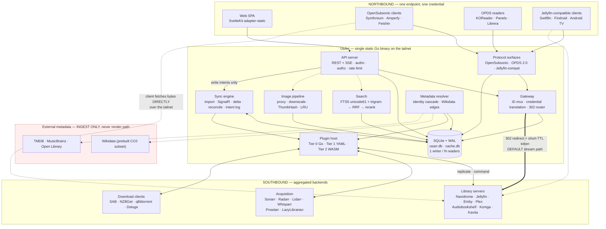

# UsArr — Architecture

**Status:** design document, pre-alpha. Nothing in this repository is implemented yet.
**Last revised:** 2026-08-16.
**Evidence base:** [`RESEARCH.md`](./RESEARCH.md). **Decision log:** [`DECISIONS.md`](./DECISIONS.md).

This document is authoritative. Where it states a fact about an upstream API, that fact was
read from a shipped OpenAPI spec or from source, and the citation lives in `RESEARCH.md`.
Where it states a judgement, it says so. Claims marked ⚠️ are **unverified** and must be
confirmed before code depends on them.

---

## 1. Vision and non-goals

### 1.1 What UsArr is

UsArr is a **self-hosted aggregation gateway**: one unified, searchable catalogue over
everything you own and everything you might want, that plugs into the players you already
use and routes each request to the backend that can actually serve it.

It is deliberately **two-sided**.

- **Northbound** — protocol surfaces that existing client apps connect to. Point Symfonium,
  Amperfy, Feishin, play:Sub, KOReader, Panels or Librera at **one endpoint with one
  credential**, and UsArr presents the union of every backend library, routing each item to
  the right place. You stop maintaining a bookmark folder of five server URLs.
- **Southbound** — the services UsArr aggregates: Navidrome, Jellyfin/Emby/Plex,
  Audiobookshelf, Komga/Kavita/Calibre-Web for libraries, and Sonarr, Radarr, Lidarr,
  Prowlarr, LazyLibrarian and the post-Readarr successors for acquisition.

Between the two sits the thing that makes it worth building: **one canonical library
database** spanning movies, TV, music, books, audiobooks and comics, with cross-media links,
one tag vocabulary, one search box, and one request flow.

Six properties define it. Everything in this document exists to serve one of them.

| # | Property | What it means concretely |
|---|---|---|
| 1 | **Fast** | Every user-facing read is a local SQLite query. Target: library page p50 < 8 ms, search p50 < 15 ms, first meaningful paint of a poster grid < 150 ms. No screen ever waits on an upstream HTTP call. |
| 2 | **A gateway, not a player** | UsArr aggregates catalogues and routes clients. It serves metadata, search, and routing decisions. It does **not** serve media bytes as a core capability and has **no in-app player** (§5). |
| 3 | **Pluggable** | Runs over just Prowlarr, or a full stack, or a service nobody has written Go code for. Three plugin tiers (§11), of which the middle one — declarative YAML manifests — makes arbitrary services possible without a compiler. |
| 4 | **One library** | A single canonical `work` table is the source of truth. *Arr and media-server instances are replication sources, not the model. One work can map to rows in many instances at once. |
| 5 | **Requests are a pillar** | "View and search everything in your library everywhere, and if you want something you don't have, you can do that here too." Owned and unowned appear in **one** result set with clear availability state, and a single Add action routes to whichever backend can service it (§8.6). |
| 6 | **Cross-media + provenance** | Searching "Train Dreams" surfaces the 2025 film **and** the Denis Johnson novella, joined by a typed, evidence-carrying edge (§9). Media type and acquisition source (usenet/torrent/irc/direct) are first-class indexed attributes, never strings buried in a release name (§10). |

### 1.2 Deployment assumption: a tailnet

**UsArr assumes it runs on a Tailscale tailnet (or an equivalent WireGuard overlay), not on
the public internet.** This is an explicit, load-bearing assumption, and several designs in
this document depend on it:

- Every client device can already reach every backend directly (§5.4 — this is what makes
  302-redirect the default stream path rather than byte-proxying).
- The network is authenticated at the transport layer before UsArr sees a packet, so the
  threat model is "people I have deliberately let onto my tailnet", not "the internet".
- Because the backend is Go, `tailscale.com/tsnet` can embed a tailnet node **directly in the
  UsArr binary** — UsArr appears as its own device on the tailnet with its own MagicDNS name
  and its own ACL entry, with no host-level Tailscale daemon required. See §12.4.

Internet-exposed deployment remains **supported, but as a hardened secondary mode** with its
own checklist (§14.7), not the default. Do not design as if the internet were the baseline;
do not make the tailnet a requirement either.

### 1.3 Single-user first, multi-user schema from day one

v0.1 ships single-user: one implicit owner account, user-management UI hidden.

**But every table that should be user-scoped carries a `user_id` from the very first
migration.** This is a hard design rule, not a preference. Retrofitting multi-tenancy into a
schema that assumed one user is expensive and touches every query; hiding a UI is free. Rows
that are user-scoped from migration 0001: `request`, `tag_assignment` (for user-namespace
tags), `playback_state`, `saved_filter`, `client_credential`, `session`, `audit_log`, and the
review-inbox verdicts on `work_relation`.

### 1.4 Non-goals

These are refusals, not "not yet". Each has a rationale in `DECISIONS.md`.

- **UsArr will never build a video transcoder.** No FFmpeg command lines assembled from user
  input, no hardware-acceleration backends, no patched FFmpeg fork. See ADR-0006 and §5.4.
  The estimated cost was 7–12 engineer-months to reach a *worse* result than Jellyfin, plus a
  permanent High-severity CVE class (Jellyfin has shipped FFmpeg argument-injection bugs
  twice — CVE-2025-31499 was a bypass of a fix shipped in 10.8.13).
- **UsArr has no in-app media player, and serving media bytes is not a core capability.**
  Playback is the backend's job and the client app's job. UsArr's northbound surfaces exist so
  that Symfonium, KOReader, Finamp and the Jellyfin TV apps can plug in — their job is
  catalogue, search, routing and redirect, not byte delivery. Byte-proxying exists only as an
  opt-in fallback for deployments where a client cannot reach a backend (§5.4). This is a
  change from an earlier draft that planned a minimal web player; that plan is withdrawn.
- **UsArr will not reimplement the *Arr download/import engines.** MediaManager (3.3k★) took
  that path and inherited a decade of solved problems: release parsing, quality scoring,
  import edge cases. UsArr sits *over* the ecosystem so that a user with an existing Sonarr
  install gets value on day one.
- **UsArr will not require Postgres, Redis, Meilisearch, or any sidecar.** One binary, one
  container, one `/config` volume. Optional backends may exist; none may ever be required.
- **UsArr will not ship native TV or mobile apps** (Roku BrightScript, Tizen `.wgt`, webOS,
  Android TV Leanback, tvOS). Jellyfin already has that client matrix and ~40 OpenSubsonic
  clients already exist; UsArr borrows both by speaking their protocols. Reiverr's Chromium-69
  ceiling (imposed by Tizen 5.5) is the cautionary example of chasing TV platforms early.
- **UsArr will not put an external metadata API on the render path.** TMDB, MusicBrainz,
  Wikidata, Open Library are **ingest-time** dependencies only. This is the direct lesson of
  DroppedNeedle: a modern SvelteKit UI sitting on MusicBrainz's hard 1 req/s ceiling takes
  ~50 minutes to scan a 10k-album library, and no amount of frontend polish hides that.
- **UsArr will not be a dashboard.** Homarr occupies that niche well. UsArr is a library.

---

## 2. The replica-not-proxy principle

This is the single structural decision from which everything else follows.

> **UsArr is not a proxy. UsArr is a replica.**
>
> Every user-facing read renders from a local SQLite database that UsArr owns. No browser
> request ever awaits an outbound call to Sonarr, Radarr, Lidarr, Prowlarr, TMDB or
> MusicBrainz. The *Arr services are **upstream replication sources** whose changes stream
> into the local DB, and **command sinks** to which user intent is dispatched asynchronously.

If every *Arr instance in the stack is offline, UsArr still browses, searches, sorts,
filters, and paginates the entire library at full speed. Only *new actions* degrade — and
they degrade into a queue with an honest label, not a spinner.

### 2.1 Why: the failure modes this eliminates

Every unified-frontend project surveyed has documented latency complaints, and they cluster
into five mechanisms. The replica model kills four of them outright.

| Failure mechanism | Observed in | Killed by replica model? |
|---|---|---|
| Live third-party API on the render path | DroppedNeedle (MusicBrainz @ 1 req/s → 50 min per 10k albums, first-party docs); Seerr/TMDB | **Yes.** External providers are ingest-only. |
| All-or-nothing page load: one slow integration blocks the whole page | Homarr, its single dominant complaint — *"all the data has to load before anything shows"* | **Yes.** Nothing to block on; the page is a local query. |
| Fan-out search as slow as the deadest indexer (30 s+) | Prowlarr#712 | **Partly.** Catalog search is local and instant; *release* search is inherently remote and is moved behind progressive disclosure (§7.5). |
| Background jobs stall the request-serving path | Overseerr#2030 (open 2021→archive, never fixed), #3665 | **No** — needs a separate mechanism: bounded worker pools, a single-writer DB discipline, and Go's preemptive scheduler (§13.1). |
| Heap blowup ingesting large *Arr payloads | arr-dashboard v2.18+ had to add streaming JSON parse + cursor pagination | **No** — needs streaming ingest (§6.3). |

Note the honest caveat, and it matters for budgeting: **SQLite is not the bottleneck.** Seerr
users report 82k-item libraries with ~1.5 s cold load and zero SQLite tuning. Do not spend the
speed budget on query planning. Spend it on scheduling discipline, I/O, and **images** (§6.6 —
posters are 5–9 MB per screenful against ~30 KB of JSON).

### 2.2 What it costs

The replica model buys speed and pays for it in **cache coherency**. UsArr now owns:

- A four-channel sync engine (§6) whose correctness cannot depend on any single channel.
- A write path that must present optimistic results and reconcile them against reality (§6.7).
- A stated, unambiguous conflict rule: **the *Arr owns the truth; UsArr owns the cache.** When
  a reconciliation sweep finds divergence and there is no pending intent, the *Arr wins and
  UsArr corrects itself. Being unambiguous about the direction prevents an entire category of
  flip-flopping bugs.

### 2.3 Where the replica model stops

Stating this boundary explicitly, because otherwise §5 reads as a contradiction:

| Concern | Model | Why |
|---|---|---|
| Metadata, browse, list, sort, filter | **Replicated.** Local SQLite, always. | Bounded size, changes slowly, read 1000:1 vs written. |
| Catalogue search (owned + unowned) | **Replicated.** Local FTS5. | The whole point. See §7. |
| Availability state ("do I have this in 4K?") | **Replicated**, via `service_item_link`. | Renders on every poster; can never be a live call. |
| Cross-media links | **Replicated**, from a prebuilt Wikidata subset. | ~35k edges total; fits in the binary's release artifact. |
| Tags, requests, users, playback position | **Owned outright.** UsArr is the source of truth. | Nobody upstream has this data. |
| **Media bytes** | **Live pass-through, and normally not through UsArr at all.** | A stream is inherently live; there is nothing to replicate. On a tailnet, UsArr answers with a `302` and the client talks to the backend directly (§5.4). |
| **Release search across indexers** | **Live**, behind progressive disclosure. | Prowlarr#712: a fan-out is only as fast as its deadest indexer, and users report 30 s+ waits. Never on a page-load path (§7.5). |

The rule that unifies these: **UsArr replicates anything a screen renders, and never
replicates a byte stream.** Everything a user *looks at* is local; the thing they *play* is
someone else's job.

### 2.4 Two rules that make it non-negotiable in code

1. **No HTTP handler serving the browser may hold a reference to an outbound HTTP client.**
   This should be enforced by package boundaries: the `api` package imports `store`, never
   `provider`. Violations are architectural, not stylistic.
2. **Degraded ≠ blocked.** When an instance's circuit breaker is open, affected rows are
   returned with `"stale": true, "degraded_services": ["Radarr 4K"]` and the UI shows a small
   non-modal banner. Do not grey out content. Do not show a spinner. Stale data beautifully
   presented beats a spinner every time.

---

## 3. System diagram



**Read the diagram as three rules:**

1. Solid lines into `DB` are the render path. Every dashed line is off it. The `API` box has
   **no solid line to any southbound service** — that is replica-not-proxy as topology.
2. The thick line is a *redirect*, not a data flow. Bytes travel on the dotted client→backend
   line, never through UsArr (§5.4).
3. The red `ext` box is reachable only from `META`, only in the background, never from a
   handler serving a client.

---

## 4. Component breakdown

### 4.1 API server

Go, `net/http` + a light router. Serves:

- `/api/v1/*` — the SPA's REST surface. Keyset-paginated lists, ETagged, JSON only
  (`Accept: application/json`).
- `/api/events` — a single **SSE** stream, multiplexed by event type, filtered per client.
  SSE rather than WebSocket deliberately: it is plain HTTP, survives reverse proxies far
  better, auto-reconnects natively with `Last-Event-ID`, and UsArr's push traffic is
  overwhelmingly one-directional (writes go over normal POSTs). This directly avoids the
  reverse-proxy breakage that the *Arrs themselves suffer with SignalR.
- `/img/{cache_key}?w={allowlisted}&fmt=auto` — the image pipeline (§4.5).
- `/rest/*` — OpenSubsonic server surface, `apiKeyAuthentication` only (§5.2).
- `/opds/*` — OPDS 2.0 catalog with 1.2 fallback (§5.2).
- `/stream/{usarr_id}` — the redirect router. Returns `302` to a backend URL carrying a
  short-TTL credential. Serves no bytes in the default configuration (§5.4).
- `/` — the embedded SPA via `embed.FS`, hashed assets served
  `Cache-Control: public, max-age=31536000, immutable`, `index.html` served `no-cache`.
- `/api/health/live` and `/api/health/ready` — distinct. *Live* = process up. *Ready* = DB
  migrated and initial sync complete. The container `HEALTHCHECK` hits `ready`.

The API server owns authentication, authorization filtering, CSRF, and rate limiting (§11).
It does **not** own any outbound HTTP client.

### 4.2 Gateway

The component that makes the two-sided story work. Four responsibilities, all detailed in §5:

- **ID multiplexing** — minting and resolving stable, opaque UsArr IDs that encode
  `(service_instance, native_id)` so that aggregating three Navidromes behind one Subsonic
  endpoint does not collide, and so client-cached IDs survive restarts and re-syncs.
- **Credential translation** — the client authenticates to UsArr; UsArr holds the backend
  credentials. Backend credentials never reach a client.
- **Stream routing** — resolve a UsArr ID to a backend, mint a short-TTL credential, `302`.
- **Capability negotiation** — advertise northbound only what the southbound union can
  actually do, and degrade per-backend rather than failing the endpoint.

### 4.3 Sync engine

Four channels plus a write path. Detailed in §7. Runs on bounded worker pools, never on a
request goroutine. Owns the single SQLite writer connection.

### 4.4 Metadata resolver

Two jobs, both off the render path:

1. **Identity resolution** — mapping a `RemoteItem` from any provider tier onto a canonical
   `work`, via the confidence cascade in §6.8. This is the component that decides whether
   Radarr-1080p's movie 842 and Radarr-4K's movie 1191 are the same film.
2. **Cross-media linking** — populating `work_relation` from the prebuilt Wikidata subset,
   with live SPARQL only on cache miss, and routing 0.55–0.85-confidence guesses to the
   review inbox. Detailed in §9.

It also owns provider rate-limit budgets: MusicBrainz at **1 req/s per IP** (hard, enforced
by the upstream with 503s, and `User-Agent: UsArr/<ver> ( <contact> )` is mandatory), Open
Library at 1 req/s anonymous / 3 req/s with an identifying UA, Hardcover at 60 req/min,
AniList at 90 req/min, Metron at 20 req/min burst / 5,000 per day. TMDB's real limit is
**⚠️ unpublished** — the widely-repeated "~40 req/s per IP" figure is a forum claim, not ToS.
Implement adaptive backoff on 429 rather than hard-coding a number.

### 4.5 Search

Three tiers, all local. Detailed in §8.

### 4.6 Image pipeline

Posters are the actual bottleneck: a 60-item viewport at 500×750 is ~60 requests × 80–150 KB
= **5–9 MB per screenful**, against ~30 KB of JSON for the same screen. Optimising anything
else first is optimising the wrong thing.

- **Ingest-time downscale.** Never cache the original at full size unless explicitly
  requested. Jellyfin caches full-size sources without rescaling and it costs users hundreds
  of MB (jellyfin#9069); this is that bug, avoided in one line.
- **Fixed width allowlist:** `92, 154, 200, 342, 500, 780, orig`. Arbitrary `?w=` is a
  cache-poisoning DoS — a buggy client requesting 5,000 distinct widths fills the disk. This
  is also a live CVE class: GHSA-rrr6-mvwg-9pg9 (Mar 2026) is an unauthenticated
  resource-exhaustion DoS in Jellyfin's branding endpoint generating arbitrary-size images.
- **Format negotiation from `Accept`:** AVIF → WebP → JPEG, `Vary: Accept`. But **encode AVIF
  lazily, off the request path** — AVIF encode is ~10–20× slower than WebP and will stall a
  Pi. Serve WebP immediately; backfill AVIF in a low-priority queue; upgrade on next request.
- **Bounded concurrency, hard:** a semaphore of `min(NumCPU, 4)` for all transcoding, ever.
  Jellyfin's #9795 is exactly this failure — unbounded concurrent thumbnail generation
  spiking CPU and memory to OOM.
- **Cache layout:** `/config/cache/images/{key[0:2]}/{key[2:4]}/{key}_{w}.{ext}`. Two levels
  of fan-out keeps directory entry counts sane on ext4/btrfs. LRU eviction by `atime` against
  a configurable cap, default 2 GB.
- **`Cache-Control: public, max-age=31536000, immutable`** — safe because the cache key is
  content-derived (`sha256(source_url)[:16]`), so the browser never revalidates.
- **ThumbHash inline in every list payload.** ~25 bytes per item; 100 items = 2.5 KB, and the
  grid paints instantly with correctly-coloured, correctly-proportioned poster shapes.
  ThumbHash over BlurHash on measured decode cost (503 µs vs 6.5 ms) — decode runs on every
  page load for every user, encode runs once at ingest, so decode is the axis that matters.
- **Proxying is mandatory, not optional.** *Arr `MediaCover.url` is instance-relative
  (`/MediaCover/123/poster.jpg`) and served under `/api/v3/mediacover/{id}/{file}` — it
  **requires the API key**. Since the API key must never reach the browser (§14.4), UsArr
  must proxy. `MediaCover.remoteUrl` points at TMDB/TheTVDB and is publicly fetchable, so
  prefer it for ingest where present.

Expected effect: first meaningful paint of a poster grid goes from ~1.5–3 s (waiting on 60
upstream JPEGs) to **< 150 ms** (JSON + ThumbHash), with real posters streaming in from local
disk over the following second.

### 4.7 Plugin host

Three tiers over one interface. Detailed in §11. Tier 2 runs on **wazero**, which is pure Go
with a JIT for arm64/amd64 and zero CGO — the same runtime `ncruces/go-sqlite3` already uses.
One runtime, two uses, static binary preserved.

### 4.8 Web client

SvelteKit with `adapter-static`, built to `web/dist`, embedded via `embed.FS`. No Node process
in production, ever. The patterns that matter more than the framework choice:

1. **Virtualize everything over ~200 rows** (`@tanstack/svelte-virtual`, grid mode with
   dynamic measurement). Non-negotiable at 10k+ posters — without it you have 10k DOM nodes
   and 10k image requests.
2. **Never load the whole library into the client.** Keyset-paginated windows of ~100 items,
   prefetching ±2 pages in the scroll direction.
3. **Client-side prefix index** — a compact denormalised
   `{id, title, sort_title, year, kind, thumbhash}` index for the whole library, ~80–120
   bytes/item, so **~1.2 MB for 10k items**. Shipped on load, cached in IndexedDB, versioned
   by ETag. This is where the "instant" feeling actually comes from (§8.2).
4. **Service worker**: stale-while-revalidate for `/api/*` GETs, cache-first for `/img/*`.
5. **Prefetch on intent** — `pointerenter` + `touchstart` on a card fires the detail-view
   prefetch. Costs nothing; makes navigation feel pre-rendered.
6. **Optimistic writes overlay server state** from a local pending-intent store keyed by the
   ULID idempotency key (§7.7).

---

## 5. The gateway: northbound and southbound

This section is the product's spine alongside the unified library. Everything here exists to
answer one user story: *point every client at one endpoint with one credential, and have the
right library show up.*

### 5.1 The shape of the problem

A realistic tailnet has: two Navidrome instances (main + kids), one Audiobookshelf, one
Komga, one Jellyfin, and four *Arrs. Today that means the user configures Symfonium twice,
Panels once, Finamp once, and remembers which URL is which. Four problems fall out the moment
you try to put one endpoint in front of all of it:

| Problem | Why it is hard | Section |
|---|---|---|
| **ID collision** | Navidrome-A's album `3f2a…` and Navidrome-B's album `3f2a…` are different albums. Clients cache IDs *indefinitely* — in playlists, favourites, and offline downloads. An ID that changes on re-sync silently corrupts a user's playlists. | §5.3 |
| **Credential translation** | The client has one UsArr credential. UsArr has N backend credentials. They must never meet. | §5.2 |
| **Byte delivery** | Redirect or proxy? This determines whether UsArr is on the hot path for gigabytes. | §5.4 |
| **Write-back** | Favourites, play counts, scrobbles, playlists and positions arrive northbound and must land on the right backend — and reconcile when the backend changes them too. | §5.5 |
| **Capability skew** | Navidrome supports OpenSubsonic extension X; gonic does not. Advertise what? | §5.6 |

### 5.2 Northbound surfaces and credential translation

Three surfaces, in priority order.

**1. OpenSubsonic (music, and audiobooks where clients tolerate it).** The single
highest-leverage integration available: speaking it as a *server* means Symfonium, Amperfy,
Supersonic, play:Sub, DSub, substreamer, Nautiline, NaviBeat and ~30 more work on day one,
with zero client work by UsArr. The spec is ~100 endpoints across ~15 categories plus ~28
extensions negotiated at runtime via `getOpenSubsonicExtensions`.

> 🚩 **Auth rule, non-negotiable: implement `apiKeyAuthentication` ONLY. Never implement
> salt/token auth.**
>
> Classic Subsonic auth is `u` + `t` + `s`, where `t = md5(password + salt)`. That
> **mathematically requires the server to hold the password in recoverable form.** Navidrome's
> own docs concede this: *"Due to limitations with the Subsonic API, Navidrome is unable to
> properly hash passwords and thus encrypts them instead"* — with a key that by default ships
> in the source. The [`apiKeyAuthentication` extension](https://opensubsonic.netlify.app/docs/extensions/apikeyauth/)
> exists precisely to fix this, and the spec states that servers offering API-key auth
> *should no longer support* salt/token auth. Taking that trade lets Argon2id remain the only
> password storage in UsArr. A minority of ancient clients will not work. That is correct.
> Document it prominently; users will ask. Test against **Symfonium** as the reference client
> — coverage across clients is uneven (⚠️ one source indicates Feishin still targets
> Navidrome's internal API and Jellyfin's API rather than full OpenSubsonic; re-check).

**2. OPDS 2.0, with 1.2 fallback (books and comics).** OPDS 1.2 is Atom + Dublin Core; OPDS
2.0 is JSON-LD over the Readium Web Publication Manifest. Generating it is cheap — it is JSON
over a metadata table — and it instantly serves KOReader, Panels, Librera and Moon+ Reader:
the e-ink and offline-reading crowd a web app can never reach. Acquisition links point at
§5.4's redirect router.

**3. Jellyfin-compatible surface (video). ⚠️ Deferred and unproven.** Emulating enough of
Jellyfin's API for Swiftfin/Findroid/Android TV to browse a *unified* catalogue is
attractive, but the API is large, under active change (the 10.11 auth-header change broke
clients; the 10.11 OpenAPI schema is reported invalid), and the playback-negotiation surface
is exactly the part UsArr does not want to own. **Do not commit to this before v2.** The
honest v1 answer for video is: UsArr routes you to the right Jellyfin, and you use Jellyfin's
own excellent client matrix. Prior art exists — DroppedNeedle emulates both OpenSubsonic and
Jellyfin server APIs — so it is possible, just not cheap.

**Credential translation, precisely:**

```
client ──[ UsArr client_credential: per-user, per-app, revocable ]──▶ UsArr
UsArr  ──[ service_instance.api_key_enc, decrypted in memory only ]──▶ backend
```

Rules:
- Client credentials are **per user, per client app**, individually revocable, and stored as
  Argon2id hashes (they are bearer secrets, not passwords, but treat them as passwords).
  "Sign out my ex-roommate's Fire Stick" is a real feature and it requires per-app grants.
- **Backend credentials are never returned to any client, in any form, ever** — not in an API
  response, not in a redirect target that a client can read and replay against the backend
  outside UsArr's authorization (see §5.4 on this exact hazard), not in logs, not in a support
  bundle. Display as `••••••1a2b`; verify with a server-side "test connection" button.
- The northbound authorization decision is made by **UsArr's own permission model**, never
  delegated to the backend's. Jellyfin's parental/library controls have documented gaps
  (jellyfin#17014), and UsArr aggregates more than any one backend knows about. Backend policy
  is defence in depth, not the boundary (§14.6).

### 5.3 Stable IDs: the hardest correctness requirement

Clients cache IDs forever. Symfonium will still have last year's album ID in a playlist. An
ID scheme that is not stable across restarts, re-syncs, backend re-scans, or a Navidrome
database rebuild will silently destroy user data — and the user will blame UsArr.

**Requirements:**

| # | Requirement | Consequence |
|---|---|---|
| R1 | Globally unique across all backends | No collisions when aggregating N of the same kind |
| R2 | Stable across UsArr restart, re-sync and reconcile | Survives §7's four channels |
| R3 | Stable across backend re-scan where the backend's own ID is stable | Navidrome IDs are content-derived and survive rescans; Jellyfin's are not always |
| R4 | Opaque to the client | Frees UsArr to change the mapping without breaking cached IDs |
| R5 | Resolvable without a lookup where possible | Hot path — every `stream` call resolves one |
| R6 | Reasonable length | Some Subsonic clients have historically been unhappy with very long IDs ⚠️ (unverified; keep under ~48 chars to be safe) |

**Scheme.** The UsArr ID is a base32 (Crockford, unpadded, lowercase) encoding of:

```
usarr_id := base32( varint(instance_id) || 0x00 || native_id_bytes )
```

- `instance_id` is `service_instance.id`, a local integer that is assigned once and **never
  reused**, even after an instance is deleted. Deleted instances leave a tombstone row.
- `native_id_bytes` is the backend's own identifier **verbatim** — Navidrome's MBID-ish hash,
  Jellyfin's GUID, Audiobookshelf's `li_…`, Komga's ULID. Never re-derived, never normalised.

This satisfies R1 (instance prefix), R2 and R3 (nothing UsArr computes is in it — it is a
pure function of two values UsArr does not control), R4 (opaque-looking), and R5 (decodes
locally with no DB hit; the DB is touched only to look up the instance's base URL and
credential, which is a single indexed row and hot in page cache).

**Why not a UsArr-local surrogate key (`work.id`)?** Because a canonical `work` can be
*merged* by the identity cascade (§6.8) or *split* by an un-merge, and its id would then
change — violating R2 for reasons entirely internal to UsArr. Merges must not be able to
corrupt a client's playlist. So: **the northbound ID addresses a `service_item_link`, not a
`work`.** The gateway resolves `usarr_id → service_item_link → work` for metadata, and
`usarr_id → service_instance` for routing. Merging changes which `work` a link points at; it
does not change the link's addressability.

**Corollary for browse.** Because the ID names a backend item, a *unified* album that exists
in two Navidromes must pick one to address. Rule: address the **highest-`priority`
`service_item_link`** among those whose instance is currently healthy; if the chosen instance
is down, fall back to the next and **note that the ID changes**. To avoid a changing ID,
prefer: always address the highest-priority link regardless of health, and let §5.4's redirect
fail over at stream time. Stability beats availability here.

⚠️ **Open question for implementation:** whether every target client tolerates non-UUID,
non-numeric IDs in all fields (Subsonic `id`, `parent`, `coverArt`, `albumId`, `artistId`).
Symfonium is the reference; test the full matrix before v1.1 ships.

### 5.4 Stream path: redirect by default, proxy as fallback

Two options. The tailnet assumption (§1.2) resolves them.

| | **302 redirect** (default) | **Byte proxy** (opt-in fallback) |
|---|---|---|
| UsArr on the byte path | No | Yes, for every byte |
| HTTP `Range`, seek, resume | Backend's native behaviour, untouched | UsArr must implement `Range`, `Content-Range`, `206`, `If-Range`, `ETag` correctly — a real, bug-prone surface |
| Cost on a Pi | ~0 | Saturates NIC and burns goroutines; a 4K remux at 60 Mb/s through a Pi's single NIC is the whole box |
| Works when client cannot reach backend | **No** | Yes |
| Leaks backend URL to client | **Yes** | No |
| Leaks backend *credential* to client | **Only if you are careless — see below** | No |
| One endpoint / one credential story | Preserved for catalogue; the stream URL is a backend URL | Fully preserved |

**Decision: `302` redirect is the default.** On a tailnet the sole objection to redirecting —
"the client might not be able to reach the backend" — is false by construction. Every device
on the tailnet can reach every other device on the tailnet; that is what a tailnet is. Paying
a permanent byte-path tax to solve a problem the network already solved is the wrong trade.

**The remaining honest problem is credential leakage in the redirect target**, and it must be
solved, not waved off. A naive implementation redirects to
`http://navidrome:4533/rest/stream?id=…&u=usarr&p=<backend password>` — which hands every
client a permanent, unscoped backend credential. Three mitigations, in order of preference:

1. **Backend-native ephemeral token minted per request.** Best when the backend supports it.
   Jellyfin can issue scoped access tokens; Navidrome supports its own API keys. UsArr mints
   or reuses a short-lived, narrowly-scoped backend token and puts *that* in the redirect. The
   token is useless after expiry and reveals nothing about UsArr's stored credential.
2. **Short-TTL signed URL.** Where the backend supports signed/expiring links, use them.
3. **UsArr-signed redirect through a per-backend shim.** Where neither is available, UsArr
   redirects to *itself* at `/stream/raw/{token}` and proxies — i.e. falls back to mode 2 for
   that backend only. Per-backend fallback, not global.

Additional rules:
- Redirect targets carry a `Cache-Control: no-store` and the token TTL is minutes, not hours,
  and is **bound to the resolved `(user_id, usarr_id)`** so a leaked token is not a general
  key to the backend.
- ⚠️ **Verify per client:** some Subsonic clients historically follow redirects poorly,
  particularly on `getCoverArt` and during seek. Test Symfonium, Amperfy, Supersonic and
  DSub. If a client misbehaves, the per-backend proxy fallback is the escape hatch — this is
  a config flag, not a redesign.
- Prior art both ways: **Streamarr** ships "internal service proxies" to reach embedded *Arr
  admin UIs through one authenticated front door, which is the proxy argument in its
  strongest form — but that is for *UIs*, where the payload is kilobytes, not for gigabyte
  streams.

**When to enable the proxy fallback** (`USARR_STREAM_MODE=proxy`, per-instance override):
- The deployment is internet-exposed rather than tailnet-only, and backends are not
  themselves reachable.
- A backend sits on a network segment clients cannot route to.
- A specific client is confirmed to mishandle redirects.

**Images are the exception.** `/img/*` is always proxied and cached by UsArr (§4.6), never
redirected — because *Arr `MediaCover` requires an API key, because the downscale + ThumbHash
pipeline is the single biggest perceived-speed win, and because a poster is ~30 KB, not 30 GB.

### 5.5 Write-back: favourites, play counts, scrobbles, playlists, position

Clients send state northbound. It must land on the right backend and survive the backend
changing it too. **Reuse the intent log** (§7.7) — this is the same problem as writing to a
*Arr, and it gets the same machinery: optimistic local apply, async dispatch, three-phase
settlement, inverse-patch rollback, ULID idempotency.

| Northbound call | Local effect | Southbound dispatch | Conflict rule |
|---|---|---|---|
| `star` / `unstar` | Write `tag_assignment` in the `user:` namespace, scoped to `user_id`. Instant. | Intent → backend's favourite API on the addressed instance. | **UsArr wins.** Favourites are user data UsArr owns; a backend's favourite state is a mirror. On divergence, re-push. |
| `scrobble` (`submission=false`, "now playing") | Update `playback_state`. | Fire-and-forget to backend + any configured ListenBrainz/Last.fm. | No reconciliation. Ephemeral by nature. |
| `scrobble` (`submission=true`) | Increment local play count, append to `play_history`. | Intent → backend scrobble. Retry-safe (idempotency key = `(user, item, started_at)`). | **Additive, never reconciled.** Play counts merge by union of events, never by taking a max — taking a max from a backend that reset would silently delete history. |
| `setRating` | Local, user-scoped. | Intent → backend. | UsArr wins. |
| Playlist create/update/reorder | Local `playlist` + `playlist_item`, user-scoped. | Intent → backend playlist API **only if the playlist is single-backend**. | **A cross-backend playlist cannot be written back** — no backend can hold it. Mark it `usarr_only` and say so in the UI. This is a real limitation of aggregation, and it must be visible, not silent. |
| Playback position (Audiobookshelf, ebooks) | Local `playback_state`, user-scoped. | Two-way: mirror into UsArr for the unified "continue" row; push back on change. | **The backend wins for its own media.** Audiobookshelf is the source of truth for audiobook position — it has the chapter model and the cross-device session logic. UsArr mirrors and displays; it does not arbitrate. |

The general rule, stated once: **UsArr owns user-intent state (favourites, ratings, tags,
requests); the backend owns media-derived state (position, transcode session, file
presence).** Where both write, the owner in that table wins and the loser is corrected on
the next reconcile.

### 5.6 Capability negotiation and degradation

**Northbound advertisement is the intersection-or-union question.** UsArr advertises the
**union** of southbound capabilities, and degrades per item, because a client that is told
"no playlists" because *one* of five backends lacks them is worse off than a client that
tries and gets a clean error on the one album that cannot do it.

- `getOpenSubsonicExtensions` returns the extensions UsArr itself implements, which is a
  fixed set determined by UsArr's code, not by backends. `apiKeyAuthentication` always. Others
  (`transcodeOffset`, `formPost`, `songLyrics`, …) only where UsArr can honour them for
  *every* backend or degrade cleanly.
- Per-backend capabilities come from `Provider.Capabilities(ctx, instance)`, which **probes
  the live instance** rather than assuming from the `kind` (§11.4). They are cached on
  `service_instance` and refreshed on health probe.
- Where an operation is unsupported for the addressed item, return the protocol's own error
  (Subsonic error code 70 "not found" / 50 "not authorized" as appropriate) — never a 500.

**Degradation when a backend is offline** is the single most important behaviour here, and it
is the Homarr anti-pattern in a new costume: *one slow integration must never fail the whole
endpoint.*

- **Browse and search still list everything**, because they are answered from the local
  replica. Items whose instance is down are returned normally, flagged
  `"degraded": true` in the native API and simply listed in the Subsonic/OPDS surfaces (those
  protocols have no field for it).
- **Stream requests to a down backend fail individually** with a protocol-native error, after
  a short deadline — never after a 30-second timeout.
- The circuit breaker (§7.6) means a down instance is *known* down and is not re-probed on
  every request. Skip known-down instances rather than re-timing-out on them.
- The web UI shows a non-modal banner naming the degraded instance. The catalogue never
  greys out.

---

## 6. The data model

SQLite dialect, `STRICT` tables throughout (requires SQLite ≥ 3.37; `ncruces/go-sqlite3`
bundles a recent build, so this is safe — note it if the driver ever changes). All timestamps
are ISO-8601 UTC text. Migrations are plain SQL run by `goose`, embedded via
`//go:embed migrations/*.sql`.

Two naming notes, because the brief and the research used different names:
- The brief's `file` table is **`media_file`** — `FILE` is not a SQLite keyword but the name
  is ambiguous next to `media_file`'s actual role, and `media_file` matches the *Arr
  vocabulary (`EpisodeFileResource`, `MovieFileResource`).
- The brief's `release` table is split into **`release_candidate`** (ephemeral, TTL-evicted,
  grabbable) and **`provenance`** (immutable, one row per acquisition event). `RELEASE` *is* a
  SQLite keyword (`RELEASE SAVEPOINT`), so a bare `release` table would need quoting forever.

The DDL below is grouped by concern for readability, so some tables reference others declared
further down (`media_file` → `provenance`, `tag_assignment` → `user`). SQLite resolves foreign
keys at DML time rather than at `CREATE TABLE`, so this is legal as written — but the actual
migration files should still be ordered dependencies-first, because a reader following the
schema history should not have to jump forward.

### 6.1 The three-layer core: work / edition / file

The most important modelling call in the project:

> **The film *Train Dreams* and the novella *Train Dreams* are two different `work` rows,
> connected by a typed edge — NOT one `work` with two editions.**

Rationale, in strength order:
1. Two independent, mature bibliographic systems converged on this. Open Library's rule is
   explicit: *"if a work has been adapted or retold, it is considered a unique work, different
   from the original."* Wikidata models adaptation as `P144 based on` — a link *between* works.
2. Practically: the film has a director, a runtime and a Radarr row; the novella has an
   author, a page count and a book-service row. Forcing them into one `work` produces a table
   where most columns are null for most rows, and destroys "monitor the movie but not the book".
3. The user-facing feature is served *better* by an edge: the UI can say **"Based on the
   novella by Denis Johnson"** with a real relationship type, instead of silently merging.

| Layer | Meaning | Examples |
|---|---|---|
| **`work`** | The abstract creative work, kind-scoped | the film *Train Dreams*; the novella *Train Dreams*; the series *Severance*; the album *Kid A* |
| **`edition`** | A specific released form of a work | the 2160p Director's Cut; the 2013 Granta paperback; the Portuguese translation; the 24/96 remaster |
| **`media_file`** | Concrete bytes on disk | `/media/movies/Train Dreams (2025)/…mkv` |

For movies and TV the work→edition distinction is mostly degenerate — but modelling it
uniformly means the dual-Radarr 1080p/4K case (§6.6) falls out for free instead of needing a
hack.

```sql
-- ============================================================
-- WORK — the abstract creative work
-- ============================================================
CREATE TABLE work (
  id                INTEGER PRIMARY KEY,
  kind              TEXT NOT NULL CHECK (kind IN (
                      'movie','series','season','episode',
                      'artist','album','track',
                      'book','audiobook','comic','game')),
  parent_work_id    INTEGER REFERENCES work(id) ON DELETE CASCADE,
                    -- series→season→episode; artist→album→track; book series→book.
                    -- One recursive tree instead of N bespoke hierarchies.
  title             TEXT NOT NULL,
  sort_title        TEXT NOT NULL,      -- leading articles stripped, per-locale
  normalized_title  TEXT NOT NULL,      -- casefold + NFKD + unaccent + punct-strip
  norm_version      INTEGER NOT NULL DEFAULT 1,  -- bump when the algorithm changes;
                                        -- tells you which rows are stale (§6.8)
  original_title    TEXT,
  year              INTEGER,
  release_date      TEXT,
  overview          TEXT,
  runtime_secs      INTEGER,
  language          TEXT,               -- BCP-47
  popularity        REAL NOT NULL DEFAULT 0,   -- normalized 0..1; search prior (§8.3)
  rating            REAL,
  status            TEXT,               -- continuing|ended|announced|released|tba
  poster_asset_id   INTEGER REFERENCES image_asset(id),
  backdrop_asset_id INTEGER REFERENCES image_asset(id),
  -- Denormalised rollups: recomputed in the same txn as the child write, never
  -- JOINed at read time. Read:write here is ~1000:1, so denormalisation is correct.
  have_count        INTEGER NOT NULL DEFAULT 0,
  want_count        INTEGER NOT NULL DEFAULT 0,
  size_on_disk      INTEGER NOT NULL DEFAULT 0,
  monitored         INTEGER NOT NULL DEFAULT 0,
  -- Availability summary, maintained from service_item_link. Lets the grid render
  -- the "1080p ✓ / 4K ✗" badge without a join. JSON: {"1080p":true,"2160p":false}
  availability      TEXT,
  added_at          TEXT,
  created_at        TEXT NOT NULL DEFAULT (datetime('now')),
  updated_at        TEXT NOT NULL DEFAULT (datetime('now')),
  deleted_at        TEXT,               -- soft delete; see the 7-day tombstone rule (§7.8)
  content_hash      TEXT                -- hash of synced fields; delta short-circuit
) STRICT;

CREATE INDEX ix_work_kind_sort ON work(kind, sort_title, id) WHERE deleted_at IS NULL;
CREATE INDEX ix_work_parent    ON work(parent_work_id, kind);
CREATE INDEX ix_work_norm      ON work(normalized_title, year, kind);
CREATE INDEX ix_work_added     ON work(added_at DESC, id DESC);  -- keyset (§13.1)
CREATE INDEX ix_work_pop       ON work(popularity DESC, id DESC);

-- Kind-specific columns live in subtype tables. Rule: if the library grid or the
-- search ranker needs it, it goes in `work`; otherwise it goes in a subtype.
CREATE TABLE work_movie (
  work_id     INTEGER PRIMARY KEY REFERENCES work(id) ON DELETE CASCADE,
  collection  TEXT, studio TEXT, certification TEXT,
  in_cinemas  TEXT, physical_release TEXT, digital_release TEXT
) STRICT;

CREATE TABLE work_series (
  work_id      INTEGER PRIMARY KEY REFERENCES work(id) ON DELETE CASCADE,
  series_type  TEXT,                    -- standard|daily|anime
  network      TEXT, air_time TEXT,
  season_count INTEGER,
  ended        INTEGER NOT NULL DEFAULT 0
) STRICT;

CREATE TABLE work_episode (
  work_id         INTEGER PRIMARY KEY REFERENCES work(id) ON DELETE CASCADE,
  season_number   INTEGER NOT NULL,
  episode_number  INTEGER NOT NULL,
  absolute_number INTEGER,              -- anime; see the mapping-file note in §9.6
  air_date_utc    TEXT,
  has_file        INTEGER NOT NULL DEFAULT 0
) STRICT;
CREATE INDEX ix_ep_air ON work_episode(air_date_utc);

CREATE TABLE work_album (
  work_id    INTEGER PRIMARY KEY REFERENCES work(id) ON DELETE CASCADE,
  album_type TEXT, disambiguation TEXT, track_count INTEGER
) STRICT;

CREATE TABLE work_book (
  work_id         INTEGER PRIMARY KEY REFERENCES work(id) ON DELETE CASCADE,
  page_count      INTEGER,
  series_name     TEXT, series_position REAL
) STRICT;

-- Alt titles: what makes "Shingeki no Kyojin" find "Attack on Titan", "LOTR" find
-- the trilogy, and "Sonhos e Comboios" find "Train Dreams". Fed from *Arr
-- alternateTitles, TMDB alternative_titles, MusicBrainz aliases, OL editions.
CREATE TABLE work_alt_title (
  id         INTEGER PRIMARY KEY,
  work_id    INTEGER NOT NULL REFERENCES work(id) ON DELETE CASCADE,
  title      TEXT NOT NULL,
  normalized TEXT NOT NULL,
  kind       TEXT NOT NULL,   -- original|translated|alias|acronym|sort
  language   TEXT
) STRICT;
CREATE INDEX ix_alt_work ON work_alt_title(work_id);
CREATE INDEX ix_alt_norm ON work_alt_title(normalized);

-- ============================================================
-- EDITION — a specific released form
-- ============================================================
CREATE TABLE edition (
  id           INTEGER PRIMARY KEY,
  work_id      INTEGER NOT NULL REFERENCES work(id) ON DELETE CASCADE,
  label        TEXT,      -- "Director's Cut" | "2013 Granta pb" | "Remastered"
  format       TEXT,      -- bluray|web|ebook|audiobook|vinyl|flac|cbz
  language     TEXT,
  quality_tier TEXT,      -- 2160p|1080p|720p|lossless|lossy
  is_primary   INTEGER NOT NULL DEFAULT 0,
  published_at TEXT,
  publisher    TEXT
) STRICT;
CREATE INDEX ix_edition_work ON edition(work_id, is_primary DESC);

-- ============================================================
-- MEDIA_FILE — concrete bytes
-- ============================================================
CREATE TABLE media_file (
  id                  INTEGER PRIMARY KEY,
  work_id             INTEGER NOT NULL REFERENCES work(id) ON DELETE CASCADE,
  edition_id          INTEGER REFERENCES edition(id) ON DELETE SET NULL,
  service_instance_id INTEGER REFERENCES service_instance(id) ON DELETE SET NULL,
  remote_file_id      TEXT,
  provenance_id       INTEGER REFERENCES provenance(id),  -- NULL for manual imports
  path                TEXT NOT NULL,
  size_bytes          INTEGER NOT NULL DEFAULT 0,
  quality             TEXT, resolution TEXT,
  video_codec         TEXT, audio_codec TEXT, audio_channels REAL,
  languages           TEXT,   -- JSON array
  release_group       TEXT,
  date_added          TEXT,
  media_info          TEXT    -- JSON blob; queried rarely, NEVER in list views
) STRICT;
CREATE INDEX ix_file_work ON media_file(work_id);
CREATE UNIQUE INDEX ux_file_path ON media_file(path);
```

### 6.2 Identity: `external_id`

External IDs are the **only** reliable cross-instance join key. Never join on an *Arr's local
`id` — instance A's series 42 and instance B's series 42 are unrelated.

```sql
CREATE TABLE external_id (
  id         INTEGER PRIMARY KEY,
  work_id    INTEGER REFERENCES work(id)    ON DELETE CASCADE,
  edition_id INTEGER REFERENCES edition(id) ON DELETE CASCADE,
  source     TEXT NOT NULL,   -- tmdb_movie|tmdb_tv|tvdb|imdb|tvmaze|tvrage|
                              -- musicbrainz_artist|musicbrainz_rg|musicbrainz_release|
                              -- musicbrainz_recording|openlibrary_work|openlibrary_edition|
                              -- isbn13|asin|goodreads_work|goodreads_edition|
                              -- anilist|mal|anidb|wikidata|discogs|theaudiodb|allmusic
  value      TEXT NOT NULL,
  confidence REAL NOT NULL DEFAULT 1.0,   -- <1.0 = heuristic match (§6.8)
  CHECK ((work_id IS NULL) != (edition_id IS NULL))
) STRICT;

-- The same IMDb id can legitimately appear on a work and on an edition, so the
-- full unique index includes both nullable FKs.
CREATE UNIQUE INDEX ux_extid ON external_id(
  source, value, COALESCE(work_id, -1), COALESCE(edition_id, -1));

-- But a strong external id must identify exactly ONE work. This partial unique
-- index enforces that where it is true, without blocking edition-level ids.
CREATE UNIQUE INDEX ux_extid_work_strong ON external_id(source, value)
  WHERE work_id IS NOT NULL AND confidence >= 1.0;

CREATE INDEX ix_extid_work   ON external_id(work_id, source);
CREATE INDEX ix_extid_lookup ON external_id(source, value);  -- THE hot sync lookup
```

**Normalisation at ingest is mandatory**, because the ecosystem is inconsistent:

| Concept | Sonarr/Radarr | Prowlarr | Webhook payload |
|---|---|---|---|
| `imdbId` | `string` `"tt0117951"` | **`int` `117951`** | `string` |
| `indexerFlags` | `int` bitmask | **`string[]`** | absent |
| `tags` | `int[]` | `int[]` | **`string[]` (labels!)** |
| `quality` | `QualityModel` object | absent | `string` name + `qualityVersion` int |
| `protocol` (in history `data`) | **`int`** `0=unknown,1=usenet,2=torrent` | — | — |
| `protocol` (REST resources) | `string` `"usenet"` | `string` | — |

Store IMDb canonically as `tt0117951`. Store protocol canonically as the string. Do not share
a deserialiser between the REST and webhook shapes.

⚠️ Also note `Quality.source` is a **per-app enum** — Sonarr's members
(`television|televisionRaw|web|webRip|dvd|bluray|blurayRaw`) differ from Radarr's
(`bluray|webdl|webrip|dvd|tv|cam|telesync|…`) and Lidarr's are audio formats. **Do not model
`source` as a shared enum.** Store `quality.id` + `quality.name` + the app that emitted it.

### 6.3 Cross-media edges: `work_relation`

The Train Dreams edge. Wikidata `P144 based on` / `P4969 derivative work` as the spine
(§9). This table carries **evidence and a review status**, not just a confidence float — the
review inbox is unusable without being able to say *why* two things were linked.

```sql
CREATE TABLE work_relation (
  from_work_id INTEGER NOT NULL REFERENCES work(id) ON DELETE CASCADE,
  to_work_id   INTEGER NOT NULL REFERENCES work(id) ON DELETE CASCADE,
  rel_type     TEXT NOT NULL CHECK (rel_type IN (
                 'based_on',         -- P144: the film is based_on the novella
                 'derivative_of',    -- P4969, the declared inverse
                 'adaptation_of','remake_of','sequel_to','prequel_to',
                 'soundtrack_of',    -- P406: album -> film
                 'novelization_of',  -- inverts the usual arrow; see §9.4
                 'same_franchise',   -- P179 / P8345 / TMDB belongs_to_collection
                 'translation_of','edition_of','same_universe','spinoff_of')),
  source       TEXT NOT NULL,        -- wikidata|tmdb|openlibrary|musicbrainz|
                                     -- comicinfo|heuristic|manual
  confidence   REAL NOT NULL DEFAULT 1.0,
  evidence     TEXT NOT NULL,        -- JSON: [{"source":"wikidata","prop":"P144",
                                     --          "qid":"Q126086662"}]
  status       TEXT NOT NULL DEFAULT 'auto_confirmed' CHECK (status IN (
                 'auto_confirmed','pending_review','user_confirmed','user_rejected')),
  reviewed_by  INTEGER REFERENCES user(id) ON DELETE SET NULL,
  reviewed_at  TEXT,
  created_at   TEXT NOT NULL DEFAULT (datetime('now')),
  PRIMARY KEY (from_work_id, to_work_id, rel_type)
) STRICT, WITHOUT ROWID;
CREATE INDEX ix_relation_to     ON work_relation(to_work_id, rel_type);
CREATE INDEX ix_relation_review ON work_relation(status, confidence DESC)
  WHERE status = 'pending_review';
```

`user_rejected` is **permanent and excludes the pair from future auto-linking**, not just
from display. A rejected pair that keeps reappearing in the inbox is the fastest way to make
the review feature hated.

### 6.4 Services and the M:N link

```sql
CREATE TABLE service_instance (
  id            INTEGER PRIMARY KEY,   -- NEVER reused, even after delete (§5.3 R1)
  kind          TEXT NOT NULL,         -- sonarr|radarr|lidarr|whisparr|readarr|prowlarr|
                                       -- lazylibrarian|jellyfin|emby|plex|navidrome|
                                       -- audiobookshelf|komga|kavita|sabnzbd|qbittorrent|
                                       -- <manifest name>|<wasm plugin id>
  role          TEXT NOT NULL DEFAULT 'library' CHECK (role IN (
                  'library','acquisition','indexer','download_client')),
  name          TEXT NOT NULL UNIQUE,  -- "Radarr 4K"
  base_url      TEXT NOT NULL,
  url_base      TEXT NOT NULL DEFAULT '',  -- reverse-proxy path prefix, e.g. "/sonarr"
  api_key_enc   BLOB NOT NULL,         -- AES-256-GCM, KEK from /config/secret.key (0600)
  api_version   TEXT,                  -- v1 | v3 | v5 — per app, NOT the app version
  verify_tls    INTEGER NOT NULL DEFAULT 1,
  enabled       INTEGER NOT NULL DEFAULT 1,
  priority      INTEGER NOT NULL DEFAULT 0,  -- tie-break when N can serve; also the
                                             -- northbound addressing order (§5.3)
  managed_by_env INTEGER NOT NULL DEFAULT 0, -- read-only in the UI, badged (§15.3)
  -- health / circuit breaker (§7.6)
  health_state  TEXT NOT NULL DEFAULT 'unknown',  -- healthy|degraded|down|unknown
  breaker_state TEXT NOT NULL DEFAULT 'closed',   -- closed|open|half_open
  breaker_until TEXT,
  consecutive_failures INTEGER NOT NULL DEFAULT 0,
  last_ok_at    TEXT, last_error TEXT,
  -- capabilities, probed live rather than assumed from `kind` (§11.4)
  capabilities  TEXT,                  -- JSON Caps
  -- sync cursors (§7)
  last_full_sync_at  TEXT,
  last_delta_sync_at TEXT,
  last_history_id    INTEGER,
  signalr_connected  INTEGER NOT NULL DEFAULT 0,
  config_json        TEXT,             -- plugin-specific settings
  deleted_at         TEXT              -- tombstone; id stays burned
) STRICT;

-- The many-to-many that makes "one canonical item, N *Arr rows" work. This is the
-- flagship feature: one poster, two Radarrs, a "1080p ✓ / 4K ✗" badge.
CREATE TABLE service_item_link (
  id                  INTEGER PRIMARY KEY,
  service_instance_id INTEGER NOT NULL REFERENCES service_instance(id) ON DELETE CASCADE,
  work_id             INTEGER NOT NULL REFERENCES work(id) ON DELETE CASCADE,
  edition_id          INTEGER REFERENCES edition(id) ON DELETE SET NULL,
  remote_id           TEXT NOT NULL,   -- Sonarr seriesId / Radarr movieId / Navidrome hash
  remote_kind         TEXT NOT NULL,   -- series|episode|movie|album|track|book|author
  remote_path         TEXT,
  monitored           INTEGER NOT NULL DEFAULT 0,
  quality_profile_id  INTEGER,
  root_folder_path    TEXT,
  is_authoritative    INTEGER NOT NULL DEFAULT 0,  -- which instance wins on metadata conflict
  has_file            INTEGER NOT NULL DEFAULT 0,
  remote_updated_at   TEXT,
  remote_hash         TEXT,            -- hash of the SYNCED SUBSET; delta short-circuit
  synced_at           TEXT NOT NULL,
  deleted_at          TEXT             -- 7-day tombstone before hard delete (§7.8)
) STRICT;
CREATE UNIQUE INDEX ux_sil ON service_item_link(service_instance_id, remote_kind, remote_id);
CREATE INDEX ix_sil_work ON service_item_link(work_id) WHERE deleted_at IS NULL;
```

**Conflict rule when instances disagree on shared metadata:** highest `priority` among
`is_authoritative` links wins; otherwise most-recently-synced. Log divergences rather than
flip-flopping.

**`remote_hash` must hash only the synced subset**, not the whole payload — fields like
`sizeOnDisk` churn constantly and would defeat it entirely. Done right, a full reconciliation
sweep touches <1% of rows.

### 6.5 Provenance and release candidates

Source tagging is not inference. `protocol` is a first-class enum
(`{"enum":["unknown","usenet","torrent"]}`, **byte-identical in the Prowlarr, Sonarr and
Radarr specs**) asserted by the indexer definition and carried through the whole pipeline.
LazyLibrarian adds two more via `listIRCProviders` / `listDirectProviders`.

The engineering work is the **join**, because the import event drops the provenance:

```
grabbed.data                    → Indexer, Protocol(int!), Guid, TorrentInfoHash,
                                  NzbInfoUrl, ReleaseGroup, DownloadClient, Size,
                                  PublishedDate, IndexerFlags, ReleaseType, …
downloadFolderImported.data     → FileId, DroppedPath, ImportedPath, DownloadClient,
                                  ReleaseGroup, CustomFormatScore, Size, IndexerFlags
                                  ── NO Indexer. NO Protocol. NO Guid. NO InfoHash. ──
```

⇒ **The provenance join key is `downloadId`.** Walk history, pair `grabbed` ↔
`downloadFolderImported` on `downloadId`, stamp the resulting file. Fallback when the grab
record is gone: `DownloadClient` in the import event is the client *implementation type*
(`Sabnzbd`, `NzbGet`, `QBittorrent`, `Deluge`, `Transmission`, `RTorrent`), and the
implementation type determines protocol unambiguously.

```sql
CREATE TABLE provenance (
  id                 INTEGER PRIMARY KEY,
  -- WHERE it came from
  protocol           TEXT NOT NULL CHECK (protocol IN (
                       'usenet','torrent','irc','direct','manual','unknown')),
  indexer_name       TEXT,
  indexer_id         INTEGER,          -- Prowlarr indexer id where resolvable
  indexer_privacy    TEXT,             -- public|semiPrivate|private (Prowlarr)
  indexer_categories TEXT,             -- JSON array of raw Newznab cat ints — DO NOT collapse
  indexer_flags      TEXT,             -- JSON array: freeleech|internal|scene|…
  -- HOW it was fetched
  download_client_type TEXT,           -- Sabnzbd|NzbGet|QBittorrent|Deluge|Transmission
  download_client_name TEXT,
  download_id        TEXT,             -- THE JOIN KEY: nzo_id / torrent infohash
  torrent_info_hash  TEXT,
  nzb_info_url       TEXT, download_url TEXT, release_guid TEXT,
  -- WHAT it was
  release_title      TEXT NOT NULL,    -- the raw scene/P2P name, VERBATIM, FOREVER
  release_group      TEXT,
  quality_source     TEXT,             -- bluray|webdl|webrip|hdtv|dvd|remux|cam
  quality_resolution TEXT,             -- 2160p|1080p|720p|480p|sd
  video_codec TEXT, audio_codec TEXT, audio_channels TEXT,
  edition_label      TEXT,             -- Extended|Director's Cut|Unrated|Remux
  languages          TEXT,             -- JSON array
  proper_repack      INTEGER,
  -- WHEN
  published_at TEXT, grabbed_at TEXT, imported_at TEXT,
  -- provenance of the provenance
  source_system    TEXT NOT NULL,      -- sonarr|radarr|lidarr|prowlarr|manual|filesystem
  source_record_id TEXT,               -- the *Arr history id
  confidence       REAL NOT NULL DEFAULT 1.0  -- 1.0 from a grab record; ~0.6 if inferred
) STRICT;
CREATE INDEX ix_prov_protocol ON provenance(protocol);
CREATE INDEX ix_prov_indexer  ON provenance(indexer_name);
CREATE INDEX ix_prov_dlid     ON provenance(download_id);

-- Grabbable candidates from Prowlarr/indexers. EPHEMERAL by design.
CREATE TABLE release_candidate (
  id                  INTEGER PRIMARY KEY,
  work_id             INTEGER REFERENCES work(id) ON DELETE CASCADE,
  service_instance_id INTEGER NOT NULL REFERENCES service_instance(id) ON DELETE CASCADE,
  guid       TEXT NOT NULL, title TEXT NOT NULL,
  indexer    TEXT, protocol TEXT,
  categories TEXT,                     -- JSON array of Newznab cat ints
  size_bytes INTEGER, seeders INTEGER, leechers INTEGER, age_days REAL,
  quality    TEXT, download_url TEXT, info_url TEXT, info_hash TEXT,
  rejected   INTEGER NOT NULL DEFAULT 0, rejection_reasons TEXT,
  fetched_at TEXT NOT NULL,
  expires_at TEXT NOT NULL             -- ≤ 25 min for Prowlarr; see below
) STRICT;
CREATE INDEX ix_rel_expiry ON release_candidate(expires_at);
```

> 🚩 **Prowlarr's grab cache is 30 minutes.** `SearchController.MapReleases()` rewrites
> download URLs to Prowlarr proxy links and caches the original `ReleaseInfo` in memory keyed
> `"{indexerId}_{guid}"` for `TimeSpan.FromMinutes(30)`. **You must POST the release back
> within 30 minutes of the search or the grab fails.** Set `expires_at` to 25 minutes for
> Prowlarr-sourced candidates and never present an expired one as grabbable.

**Three principles, learned from other people's regrets:**
1. **Store `release_title` verbatim, forever.** Every parsed field is re-derivable if the
   parser improves. The raw name is not recoverable once discarded.
2. **Never overwrite provenance on upgrade** — insert a new row, link the new `media_file`.
   Free upgrade history.
3. Manual/filesystem imports get `protocol='manual'`. Do not launder `unknown` into `torrent`.

### 6.6 Media type from categories

Newznab/Torznab parent category is an independent, always-present media-type signal:
`floor(cat/1000)*1000` → `{2000: movie, 5000: tv (5070→anime), 3000: music (3030→audiobook),
7000: book (7020→ebook, 7030→comic, 7010→magazine), 6000: adult, 1000/4000: game/software,
0/8000: other}`. Categories ≥ 100000 are site-specific and need the indexer's `t=caps` to
resolve; fall back to the parent cat Prowlarr also emits.

**Category `3030` is the only reliable machine signal separating audiobook from music at
acquisition time, and `7030` likewise for comics.** Capture the raw array; never collapse it.

### 6.7 Tags, users, requests, intents, gateway state

```sql
-- ============================================================
-- TAGS — namespaced (§10)
-- ============================================================
CREATE TABLE tag (
  id          INTEGER PRIMARY KEY,
  namespace   TEXT NOT NULL DEFAULT 'tag',
  value       TEXT NOT NULL,
  is_system   INTEGER NOT NULL DEFAULT 0,   -- system tags: filterable, not deletable
  cardinality TEXT NOT NULL DEFAULT 'multi' CHECK (cardinality IN ('single','multi')),
  inheritable INTEGER NOT NULL DEFAULT 0,   -- does it flow down the work tree? (§10.4)
  color       TEXT,
  item_count  INTEGER NOT NULL DEFAULT 0,   -- denormalised; drives selectivity ordering
  UNIQUE (namespace, value)
) STRICT;
CREATE INDEX ix_tag_ns ON tag(namespace, value);

-- Hydrus-style sibling: "these two tags mean the same thing"; canonical wins on display.
CREATE TABLE tag_alias (
  alias_id     INTEGER PRIMARY KEY REFERENCES tag(id) ON DELETE CASCADE,
  canonical_id INTEGER NOT NULL REFERENCES tag(id) ON DELETE CASCADE
) STRICT;

-- Hydrus-style VIRTUAL parent: child implies parent at QUERY time.
-- Do NOT materialize the parent onto every entity. type:audiobook implies type:book.
CREATE TABLE tag_implies (
  child_id  INTEGER NOT NULL REFERENCES tag(id) ON DELETE CASCADE,
  parent_id INTEGER NOT NULL REFERENCES tag(id) ON DELETE CASCADE,
  PRIMARY KEY (child_id, parent_id)
) STRICT, WITHOUT ROWID;

-- One assignment table, but with REAL foreign keys rather than a polymorphic
-- (entity_type, entity_id) pair. Exactly one target column is non-NULL. This keeps
-- FK integrity and lets the planner reason, at the cost of one CHECK constraint.
CREATE TABLE tag_assignment (
  id                  INTEGER PRIMARY KEY,
  tag_id              INTEGER NOT NULL REFERENCES tag(id) ON DELETE CASCADE,
  work_id             INTEGER REFERENCES work(id)             ON DELETE CASCADE,
  edition_id          INTEGER REFERENCES edition(id)          ON DELETE CASCADE,
  media_file_id       INTEGER REFERENCES media_file(id)       ON DELETE CASCADE,
  service_instance_id INTEGER REFERENCES service_instance(id) ON DELETE CASCADE,
  user_id             INTEGER REFERENCES user(id) ON DELETE CASCADE,
                      -- NULL = a shared/system tag. Non-NULL = private to that user.
                      -- Present from migration 0001 per §1.3.
  source   TEXT NOT NULL CHECK (source IN ('system','rule','user','imported')),
  rule_id  INTEGER REFERENCES tag_rule(id) ON DELETE SET NULL,
  added_at TEXT NOT NULL DEFAULT (datetime('now')),
  CHECK ((work_id IS NOT NULL) + (edition_id IS NOT NULL)
       + (media_file_id IS NOT NULL) + (service_instance_id IS NOT NULL) = 1)
) STRICT;
-- The two indexes that matter. Keep this table narrow; it is the hot path.
CREATE UNIQUE INDEX ux_ta_work ON tag_assignment(work_id, tag_id, COALESCE(user_id,0))
  WHERE work_id IS NOT NULL;
CREATE INDEX ix_ta_tag  ON tag_assignment(tag_id, work_id);   -- "all items with tag X"
CREATE INDEX ix_ta_work ON tag_assignment(work_id, tag_id);   -- "all tags on item Y"

-- Auto-tagging rules, modelled on *Arr's AutoTaggingSpecification
-- (implementation + fields + negate + required + removeTagsAutomatically).
CREATE TABLE tag_rule (
  id INTEGER PRIMARY KEY, name TEXT NOT NULL,
  specifications_json  TEXT NOT NULL,   -- [{field, op, value, negate, required}]
  tag_ids_json         TEXT NOT NULL,
  remove_automatically INTEGER NOT NULL DEFAULT 1,
  enabled              INTEGER NOT NULL DEFAULT 1
) STRICT;

-- A smart filter is NEVER a tag. It is a saved query that looks like one in the sidebar.
CREATE TABLE saved_filter (
  id INTEGER PRIMARY KEY,
  user_id    INTEGER REFERENCES user(id) ON DELETE CASCADE,
  name       TEXT NOT NULL,
  query_json TEXT NOT NULL,             -- structured AST, never raw SQL
  pinned     INTEGER NOT NULL DEFAULT 0
) STRICT;

-- ============================================================
-- IDENTITY (§12)
-- ============================================================
CREATE TABLE user (
  id            INTEGER PRIMARY KEY,
  username      TEXT NOT NULL UNIQUE,
  display_name  TEXT,
  email         TEXT,
  auth_source   TEXT NOT NULL CHECK (auth_source IN (
                  'local','jellyfin','plex','oidc','tailscale')),
  external_id   TEXT,                   -- Jellyfin user GUID / Plex id / OIDC sub /
                                        -- Tailscale login (e.g. joe@github)
  password_hash TEXT,                   -- full PHC string, Argon2id. NULL for external.
                                        -- NEVER populated by user import (§12.3).
  totp_secret_enc BLOB,
  is_owner      INTEGER NOT NULL DEFAULT 0,
  is_disabled   INTEGER NOT NULL DEFAULT 0,
  created_at    TEXT NOT NULL DEFAULT (datetime('now')),
  last_login_at TEXT,
  UNIQUE (auth_source, external_id)
) STRICT;

CREATE TABLE role (
  id INTEGER PRIMARY KEY, name TEXT NOT NULL UNIQUE, is_builtin INTEGER NOT NULL DEFAULT 0
) STRICT;

-- Named permission STRINGS, not a bitfield. UsArr has more media types x more verbs
-- than Overseerr, and a 64-bit field would run out and become unreadable.
CREATE TABLE role_permission (
  role_id    INTEGER NOT NULL REFERENCES role(id) ON DELETE CASCADE,
  permission TEXT NOT NULL,   -- media.video.browse | media.music.play |
                              -- media.book.download | requests.create.movie |
                              -- requests.approve | requests.autoapprove.book |
                              -- admin.services.configure | admin.users.manage
  PRIMARY KEY (role_id, permission)
) STRICT, WITHOUT ROWID;

CREATE TABLE user_role (
  user_id INTEGER NOT NULL REFERENCES user(id) ON DELETE CASCADE,
  role_id INTEGER NOT NULL REFERENCES role(id) ON DELETE CASCADE,
  PRIMARY KEY (user_id, role_id)
) STRICT, WITHOUT ROWID;

-- Per-user grants/denies that override the role bundle.
CREATE TABLE user_permission (
  user_id INTEGER NOT NULL REFERENCES user(id) ON DELETE CASCADE,
  permission TEXT NOT NULL,
  granted INTEGER NOT NULL,             -- 1 grant, 0 explicit deny (deny wins)
  PRIMARY KEY (user_id, permission)
) STRICT, WITHOUT ROWID;

-- Library visibility enforced by UsArr, NOT delegated to Jellyfin's EnabledFolders.
CREATE TABLE user_library_access (
  user_id             INTEGER NOT NULL REFERENCES user(id) ON DELETE CASCADE,
  service_instance_id INTEGER NOT NULL REFERENCES service_instance(id) ON DELETE CASCADE,
  library_key         TEXT NOT NULL DEFAULT '*',
  PRIMARY KEY (user_id, service_instance_id, library_key)
) STRICT, WITHOUT ROWID;

CREATE TABLE session (
  id            TEXT PRIMARY KEY,       -- opaque, high-entropy; the cookie value's hash
  user_id       INTEGER NOT NULL REFERENCES user(id) ON DELETE CASCADE,
  kind          TEXT NOT NULL CHECK (kind IN ('web','device')),
  device_label  TEXT, user_agent TEXT, ip TEXT,
  created_at    TEXT NOT NULL, last_seen_at TEXT NOT NULL,
  idle_expires_at TEXT NOT NULL, absolute_expires_at TEXT NOT NULL,
  revoked_at    TEXT
) STRICT;
CREATE INDEX ix_session_user ON session(user_id, revoked_at);

-- Northbound client credentials: per user, per app, revocable. §5.2.
CREATE TABLE client_credential (
  id           INTEGER PRIMARY KEY,
  user_id      INTEGER NOT NULL REFERENCES user(id) ON DELETE CASCADE,
  label        TEXT NOT NULL,           -- "Symfonium on the Pixel"
  protocol     TEXT NOT NULL CHECK (protocol IN ('subsonic','opds','jellyfin','native')),
  key_prefix   TEXT NOT NULL,           -- first 8 chars, shown in the UI for identification
  key_hash     TEXT NOT NULL,           -- Argon2id PHC string
  created_at   TEXT NOT NULL DEFAULT (datetime('now')),
  last_used_at TEXT, revoked_at TEXT
) STRICT;
CREATE INDEX ix_cc_user ON client_credential(user_id, revoked_at);

CREATE TABLE audit_log (
  id INTEGER PRIMARY KEY,
  ts TEXT NOT NULL DEFAULT (datetime('now')),
  actor_user_id INTEGER REFERENCES user(id) ON DELETE SET NULL,
  actor_ip TEXT, action TEXT NOT NULL,
  target_type TEXT, target_id TEXT,
  result TEXT NOT NULL, metadata_json TEXT   -- secret VALUES never appear here
) STRICT;
CREATE INDEX ix_audit_ts ON audit_log(ts DESC);

-- ============================================================
-- REQUESTS (§8.6) — a first-class pillar
-- ============================================================
CREATE TABLE request (
  id            INTEGER PRIMARY KEY,
  user_id       INTEGER NOT NULL REFERENCES user(id) ON DELETE CASCADE,
  work_id       INTEGER REFERENCES work(id) ON DELETE SET NULL,
                -- NULL when requesting something not yet in the catalogue; the
                -- external ids below then carry the identity until it resolves.
  kind          TEXT NOT NULL,          -- movie|series|season|episode|album|book|audiobook|comic
  title_snapshot TEXT NOT NULL,         -- what the user thought they asked for, frozen
  external_ids_json TEXT,               -- {"tmdb_movie":"1241983","imdb":"tt29768334"}
  season_numbers TEXT,                  -- JSON array; per-season TV requests
  target_instance_id INTEGER REFERENCES service_instance(id) ON DELETE SET NULL,
                -- resolved by the routing rules in §8.6; NULL until routed
  quality_profile_id INTEGER,
  root_folder_path   TEXT,
  status  TEXT NOT NULL DEFAULT 'pending' CHECK (status IN (
            'pending','approved','declined','routed','available','failed')),
  decided_by INTEGER REFERENCES user(id) ON DELETE SET NULL,
  decided_at TEXT, decline_reason TEXT,
  intent_id  INTEGER REFERENCES intent_log(id) ON DELETE SET NULL,
  created_at TEXT NOT NULL DEFAULT (datetime('now')),
  updated_at TEXT NOT NULL DEFAULT (datetime('now'))
) STRICT;
CREATE INDEX ix_request_user   ON request(user_id, status, created_at DESC);
CREATE INDEX ix_request_status ON request(status, created_at DESC);
CREATE INDEX ix_request_work   ON request(work_id, status);

CREATE TABLE request_quota (
  user_id    INTEGER NOT NULL REFERENCES user(id) ON DELETE CASCADE,
  media_kind TEXT NOT NULL,             -- movie|series|album|book|* 
  limit_count INTEGER NOT NULL,
  window_days INTEGER NOT NULL,
  PRIMARY KEY (user_id, media_kind)
) STRICT, WITHOUT ROWID;

-- ============================================================
-- INTENT LOG (§7.7) — the optimistic-UI backbone, reused by §5.5 write-back
-- ============================================================
CREATE TABLE intent_log (
  id              INTEGER PRIMARY KEY,
  idempotency_key TEXT NOT NULL UNIQUE,   -- client-generated ULID
  user_id         INTEGER REFERENCES user(id) ON DELETE SET NULL,
  kind            TEXT NOT NULL,   -- add|delete|monitor|unmonitor|search|grab|
                                   -- queue_remove|tag_add|refresh|star|unstar|
                                   -- scrobble|rate|playlist_write|position_write
  work_id             INTEGER REFERENCES work(id) ON DELETE CASCADE,
  service_instance_id INTEGER REFERENCES service_instance(id) ON DELETE CASCADE,
  payload         TEXT NOT NULL,   -- JSON
  state           TEXT NOT NULL DEFAULT 'pending' CHECK (state IN (
                    'pending','inflight','applied','confirmed','failed','rolled_back')),
  attempts        INTEGER NOT NULL DEFAULT 0,
  max_attempts    INTEGER NOT NULL DEFAULT 6,
  next_attempt_at TEXT,
  last_error      TEXT,
  inverse_patch   TEXT,            -- JSON: the PRIOR values, for rollback (§7.7)
  created_at      TEXT NOT NULL DEFAULT (datetime('now')),
  settled_at      TEXT
) STRICT;
CREATE INDEX ix_intent_runnable ON intent_log(state, next_attempt_at)
  WHERE state IN ('pending','inflight');
CREATE INDEX ix_intent_work ON intent_log(work_id, state);

-- Merges must be recorded and reversible. Without this, one bad heuristic
-- permanently corrupts someone's library and produces a bug report you cannot fix.
CREATE TABLE work_merge (
  id INTEGER PRIMARY KEY,
  surviving_work_id INTEGER NOT NULL REFERENCES work(id) ON DELETE CASCADE,
  merged_work_id    INTEGER NOT NULL,
  confidence REAL NOT NULL, rule TEXT NOT NULL,
  merged_at  TEXT NOT NULL DEFAULT (datetime('now')),
  payload_json TEXT NOT NULL       -- the full pre-merge row, for un-merge
) STRICT;

-- ============================================================
-- GATEWAY / PLAYBACK STATE (§5.5)
-- ============================================================
CREATE TABLE playback_state (
  user_id      INTEGER NOT NULL REFERENCES user(id) ON DELETE CASCADE,
  work_id      INTEGER NOT NULL REFERENCES work(id) ON DELETE CASCADE,
  position_secs REAL NOT NULL DEFAULT 0,
  duration_secs REAL,
  is_finished  INTEGER NOT NULL DEFAULT 0,
  play_count   INTEGER NOT NULL DEFAULT 0,
  owner        TEXT NOT NULL DEFAULT 'usarr',  -- 'usarr' | 'backend'; who arbitrates
  updated_at   TEXT NOT NULL,
  PRIMARY KEY (user_id, work_id)
) STRICT, WITHOUT ROWID;

CREATE TABLE play_history (          -- append-only; play counts merge by union of events
  id INTEGER PRIMARY KEY,
  user_id INTEGER NOT NULL REFERENCES user(id) ON DELETE CASCADE,
  work_id INTEGER NOT NULL REFERENCES work(id) ON DELETE CASCADE,
  started_at TEXT NOT NULL, client_label TEXT,
  UNIQUE (user_id, work_id, started_at)
) STRICT;

CREATE TABLE playlist (
  id INTEGER PRIMARY KEY,
  user_id INTEGER NOT NULL REFERENCES user(id) ON DELETE CASCADE,
  name TEXT NOT NULL, public INTEGER NOT NULL DEFAULT 0,
  -- NULL when the playlist spans backends: it CANNOT be written back (§5.5).
  home_instance_id INTEGER REFERENCES service_instance(id) ON DELETE SET NULL,
  remote_id TEXT, created_at TEXT NOT NULL, updated_at TEXT NOT NULL
) STRICT;

CREATE TABLE playlist_item (
  playlist_id INTEGER NOT NULL REFERENCES playlist(id) ON DELETE CASCADE,
  position    INTEGER NOT NULL,
  work_id     INTEGER NOT NULL REFERENCES work(id) ON DELETE CASCADE,
  PRIMARY KEY (playlist_id, position)
) STRICT, WITHOUT ROWID;

-- ============================================================
-- IMAGES (§4.6)
-- ============================================================
CREATE TABLE image_asset (
  id         INTEGER PRIMARY KEY,
  source_url TEXT NOT NULL UNIQUE,
  role       TEXT NOT NULL,        -- poster|backdrop|banner|cover|logo|headshot
  width INTEGER, height INTEGER,
  thumbhash  BLOB,                 -- ~25 bytes; inlined into every list payload
  dominant_color TEXT,
  cache_key  TEXT NOT NULL,        -- sha256(source_url)[:16]; also the filename
  etag TEXT, last_modified TEXT,
  fetched_at TEXT, expires_at TEXT,
  state      TEXT NOT NULL DEFAULT 'pending'  -- pending|ready|failed|gone
) STRICT;
CREATE INDEX ix_img_state ON image_asset(state, expires_at);

-- ============================================================
-- SEARCH (§8)
-- ============================================================
CREATE VIRTUAL TABLE search_fts USING fts5(
  title, original_title, alt_titles, people, overview,
  content='',                                    -- contentless: we own the sync
  tokenize='unicode61 remove_diacritics 2',
  prefix='2 3 4'                                 -- as-you-type prefix indexes
);

CREATE VIRTUAL TABLE search_trgm USING fts5(
  title, alt_titles,
  content='',
  tokenize='trigram'                             -- substring / mangled-input matching
);

-- Maps FTS rowid → entity, and carries the ranking priors so the re-rank needs no JOIN.
CREATE TABLE search_doc (
  rowid       INTEGER PRIMARY KEY,
  work_id     INTEGER NOT NULL REFERENCES work(id) ON DELETE CASCADE,
  kind        TEXT NOT NULL,
  popularity  REAL NOT NULL DEFAULT 0,
  in_library  INTEGER NOT NULL DEFAULT 0,
  title_idf   REAL NOT NULL DEFAULT 0,   -- corpus frequency prior; penalises "It", "Her"
  norm_title  TEXT NOT NULL
) STRICT;
CREATE INDEX ix_sd_work ON search_doc(work_id);
```

**`cache.db` is a second, disposable database file** holding `http_cache` (url_hash, etag,
last_modified, body_hash, fetched_at, expires_at), the job queue, and image-cache metadata.
High-churn, low-value data that should not bloat the main WAL or the nightly backup. Document
loudly that deleting it costs a re-sync, not data — that lets support say "delete `cache.db`
and restart" as a safe first step.

### 6.8 Identity resolution and dedup

A confidence-ordered cascade, applied in order, first hit wins:

| Tier | Rule | Confidence |
|---|---|---|
| 1 | Exact match on a strong external id (imdb, tmdb+kind, tvdb, MBID, ISBN-13, OL work) | 1.00 |
| 2 | Transitive closure over external ids (A has tmdb X, B has imdb Y, a known X↔Y pair exists) | 0.95 |
| 3 | `normalized_title` + `year` (±1) + same `kind` | 0.85 |
| 4 | `normalized_title` matches an **alt** title + year ±1 + same kind | 0.75 |
| 5 | Jaro-Winkler ≥ 0.94 + year ±1 + same kind + ≥1 shared credited person | 0.65 |
| — | Below 0.65 → **do not merge.** Create separate works; queue for review. | — |

Three rules that prevent the classic disasters:

1. **Never auto-merge across `kind`.** Tiers 3–5 all require same-kind. The film and the
   novella must not merge, ever — they are linked (§6.3), not merged.
2. **Merges are recorded and reversible** — that is what `work_merge` is for.
3. **`normalized_title` must be deterministic and versioned.** Unicode full casefold (not
   `ToLower` — beware Turkish dotless ı), NFKD + strip combining marks, transliterate
   non-Latin scripts while **keeping the original as an alias**, strip punctuation, collapse
   whitespace, expand `&`→`and`, map roman numerals both ways, strip trailing disambiguators
   (`(film)`, `(novel)`, `(2025)`), and split a `": "` subtitle into its own field rather than
   deleting it. Keep both an article-stripped and an unstripped key — *The Thing* vs *Thing*
   is a real distinction in some catalogues. Bump `norm_version` when the algorithm changes.

---

## 7. The sync engine

No single mechanism is sufficient. Four channels, layered, each covering the previous one's
failure mode.

### 7.1 The four channels

| # | Channel | Latency | Covers | Fails when |
|---|---|---|---|---|
| 1 | **Full import** | minutes | Bootstrap, disaster recovery | Always slow |
| 2 | **SignalR stream** | **< 1 s** | Live changes while connected | Reverse proxy blocks WS; app restart; hub not CORS-enabled |
| 3 | **Delta poll** (`/history/since`) | 30–120 s | Everything missed while disconnected | Only covers history-generating events |
| 4 | **Reconciliation sweep** | 6–24 h | Silent drift, out-of-band edits, deletions | Expensive |
| 4b | **Webhook receiver** | < 1 s | Push from services with no SignalR | Requires writing config into the user's *Arr |

> **The load-bearing insight: channel 2 is an optimisation, channel 3 is the correctness
> guarantee, channel 4 is the safety net.** Never let correctness depend on SignalR staying
> up, because behind a reverse proxy it frequently will not — Radarr's own docs note that
> "the most common occurrence [of SignalR failure] is use of a reverse proxy or cloudflare,
> which needs websockets enabled."

### 7.2 Channel 2 — SignalR, exact mechanics

Verified from Sonarr source. All five *Arrs share this codebase, so the contract is identical.

- Endpoint: **`{urlBase}/signalr/messages`**, registered
  `MapHub<MessageHub>("/signalr/messages").RequireAuthorization("SignalR")`.
- Protocol: **ASP.NET Core SignalR** (not legacy). `POST /signalr/messages/negotiate?negotiateVersion=1`,
  then WebSocket.
- Auth: scheme `SignalR` = API key in header `X-Api-Key` **or query `access_token`**. The
  official web UI uses the query form.
- **Single client method: `receiveMessage`.** Payload:
  ```ts
  { name: string,            // resource name
    body: { action: 'sync'|'created'|'updated'|'deleted', resource: T },
    version?: number }
  ```
  Note `SignalRMessage.Action` is `[JsonIgnore]`d at the top level — the action rides *inside*
  `body` as `ResourceChangeMessage<T>`.
- On connect the hub immediately pushes `{name:"version", body:{version:"4.x.y"}}`.
- `name` values (Sonarr, read from `SignalRListener.tsx`): `calendar, command, downloadclient,
  episode, episodefile, health, importlist, indexer, metadata, connection, qualitydefinition,
  queue, queue/details, queue/status, rootfolder, series, system/task, tag, version,
  wanted/cutoff, wanted/missing`. Radarr swaps `series`→`movie`, `episode(file)`→`moviefile`,
  adds `collection`. ⚠️ Per-app lists other than Sonarr's are **inferred, not source-read**.

> 🚩 **CORS: the hub is NOT covered by any CORS policy.** `/api/vN/*` is `AllowAnyOrigin` via
> `VersionedApiControllerAttribute`, but `MapHub` has no `.RequireCors(...)`. The negotiate
> POST is a cross-origin XHR and is **blocked in a browser**. Combined with the fact that an
> *Arr API key grants full admin (delete library, change root folders, restart), this settles
> it: **UsArr must terminate SignalR server-side, and *Arr API keys must never reach a
> browser.**

Three implementation rules:

1. **Hand-roll the client.** The needed subset is small — negotiate → WebSocket → send
   `{"protocol":"json","version":1}\x1e` → read `\x1e`-delimited JSON frames → handle `type:1`
   (invocation) and `type:6` (ping). ~200 lines. The `\x1e` record-separator framing is the
   one non-obvious detail; budget a day. Pulling `philippseith/signalr` drags in a whole
   server implementation you do not want.
2. **Coalesce aggressively.** During an *Arr's own library refresh you can receive hundreds of
   `episode/Updated` messages per second. Push keys into a `map[key]struct{}` and flush every
   250 ms into one batched transaction. Without this, a Sonarr rescan will melt a Pi.
3. **Treat payloads as invalidation hints, not data.** For `created`/`updated`, mark the key
   dirty and refetch canonically in the flush — the SignalR DTO and the REST DTO do diverge.
   `deleted` is the exception: act on it directly (cheap, and refetching a deleted id 404s).

⚠️ Two hazards. Sonarr `develop` now carries an **API v5** alongside v3, and
`RestControllerWithSignalR` contains version filtering that determines whether messages are
sent at all — **version-negotiate at connect time; do not hardcode v3.** And API keys are not
validated for URL-safety upstream: a key containing `#` will break the query-param form.
URL-encode it and warn in config if it contains non-`[A-Za-z0-9]` characters.

### 7.3 Channel 1 — full initial import

The *Arr list endpoints are **unpaged and large**. `/api/v3/movie`, `/series`, `/artist`,
`/album`, `/book`, `/episode`, `/calendar`, `/tag`, `/qualityprofile`, `/rootfolder`,
`/health`, `/indexer` all return **bare arrays**. There is no sparse-fieldset parameter
anywhere in these APIs. A 10k-movie library is ~30–80 MB of JSON in one response.

Consequences, all mandatory:

- **Stream the JSON; never `io.ReadAll`.** Use `json.Decoder.Token()` to consume the array
  element by element. A 60 MB payload buffered *and* unmarshalled into a slice peaks at
  ~200–400 MB on a 1 GB Pi. Streaming holds it near-constant. arr-dashboard had to retrofit
  exactly this after blowing up Node's heap — do it from day one.
- **Chunk transactions.** Accumulate 1000–5000 items, one `BEGIN IMMEDIATE`, commit, repeat.
  This is the difference between a 40-second import and a 40-minute one.
- **Two-phase import.** Phase A: id, title, year, external ids, poster URL — enough to render
  the grid. Phase B (background): overview, file details, media info, FTS population. The
  user sees a populated library in ~10 s instead of ~3 min, which is the entire first
  impression.
- **Report progress over SSE** so the UI shows a real bar, not a spinner.
- **Never fetch children per-parent.** `/api/v3/episode?seriesId=N` across 2000 series is an
  N+1 that will get UsArr a reputation for breaking people's setups. Bound concurrency to
  4–8 and rate-limit. Stagger, never thundering-herd (Pulsarr's staggered-polling design is
  the reference).
- **Send `Accept: application/json`.** `options.ReturnHttpNotAcceptable = true` upstream means
  an `Accept: text/html` gets a 406. Enable gzip/br — response compression is on.

### 7.4 Channel 3 — delta poll, the correctness guarantee

**`/history/since` exists in all five apps** — verified from the shipped OpenAPI specs:
`/api/v3/history/since` in Sonarr and Radarr; `/api/v1/history/since` in Lidarr, Readarr and
Prowlarr. Parameters: `date` (DateTime), `eventType`, plus per-app include flags
(`includeSeries`/`includeEpisode` in Sonarr, `includeMovie` in Radarr). ⚠️ Behavioural parity
across all five is **not** verified — only existence is. Probe at connection time.

The loop, per instance, every 60 s jittered ±20%:

1. `GET /history/since?date=<last_delta_sync_at − 5 min overlap>`.
2. Extract the distinct affected entity ids from the returned records.
3. Refetch **only those** entities canonically.
4. Advance `last_delta_sync_at` **to the max timestamp actually observed, not to `now()`**.
   Using `now()` creates a silent gap for records written during the request.
5. Keep the 5-minute overlap and rely on idempotent upserts. Cheap insurance against clock
   skew between UsArr's host and the *Arr's — which is real, especially in Docker on a NAS.

> **Stated plainly: `/history/since` only reports events that generate history** — grabbed,
> imported, deleted, upgraded, failed. It does **not** report a user toggling `monitored`,
> editing a quality profile, or renaming a root folder. Those are caught by SignalR when
> connected and by the reconciliation sweep otherwise. **This is exactly why channel 4 is not
> optional.**

**Conditional requests:** ⚠️ test per endpoint, do not assume. ASP.NET Core does not emit
`ETag` on API responses by default and the *Arrs largely do not. Where absent, synthesise the
benefit: hash the response body, compare against `http_cache.body_hash`, and skip all
downstream parsing and diffing on a match. You still pay the bytes but skip the expensive
part — which on a Pi is the parse, not the transfer.

### 7.5 Channel 4b — webhooks

Configure via `POST /api/v3/notification` (schema at `/notification/schema`, verify with
`/notification/test`) — which makes webhook setup a nice one-click install story in the
connection wizard. Webhooks give **semantic** events SignalR does not: `Grab`, `Download`,
`ManualInteractionRequired`, `HealthRestored`.

Two gotchas:

- **`eventType` is PascalCase**, not camelCase, unlike everything else in these APIs. There is
  a `// TODO: In v4 this will likely be changed to the default camel case` comment upstream
  that has still not been actioned.
- **`eventType:"Download"` has two possible body shapes.** `BuildOnImportCompletePayload()`
  emits `WebhookEventType.Download` even though it builds a `WebhookImportCompletePayload`
  with a different body. **Discriminate on the presence of `episodeFile` (single) vs
  `episodeFiles` (import complete).**
- Webhook payloads are **flattened** relative to REST: `quality` is a plain string name,
  `tags` are **string labels** rather than int ids. Do not share a deserialiser.

### 7.6 Degradation: per-instance circuit breakers

```
        ┌──────────────────── success ────────────────────┐
        ▼                                                 │
   ┌─────────┐  N consecutive   ┌────────┐  cooldown  ┌──────────┐
   │ CLOSED  │─── failures ────►│  OPEN  │── expires ─►│HALF_OPEN │
   │(healthy)│    (N = 5)       │ (down) │             │ (1 probe)│
   └─────────┘                  └────────┘             └──────────┘
        ▲                                                  │
        └──────────────── probe fails ─────────────────────┘
                          (back to OPEN, backoff ×2)
```

- Backoff 5 s → 10 s → 30 s → 1 m → 5 m → 15 m (capped), ±20% jitter.
- **Per-instance, never global.** Radarr being down must not stop Sonarr syncing. This is the
  structural fix for Homarr's dominant complaint.
- While OPEN: serve every read from SQLite, tag affected rows `"stale": true,
  "degraded_services": [...]`, show a small non-modal banner. Writes are accepted into
  `intent_log` as `pending` with an honest label: *"queued — Radarr 4K is unreachable."*
- Health probe: `GET /api/v3/system/status`, 3 s timeout. Also surface the *Arr's **own**
  `/api/v3/health` warnings in UsArr's UI — genuinely valuable, since today you must visit
  five web UIs to notice one is unhappy.
- **Layered timeouts, not one blunt `http.Client.Timeout`:** connect 3 s, TLS handshake 3 s,
  response-header 10 s, total 60 s for list endpoints and 10 s for everything else. Use a
  `Transport` with explicit `DialContext`, `TLSHandshakeTimeout` and `ResponseHeaderTimeout`.
- **One `http.Client` per service instance**, `MaxIdleConnsPerHost: 8`, `IdleConnTimeout: 90s`,
  keep-alives on — so a slow instance's pool cannot starve others. Pooling matters: a Pi doing
  2000 fresh TLS handshakes during an import burns real seconds of CPU.
- **Prowlarr failures are soft.** It historically returned **HTTP 200 with an error in the
  body** when a query limit was hit, and upstream 429s surface only as generic connection
  failures. Read `indexerstatus.disabledTill` and treat search failure as non-fatal.

### 7.7 The write path: intent log with three-phase settlement

```
Client                     UsArr                          *Arr / backend
  │                          │                              │
  │ POST /api/v1/works/101/add                              │
  │  Idempotency-Key: 01J…  │                               │
  ├─────────────────────────►│                              │
  │                          │ BEGIN IMMEDIATE              │
  │                          │  INSERT intent_log(pending)  │
  │                          │  apply optimistic patch      │
  │                          │  store inverse_patch         │
  │                          │ COMMIT                       │
  │  202 {intent_id, patch}  │      ~5 ms total             │
  │◄─────────────────────────┤                              │
  │  (UI already updated)    │──── worker picks up ────────►│
  │                          │   POST /api/v3/movie         │
  │                          │◄──── 201 {id: 842} ──────────┤
  │                          │ intent → applied             │
  │                          │ upsert service_item_link     │
  │  SSE: intent.applied     │                              │
  │◄─────────────────────────┤                              │
  │                          │◄═══ SignalR movie/created ═══┤
  │                          │ intent → confirmed           │
  │  SSE: work.updated       │                              │
  │◄─────────────────────────┤                              │
```

Three states carry meaning:

- **`applied`** — the backend returned 2xx. Optimism justified.
- **`confirmed`** — we *independently observed* the resulting state via SignalR or a delta
  poll. This distinction matters: a 201 from Radarr means "queued", not "exists in a
  consistent state". **Only `confirmed` clears the pending affordance in the UI.**
- **`failed` → rollback.** Apply `inverse_patch` in the same transaction that marks the intent
  failed, push SSE `intent.failed` with a human-readable reason, show a toast with **Retry**
  and **Dismiss**. **Never silently revert** — a poster that quietly un-monitors itself is
  worse than an error.

**Retry policy:** exponential backoff 2 s → 4 s → 8 s → 30 s → 2 m, max 6 attempts, then
terminal. **Retry only idempotent-safe kinds.** `monitor`, `unmonitor`, `tag_add`, `delete`,
`star`, `rate` are safe. `add` is safe *only* because we check `service_item_link` for the
remote id first. **`grab` is not safe to blind-retry** (double download) — max 1 attempt plus
a manual retry button.

**Idempotency:** the client generates a ULID per user action, sent as `Idempotency-Key`,
stored `UNIQUE`. A retried POST (double-click, flaky Wi-Fi, service-worker replay) returns the
existing intent rather than duplicating. Cheap; eliminates an entire bug class.

**Reconciliation wins.** If a sweep finds UsArr says `monitored=1`, Radarr says `monitored=0`,
and there is no `pending`/`inflight` intent for that work, **the *Arr is authoritative** and
UsArr corrects itself. Unambiguity about direction prevents an entire category of
flip-flopping bugs.

### 7.8 Channel 4 — the reconciliation sweep

Every 6 h (configurable) plus on demand:

1. Fetch the full entity list per instance — id plus a cheap discriminator where the API
   allows it.
2. Left-anti-join against `service_item_link` → **rows deleted upstream**. SignalR `deleted`
   is easy to miss across a restart.
3. **Soft-delete locally with a 7-day tombstone.** This guard is important: an *Arr being
   temporarily empty (misconfigured root folder, unmounted NFS share) must not nuke the user's
   library. *"My NAS unmounted and UsArr deleted everything"* is the nightmare bug, and it is
   entirely preventable with one `deleted_at` column and a delay.
4. Compare `remote_hash` → drifted rows → refetch.
5. Emit a `sync_report` row so the user can see what changed.
6. Run at low priority with a bounded rate so it never competes with interactive load.

### 7.9 SQLite concurrency discipline

Five rules. Getting these wrong produces `SQLITE_BUSY` in production and nowhere else.

1. **Two connection pools.** A read pool (`max_open = NumCPU*2`) and a **write pool of exactly
   one connection**. All writes funnel through the single writer, which makes `SQLITE_BUSY`
   from internal contention *structurally impossible*.
2. **Every write transaction uses `BEGIN IMMEDIATE`.** `busy_timeout` does not help a deferred
   read transaction that upgrades to a write — that path returns `SQLITE_BUSY` immediately.
3. **Pragmas on every connection:**
   ```sql
   PRAGMA journal_mode = WAL;
   PRAGMA busy_timeout = 5000;
   PRAGMA synchronous = NORMAL;    -- safe under WAL; ~10x faster than FULL
   PRAGMA foreign_keys = ON;
   PRAGMA cache_size = -32000;     -- 32 MB page cache; tune down for a Pi
   PRAGMA temp_store = MEMORY;
   PRAGMA mmap_size = 134217728;   -- 128 MB
   PRAGMA wal_autocheckpoint = 1000;
   ```
4. **Batch sync writes** — 1000–5000 rows per transaction, never 400k single-row commits.
5. **`ANALYZE` after bulk import.** SQLite's planner is materially better with stats for the
   multi-index intersections that tag filtering depends on (§10.6).

⚠️ Document the NAS case: SQLite's many-small-writes pattern causes severe **write
amplification on ZFS and other CoW filesystems**; Seerr users hit this and the documented
workaround is moving the DB to ext4. WAL plus batching mitigates it; it does not eliminate it.

---

## 8. Search, and requests

These belong in one section because to the user they are one interaction: *type a thing, see
everything, get what you don't have.*

### 8.1 The requirement, stated precisely

The user types `train dremas` and expects back the 2025 film **and** the Denis Johnson
novella, ranked together, in one list, with the film marked "1080p ✓ / 4K ✗" and the novella
marked "not in library — add?". That decomposes into five distinct requirements:

1. **Typo tolerance** — `dremas` → `dreams`. Edit distance ≥1, ideally 2 for long terms.
2. **Prefix / as-you-type** — `train dr` must already match.
3. **Cross-entity ranking** — a movie row and a book row compete in one ranked list with
   comparable scores despite different field sets.
4. **Owned and unowned in one result set** — with unambiguous availability state.
5. **Conceptual linkage** — the UI says *"the film is based on the novella."* This is a
   **data-modelling** problem (§9), **not** a search problem. Conflating the two is the
   classic mistake here.

### 8.2 Tier 1 — client-side prefix index (0 ms)

A denormalised `{id, title, sort_title, year, kind, thumbhash, availability}` index for the
whole library — ~80–120 bytes/item, so **~1.2 MB for 10k items** — shipped on load, cached in
IndexedDB, versioned by ETag. Filters as you type with literally zero network.

This handles ~80% of real queries ("show me Severance") and **is where the "instant" feeling
actually comes from.** It is the single highest-impact perceived-speed trick available, and it
costs one endpoint and one IndexedDB store.

### 8.3 Tier 2 — server FTS5 hybrid (target p50 < 15 ms)

FTS5's default tokenizers do prefix matching, **not** fuzzy matching — there is no built-in
fuzzy search. But FTS5 ships a `trigram` tokenizer explicitly designed for "generalized
substring matching", which makes `LIKE '%foo%'`-style and mangled-input matching indexable.
Two FTS5 tables over the same content, queried in parallel and fused:

```sql
-- Reciprocal Rank Fusion, k = 60 (conventional).
-- RRF deliberately does NOT compare the two engines' scores directly — BM25 over a
-- unicode61 index and BM25 over a trigram index are not on a common scale. It uses
-- them only for row_number() ranking within each set.
WITH kw AS (
  SELECT rowid, ROW_NUMBER() OVER (ORDER BY bm25(search_fts)) AS rnk
  FROM search_fts WHERE search_fts MATCH :q_prefix LIMIT 200
),
tg AS (
  SELECT rowid, ROW_NUMBER() OVER (ORDER BY bm25(search_trgm)) AS rnk
  FROM search_trgm WHERE search_trgm MATCH :q_raw LIMIT 200
)
SELECT COALESCE(kw.rowid, tg.rowid) AS rowid,
       COALESCE(1.0/(60 + kw.rnk), 0) + COALESCE(1.0/(60 + tg.rnk), 0) AS rrf
FROM kw FULL OUTER JOIN tg USING (rowid)
ORDER BY rrf DESC LIMIT 200;
```

Then re-rank those ≤200 candidates in Go — sub-millisecond for 200 short strings:

| Signal | Weight | Why |
|---|---|---|
| **Jaro-Winkler** on `norm_title` | primary | Prefix-weighted, which matches how people type titles — they get the beginning right. |
| **`popularity` prior** | high for short queries | For a 3-character query, popularity is a better signal than text score. |
| **`in_library` boost** | high | Items you own outrank items you don't. The single most user-satisfying signal, and everyone forgets it. |
| **`title_idf` penalty** | negative | Penalise short high-frequency titles ("It", "Her", "Us") hard, or they swamp everything. |
| **Recency of `added_at`** | small | Mild tiebreak toward newly added. |

**Then: media-type diversity injection.** After ranking, guarantee the top 10 contains at
least one item per media type that scored above a floor. **This is what makes the Train Dreams
case work.** Without it, whichever medium has better text statistics sweeps the list, and the
novella never appears — which is precisely the failure the feature exists to prevent.

⚠️ **A resolved conflict between the research tracks.** Track 03 wanted diversity injection so
both the film and the novella surface as separate ranked rows; Track 05 wanted a `work_group`
connected-component materialisation so they collapse into one grouped card with a film tab and
a book tab. **Both, at different layers:** diversity injection operates on *ranking* (ensuring
both are retrieved and scored), grouping operates on *presentation* (rendering linked works as
one card with per-medium availability). The grouped card is derived at query time from
`work_relation` edges with `status != 'user_rejected'` and `confidence ≥ threshold`; it is not
a stored group table, because a stored group has to be invalidated on every edge change and
the connected components at this scale are tiny.

### 8.4 Tier 3 — optional external engine

A `SearchProvider` interface (§11.4) whose default implementation is the FTS5 hybrid. An
optional **Meilisearch** provider exists for users with 100k+ items or a taste for better
fuzzy matching. Meili over Typesense specifically because it is **memory-mapped (LMDB)** —
"dataset size is not limited by available RAM" — whereas Typesense stores indexes entirely in
memory and requires ≥2 vCPUs. Memory-mapped is the right property on a NAS or a Pi.

**It must never be required.** The library is ~50k short strings, not 50M documents; a 200 MB
search server for that is absurd. In head-to-head testing of a misspelled query (`suprman`),
only Typesense and Meilisearch handled the misspelling properly — but the same benchmark found
**in-memory SQLite by far the fastest** on raw FTS latency. The trigram + Jaro-Winkler rerank
closes most of the quality gap at a fraction of the cost.

**Deferred: `sqlite-vec` semantic search.** It would work at this scale (a flat in-memory
exact-NN scan is single-digit milliseconds up to a few hundred thousand vectors), but it needs
an embedding model — a runtime dependency or a remote API call, both of which violate the
zero-dependency principle. Park it as a phase-3 plugin for "search by plot description".
⚠️ Note also that TMDB's ToU explicitly names *"training or validating a machine learning or
AI system"* as commercial use; embedding TMDB overviews is arguably in scope. Prefer embedding
Wikidata or user-local text.

### 8.5 Release search is a different thing, and it is slow

**Catalogue search** (above) is local and instant. **Release search** — "which indexer
actually has this" — is inherently remote and must never be on a page-load path.

The definitive datapoint: Prowlarr users "must wait for disabled or down indexers to return an
invalid response or timeout, with requests taking over 30 seconds", and FlareSolverr's default
timeout is **60 s** (range 1–180 s), so a single Cloudflare-protected indexer can hold a naive
implementation for a minute. Prowlarr has also stated that **an aggregate multi-indexer
endpoint will not be added** — per-indexer fan-out with client-side merging is UsArr's job.

Rules:
- **Behind progressive disclosure** — a user action ("find releases"), never a page load.
- **Stream partial results** over SSE as each indexer answers. Never wait for the full fan-out.
- **Aggressive per-indexer deadlines** (single-digit seconds) with independent circuit
  breakers.
- **Skip known-down indexers entirely** rather than re-timing-out on them every search.
- **Rank and re-rank progressively** as results arrive.
- Respect `capabilities.limitsMax` / `limitsDefault` from the indexer's `t=caps`, and check
  `supportsPagination` before sending an `offset` at all.
- Use `IndexerCapabilityResource.{tv,movie,music,book}SearchParams` to decide *how* to query:
  if an indexer advertises `imdbId` support, query by id rather than by title.

### 8.6 Requests: one Add button that routes

The second pillar. "If you want something you don't have, you can do that here too."

**One result set.** Search returns owned and unowned together. Availability state is computed
from `service_item_link` and rendered per medium:

| State | Meaning | Rendered |
|---|---|---|
| `available` | ≥1 link with `has_file = 1` | Play / Open |
| `partial` | some editions present, some not | **"1080p ✓ / 4K ✗"** — the flagship badge |
| `monitored` | link exists, `monitored = 1`, no file | "Wanted" |
| `requested` | an open `request` row exists | "Requested — pending approval" |
| `absent` | no link, no request | **"Add"** |
| `unroutable` | no enabled instance can service this kind | "Add" disabled, with the reason |

**Routing: which backend gets the Add?** Resolved in order, first match wins:

1. **Explicit user choice**, if the UI offered a picker (it does for power users, collapsed by
   default).
2. **A routing rule** matching on `kind`, quality tier, genre, language, or tag — modelled on
   Pulsarr's AND/OR content routing.
3. **Capability filter**: instances whose probed `Caps` include `Add` and whose `MediaKinds`
   contain this `kind`.
4. **Highest `priority`** among the survivors, preferring `health_state = 'healthy'`.
5. If none survive → `unroutable`, with the reason surfaced. Do not silently drop.

Routing for a request that has *no* work row yet (searched from an external provider, not the
library) resolves the identity first via §6.8, creating the `work` at request time.

**Approval workflow:** `pending → approved → routed → available`, or `→ declined`.
Auto-approve is driven by a permission (`requests.autoapprove.movie`), not a boolean flag, so
it composes with the per-media-type grants in §12.2. Quotas are `(user_id, media_kind) →
{limit_count, window_days}`.

**Single-user mode** (v0.1): the owner has `requests.autoapprove.*`, so Add → routed
immediately and the approval UI is hidden. The rows and the state machine still exist — that
is §1.3 in practice.

**Request granularity matters.** Per-season TV requests are table stakes (Seerr set that bar).
Per-track music requests and separate ebook-vs-audiobook routing are the harder cases;
SeerrNG named provider-matching and ebook/audiobook service routing as its two friction
points, and those are exactly what `work`/`edition` plus per-instance `MediaKinds` are for:
an audiobook is an `edition` of a `book` work, routed to a different instance than the ebook.

**Do not build a bot yet, but leave room.** Two of the three flagship *Arr request bots are
archived (Requestrr's original 2024-01-06, Doplarr 2026-06-15), so the category is
consolidating — but the demand it served (*request without opening a web app*) is real
evidence that **fast, low-friction request entry beats a rich UI for the common case.** Treat
"request in under 3 seconds from a search box" as the design target, and keep the request API
clean enough that a bot is a 200-line external program.

---

## 9. Cross-media linking

### 9.1 Why Wikidata is the spine

Wikidata is the only free, CC0, queryable source that carries **both** the book→film
adaptation edge (`P144 based on`) **and** the external IDs of every downstream provider
(`P345` IMDb, `P4947` TMDB movie, `P648` Open Library, `P434`/`P436` MusicBrainz). Nothing
else does both. It is also the only provider in the entire metadata landscape with genuinely
unencumbered terms: **CC0 — no attribution obligation, no commercial restriction, no cache
limit.** (Contrast TMDB: mandatory attribution, a **6-month cache limit**, and a
commercial/non-commercial split.)

### 9.2 The Train Dreams worked example, with verified IDs

Searching Wikidata for `Train Dreams` returns **five** distinct items — a perfect illustration
of the disambiguation problem:

| QID | Label | Description |
|---|---|---|
| `Q85810391` | Train Dreams | 2011 novella by Denis Johnson |
| `Q126086662` | Train Dreams | 2025 film directed by Clint Bentley |
| `Q137480492` | Train Dreams | 2025 film score by Bryce Dessner |
| `Q137993803` | Train Dreams | Song from the 2025 film |
| `Q131428569` | Train Dreams | **Wikimedia disambiguation page** |

Note the fifth: **disambiguation pages are items too and must be filtered out**
(`P31 = Q4167410`).

**The novella, `Q85810391`:** `P31` = `Q7725634` (literary work), `P50` author = `Q340016`
(Denis Johnson), `P577` = 2011-08-30, `P7937` = `Q149537` (novella), **`P648` Open Library =
`OL15916948W`**, `P8383` Goodreads work = `2046778`, `P1411` nominated for Pulitzer.

**The film, `Q126086662`:** `P31` = `Q11424` (film), **`P144` based on = `Q85810391`** ← the
adaptation edge, **`P345` IMDb = `tt29768334`**, **`P4947` TMDB = `1241983`**, `P57` director
= `Q131863949` (Clint Bentley), `P2047` duration = 102 min.

**The Open Library work `OL15916948W`** has 9 editions, including
`OL34486604M` (ISBN-13 `9781847086624`, 2013 Granta) and — critically —
`OL62068093M`, ***Sonhos e Comboios***, ISBN-13 `9789896412913`, the Portuguese translation.
**Pure title matching would never find that.** Only the OL Work→Edition edge or the Wikidata
item does. That is the argument for the `edition` layer in one example.

> ⚠️ **Conflict between research tracks, resolved.** Track 03's schema sketch illustrated this
> example with TMDB `1156593`, IMDb `tt13444824`, OL work `OL15170152W` and ISBN
> `9780374281144`. Track 05 executed the lookups **live** against production endpoints and
> got TMDB `1241983`, IMDb `tt29768334`, OL work `OL15916948W`, ISBN `9781847086624`, and
> independently confirmed that `themoviedb.org/movie/1241983` resolves to *Train Dreams
> (2025)*, dir. Clint Bentley. **Track 05's IDs are authoritative here**; Track 03's were
> illustrative and are wrong. Use the values in this section.

**Structural finding that shapes the implementation:** the novella carries **no `P4969`
statement** pointing at the film. **The adaptation edge exists only in the film → book
direction.** Any implementation that starts from a book and naïvely reads its statements finds
nothing. You must query the **inverse**:

```sparql
SELECT ?adaptation ?typeLabel ?imdb ?tmdb ?year WHERE {
  ?adaptation wdt:P144 wd:Q85810391 .
  OPTIONAL { ?adaptation wdt:P31   ?type }
  OPTIONAL { ?adaptation wdt:P345  ?imdb }
  OPTIONAL { ?adaptation wdt:P4947 ?tmdb }
  OPTIONAL { ?adaptation wdt:P577  ?year }
  SERVICE wikibase:label { bd:serviceParam wikibase:language "en". }
}
-- verified live: → Q126086662, "Train Dreams", film, tt29768334, 1241983, 2025
```

**That inverse query is the core primitive of UsArr's cross-media search.** Everything else is
caching, fallback, and UI.

The two directions UsArr executes:

```
A. Have the film (Radarr), want the book:
   tmdbId 1241983 → QID via haswbstatement:P4947=1241983 → Q126086662
   → P144 → Q85810391 → P648 → OL15916948W → editions.json → 9 editions, ISBNs

B. Have the book (an EPUB, ISBN 9781847086624), want the film:
   ISBN → OL edition → OL work OL15916948W → QID via haswbstatement:P648=… → Q85810391
   → INVERSE: ?x wdt:P144 wd:Q85810391 → Q126086662 → P4947 → 1241983 → Radarr
```

### 9.3 Ship the edges; do not query at runtime

Measured coverage, from live SPARQL `COUNT(*)` queries:

| Query | Count |
|---|---|
| Films (`P31=Q11424`) with a TMDB ID (`P4947`) | 241,618 |
| Films with a `based on` (`P144`) statement | **15,360** |
| Films with **both** TMDB ID and `P144` | 14,443 (**94%** of adaptations are TMDB-resolvable) |
| Films with `P144` whose source work has an Open Library ID | 6,134 |
| TV series (`P31=Q5398426`) with `P144` | 5,314 |
| All `P4969` derivative-work statements, any type | 34,673 |
| Items with an Open Library ID (`P648`) | 508,194 |
| Items with a MusicBrainz release-group ID (`P436`) | 243,634 |
| Items with an IMDb ID (`P345`) | 1,190,531 |

**Interpretation, and it is the single most decision-relevant table in the whole research
corpus:**

- The adaptation graph is **small and clean**. ~15k film adaptations, ~5k TV, ~35k
  derivative-work edges total. **The entire cross-media edge set fits comfortably in a SQLite
  table well under a million rows.** Materialise it at build time and ship it as a release
  artifact. There is no need for live SPARQL on the hot path at all.
- Coverage is **excellent for famous works, poor for the long tail.** ~6.1k book→film pairs
  with an OL ID on the book side means UsArr resolves *Dune*, *No Country for Old Men* and
  *Train Dreams*, and misses most mid-list adaptations. **Hence the fuzzy tier and the human
  confirmation UI are not optional.**
- 94% of `P144` films carry a TMDB ID, so once you have the edge you can almost always land it
  in Radarr.

**Redistribution is legal** — all Wikidata structured data is CC0.

**Operational notes learned the hard way:**
- `www.wikidata.org/w/api.php` **rate-limits within a handful of sequential requests**
  (*"You are making too many requests to the API"*). **Do not build the hot path on
  `wbgetentities`.**
- `https://www.wikidata.org/wiki/Special:EntityData/{QID}.json` served every request reliably
  and is CDN-cached. **Use this for single-entity fetches.**
- `https://query.wikidata.org/sparql` (GET, `Accept: application/sparql-results+json`,
  descriptive UA) answered every query including aggregate counts over hundreds of thousands
  of triples. 60 s timeout.
- ⚠️ The **May 2025 WDQS graph split** moved scholarly articles to a separate endpoint.
  Irrelevant for media (films, books, albums are all in the main graph) but relevant if UsArr
  ever federates.

**Subset filter for the shipped artifact:** items with `P31` in {film, TV series, literary
work, book, album, video game, comic, manga, anime} **OR** carrying any of {`P345`, `P4947`,
`P4983`, `P648`, `P434`, `P436`, `P8383`} — plus their `P144`/`P4969` neighbours. A few
million items; a few hundred MB with labels, a few MB for edges alone. Refresh weekly from the
dumps. Live SPARQL becomes a **cache-miss path, not a dependency.**

### 9.4 The scoring ladder

```
LINK(work W):

── Tier 0: exact identity (confidence 1.00, auto-confirm) ────────────────
   For each external id on W, look for another work with the same (source, value).
   Same work → MERGE (§6.8), not link.

── Tier 1: Wikidata edges (0.95–0.99, auto-confirm) ──────────────────────
   1a. Resolve W → QID.
       - if W has tmdb/imdb/olid/mbid: haswbstatement:P<prop>=<value> (one HTTP call)
       - else: SPARQL label match + P31 filter + year ±1
   1b. Collect edges in BOTH directions:
         SELECT ?o WHERE { wd:QID wdt:P144|wdt:P4969|wdt:P179 ?o }
         SELECT ?s WHERE { ?s wdt:P144|wdt:P4969 wd:QID }     ← ESSENTIAL (§9.2)
   1c. For each neighbour pull P31 (→ kind), P345/P4947/P648/P436 (→ external ids), P577.
   1d. Emit work_relation(rel_type='based_on', confidence=0.98,
         evidence=[{"source":"wikidata","prop":"P144"}], status='auto_confirmed')
   → served from the shipped subset; live SPARQL only on cache miss.

── Tier 2: provider-native structure (0.90, auto-confirm) ────────────────
   TMDB belongs_to_collection            → same_franchise
   Open Library work→editions            → edition_of / translation_of
   MusicBrainz release-group via P406,
     or (title match AND composer == film's P86) → soundtrack_of
   ComicInfo.xml <Series>                → same_franchise

── Tier 3: fuzzy inference (0.40–0.85, NEEDS REVIEW) ─────────────────────
   Candidates (cheap, indexed — trigram blocking, cap at ~200):
     C = works where trigram_sim(norm_key(W), norm_key(X)) >= 0.55
         AND kind(X) != kind(W)                    ← CROSS-MEDIA ONLY
         AND |year(X) - year(W)| <= 60
   Score (weighted sum, then calibrate):
     +0.45  jaro_winkler(norm_title) >= 0.92
     +0.30  creator overlap: author(book) ∈ {screenwriter, writer, based-on-credit}(film)
     +0.20  year ordering consistent with the adaptation direction
     +0.15  TMDB keyword "based on novel or book" present on the film
     +0.10  shared narrative universe / character overlap
     -0.40  both sides are extremely common short titles ("It", "Her", "Us")
              — measure via corpus title frequency (search_doc.title_idf); penalise hard
     -0.30  no creator overlap AND title length < 12 chars
   Thresholds:
     >= 0.85  → auto_confirmed
     0.55–0.85 → pending_review        ← the review inbox (§9.5)
     < 0.55   → DISCARD, do not store  ← keeps the queue sane
```

**Five disambiguation rules that actually work:**

1. **Never group on title alone.** Title equality is a candidate *generator*, never evidence.
   *The Wire* (TV) vs *The Wire* (album) vs *Wire* (band). *It* (1986 novel) → *It* (1990
   miniseries) → *It* (2017 film) is a real chain; *It* (1927 Clara Bow film) is **not**
   related at all.
2. Require at least one of: a shared external id, a Wikidata `P144`/`P4969` edge, or
   (creator overlap **AND** temporal plausibility).
3. **Temporal plausibility:** an adaptation is published *after* its source, typically within
   0–60 years. `film.year < book.year` is near-fatal to an adaptation hypothesis.
4. **Novelizations invert the arrow** (Star Wars, Alien). Detect via year ordering and each
   side's `P31`; store the edge source→derived consistently, using `rel_type='novelization_of'`.
5. **Filter disambiguation pages** (`P31 = Q4167410`) and list articles.

⚠️ **Tolerate noisy roles.** Wikidata lists Denis Johnson under `P58 screenwriter` on the
film, which appears to be a data-quality artifact (Bentley and Kwedar wrote the screenplay).
Do not treat "author == screenwriter" as impossible; also do not weight it as strongly as an
explicit `P144`.

**Cross-media edges should be imported, not inferred.** Title-similarity-based adaptation
guessing is a false-positive machine. Tier 3 exists to *populate a review queue*, not to
create confirmed links.

### 9.5 The review inbox

Anything scoring 0.55–0.85 lands in `work_relation` with `status = 'pending_review'`.

- **Sorted by confidence descending**, showing both cards side by side with the **evidence
  string rendered in plain English** ("Wikidata says the film is based on this novella";
  "Same title, same author credited, film published 14 years later") and a diff of the
  distinguishing facts: year, creator, kind.
- **Three actions:** **Confirm** → `user_confirmed`, confidence 1.0. **Reject** →
  `user_rejected`, permanently excluded from regrouping *and from future auto-linking of that
  pair*. **Not sure** → leave pending.
- **Review in context beats a separate queue.** Show the group on the search result itself
  with an inline "these are linked — wrong?" affordance. The dedicated inbox is the overflow,
  not the primary surface.
- Verdicts are **local user data**, `user_id`-scoped per §1.3. A future opt-in "contribute
  this link back to Wikidata" flow is the ecosystem-positive move and costs nothing given CC0.

**Storing confidence with evidence per edge is what makes a low-confidence review UI usable
instead of a guessing game.** This is why `work_relation.evidence` is `NOT NULL`.

### 9.6 Anime is a separate ID universe

AniDB, AniList, MAL, TVDB and TMDB all number anime differently (season vs absolute numbering,
cours vs series). **Do not solve this.** Vendor the community mapping files and refresh them
weekly — they are static files with no rate limits and no ban risk:
[Fribb/anime-lists](https://github.com/Fribb/anime-lists) (merged JSON keyed by AniDB id,
mapping anidb ↔ anilist ↔ mal ↔ kitsu ↔ tvdb ↔ tmdb ↔ imdb),
[ScudLee/anime-lists](https://github.com/ScudLee/anime-lists) (the classic AniDB↔TVDB XML),
[Goldenfreddy0703/Otaku-Mappings](https://github.com/Goldenfreddy0703/Otaku-Mappings).

---

## 10. Tag taxonomy

### 10.1 Three lessons from the reference implementations

- ***Arr tags are join keys for policy, not labels.** `TagDetailsResource` exposes
  `delayProfileIds`, `importListIds`, `notificationIds`, `restrictionIds`, `indexerIds`,
  `downloadClientIds`, `autoTagIds`, `seriesIds`. **Tags must be attachable to config objects,
  not only to media** — hence `tag_assignment.service_instance_id`.
- **Hydrus has the best tag model in the space:** namespaces (`character:`, `series:`,
  `creator:`), **siblings** (A means the same as B; the better one displays), and **virtual
  parents** (child implies parent — *"parents are virtual; the parent is not actually added to
  every file"*). Steal both.
- **Tags, genres and collections are different things.** Komga/Kavita and Jellyfin all keep
  them separate: genres come from providers (controlled vocabulary), tags are yours
  (arbitrary), collections/lists are ordered and user-curated. Conflating them is a common
  and expensive mistake.

### 10.2 The vocabulary

Namespaced `namespace:value`, stored **decomposed into two indexed columns**, never as one
string. Reserved system namespaces are immutable to users because they are derived.

**System / derived (never user-editable):**

```
type:            movie | tv | season | episode | music | album | track |
                 book | audiobook | comic | game     ← provider + Newznab category
source:          usenet | torrent | irc | direct | manual | unknown  ← DownloadProtocol
indexer:         <slug>                              ← provenance.indexer_name
indexer-privacy: public | semi-private | private     ← Prowlarr IndexerPrivacy
client:          sabnzbd | nzbget | qbittorrent | deluge | transmission | rtorrent
quality:         2160p | 1080p | 720p | 480p | sd | lossless | lossy | mp3-320 | flac
media-source:    bluray | remux | web-dl | webrip | hdtv | dvd | cam
codec:           x265 | x264 | av1 | hevc | flac | aac | opus
hdr:             hdr10 | hdr10plus | dolby-vision | sdr
edition:         directors-cut | extended | theatrical | unrated | remastered | criterion | imax
lang:            en | ja | pt | …    ← ISO 639-1, from AUDIO TRACKS not the filename
status:          monitored | unmonitored | missing | upgradable | orphaned
provider:        tmdb | tvdb | musicbrainz | openlibrary | wikidata | manual
group:           <release group>
flag:            freeleech | internal | scene | proper | repack | nuked
```

**User (free-form; users may mint arbitrary namespaces):**

```
user:        favorites | to-watch | rewatch | lent-out | …
collection:  halloween-2026 | dad-recommendations | …
rating:      1..5
<anything>:  <anything>
```

**Rules:**
- A bare tag with no colon lands in an implicit `tag:` namespace, so users never hit a syntax
  wall.
- **`type:` is single-valued per entity**; most others are multi-valued. Enforced by
  `tag.cardinality`.
- `is_system` tags render as chips you can filter by but not delete.

### 10.3 Virtual parents and aliases

`tag_implies` is resolved **at query time**, never materialised. `type:audiobook` implies
`type:book`; `quality:flac` implies `quality:lossless`; `media-source:remux` implies
`media-source:bluray`. Materialising these would double-write every ingest and would make
changing an implication a full re-tag.

`tag_alias` handles siblings: `type:movie` ← `type:film`, `type:tv` ← `type:series`. The
canonical wins on display; both resolve on query.

### 10.4 Inheritance across the hierarchy

Series → Season → Episode, Artist → Album → Track, Book series → Book → Edition.

**Do not materialize inherited tags onto children.** Tags are stored at the level they were
applied to, and query resolution walks *up* the `work.parent_work_id` tree with a recursive
CTE. At home-library scale (<1M rows) the CTE is fine; if read latency ever demands it,
precompute a materialized `effective_tag` view refreshed on write.

The `tag.inheritable` flag controls direction, and getting it wrong is a real bug:
- `user:favorites`, `collection:*` — **inherit downward**. Favouriting a series should
  favourite its episodes for filter purposes.
- `source:*`, `quality:*`, `codec:*`, `hdr:*`, `group:*` — **per-file, must NOT inherit
  downward from a series**. "This series is `source:usenet`" is meaningless when episode 4 came
  from a torrent.
- `type:*` — **inherits downward** (an episode of a `type:tv` series is `type:tv`) but is also
  independently derivable. Keep both and assert they agree; a mismatch is a sync bug.

Conversely some tags **roll up**: "this series has any 4K file" is true if any episode is.
Model those as **computed saved filters, not stored tags** (§10.5).

### 10.5 Smart vs static

- **Static tag** — a `tag_assignment` row with `source='user'`. Persists regardless of state.
- **Rule tag** — `source='rule'`, re-evaluated on ingest and on rule change.
  `tag_rule.remove_automatically` mirrors *Arr's flag, so a rule that stops matching un-tags.
  Auditable via `rule_id`.
- **Smart filter** — **never a tag.** A `saved_filter` row that *looks* like a tag in the
  sidebar. This distinction prevents the classic bug where a "smart tag" goes stale and users
  cannot tell why an item is in a collection.

> **Rule of thumb: if the answer changes when the underlying data changes, it is a filter, not
> a tag.**

The rule engine copies *Arr's `AutoTaggingSpecification` shape almost verbatim —
`{implementation, fields, negate, required}` — because it already exists, users already
understand it, and `negate` + `required` is exactly the expressiveness needed without becoming
a query language.

### 10.6 Fast filtering

- The `(tag_id, work_id)` covering index turns "all items with `source:usenet`" into an
  index-only scan.
- **AND of N tags:** either `INTERSECT` of N index scans, or
  `GROUP BY work_id HAVING COUNT(DISTINCT tag_id) = N`. The former is usually faster with
  SQLite's planner; **benchmark both** rather than assuming.
- **Selectivity ordering is the single highest-leverage optimisation.** Start from the rarest
  tag. `tag.item_count` is maintained denormalised so the query builder can order the
  intersection cheapest-first without a count query.
- `ANALYZE` after bulk import — the planner is materially better with stats for multi-index
  intersections.
- Keep `tag_assignment` narrow. It is the hot path; do not put timestamps in the hot index.

### 10.7 Importing *Arr tags

*Arr tags are **integer-keyed, per-instance labels with no namespace.** Two instances' tag `3`
are unrelated. Import them into a dedicated namespace to avoid collisions and keep
round-tripping safe:

```
sonarr-tag:<label>   radarr-tag:<label>   lidarr-tag:<label>   prowlarr-tag:<label>
```

Offer a one-click **"promote to UsArr tag"** that creates a `tag_alias` from
`sonarr-tag:anime` → `type:tv` + `genre:anime`, rather than silently reinterpreting the user's
data. If UsArr ever writes tags *back* to an *Arr, **only write from the `sonarr-tag:`
namespace** — never push a namespaced UsArr tag into a flat-label system.

---

## 11. The plugin model

### 11.1 The requirement that drives everything

UsArr must work with (a) Prowlarr alone, (b) the full stack, and (c) **a service nobody has
written Go code for.** Requirement (c) is the interesting one.

The insight that makes it tractable: **90% of "add a new service" is not code, it is HTTP
plumbing** — a base URL, an auth header, a few endpoint paths, and a field mapping. Encoding
that declaratively covers the long tail without a compiler, a sandbox, or a release.

### 11.2 Three tiers

| Tier | Model | User can add a service without… | Sandboxed | Distribution |
|---|---|---|---|---|
| **0** | Compiled-in Go providers | …nothing; needs a PR + release | n/a | in-binary |
| **1** | **Declarative YAML manifests** | …writing any code | fully (no code runs) | a file in `/config/providers/` |
| **2** | WASM via Extism/wazero | …recompiling UsArr | **yes** | a `.wasm` file |
| — | ~~gRPC (hashicorp/go-plugin)~~ | rejected | no | extra binary + supervised process |
| — | ~~Go `plugin` (.so)~~ | rejected | no | must match the Go build exactly |

**Tier 0** — Sonarr, Radarr, Lidarr, Whisparr, Prowlarr, Jellyfin, Navidrome, Audiobookshelf,
Komga. Full speed, full fidelity, handles SignalR and other protocol quirks. First-class,
always.

**Tier 2 chosen over gRPC** on security and distribution. Helm 4 explicitly ruled out
HashiCorp's go-plugin *"as it wasn't as secure as the new Wasm plugin model"* — a recent
datapoint from a major Go project making exactly this call. The clinching point for UsArr
specifically: **wazero is pure Go**, so adding a plugin host costs nothing from the static
binary / zero-CGO / trivially-cross-compiled property that justified choosing Go at all. gRPC
plugins would mean shipping and supervising extra processes inside the container — precisely
the sidecar complexity §15.1 rejects.

**Tier 2 sandbox posture:** no filesystem, no network by default. Host functions grant
capabilities explicitly — `http_request` restricted to the instance's configured base URL,
`log`, and `kv_get`/`kv_put` in a plugin-scoped namespace. Plugins are third-party code
touching people's API keys; **the default must be deny.**

### 11.3 Tier 1: the declarative service manifest

The centrepiece. A YAML file dropped in `/config/providers/` describes a REST service well
enough to sync it. No code, no sandbox, no restart.

```yaml
apiVersion: usarr.dev/v1
kind: ServiceDefinition
metadata:
  name: lazylibrarian
  displayName: LazyLibrarian
  mediaKinds: [book, audiobook]
  role: acquisition

auth:
  type: query_param          # header | query_param | basic | bearer | cookie_session
  name: apikey
  secretField: api_key

# Probed at connect time and cached on service_instance.capabilities.
capabilities:
  search: true
  librarySync: true
  add: true
  monitor: false
  delete: false
  health: true
  deltaSync: false

# LazyLibrarian returns HTTP 200 WITH an error object, so success must be asserted
# on a body predicate, not on the status code. This is why `expect` takes both.
errorSignalling:
  successPath: $.Success        # optional; when present, must be truthy
  messagePath: $.Error.Message

endpoints:
  health:
    method: GET
    path: /api?cmd=getVersion
    expect: { status: 200 }

  librarySync:
    method: GET
    path: /api?cmd=getAllBooks
    pagination: { type: none }   # none | page_param | offset_limit | cursor_header
    itemsPath: $.data            # JSONPath to the array
    map:
      remoteId:  $.BookID
      title:     $.BookName
      year:      $.BookDate | year
      overview:  $.BookDesc
      posterUrl: $.BookImg
      kind:      book
      externalIds:
        goodreads_work: $.BookID
        isbn13:         $.BookIsbn

  search:
    method: GET
    path: /api?cmd=searchBook&name={{ .Query | urlquery }}
    itemsPath: $.data
    map:
      title: $.bookname
      externalIds: { isbn13: $.bookisbn }

  add:
    method: GET
    path: /api?cmd=addBook&id={{ .ExternalIds.goodreads_work }}
    expect: { status: 200 }

sync:
  strategy: poll               # poll | webhook | push
  interval: 15m
  deltaSupported: false

rateLimit:
  requestsPerSecond: 2
  burst: 4
```

**This is the highest-leverage piece of the whole plugin design.** A user can add Komga,
Kavita, Audiobookshelf, a Sonarr fork, or their own homebrew HTTP service in ~40 lines of YAML
and a reload. Manifests are shareable as gists; popular ones get promoted into the repo as
bundled defaults. **Ship 6–8 community manifests in the first release specifically to prove
the mechanism works** — a plugin system with one plugin is not a plugin system.

**Deliberate limits.** A manifest expresses request → JSON → field mapping and nothing else.
The moment you need custom auth flows, pagination cursors derived from response bodies, or
protocol work (SignalR), you graduate to Tier 2.

> **The main discipline required here is resisting the urge to grow the manifest DSL into a
> programming language.** That path ends in a Turing-complete YAML nobody can debug. When a
> feature request would add control flow, the answer is "write a Tier 2 plugin."

The manifest format must accommodate the real diversity of the ecosystem, which is why `auth`,
`errorSignalling`, `pagination` and `sync.strategy` are all enumerations rather than
assumptions:

| Axis | Values seen in the wild |
|---|---|
| auth | header-key (*Arr, Bazarr `X-API-KEY`), query-key (SAB, LazyLibrarian), basic (NZBGet, Komga), bearer (Audiobookshelf), cookie-session (qBittorrent `SID`), token+client-identity (Jellyfin `MediaBrowser`, Plex `X-Plex-Token`) |
| transport | REST/JSON, JSON-RPC (NZBGet, Transmission, Deluge), query-string RPC (LazyLibrarian, SAB), XML (Plex default) |
| error signalling | HTTP status; **HTTP 200 + `Success:false` body** (LazyLibrarian, SAB); HTTP 200 + error text (some Prowlarr paths) |
| session lifecycle | stateless; login→cookie (qBittorrent, Deluge); **409-challenge-retry** (Transmission's mandatory `X-Transmission-Session-Id` handshake) |
| realtime | SignalR hub; webhook push; poll-only |
| ID space | global external id; **instance-local int id only** (Bazarr keys off `sonarrSeriesId`/`radarrId`; every *Arr `id`) |

### 11.4 The Go provider interface

One interface plus optional capability groups, type-asserted at runtime. Discovery is explicit
so the UI renders only what a provider can do — "just Prowlarr" then works naturally, because
Prowlarr advertises `Search` and `Health` but not `LibrarySync`.

```go
// Every provider implements this much.
type Provider interface {
    // Static identity: id, display name, supported media kinds, API versions.
    Descriptor(ctx context.Context) (Descriptor, error)

    // Probes the LIVE instance. Never inferred from `kind` — a Sonarr fork,
    // an old version, or a manifest-described service may differ. Cached on
    // service_instance.capabilities and refreshed on health probe.
    Capabilities(ctx context.Context, inst Instance) (Caps, error)

    // Liveness + the upstream's OWN health warnings, surfaced into UsArr's UI.
    Health(ctx context.Context, inst Instance) (Health, error)
}

type Caps struct {
    Search, LibrarySync, DeltaSync, Push, Add, Monitor,
    Delete, Queue, Grab, Images, Stream bool
    MediaKinds []Kind
    APIVersion string        // "v1" | "v3" | "v5" — per app, not the app version
    RateLimit  *RateLimit
}

// ---- optional capability interfaces ----

type Searcher interface {
    Search(ctx context.Context, inst Instance, q SearchQuery) ([]SearchResult, error)
}

type LibrarySyncer interface {
    // cursor == "" means full import. STREAMS, so a 10k-item library never
    // buffers in memory (§7.3). Returns the next cursor, or "" when complete.
    SyncLibrary(ctx context.Context, inst Instance, cursor string,
        out chan<- RemoteItem) (next string, err error)
}

type DeltaSyncer interface {   // maps to /history/since
    SyncDelta(ctx context.Context, inst Instance, since time.Time) (
        []ChangeEvent, time.Time, error)
}

type Pusher interface {        // SignalR, webhooks, long-poll
    Subscribe(ctx context.Context, inst Instance, out chan<- ChangeEvent) error
}

type Requester interface {     // the write path (§7.7) and requests (§8.6)
    Add(ctx context.Context, inst Instance, r AddRequest) (remoteID string, err error)
    SetMonitored(ctx context.Context, inst Instance, remoteID string, m bool) error
    Delete(ctx context.Context, inst Instance, remoteID string, deleteFiles bool) error
}

type Grabber interface {
    Releases(ctx context.Context, inst Instance, w WorkRef) ([]Release, error)
    Grab(ctx context.Context, inst Instance, releaseGUID string) error
}

// Northbound gateway support (§5.4): resolve a UsArr ID to a redirect target.
type Streamer interface {
    StreamTarget(ctx context.Context, inst Instance, nativeID string,
        u UserRef) (StreamTarget, error)  // {URL, ExpiresAt, Headers, Mode}
}
```

`RemoteItem` is **the neutral wire type all three tiers produce.** The canonical mapper (§6.8)
consumes it and knows nothing about which tier produced it. That is the property that makes
the whole design hold together: **adding Tier 2 later changes zero code in the sync engine.**

### 11.5 Connection wizard rules

- **Mandatory connection test before save.** Homarr requires this and it eliminates an
  enormous class of "why is my dashboard blank" support load. Do not make it skippable.
- **Probe the URL base.** `UrlBase` is a real feature: if the user set `UrlBase=/sonarr`, then
  *every* path becomes `/sonarr/api/v3/…`, `/sonarr/signalr/messages`, `/sonarr/ping`. But
  `SystemResource.urlBase` reports it and you need the right path to read it. So probe
  `{base}/ping` and `{base}/api/v3/system/status` **with and without a trailing path
  segment**, and store the resolved base.
- **`GET /ping` is the ideal probe.** It is `[AllowAnonymous]`, returns
  `{status: "OK"|"Error"}`, and returns 500 with `status:"Error"` if the *Arr's own DB is
  unreachable — so it distinguishes "not a Servarr app" from "Servarr app that is sick".
- **`system/status.appName` + `version` + `urlBase` is the handshake.** Combined with the
  `X-Application-Version` header present on *every* API response, version detection is free.
- **API version is per app and does not track app version.** Sonarr 4.x / Radarr 5.x /
  Whisparr 2.x–3.x → `/api/v3`. Lidarr / Readarr / Prowlarr → `/api/v1`. **There is no "Radarr
  v5 API".** Never guess it from the version string.
- **Ship the OpenAPI specs with UsArr.** `app.UseSwagger()` is guarded by
  `if (BuildInfo.IsDebug)`, so a **production instance does not serve
  `/docs/v3/openapi.json`.** Do not try to fetch the spec from the user's instance.
- **Per-connection TLS toggle, not a global insecure flag.** Self-hosters overwhelmingly run
  `https://192.168.1.x` with a self-signed cert; refusing it generates support tickets, and a
  global flag is a security hole. `service_instance.verify_tls` is per row.
- **Render provider settings generically from `/schema`.** The shared `Field` model
  (`{order, name, label, helpText, value, type, advanced, selectOptions, privacy, …}`) is the
  key to a generic settings editor — and **`Field.privacy ∈ {normal, password, apiKey,
  userName}` tells you exactly which fields to redact** in the UI and in logs.
- **POST/PUT of provider resources must round-trip the whole `fields[]` array** from
  `/schema`. Partial updates are rejected upstream.
- **`DELETE /api/v3/series/{id}?deleteFiles=&addImportListExclusion=`** — destructive defaults
  matter. **Always send them explicitly**, never rely on the server default.
- **Custom formats are externally managed.** Recyclarr and Configarr write TRaSH custom
  formats and quality profiles into Sonarr/Radarr. UsArr must read them and **never clobber
  them.**

---

## 12. Identity, the tailnet, and access control

### 12.1 UsArr owns identity

UsArr is the **authorization plane**; a media server may be the **authentication source**.
That split is Jellyseerr's proven model and it is the right shape.

**Local accounts: Argon2id**, per OWASP. Default **m = 19456 KiB (19 MiB), t = 2, p = 1**,
admin-tunable. Note the NAS constraint: OWASP's alternative m = 47 MiB × concurrent logins is
a real memory spike on a Synology. Store the **full PHC string**
(`$argon2id$v=19$m=…,t=…,p=…$salt$hash`) so parameters are self-describing and can be upgraded
by re-hashing on successful login. Pepper stored separately from the DB; rotating it forces
password resets.

**Sessions: hybrid.**
- **Web UI** — an opaque server-side session id in a `HttpOnly; Secure; SameSite=Lax` cookie.
  **Not a JWT in localStorage** — OWASP is explicit that authentication tokens must not live in
  `localStorage`/`sessionStorage`, because one XSS discloses every token.
- **Devices/native** — bearer tokens (no cookie jar): short-lived access token plus a
  server-side refresh token **with rotation**, so replay of a stolen refresh token is
  detectable.
- Both backed by one `session` table. **Enforce both idle and absolute timeouts** — different
  failure modes. Regenerate the session id on privilege change.
- Server-side state is needed anyway for logout, an "active sessions" list, and admin
  revocation — *"sign out my ex-roommate's Fire Stick"* is a genuine hub feature, and stateless
  JWT actively fights it.

### 12.2 Permissions: named strings, not a bitfield

Overseerr/Seerr store permissions as a bitfield with a `hasPermission()` helper. **UsArr does
not copy this.** UsArr has more media types (video, music, books, comics, audiobooks) × more
verbs (browse, play, download, request, approve, manage) than Overseerr, and a 64-bit field
will run out and become unreadable.

- **Named permission strings** in `role_permission`: `media.video.browse`, `media.music.play`,
  `media.book.download`, `requests.create.movie`, `requests.approve`,
  `requests.autoapprove.book`, `admin.services.configure`, `admin.users.manage`.
- **Roles as bundles** — `owner`, `admin`, `curator`, `user`, `request_only`, `kids` — plus
  per-user grants and **explicit denies, where deny wins**.
- **Per-media-type grants**: a user can request books but not 4K movies.
- **Quotas** per `(user, media_kind)` → `{limit_count, window_days}`.
- **Library visibility in `user_library_access`, enforced in UsArr's own query layer** — never
  delegated (§14.6).
- **Parental controls**: max content rating per user + a tag blocklist, enforced in UsArr,
  mirrored to Jellyfin policy where possible as defence in depth.

### 12.3 Importing users from Jellyfin/Plex

Copy the Jellyseerr model exactly:

- `user.auth_source ∈ {local, jellyfin, plex, oidc, tailscale}` with an `external_id`.
- **Never copy password hashes across.** External users authenticate against their source. The
  `password_hash` column stays NULL for them, permanently.
- Import is **optional**: any valid Jellyfin/Plex user should be able to log in and get a
  profile created lazily, gated by a configurable "auto-create on first login" toggle and a
  default role.
- Import pulls email so notifications work immediately.
- **On login, refresh the external policy** — a user removed from a Jellyfin library loses
  UsArr visibility too.
- For the service credential, mint UsArr's own Jellyfin API key via `/Auth/Keys` rather than
  storing an admin password.

⚠️ **Jellyfin `DeviceId` gotcha:** only one access token per `DeviceId` is permitted. An app
authenticating many users against one Jellyfin server — exactly UsArr's case — **must generate
a per-user DeviceId**, e.g. `hash(installId + username)`. Getting this wrong silently logs
users out of each other's sessions.

⚠️ **Jellyfin auth-header churn:** the modern form is
`Authorization: MediaBrowser Token="…", Client="UsArr", Device="…", DeviceId="…", Version="…"`.
`X-Emby-Token`, `X-MediaBrowser-Token`, `X-Emby-Authorization` and the `api_key` query param
are deprecated and **scheduled for removal in Jellyfin 12.0**. Jellyfin 10.11.x already changed
which header it accepts and broke clients (Seerr hit this). **Write the header once, behind an
adapter, and version-probe the server.**

🚩 **Plex is a secondary integration, not a target.** As of 29 April 2025 Plex paywalled
*remote* playback of personal media — the server owner needs a Plex Pass, or each viewer needs
a Remote Watch Pass. Local-network streaming remains free, and enforcement on TV apps rolled
out through late 2025. Support Plex as an import + browse source; document the paywall; nudge
toward Jellyfin.

### 12.4 Tailscale: tsnet, Serve, and identity headers

Because the backend is Go, `tailscale.com/tsnet` can embed a tailnet node **directly in the
UsArr binary**: UsArr joins the tailnet as its own device, with its own MagicDNS name and its
own entry in the tailnet ACLs, with no host-level `tailscaled` required and no port published
on the Docker host. This is a genuinely better deployment story than "run Tailscale on the
host and hope your firewall is right", and it is only available because of the Go decision.

⚠️ **Verify all of the following against current Tailscale documentation before implementing —
these are stated from research notes, not from a live API test:**

- `tsnet.Server` exposes a `Listen` that returns a `net.Listener` on the tailnet, so UsArr's
  existing `http.Server` needs no restructuring — it is a one-line swap of listener.
- `tsnet.Server.LocalClient()` returns a client exposing **`WhoIs(ctx, remoteAddr)`**, which
  maps a tailnet connection back to a Tailscale identity.
- **Tailscale Serve** (and Funnel, for the deliberately-exposed case) can front the listener
  with automatic HTTPS certificates, which removes the TLS-certificate problem entirely for
  the default deployment.
- When fronted by Serve, identity headers **`Tailscale-User-Login`**, **`Tailscale-User-Name`**
  and a profile-picture header are injected. ⚠️ Exact header names and availability conditions
  must be confirmed.

**Tailscale identity as an auth source, with rules.** `auth_source='tailscale'` is legitimate
and is the zero-config path: the user is already authenticated by WireGuard before UsArr sees
a byte. But it is **still trusted-header auth**, and §14.3's rules apply in full:

1. Prefer **`WhoIs` over headers.** `WhoIs` derives identity from the actual tailnet
   connection, not from a header a client could set. When UsArr listens on `tsnet` directly,
   `WhoIs` is the correct mechanism and headers are unnecessary.
2. Only accept `Tailscale-User-*` headers when the request arrived on the tsnet listener or
   from an explicitly configured trusted-proxy CIDR. **Strip them from every other ingress
   path** before processing.
3. **Never apply header/WhoIs auth to the OpenSubsonic or OPDS surfaces**, which use
   `client_credential` API keys exclusively. Mixing ambient and bearer credentials on one
   endpoint is how CSRF-adjacent bugs get born.
4. Map a Tailscale login to a `user` row on first sight, gated by the same
   "auto-create on first login" toggle and default role as Jellyfin import.

**Do not make Tailscale a requirement.** A plain `0.0.0.0:8484` listener behind any reverse
proxy remains fully supported; tsnet is an *additional* listener, selected by
`USARR_TSNET_ENABLED=1`.

### 12.5 OIDC, forward-auth, passkeys

- **OIDC** (v1.2): auth code + **PKCE with S256**. Test against **Authelia** — now an
  OpenID Certified™ provider in open beta, and ⚠️ note that **its access tokens are opaque by
  default, so you must call the introspection endpoint rather than validating a JWT locally**.
  Also Authentik and Keycloak; Pocket ID best-effort (⚠️ unverified — test empirically, do not
  design around it).
- **Forward-auth / trusted header** — off by default, mandatory trusted-proxy CIDR allowlist,
  explicit header-name config, ingress header-stripping. §14.3.
- **Passkeys/WebAuthn** for the web UI, issuing **discoverable (resident) credentials** by
  default, with `go-webauthn` (the maintained successor after Duo archived `duo-labs/webauthn`).
  ⚠️ **Passkeys only work for the web UI** — TV and native clients cannot do WebAuthn. Never
  design a passkey-only system; TOTP and device-authorization flows must remain.

---

## 13. Performance budget

These are **CI-enforced targets**, not aspirations. Reference hardware: a Raspberry Pi 5 with
a 10k-movie / 2k-series library (~400k episode rows — episodes dominate row count).

| Operation | p50 | p99 |
|---|---|---|
| `GET /api/v1/library?kind=movie` (100 items, keyset) | **< 8 ms** | < 25 ms |
| `GET /api/v1/search?q=…` (server FTS hybrid + rerank) | **< 15 ms** | < 50 ms |
| Client-side prefix filter (Tier 1) | < 5 ms | **< 16 ms** (one frame) |
| `GET /img/{k}?w=342` (cache hit) | < 3 ms | < 10 ms |
| `POST` optimistic write ack | < 10 ms | < 40 ms |
| `GET /stream/{id}` → 302 (resolve + mint token) | < 5 ms | < 20 ms |
| Cold start to serving | < 300 ms | < 1 s |
| Idle RSS | **< 80 MB** | < 120 MB |
| Full import, 10k movies | — | **< 90 s** |
| First meaningful paint, poster grid | — | **< 150 ms** |
| Peak RSS during a 10k-item import | — | < 300 MB |

### 13.1 The techniques that hit them

**Keyset pagination, always.** `OFFSET` is O(offset) in SQLite — page 100 of a 10k grid scans
10k rows. Row-value comparison makes the cursor form clean:

```sql
SELECT id, title, year, poster_asset_id, have_count, want_count, availability
FROM work
WHERE kind = :kind AND deleted_at IS NULL
  AND (sort_title, id) > (:cur_sort, :cur_id)
ORDER BY sort_title, id
LIMIT 100;
```

Cursor = base64 of `(sort_value, id)`, opaque to the client, covered by `ix_work_kind_sort`.
Constant time regardless of depth; the difference at page 100 is roughly **40 ms → < 1 ms**.
The one place offset survives is jump-to-letter navigation — precompute a `letter → cursor`
map per sort order at sync time and cache it. It is ~27 rows.

**N+1 avoidance,** in priority order:
1. **Denormalised rollups on `work`** (`have_count`, `want_count`, `size_on_disk`,
   `availability`), updated in the same transaction as the child write. The grid query then
   touches exactly one table. Denormalisation is correct here: read:write is ~1000:1.
2. **Dataloader batching** for anything genuinely dynamic — collect ids across the response,
   issue one `WHERE id IN (…)`.
3. **`EXPLAIN QUERY PLAN` assertions in CI.** Assert that hot queries never contain `SCAN` on
   `work`, `media_file` or `tag_assignment`. This is a 30-line test that catches regressions
   forever.

**Transport:** SSE for push (§4.1). **HTTP/2 to the browser** where TLS is present —
multiplexing matters when 60 poster requests are in flight, because HTTP/1.1 caps at 6
connections per origin and the grid serialises. **ETags on API list responses**, computed from
`max(updated_at)` + row count for the query; a 304 on an unchanged library page is ~200 bytes.

**Isolate background work from the interactive path.** This is the failure that killed
Overseerr's responsiveness for four years (issue #2030: site slows during scheduled jobs
*despite low CPU*, which points at event-loop blocking rather than compute). Go's preemptive
scheduler makes the pathological version impossible, but the discipline still matters:
bounded worker pools with explicit sizes, the reconciliation sweep rate-limited below
interactive load, and image transcoding behind `min(NumCPU, 4)`. DroppedNeedle's shipped fix
for the same class of problem was a *scheduling* fix — user-facing queries jump the scan queue
— and that is the right instinct.

---

## 14. Security model

UsArr's threat profile is unusual: it is **a credential vault for a dozen services and an
SSRF cannon aimed at the user's own LAN.** The tailnet assumption (§1.2) removes the
"internet-exposed by design" leg of that, but not the other two — a hostile or buggy client on
the tailnet, or a malicious YAML manifest, still reaches the same internals.

Concerns are ranked accordingly: §14.1 and §14.2 apply on a tailnet exactly as they do on the
internet, and are the top priorities. §14.7 is the "if you expose it" checklist.

### 14.1 Encrypted credential storage

**Envelope encryption.** Per-record nonce with **AES-256-GCM** (authenticated, so tampered
ciphertext is rejected), DEK wrapped by a KEK. Column-level, on the sensitive fields only:
`service_instance.api_key_enc`, `user.totp_secret_enc`.

**Where the master key lives**, ranked for a self-hosted app:
1. **`USARR_SECRET_KEY` (or `USARR_SECRET_KEY_FILE`) / Docker secret / `/config/secret.key` at 0600** — the
   realistic default. Generate on first run, print once with a loud "back this up" warning.
2. OS keyring — good for desktop installs, useless in headless Docker. Support, do not require.
3. Derive from an admin passphrase at unlock time — best security, breaks unattended restart.
   Offer as an opt-in "locked mode".
4. External KMS/Vault via a pluggable provider, for the few who want it.

**Adopt the wrapped-master-key pattern:** generate a random exportable master key, encrypt
*it* with a password-derived key (Argon2id), store the wrapped result. The admin can then
change the passphrase without re-encrypting every secret.

> ⚠️ **Key loss is a real operational landmine, and it must be designed for, not discovered.**
> Homarr's `SECRET_ENCRYPTION_KEY` invalidates every stored credential if it changes on
> redeploy, and arr-dashboard has the same failure with a lost `secrets.json`. UsArr must ship
> a documented key-escrow/rotation path and a clear "re-enter your credentials" recovery flow
> rather than a cryptic decrypt failure.

**Explicitly reject Navidrome's compromise** — a hardcoded fallback encryption key. It exists
only because the Subsonic protocol forced recoverable passwords. UsArr avoids that forcing
function entirely by implementing `apiKeyAuthentication` only (§5.2).

**Never return stored secrets to any client.** Show `••••••1a2b`. Provide a server-side "test
connection" button. Redact from all logs and from any support-bundle export. `Field.privacy`
from the *Arr schema (§11.5) tells you exactly which upstream fields to redact.

### 14.2 SSRF — the biggest architectural risk

Users configure arbitrary URLs (`http://sonarr:8989`, `http://192.168.1.50:7878`) and UsArr
fetches them **server-side from inside the LAN**. That is textbook SSRF-by-design. Jellyfin
shipped exactly this bug: GHSA-rgjw-4fwc-9v96 / CVE-2021-29490 let unauthenticated attackers
enumerate the server's private network via remote-image endpoints.

Per OWASP, UsArr is genuinely **Case 1** — a fixed set of known integration types — even
though the URLs are user-supplied, which means allowlisting is available. Concrete controls:

1. **Only admins may configure service URLs.** Never expose URL configuration to a non-admin
   role. This single rule removes most of the attack surface.
2. **Two request classes with different policies.**
   - *Integration fetches* (Sonarr, Jellyfin, Navidrome…) — **may** hit RFC1918, but **only**
     to admin-configured, stored endpoints. **Never** to a URL supplied in a request parameter.
   - *Metadata/image fetches* (TMDB, artwork, remote images) — **blocked from all private
     ranges**: `10/8`, `172.16/12`, `192.168/16`, `127/8`, `169.254/16` (**including
     `169.254.169.254`, cloud metadata**), `::1`, `fc00::/7`, `fe80::/10`, `0.0.0.0`. Add the
     tailnet range `100.64.0.0/10` to this deny list for metadata fetches — a poster URL has
     no business resolving to a tailnet peer.
3. **Resolve the hostname yourself, validate the resulting IP, then connect to that IP** — pin
   it. This closes the DNS-rebinding/TOCTOU window. Retrieve both A and AAAA records and
   validate the resolved addresses, not the domain string.
4. **Disable redirect following** in the outbound client, or re-validate every hop. Redirects
   are the standard allowlist bypass.
5. **Use a battle-tested IP parser.** Encoding bypasses (`0x7f.1`, `2130706433`,
   `[::ffff:127.0.0.1]`, octal, dword, mixed) defeat naive string checks, and parser behaviour
   genuinely differs between libraries.
6. **Deny non-HTTP(S) schemes** — no `file:`, `gopher:`, `dict:`, `ftp:`.
7. **Cap response size and time.** Never proxy a raw upstream body back to a client verbatim.
8. **Defence in depth at the network layer** — document a recommended egress policy and a
   dedicated Docker network.

**Tier 1 manifests and Tier 2 WASM plugins are inside this boundary, not outside it.** A
manifest's `path` template is user-controlled data; it must not be able to escape the
instance's configured base URL. Tier 2's `http_request` host function is restricted to the
instance base URL by construction (§11.2).

### 14.3 Trusted headers and proxies

**Trusted-header auth is a footgun and must be implemented defensively.** If UsArr trusts
`Remote-User` unconditionally, anyone who can reach the app port directly — bypassing the
proxy — is instantly any user, including the owner. Navidrome learned this and now requires
`ND_REVERSEPROXYWHITELIST`, a CIDR allowlist.

**Non-negotiable rules** (they apply to Tailscale headers too, §12.4):
1. The feature is **off by default**.
2. It requires an explicit **trusted-proxy CIDR allowlist**; requests from outside it ignore
   the headers entirely.
3. It requires an explicit **header-name** configuration. No guessing.
4. **Strip the configured headers from every inbound request** before processing, then re-read
   only from the trusted path.
5. **Never** apply trusted-header auth to API-key endpoints or to the OpenSubsonic/OPDS
   surfaces.

Same allowlist governs `X-Forwarded-For`. **Never grant privileges based on "looks like a LAN
IP" without cryptographic authentication** — GHSA-qcmf-gmhm-rfv9 is exactly this bug in
Jellyfin, where a spoofed source IP made an attacker look local and let them restart the
server unauthenticated.

### 14.4 Admin-grade API keys never reach the browser

An *Arr API key grants **full admin**: delete the library, change root folders, restart the
process. It is a single opaque 32-hex-character string with no scoping whatsoever, accepted
three ways (`X-Api-Key` header, `?apikey=` query, `Authorization: Bearer`).

Therefore:
- **No *Arr API key is ever sent to a browser, embedded in an SPA bundle, or included in an
  API response.** The server is the only caller.
- **Images must be proxied** (§4.6) because `MediaCover` requires the key.
- **SignalR must be terminated server-side** (§7.2) because the hub is not CORS-enabled anyway.
- The `/api/vN/*` CORS policy being `AllowAnyOrigin` is a red herring — a browser *can* call an
  *Arr directly, but doing so would ship an admin credential to every user. Do not.
- The one southbound credential that may leave UsArr is a **short-TTL, scoped, per-request
  backend token in a redirect** (§5.4), which is a different thing entirely — and only where
  the backend can mint one.

### 14.5 CSRF, rate limiting, audit

- **CSRF:** cookie sessions mean CSRF applies. `SameSite=Lax` blocks the common cases but is
  **not sufficient alone** — use a synchronizer/double-submit token for all state-changing
  requests and require `Content-Type: application/json` (which blocks simple cross-origin form
  POSTs). Keep the cookie and bearer/API-key auth paths **strictly separate** so a browser
  cannot accidentally authenticate an API endpoint with an ambient credential.
- **Rate limiting:** strict per-IP *and* per-username limits on auth endpoints with exponential
  backoff and temporary lockout; constant-time comparison; **identical error text and timing**
  for unknown-user vs bad-password. A separate, tighter bucket for expensive endpoints —
  search, scan trigger, image resize, release fan-out.
- **Audit log:** append-only `audit_log` covering login success/failure, session
  created/revoked, permission change, user create/delete, service credential
  added/changed/removed (**value never logged**), request submitted/approved/declined, admin
  settings change, client credential issued/revoked. Expose it in the admin UI with filters —
  people running a shared server genuinely want *"who deleted this."*

### 14.6 Do not outsource the authorization boundary

Because Jellyfin's parental and library controls have documented gaps (jellyfin#17014: special
features do not respect parental controls), and because UsArr aggregates more than any single
backend knows about:

> **Every UsArr API response — northbound protocol surfaces included — is filtered by UsArr's
> own permission model, with the backend's policy as a second layer.** Never construct a UI
> that hides items the API would still return.

### 14.7 If you expose it to the internet

The tailnet is the default. If a user deliberately exposes UsArr (Tailscale Funnel, a reverse
proxy, a port forward), these become mandatory rather than recommended:

1. HTTPS enforced, HSTS, secure cookie flags; reject plaintext HTTP for auth (with an explicit
   "behind a TLS-terminating proxy" mode).
2. **No default credentials. A forced admin setup wizard on first run** — refuse to serve until
   a strong password or passkey is set.
3. Login rate limiting and lockout on by default.
4. Startup **fails loudly** without a master key.
5. Strict CSP (no `unsafe-inline`, no `unsafe-eval`), `X-Content-Type-Options: nosniff`,
   `Referrer-Policy: no-referrer`, `frame-ancestors 'none'`.
6. SSRF egress policy on by default for metadata fetches.
7. Trusted-proxy allowlist required before honouring `X-Forwarded-For` or any auth header.
8. A visible **security posture panel**: *"you are exposed to the internet; 2FA is off; 3 users
   have weak passwords."*
9. Signed, reproducible container images; documented non-root UID; read-only mount guidance
   for media.
10. A published security policy and advisory process. Jellyfin's GHSA history is the model to
    imitate — not for the bugs, but for how they were disclosed.

---

## 15. Deployment

### 15.1 One image, no sidecars

One multi-arch image — `linux/amd64` + `linux/arm64`, plus `linux/arm/v7` if it is cheap —
built with `docker buildx`. `FROM gcr.io/distroless/static` or `alpine`; the binary is static,
so the base is nearly irrelevant. **Target < 40 MB compressed.**

The `docker-compose.yml` in the repo is **documentation** — it shows UsArr next to the services
it talks to. It must never be required to run UsArr.

### 15.2 Conventions self-hosters expect

LinuxServer.io's conventions are the de facto standard, and violating them generates
permission-hell support tickets. Match them even though UsArr is not an LSIO image.

```
/config/                    # the single volume
  usarr.db                  #   main DB (+ -wal, -shm)
  cache.db                  #   HTTP cache, job queue, image metadata — DISPOSABLE
  config.yaml               #   bootstrap-only settings
  secret.key                #   0600, encrypts credentials at rest
  providers/                #   Tier 1 YAML manifests
  plugins/                  #   Tier 2 .wasm files
  cache/images/…            #   image cache, LRU-evicted
  wikidata-edges.db         #   the prebuilt CC0 cross-media subset (§9.3)
  backups/                  #   automatic nightly snapshots
  logs/
```

- Honour **`PUID` / `PGID`**, chown `/config` at start, drop privileges. Support **`UMASK`**
  and **`TZ`**.
- Expose **`8484`** — unclaimed in this ecosystem (Sonarr 8989, Radarr 7878, Lidarr 8686,
  Readarr 8787, Prowlarr 9696, Whisparr 6969, Jellyfin 8096, Navidrome 4533). See
  [`CONFIGURATION.md`](./CONFIGURATION.md), which is authoritative for every env var and default.
- **`HEALTHCHECK`** hitting `/api/health/ready`, which is distinct from `/live`.
- `USARR_TSNET_ENABLED=1` adds a tailnet listener alongside (§12.4).

### 15.3 Config: env for bootstrap, UI for everything else

| Setting | Where | Why |
|---|---|---|
| `USARR_CONFIG_DIR`, `USARR_PORT`, `USARR_LOG_LEVEL`, `USARR_URL_BASE`, `USARR_SECRET_KEY`, `USARR_TSNET_*` | **Env only** | Needed before the DB opens |
| `PUID`/`PGID`/`UMASK`/`TZ` | **Env only** | Container-level |
| Service instances, API keys, sync intervals, image cache size, UI prefs | **UI, stored in DB** | Users must not restart a container to add a Radarr |
| Everything in the UI | **Also overridable by env** (`USARR_SONARR_URL`, `USARR_SONARR_2_URL`, …) | Enables GitOps/IaC users to declare instances |

**Env overrides must be read-only in the UI and visibly badged "managed by environment"**
(`service_instance.managed_by_env`). Silently accepting an edit that gets clobbered on restart
is a classic and infuriating bug.

### 15.4 Migrations and backup

**`goose` with embedded SQL** (`//go:embed migrations/*.sql`). Plain SQL so a contributor can
read the schema history without learning a DSL; embedded so there are no files to mount and no
version skew; run automatically at startup inside a transaction, **after an automatic
pre-migration backup**. Forward-only in released versions. Additive-first: add column →
backfill → start writing → stop reading old → drop in a later release. Every migration
testable against a fixture DB in CI.

**Backup:** nightly **`VACUUM INTO '/config/backups/usarr-<ts>.db'`** — the correct way to
snapshot a live SQLite database. Transactionally consistent, needs no file locking, produces a
compacted file. Keep 7 daily + 4 weekly. Plus `POST /api/v1/system/backup` and a UI download
button. **Restore = stop, replace the file, start** — document that in one sentence in the
README. Document explicitly that `cache.db` and `cache/images/` are **disposable**.

---

## 16. Roadmap

Versions are scope markers, not dates. **Nothing below is implemented.**

### v0.1 — "It reads your library, and it is fast"
Single-user. The whole point of this milestone is to prove the replica thesis on real data.

- Go binary + embedded SvelteKit SPA; SQLite + WAL with the §7.9 discipline; goose migrations.
- Tier 0 providers: **Sonarr, Radarr, Prowlarr**.
- Sync channels **1 and 3** (full import + `/history/since` delta). SignalR deferred one
  milestone deliberately — it is the optimisation, not the correctness guarantee.
- `work`/`edition`/`media_file`/`external_id`/`service_item_link` with the identity cascade.
- Library grid, virtualized, ThumbHash, the image pipeline, keyset pagination.
- Search tiers 1 and 2 (client prefix index + FTS5 hybrid with RRF and rerank).
- System tags: `type:`, `source:`, `quality:`, `indexer:`, with provenance joined on
  `downloadId`.
- The **"1080p ✓ / 4K ✗"** dual-instance badge. This is the flagship demo.
- Owner account, Argon2id, cookie sessions, encrypted credentials, SSRF egress policy.
- Docker image, `/config`, PUID/PGID, `VACUUM INTO` backups.
- **CI perf gates from day one** — §13 targets and `EXPLAIN QUERY PLAN` assertions.

### v0.2 — "It is a gateway"
The northbound face. This is where the product becomes distinctive.

- **OpenSubsonic server** with **`apiKeyAuthentication` only**. Stable ID scheme (§5.3),
  credential translation, 302 redirect router, per-app revocable `client_credential`s.
- **OPDS 2.0** catalog (+1.2 fallback) over the book/comic library.
- Southbound library providers: **Navidrome, Jellyfin, Audiobookshelf, Komga**.
- Write-back for favourites, ratings and scrobbles through the intent log.
- Capability negotiation and per-backend degradation.
- Reference-client test matrix: Symfonium, Amperfy, Supersonic, KOReader, Panels.

### v0.3 — "Requests"
- Request model, routing rules, approval workflow, quotas — with single-user auto-approve.
- Search over owned **and** unowned in one result set with availability state.
- Release search behind progressive disclosure, streamed over SSE with per-indexer deadlines.
- **LazyLibrarian** as the first Tier 1 YAML manifest, proving the mechanism on a service with
  a genuinely hostile API (HTTP 200 + `Success:false`, 184 undocumented commands).
- Sync channel 2 (SignalR) and 4b (webhooks).

### v1.0 — "Unified"
- **Cross-media linking**: prebuilt Wikidata CC0 edge subset shipped as a release artifact;
  Train Dreams works end to end; the review inbox.
- Full namespaced tag system: aliases, virtual parents, rule engine, saved filters, *Arr tag
  import.
- Multi-user: roles, named permissions, per-media-type grants, library visibility, user import
  from Jellyfin/Plex, active-sessions management.
- **Lidarr, Whisparr, Kavita, Calibre-Web**; download-client visibility (SAB, NZBGet,
  qBittorrent, Deluge, Transmission).
- Sync channel 4 (reconciliation sweep with the 7-day tombstone guard).
- `tsnet` embedded tailnet listener + `WhoIs` identity.
- Ship **6–8 community YAML manifests** so the plugin system has more than one plugin.

### v1.x — "Reach"
- **Tier 2 WASM plugins** via Extism/wazero with the deny-by-default sandbox.
- OIDC/PKCE (Authelia, Authentik, Keycloak), forward-auth, passkeys, TOTP.
- Optional **Meilisearch** search provider.
- Emby as a feature-flagged Jellyfin variant; Plex as import + browse.
- Cross-media **"continue"** row spanning video, audiobook and ebook position state.
- Absorbing the automation layer (Recyclarr/Configarr sync, queue cleanup, auto-hunting) —
  **proven collapsible by arr-dashboard, but explicitly phase 2.** Do not let it dilute the
  speed story.

### Explicitly never
- Native video transcoding, hardware-acceleration backends, a patched FFmpeg fork.
- An in-app media player.
- Native TV or mobile applications.
- A required sidecar of any kind.
- Reimplementing the *Arr download/import engines.

### The two conditions that would reopen the playback question
Only if **both** become true, and both must be *measured*, not assumed:

1. **Jellyfin's API becomes unusable or hostile** — a licensing change like Emby's 2018 move,
   or breaking churn that makes the adapter cost exceed the alternative. *Current signal: the
   10.11 auth-header change and the reported-invalid 10.11 OpenAPI schema are mild warnings,
   not a trend.*
2. **There are ≥2 engineers who can own an FFmpeg/HWA surface indefinitely, including security
   response.**

"It would be cooler if it were all one binary" and "I want a nicer player UI" are explicitly
**not** justifications. You can have the nicer UI today by owning the chrome around a
delegated stream — and now, per §1.4, UsArr does not even want that.
