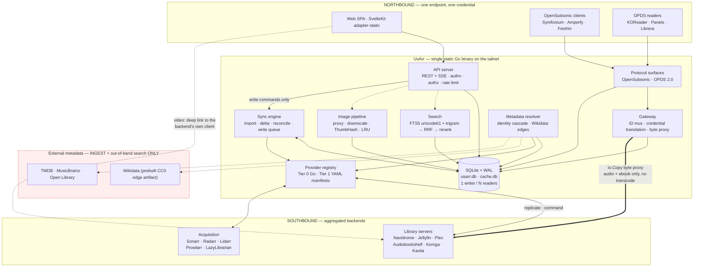

# UsArr — Architecture

**Status:** design document, pre-alpha. Nothing is implemented yet.
**Last revised:** 2026-08-16 (revision 2, after a three-way adversarial review —
[`REVIEW-LOG.md`](./REVIEW-LOG.md) records what was applied and what was rebutted).
**Evidence:** [`RESEARCH.md`](./RESEARCH.md). **Decisions:** [`DECISIONS.md`](./DECISIONS.md).
**Deferred ideas and the seams that keep them cheap:** [`FUTURE.md`](./FUTURE.md).

This is the document a contributor reads start to finish: principles, shapes, invariants, reasons.
Reference detail — full DDL, endpoint tables, normalisation matrices, provider inventories — lives
in [`reference/`](./reference/) and is linked per section.

| Reference | Contents |
|---|---|
| [`reference/schema.md`](./reference/schema.md) | Complete DDL and the invariant behind every index |
| [`reference/sync.md`](./reference/sync.md) | Import, delta, reconcile, the write queue, SQLite pragmas |
| [`reference/search.md`](./reference/search.md) | FTS5 query construction, escaping, RRF, re-rank weights |
| [`reference/gateway.md`](./reference/gateway.md) | OpenSubsonic/OPDS endpoint map, ID codec, byte proxy, write-back |
| [`reference/crossmedia.md`](./reference/crossmedia.md) | Wikidata artifact, scoring ladder, Train Dreams worked example |
| [`reference/tags.md`](./reference/tags.md) | Tag vocabulary, implications, inheritance, filtering |
| [`reference/providers.md`](./reference/providers.md) | Provider interface, manifest grammar and its limits |
| [`reference/arr-apis.md`](./reference/arr-apis.md) | \*Arr API facts: normalisation, enums, paths, gotchas |
| [`reference/security.md`](./reference/security.md) | Encryption, key rotation, SSRF classes, redaction |

Facts about upstream APIs were read from a shipped OpenAPI spec or from source. Judgements say so.
⚠️ = **unverified**. 🔍 = **inference** from verified facts, not itself verified.

---

## 1. Vision and non-goals

### 1.1 What UsArr is

A **self-hosted aggregation gateway**: one unified, searchable catalogue over everything you own and
everything you might want, that plugs into the players you already use.

- **Northbound** — protocol surfaces existing clients already speak (OpenSubsonic, OPDS): one
  endpoint, one credential, the union of every backend library.
- **Southbound** — the services UsArr aggregates: Navidrome, Jellyfin, Audiobookshelf, Komga/Kavita
  for libraries; Sonarr, Radarr, Lidarr, Prowlarr and the post-Readarr book tools for acquisition.
  **The two roles are separate bindings, and that is the normal case** (§8.3): Navidrome catalogues
  music and Lidarr or Prowlarr takes the request; Komga and Kavita catalogue comics and nothing
  downstream of them accepts a release at all.

Between them: **one canonical library database** across six media types — movies, TV, music, ebooks,
audiobooks and comics — with cross-media links, one tag vocabulary, one search box, one request flow,
and **user-defined libraries that are UsArr's organisation rather than a copy of upstream's** (§6.5).
Media type is the navigation axis and a library is a scope; the two are never merged (§17.2).

> **UsArr coexists with the ecosystem; it does not replace it.** Sonarr keeps doing acquisition,
> Jellyfin keeps doing playback, Navidrome keeps being an excellent music server. UsArr is the layer
> that makes them one catalogue. Every design decision that follows is downstream of that: features
> that would move UsArr toward *replacing* a neighbour (a transcoder, a player) are permanent
> non-goals, and features that make the neighbours easier to live with are the point.

| # | Property | Concretely |
|---|---|---|
| 1 | **Fast** | Every user-facing read is a local SQLite query. No screen waits on an upstream call (§13). |
| 2 | **A gateway, not a player** | No in-app player, no transcoding, ever. UsArr does carry bytes for its own OpenSubsonic/OPDS surfaces, because those protocols have no link-out affordance (§5.4). Video links out. |
| 3 | **Pluggable** | Runs over any single **library-bearing** service, a full stack, or a service nobody wrote Go code for. With only Prowlarr it runs in **Search-and-Grab mode** (§8.5) — a defined configuration, not an empty app. |
| 4 | **One library** | One canonical `work` table. Instances are replication sources, not the model. One work maps to rows in many instances at once. |
| 5 | **Requests are a pillar** | Owned and unowned in one result set with clear availability state; one Add that routes (§8.3). |
| 6 | **Cross-media + provenance** | "Train Dreams" surfaces the 2025 film **and** the Denis Johnson novella, joined by a typed evidence-carrying edge (§9). Acquisition source is a first-class indexed attribute, never a string in a release name (§10). |

**The honest floor.** UsArr requires **at least one library-bearing service** to present a library.
Prowlarr alone has no library; what it supports is Search-and-Grab mode. Stated because the
alternative is a user seeing a working install with nothing in it and no way to know why.

### 1.2 Deployment assumption: a tailnet

UsArr assumes a Tailscale tailnet or equivalent overlay. The network is authenticated at the
transport layer before UsArr sees a packet, so the threat model is "people I deliberately let onto
my tailnet" — a small trusted group, **not zero adversaries**: a kids account, a guest's laptop and a
compromised TV are all on it. Because the backend is Go, `tailscale.com/tsnet` can embed a tailnet
node directly in the binary (§12.3). ⚠️ tsnet specifics are from research notes and must be verified.

What the tailnet does **not** buy: it does not authenticate a backend to UsArr (§11.3), does not make
a leaked backend credential harmless, and does not authorize anything. Internet exposure is a
supported hardened secondary mode; credential encryption and the SSRF policy apply identically.

### 1.3 Single-user first, multi-user schema from day one

v0.1 ships single-user: one implicit owner, user-management UI hidden. Two hard rules from migration
0001:

1. **Every table that should be user-scoped carries `user_id`:** `request`, `tag_assignment`,
   `playback_state`, `play_history`, `playlist`, `saved_filter`, `client_credential`, `session`,
   `audit_log`, `write_queue`. Retrofitting multi-tenancy touches every query; hiding a UI is free.
2. **Every read path that aggregates across instances takes an access-scope parameter** — in the
   query signature, not bolted on later, defaulting in v0.1 to the owner's full scope. This covers
   the grid, search, the client prefix index, the availability rollup and every northbound surface. A
   rollup computed across instances a user cannot see is an existence oracle; the scope parameter is
   what stops multi-user becoming a redesign.

### 1.4 Non-goals

**Permanent refusals.** These are not deferrals and never will be:

- **A video transcoder.** No FFmpeg command lines from user input, no hardware-acceleration
  backends, no patched FFmpeg fork (ADR-0006). ~7–12 engineer-months to reach a *worse* result than
  Jellyfin, plus a permanent High-severity CVE class — Jellyfin shipped FFmpeg argument injection
  twice, and CVE-2025-31499 was a bypass of a fix shipped in 10.8.13.
- **An in-app media player.** Playback is the backend's job and the client app's job.
- **Any FFmpeg dependency**, in any form, for any purpose.
- **Reimplementing the \*Arr download/import engines.**
- **A required sidecar** — no Postgres, no Redis, no search server. Optional backends may exist; none
  may ever be required.
- **Being a dashboard.** Homarr occupies that niche well.

**Scope decisions, not refusals** — deferred with their seams recorded in
[`FUTURE.md`](./FUTURE.md): WASM plugins, an external search engine, typo tolerance, OIDC/passkeys/
TOTP/forward-auth, the cross-media fuzzy ladder, a Jellyfin-compatible surface, video byte-proxying,
release calendars, and per-user statistics.

Two things worth stating precisely because they are easy to misread:

- **UsArr does not carry video bytes.** Video links out to the backend's own client. UsArr *does*
  proxy bytes for its own OpenSubsonic and OPDS surfaces (§5.4) — a plain `io.Copy` with `Range`
  handling and **no transcoding, ever**.
- **UsArr will not put an external metadata API on a *blocking* render path.** Providers are
  ingest-time. The one qualified exception is unowned search (§8.6): a remote query runs **out of
  band**, off the handler, streamed into an already-rendered page over SSE, never persisted until
  requested.

---

## 2. The replica-not-proxy principle

> **UsArr is not a proxy. UsArr is a replica.** Every user-facing read renders from local SQLite. No
> browser request ever *awaits* an outbound call. Upstream services are **replication sources** and
> **command sinks**, never request-time dependencies.

Once synced, with every service offline UsArr still browses, searches, sorts and filters at full
speed. Two honest caveats: this holds only **after a completed initial sync** (a first run against an
offline stack shows nothing), and posters not yet cached show their placeholder until a service
returns, because \*Arr cover art requires the instance's API key (§4.4).

### 2.1 The failure modes this eliminates

| Mechanism | Observed in | Killed? |
|---|---|---|
| Live third-party API on the render path | DroppedNeedle (MusicBrainz @ 1 req/s → ~50 min per 10k albums, first-party docs) | **Yes** |
| All-or-nothing page load | Homarr's dominant complaint | **Yes** |
| Fan-out search as slow as the deadest indexer (30 s+) | Prowlarr#712 | **Partly** — catalogue search is local; *release* search is remote, behind progressive disclosure (§8.4) |
| Background jobs stall the request path | Overseerr#2030 (open 2021 → archive) | **No** — needs bounded pools and an explicit writer scheduler (§7.6) |
| Heap blowup on large \*Arr payloads | arr-dashboard retrofitted streaming parse | **No** — needs streaming ingest (§7.2) |

**SQLite is not the bottleneck** — Seerr users report 82k items at ~1.5 s cold load with zero tuning.
Spend the budget on scheduling, I/O and **images** (§4.4: posters are 5–9 MB per screenful against
~30 KB of JSON).

### 2.2 What it costs, and where it stops

The price is cache coherency, and one conflict rule: **the \*Arr owns the truth; UsArr owns the
cache.** On divergence with no in-flight write, the \*Arr wins. Unambiguity prevents a category of
flip-flopping bugs — and makes two guards mandatory, because "the \*Arr always wins" is dangerous
when the \*Arr is lying (§7.4).

| Concern | Model |
|---|---|
| Metadata, browse, sort, filter; catalogue search over **owned** items; availability; cross-media edges | **Replicated.** Local SQLite. |
| Tags, requests, users, playback position | **Owned outright.** Nobody upstream has this. |
| **Search over unowned items** | **Not replicated.** Live, out of band, SSE-streamed, not persisted (§8.6). UsArr does not and will not hold a copy of TMDB. |
| **Media bytes** | **Live pass-through.** Video: link out. Audio/ebook on UsArr's own surfaces: `io.Copy` proxy (§5.4). |
| **Release search across indexers** | **Live**, behind progressive disclosure (§8.4). |

The unifying rule: **UsArr replicates everything a screen renders from its own library, never a byte
stream, and never a third party's catalogue.**

### 2.3 Two rules that make it non-negotiable in code

1. **No HTTP handler serving the browser may hold an outbound HTTP client.** Enforced by package
   boundary: `api` imports `store`, never `provider`. Unowned search (§8.6) obeys this literally —
   the handler writes to a channel; a worker owns the client.
2. **Degraded ≠ blocked.** With a breaker open, rows return `"stale": true, "degraded_services":
   [...]` behind a small non-modal banner. No grey-out, no spinner.

---

## 3. System diagram



1. Solid lines into `DB` are the render path; every dashed line is off it. `API` has **no solid line
   to any southbound service** — replica-not-proxy as topology.
2. The thick line is the byte proxy, and it exists **only** for UsArr's own surfaces. Video is a
   dashed deep link from the SPA; UsArr never carries it.
3. The red `ext` box is reachable only from `META`, only in the background, never from a handler
   blocking a response.

⚠️ **The three OpenSubsonic clients named in the diagram are not an implemented client matrix, and
two of them cannot connect.** Verified from source: **Amperfy** has zero occurrences of `apiKey` in
its entire Swift source and builds `u` + `t`/`s` only; **Feishin**'s Subsonic controller has no
`apiKey` path either. Both implement salt/token exclusively, so **neither can authenticate to an
`apiKey`-only server**. The policy is still right — the alternative is storing recoverable passwords
— but the consequence belongs in the milestone rather than in a demo. **Symfonium** is the reference
client, and ⚠️ **its own `apiKeyAuthentication` support is unverified**: its documentation does not
mention API keys and it is closed-source (§16, v0.4).

There is **no Jellyfin-compatible northbound surface** in the diagram or the roadmap (deferred —
FUTURE.md §6). An earlier draft deferred it in the text and drew it as first-class here; diagrams are
read as commitments.

---

## 4. Components

### 4.1 API server

Go, `net/http` plus a light router. `/api/v1/*` (keyset-paginated, ETagged, JSON); `/api/events`
(one **SSE** stream — plain HTTP, survives reverse proxies, auto-reconnects with `Last-Event-ID`,
and UsArr's push traffic is one-directional); `/img/{cache_key}?w={allowlisted}` (§4.4); `/rest/*`
and `/opds/*` (§5.2); `/stream/{usarr_id}` (§5.4); `/` (the embedded SPA).

**`/img/*` is authenticated** like the rest of the API, authorized against the owning item, and
served `Cache-Control: private, max-age=31536000, immutable`. A content-derived key justifies
*immutability*, not *publicness*; `public` on a per-user-authorized resource tells shared caches to
re-serve it across users. Genuinely public provider artwork lives at `/img/public/*` so the
distinction is structural, not conditional.

**Health.** `live` = process up. **`ready` = migrations applied and the listener accepting** — the
app can serve from an empty or partial library. **Sync state is not a readiness signal**; it is
reported at `/api/v1/system/sync` and on the Services screen (§17.3). Gating readiness on initial
sync produces a first-run restart loop under Docker's defaults (`start-period=0s`, `retries=3`) that
looks exactly like a crash.

The API server owns authn, authz filtering, CSRF and rate limiting, and no outbound HTTP client.

### 4.2 Sync engine and metadata resolver

The sync engine runs three channels plus a write queue (§7) on bounded worker pools, never a request
goroutine, and owns the single SQLite writer and the scheduler in front of it.

The metadata resolver does identity resolution (§6.4) and cross-media linking (§9), both off any
blocking path, and owns provider rate budgets: MusicBrainz **1 req/s per IP** (hard, enforced with
503s, contact `User-Agent` mandatory), Open Library 1/s anonymous or 3/s with an identifying UA,
Hardcover 60/min, Metron 20/min burst. TMDB's real limit is **⚠️ unpublished** (the repeated
"~40 req/s" is a forum claim); AniList's "90 req/min" is **⚠️ unconfirmed** — `docs.anilist.co` 403s
automated fetches and AniList has run degraded at a lower limit for long periods. For both: read
`X-RateLimit-Remaining` where present and back off adaptively on 429 rather than trusting a constant.

### 4.3 Provider registry

**Two tiers** over one interface (§11): compiled-in Go, and declarative YAML manifests. Providers are
resolved from a **registry of factories** and the sync engine never names a concrete provider type —
that is the seam that makes a third tier (FUTURE.md §1) an added factory rather than a rewrite.

### 4.4 Image pipeline

Posters are the bottleneck: a 60-item viewport at 500×750 is ~5–9 MB per screenful against ~30 KB of
JSON. **Ingest-time downscale** to a **fixed width allowlist** (`92, 154, 200, 342, 500, 780, orig`;
arbitrary `?w=` is a cache-poisoning DoS and a live CVE class, GHSA-rrr6-mvwg-9pg9), **AVIF encoded
lazily off the request path** (~10–20× slower than WebP), **all transcoding behind a
`min(NumCPU, 4)` semaphore** (jellyfin#9795 is exactly this failure), and **ThumbHash inline in every
list payload** (~25 B/item; chosen over BlurHash on decode cost, 503 µs vs 6.5 ms, because decode
runs on every page load and encode runs once). Three rules that are not obvious:

- **`cache_key` derives from the credential-stripped URL.** Provider keys (TMDB v3 uses `?api_key=`)
  are never stored in `image_asset.source_url` or the HTTP cache — they are attached at request time.
  That keeps keys out of every backup and support bundle, and means rotating a provider key does not
  invalidate the whole image cache.
- **Proxying is mandatory** — \*Arr `MediaCover.url` is instance-relative and requires the API key,
  which must never reach a browser. Path shapes differ per app
  ([`reference/arr-apis.md`](./reference/arr-apis.md) §6).
- **A URL read out of an upstream response body is its own SSRF class** — neither admin-configured
  nor a known provider. `image_asset` carries `origin_service_instance_id` and `origin_class`, and
  the fetcher selects policy from the **row**, not the URL string
  ([`reference/security.md`](./reference/security.md) §2).

**4.4.1 Cold start — the moment the speed opinion forms.** §13's first-paint and `/img` numbers are
**cache-hit** numbers. The real first run fetches 10k posters through UsArr, downscales at up to
seven widths, encodes ThumbHash and backfills AVIF behind a 4-way semaphore. On a Pi that is not 90
seconds, and if nothing is done the new user's first ten minutes are grey boxes — the exact
impression the architecture exists to avoid. Four rules:

1. **Viewport-prioritised fetching.** The SPA reports its current viewport window; those
   `image_asset` rows jump the queue and background backfill runs behind them. This single change is
   what makes cold start feel instant instead of alphabetical.
2. **Smallest size first.** Fetch 92px, encode ThumbHash and `dominant_color` from it immediately,
   defer larger widths and AVIF — ThumbHash coverage then races ahead of poster coverage by an order
   of magnitude.
3. **`dominant_color` is available before ThumbHash** (one average over the 92px fetch), so the empty
   card is title and year over a colour fill, never a grey box.
4. **Progressive rendering.** The grid paints from `work` rows as import phase A commits (§7.2);
   images fill in behind, and the grid is never blocked on the image queue.

Cost: a priority queue and a client-driven hint endpoint, roughly a day's work — the difference
between "fast" and "broken" on the only run most evaluators ever do. Budget rows are in §13.

### 4.5 Web client

SvelteKit `adapter-static`, embedded via `embed.FS`, no Node in production. UI philosophy in §17.1.
**Keyset-paginated "Load more" plus `content-visibility: auto` is the default list renderer**
(revised — see below); **never load full item records** (keyset windows of ~100, prefetching ±2
pages); **service worker** stale-while-revalidate for `/api/*` and cache-first for `/img/*`;
**prefetch on intent**; and **pending-write chips** keyed by the ULID idempotency key that resolve
from SSE — a chip, not an optimistic overlay (§7.6).

**List rendering, revised — this replaces "virtualize everything over ~200 rows" (ADR-0029).**
That earlier rule was written before anyone costed what virtualization takes away. Virtualization
removes off-screen rows from the DOM, and *"accessible landmark navigation, find in page, or
intra-page anchor navigation are based solely on DOM structure, and virtualized content is by
definition not in the DOM"* (<https://github.com/WICG/virtual-scroller>). **Ctrl+F for the album is
exactly what a power user does in a library browser**, so that is a functional regression, not a
theoretical one. `content-visibility: auto` skips *rendering* without removing content: *"the
skipped contents must still be available as normal to user-agent features such as find-in-page, tab
order navigation, etc."* (<https://developer.mozilla.org/en-US/docs/Web/CSS/content-visibility>,
Baseline September 2024). Infinite scroll is refused outright — NN/g finds it *"can be downright
harmful to usability — in particular, for search results"*, and Baymard measured "Load more" plus
lazy loading as the best-performing pattern. Three consequences, all normative:

1. **The default is "Load more" over keyset pages, with `content-visibility: auto` on rows.** The
   two positions are closer than they look: with ~100-row windows and ±2 pages prefetched the
   *mounted* set is small either way; what differs is whether unmounted rows are absent from the DOM
   or present-but-unpainted.
2. **Virtualization is an escalation, not a default, and its threshold is set from a benchmark that
   does not exist yet.** No number is chosen here, deliberately: the earlier "~200" had no
   measurement behind it and inventing a replacement would repeat the mistake. **`make bench` gains
   a required line** — render and scroll a `content-visibility` list at 1k / 5k / 25k rows on the
   §13 reference hardware, in both themes and at all three densities, measuring frame time and
   scrollbar drift. The threshold is whatever that measurement says, recorded here when it exists.
3. ⚠️ **`contain-intrinsic-size` has no value anywhere yet, and it is the whole risk.** The browser
   uses it as the placeholder height for skipped elements; when it is wrong the scrollbar jumps as
   content scrolls in, which reads as *slowness* — the exact failure this rule exists to prevent. It
   **cannot be a constant**, because the density control moves row height across 28 / 32 / 36 px
   plus three more values for two-line and thumbnail rows. It must derive from the same custom
   property the row height reads (`contain-intrinsic-size: auto var(--row-h)`) and be tested with
   the density control while scrolling. Until that exists, this section is a direction, not an
   implementable rule.

The one deliberate exception to "never load the whole library" is the **client-side prefix index,
over *top-level works only*** (`movie, series, artist, album, book, comic, game`) — never seasons,
episodes, tracks or comic issues. For the §13 reference library that is ~13k rows, not the ~412k `work` rows it
actually contains. Fields `{id, title, year, kind, availability_state}` in a columnar payload plus
ThumbHashes as raw bytes in a side `ArrayBuffer` (~25 B each, not ~34 base64 chars) →
**~1.5–2.1 MB at 13k items** at a realistic 110–160 B/item. **Hard cap 25,000 items:** above it the
client ships no index, Tier 1 falls back to server search, and the UI says so. Built per access
scope and ETagged by `(user_id, access_scope_version)` (§1.3).

---

## 5. The gateway

Endpoint-level detail: [`reference/gateway.md`](./reference/gateway.md).

### 5.1 The four problems

ID collision (clients cache IDs *indefinitely*, in playlists and offline downloads) →
§5.3; credential translation (the client has one UsArr credential, UsArr has N backend credentials,
and they must never meet) → §5.2; byte delivery → §5.4; capability skew → §5.5.

### 5.2 Northbound surfaces and credential translation

**OpenSubsonic** is the highest-leverage integration available: speaking it as a *server* means ~40
client apps work with no client work by UsArr.

> 🚩 **UsArr's OpenSubsonic surface implements `apiKeyAuthentication` ONLY and actively refuses
> salt/token auth.** Classic auth is `u`+`t`+`s` where `t = md5(password + salt)`, which
> **mathematically requires the server to hold the password recoverably**. Four wire rules, all
> required and all detailed in [`reference/gateway.md`](./reference/gateway.md) §2: the parameter is
> **`apiKey`**, a query parameter (✅ verified against the spec); `apiKey` together with `u` is
> **rejected**; `u`/`t`/`s`/`p` alone are **actively rejected with the spec's error code**, never
> silently ignored, because silent ignoring lets a client believe it authenticated; and since the
> spec does **not** require TLS, the key rides in the request line of every call — serve over TLS,
> warn otherwise, and redact (§14). The spec only *recommends* dropping salt/token, so the refusal
> is UsArr's own policy and must be a hard rejection rather than an omission. A minority of ancient
> clients will not work; that is correct. Reference client: **Symfonium**.

**OPDS 2.0 with 1.2 fallback** is cheap — JSON over a metadata table — and serves KOReader, Panels,
Librera and Moon+ Reader. **Auth is HTTP Basic**, the `client_credential` as the password, because
those readers predominantly speak Basic and nothing else. Consequences, all normative: serve over
TLS or warn, since the credential is sent on every request; **`Authorization` is stripped before any
redirect UsArr emits**, so a reader that forwards credentials across hops cannot leak the UsArr
credential to a backend; and acquisition links point at UsArr's own `/stream/{usarr_id}`, never at a
backend URL. ⚠️ Whether each reader forwards `Authorization` across redirects is unverified and is a
named test case.

**Credential translation.** The client presents a UsArr `client_credential`; UsArr presents
`service_instance.api_key_enc`, decrypted in memory only.

- **Client credentials are server-generated**, ≥128 bits from `crypto/rand`, stored as
  **HMAC-SHA256 under a server-side key**, looked up by `key_prefix`, compared with
  `subtle.ConstantTimeCompare`. **Not Argon2id, and this is not an oversight.** A `client_credential`
  is a high-entropy bearer token, not a password: a memory-hard KDF buys nothing against 128 random
  bits and costs everything. Subsonic clients authenticate *per request* — one Symfonium poster grid
  is ~60 `getCoverArt` calls, which at m=19 MiB is 1.1 GB of transient allocation and 60 sequential
  memory-hard runs on a Pi, and any unauthenticated caller could OOM the process with
  `GET /rest/ping?apiKey=garbage` in a loop. **Do not "fix" this back to Argon2id.**
- **Backend credentials are never returned to any client, in any form, ever** — not in a response,
  not in a redirect target, not in logs or a support bundle.
- **Northbound authorization is UsArr's own**, never delegated to a backend's.

### 5.3 Stable IDs

Clients cache IDs forever; an unstable scheme silently destroys user playlists.

```
usarr_id := crockford_base32( varint(instance_id) || kind_byte || enc_byte || native_id_bytes )
```

- `instance_id` is `service_instance.id`, assigned once and **never reused**.
- **`kind_byte` is required, not decoration.** The only unique index on `service_item_link` is
  `(service_instance_id, remote_kind, remote_id)`; without the kind at lookup time SQLite uses only
  the leftmost column and every resolve degrades to a scan over one instance's links — ~400k rows for
  a 2k-series Sonarr. Indexing `(instance, remote_id)` instead is not available: `remote_id` is
  **not** unique per instance across kinds (Sonarr series 42 and episode 42 both exist).
- `enc_byte` records the encoding: `0x00` verbatim UTF-8; `0x01` a 32-hex or UUID identifier decoded
  to 16 raw bytes and re-hexed on the way out. There is no `0x00` *separator* — `varint` is
  self-delimiting, so a separator is decodable dead weight.

**Length, honestly.** Base32 expands 8/5: a 32-hex id is 19 B → **31 chars**; a verbatim 26-char ULID
is 29 B → **47 chars**; a verbatim 32-char non-hex id is 35 B → **56 chars**, over the ~48 target. The
length requirement is a **target the compaction rule meets for hex/UUID backends and misses for some
others**, stated rather than pretended. 🔍 Per-backend native-ID formats are inference and must be
checked against live instances **before the codec is frozen — it is unchangeable once clients cache
ids.**

**The ID addresses a `service_item_link`, not a `work`,** because a work can be merged or split by
the identity cascade, and merges must not corrupt a playlist. Two corrections to the earlier claim
that "nothing UsArr computes is in it": `instance_id` is assigned by UsArr, and *which* link is
addressed was driven by an admin-editable `priority`. The true invariant is narrower and pinned:

> The ID is stable for a fixed `(instance, kind, native id)`. **Once a link has been addressed
> northbound it is pinned** (`is_northbound_canonical = 1`) and priority changes do not move it. When
> a pinned instance is deleted, UsArr mints an alias row so old IDs still resolve; it never silently
> rebinds.

**Unguessability is not a property of this scheme** — base32 decodes in one line and \*Arr native ids
are small sequential integers, so the space is enumerable. The earlier "opaque to the client"
requirement was false and is struck. **Authorization must never depend on ID secrecy:** every
resolution — browse, metadata, `getCoverArt`, `stream`, OPDS acquisition — performs a
`user_library_access` + permission check **before any backend call**, returning the protocol-native
not-found (Subsonic 70) on failure, never a 403, which would confirm existence. Failures are
rate-limited and audit-logged so enumeration is visible.

### 5.4 Stream path: proxy for audio and ebooks, link out for video

**This reverses the earlier design, and the reason matters more than the conclusion.** The earlier
design defaulted to a `302` redirect and rested its safety case on "the backend mints a scoped
ephemeral token and UsArr puts *that* in the redirect". That premise is false:

- ✅ `jellyfin/jellyfin#10808` — *"Refactor 'Copy Stream URL' to not leak the user's session API
  key"* — is an **open issue proposing** per-object scoped keys, filed precisely because Jellyfin has
  no such thing today and its stream URLs carry the user's full session token.
- ✅ Navidrome does **not** support OpenSubsonic `apiKeyAuthentication` in any release or in `master`
  (v0.63.2 latest; two PRs open, neither merged) — so there is no Navidrome API key to mint either.

With no scoped token, a 302 hands the client a **backend-user-equivalent credential** usable outside
UsArr's authorization for its natural lifetime — un-doing library visibility and parental controls
wholesale, on a tailnet whose threat model includes a kids account. Two further unresolved problems:
a minutes-lived token breaks *seek*, because most Subsonic clients re-`Range` the same URL rather
than re-calling `stream`; and cookie-session backends cannot be redirected to at all.

| Item | Path | Why |
|---|---|---|
| Audio, ebook, comic on UsArr's own surfaces | **UsArr proxies the bytes** | These protocols have one acquisition verb and no safe way to send a client elsewhere |
| Video | **Link out** to the backend's own client; the northbound surfaces advertise no video stream endpoint | UsArr has no video northbound surface, and video is where the byte cost is ruinous |
| Images | Always proxied and cached (§4.4) | `MediaCover` requires the API key; a poster is ~30 KB |

**What the proxy is:** a plain `io.Copy`, with correct `Range` / `Content-Range` / `206` /
`If-Range` / `ETag` / `Accept-Ranges` handling, a bounded buffer, and the client's `Range` passed
through verbatim. **No transcoding, ever** — if a client asks Subsonic for a transcode, UsArr serves
the original and reports the real format.

**What it costs, plainly:** `Range` handling is a genuine source of subtle bugs and this puts UsArr
on the byte path for audio. Mitigations: audio is ~1–5 Mb/s, not a 60 Mb/s 4K remux; there is no
transcode; and the failure mode of getting it wrong is a client that cannot seek, not a leaked
credential. Given the choice between a bug-prone surface and handing tailnet clients a full backend
session token, the surface wins.

**The `/stream/{usarr_id}` token** is specified rather than gestured at, in
[`reference/gateway.md`](./reference/gateway.md) §4: HMAC-SHA256 over
`(user_id, client_credential_id, usarr_id, instance_id, expiry, nonce)` under a key derived with a
**distinct HKDF label from the credential KEK**, so the two rotate independently; **numeric TTL —
120 s default, 600 s maximum**; `client_credential_id` checked against `revoked_at` on **every**
redemption, so revoking a credential really does kill outstanding links; a nonce replay cache; ±60 s
skew tolerance; `no-store` and `no-referrer`. A short TTL does not break seek here, because the bytes
come from UsArr: the client re-`Range`s the same URL and UsArr re-authorizes.

### 5.5 Capability negotiation and degradation

`getOpenSubsonicExtensions` returns what **UsArr** implements, a fixed set determined by UsArr's
code. Per-backend capabilities come from `Provider.Capabilities`, which **probes the live instance**
rather than assuming from `kind`. Unsupported operations return the protocol's own error (70/50),
never a 500. When a backend is down, **browse and search still list everything** from the replica;
stream requests fail individually after a short deadline; the breaker means a down instance is
*known* down and is skipped rather than re-timed-out on; the Services screen (§17.3) and a non-modal
banner name it. The catalogue never greys out.

---

## 6. The data model

Full DDL and the invariant behind every index: [`reference/schema.md`](./reference/schema.md).

SQLite, `STRICT` throughout. **Minimum SQLite is 3.43, not 3.37**: `STRICT` needs 3.37, but the FTS5
`contentless_delete=1` option that makes search deletable arrived in **3.43.0**, and without it
deleted works stay in the search index forever (§8.2).

### 6.1 The three-layer core

> **The film *Train Dreams* and the novella *Train Dreams* are two different `work` rows connected by
> a typed edge — NOT one `work` with two editions.**

Two mature bibliographic systems converged on this (Open Library: *"if a work has been adapted or
retold, it is considered a unique work"*; Wikidata models adaptation as `P144 based on`, a link
*between* works). Practically: the film has a director and a Radarr row, the novella an author and a
book-service row; one table would be mostly nulls and would destroy "monitor the movie but not the
book". And the UI can say **"Based on the novella by Denis Johnson"** instead of silently merging.

`work` (the abstract work, kind-scoped) → `edition` (a specific released form — the 2160p cut, the
2013 Granta paperback, **the audiobook**, the Portuguese translation) → `media_file` (concrete
bytes).

**`work.kind` is:** `movie, series, season, episode, artist, album, track, book, comic, comic_issue,
game`.

> **`comic_issue` is new in this revision, and migration 0001 is the only cheap moment to add it
> (ADR-0030).** Every other multi-level medium got its levels — TV has `series`/`season`/`episode`,
> music has `artist`/`album`/`track` — and comics had exactly one member, `comic`, with a
> `work_comic` subtype whose columns (`issue_number`, `volume`) describe an *issue* while the search
> corpus, the Tier 1 prefix index, the `kind_byte` map and the grid all treat `comic` as
> **top-level**. Those two readings are inconsistent in precisely the way the `audiobook`
> kind-vs-edition contradiction was. With one member you either lose issues entirely (no "43 of 60",
> no per-issue availability, no read progress) or you put series and issues in one kind and
> distinguish on `parent_work_id IS NULL` — which breaks §8.2's corpus rule, because that rule
> filters on `kind`, so every chapter title enters the FTS corpus and a large manga library swamps
> every query. Fixing it now is one line. Fixing it later is a CHECK-constraint change (a SQLite
> table rebuild), an FTS re-index, a rebuild of every client prefix index, and a change to the
> `kind_byte` codec, which §5.3 states is **unchangeable once clients cache ids**. `comic` is the
> series; `comic_issue` is the issue or chapter, excluded from the corpus. Both bytes are allocated
> in the same commit, before any client caches anything.
>
> **There is no third level for Kavita's Volume, and no `manga` kind.** Kavita has a Volume node;
> Komga, Mylar3 and Kapowarr do not, so a third tier would be empty on four backends out of five and
> would render "Volume 1 › Chapter 1" for one of them over the same files. It is carried as
> `work_comic_issue.volume_label` + `volume_sort` — a grouping attribute, not a node, and a
> deliberate loss of fidelity against Kavita that is written down as one. Manga is not a separate
> kind either: Komga models no manga/comic distinction at all (only `ReadingDirection`), and
> Kavita's `LibraryType` members `Manga` / `Comic (Flexible)` / `Comic (ComicVine)` are
> filename-parsing modes over one identical entity tree. Splitting the kind would also make §6.4's
> "never auto-merge across `kind`" a liability: the same series in Komga (undifferentiated) and
> Kavita (in a Manga library) would land in two kinds and could never be merged. The real
> differences live where they cost nothing: `work_comic.reading_direction`, `external_id.source`
> (AniList/MAL/MangaBaka vs Comic Vine/Metron), routing caps, the Newznab category (§8.5), and a
> derived `type:manga` system tag.

> **`audiobook` is not a `work.kind`. An audiobook is an `edition` of a `book` work**
> (`edition.format = 'audiobook'`). The earlier draft asserted both readings in one document, which
> made it unimplementable: as a kind, an audiobook could never be matched to its own ebook (the
> cascade forbids cross-kind matching); as an edition, the kind enum and the `type:` tag vocabulary
> were wrong. Edition wins — it matches Open Library, which ADR-0009 already cites as authority. It
> propagates: `work.kind` drops `audiobook`; `edition.format ∈ {print, ebook, audiobook, bluray, web,
> vinyl, flac, cbz, …}`; `request` carries `(work_kind, edition_format)`; the tag vocabulary gains a
> `format:` namespace and `type:audiobook` is gone; `Caps.MediaKinds` becomes a list of
> `(kind, format)` pairs (§11).

**The `edition` table stays**, against a review recommendation to cut it, and the six-media-type
expansion turned that from a defensible call into an obvious one. Books, audiobooks and ebooks
genuinely need it — it is what makes the Portuguese translation *Sonhos e Comboios* the same work as
*Train Dreams*, and what makes ebook-vs-audiobook routing a schema property rather than adapter
special-casing. Three independent confirmations arrived with the expansion: **Chaptarr**, the only
new \*Arr-lineage book manager, converged on exactly `Book` → `Edition[]` with `IsEbook`,
`Narrator`, `DurationSeconds` and `ChapterCount` on the edition; **MusicBrainz** defines a remaster
as *"produced solely through … mastering"*, explicitly **not** a new recording — so a remaster is the
same album work, the same track works and a new `edition`, which is the split doing its job; and
**five scanlations of one manga chapter** are five `edition` rows on one issue work, `label` = group,
`language`, `published_at` each. One narrow table and a foreign key.

**Three `edition` columns the books and music work adds**, all of them properties of a production
rather than of a work or of a file: **`narrators` (a list)**, **`duration_seconds`** and
**`abridged`**. A 30-file audiobook has one runtime, different productions have different narrators,
and an abridged reading is a materially different thing users care about. Chaptarr, Audiobookshelf
(`Book.narrators`, `Book.duration`, `Book.abridged`) and Audnexus all put them at this level.
**`edition.format` carries the medium, never the codec** — a 2000 UK CD release can be on disk as
FLAC, so the medium belongs to the release and the codec to `media_file`. 🔍 That separation is
inference from the two models, not a cited rule, and it is the one place `edition.format` is easy to
overload. The `format` CHECK list must also agree with this document's prose: it needs `cbz`, `cbr`
and `pdf` as comic/ebook file shapes, which the DDL currently lacks.

**Every kind has a subtype table or a stated reason not to.**

- **`work_track` is edition-scoped, not work-scoped, and that is a correction.** The earlier text
  hung `disc_number` and `track_number` off a `work`. But the same recording is track 4 on the
  original CD and track 6 on the 2017 deluxe reissue, with a different track MBID each time:
  **position is a property of the (track-work, edition) pair.** So `work_track` carries
  `edition_id`, keyed `(work_id, edition_id)`. Adding that column later is a backfill over the
  largest table in the schema; adding it in migration 0001 costs eight bytes a row. **The seam ships
  in 0001; the multi-edition UI does not.**
- **`track_number` is `TEXT`, with a derived `track_position INTEGER` sort key.** Lidarr ships it as
  a string and keeps a separate integer alongside, because real track numbers are `A1`, `B2`,
  `1.01`. An integer column sorts a double LP randomly. The same rule holds one level down for
  comics: `work_comic_issue.number_text TEXT` plus `number_sort REAL`, because issue numbers are
  `1.MU`, `-1`, `0`, `Annual 1`, `1A`.
- **Artist attribution is an M:N `work_credit`, never an `artist_id` column on the album.** The
  moment attribution is a scalar, Various-Artists compilations, collaborations and classical roles
  are unrepresentable — which is Lidarr's own limitation (`AlbumResource.artistId` is singular) and
  there is no reason to inherit it. This mirrors MusicBrainz artist credits and Navidrome's
  `Participants` model.
- **`work_comic` splits with the kind.** Series level: `volume_label`, `volume_year`,
  `reading_direction`, `publisher`, `total_issues_declared`, `total_issues_source`. Issue level
  (`work_comic_issue`): `number_text`, `number_sort`, `volume_label`, `volume_sort`, `is_special`,
  `is_oneshot`, `special_version`, `page_count`.

**The availability rollup is keyed by whatever the medium's denominator actually is** (§6.3), and
for two of the six types the denominator is not a quality tier:

- **Music: the rollup is edition-keyed.** Choosing the 2017 remaster over the 2000 original changes
  the track list, the count and the durations, so `total` is a property of the edition, not of the
  album work. Render the edition label beside the fraction or the fraction is a guess.
- **Comics: there is usually no honest denominator at all, and UsArr must say so.** Every "total" in
  the domain is a *declaration* — Komga's `totalBookCount` and Kavita's `totalCount` both derive
  from ComicInfo `Count`, and the Anansi specification itself concedes *"The `Count` could be
  different on each book in a series"*; Mylar3's total comes from Comic Vine, whose own code
  comments that *"comicvine isn't as up-to-date with issue counts"*. *One Piece* has no total. So:
  show `43 / 60` **only** when the series status is `ENDED`/`Completed`/`Cancelled` **and** a total
  is declared — both Komga and Kavita report status, so the gate is cheap — and otherwise show
  `43 issues` with no denominator. The rollup gains a `total_source` field so the provenance is
  visible. The number that is *always* honest is **contiguity**, computed locally from `number_sort`
  with no upstream help: *"43 issues · #7, #12 and #30–32 missing"* is more useful than any fraction.

**File identity.** `media_file` rows are **per-instance observations**, so the unique index is
`(service_instance_id, path)`, never `path` alone — a unique index on `path` makes it impossible for
Radarr and Jellyfin to both index the same volume, which is the normal topology and exactly what
ADR-0014 exists to support. Reconciling two observations of one physical file needs a `content_key`
(size + first-64-KiB hash), **deferred to the first milestone that aggregates a media server
alongside a \*Arr** — it costs a read of every file's first block, which is not free on a NAS.

### 6.2 Identity: `external_id`

External IDs are the **only** reliable cross-instance join key; never join on a \*Arr's local `id`.
Two unique indexes carry the model: `ux_extid` over `(source, value, COALESCE(work_id,-1),
COALESCE(edition_id,-1))`, because one ISBN can legitimately sit on a work and on an edition; and
`ux_extid_work_strong` over `(source, value) WHERE work_id IS NOT NULL AND confidence >= 1.0`,
because a *strong* id must identify exactly one work.

> **A `ux_extid_work_strong` violation is not an error — it is the merge signal.** The sync path
> catches it, resolves which work survives by the §6.3 authority rule, writes `work_merge`, and
> retries. Two consequences: import batches must isolate identity conflicts (a per-row `SAVEPOINT`)
> so one conflict does not abort 4,999 unrelated rows; and any `ON CONFLICT` must repeat the index's
> exact expression list, which hand-written upserts get wrong. Literal list in the schema reference.

Ingest normalisation is mandatory, and **the axis is `(app, resource)`, not app**: within Radarr
alone, `MovieResource.imdbId` is a `string` and `ReleaseResource.imdbId` is an `int32` (verified from
the shipped spec). Full matrix: [`reference/arr-apis.md`](./reference/arr-apis.md).

### 6.3 Services and the M:N link

`service_item_link` is **many-to-many**: one canonical `work` maps to rows in many instances, each
with its own `remote_id`, `monitored` state, quality profile and root folder. That makes the
dual-Radarr (1080p + 4K) topology representable and the "1080p ✓ / 4K ✗" badge falls out at near-zero
marginal cost. Conflict rule: highest `priority` among `is_authoritative` links wins, else
most-recently-synced; log divergences. `remote_hash` hashes **only the synced subset** — `sizeOnDisk`
churns constantly and would defeat it. `service_instance.managed_by` is a three-valued `TEXT` column
(`ui | env | file`), not a boolean; `CONFIGURATION.md` is authoritative for precedence.

**The availability rollup, defined.** Not a boolean map: for a series with 250 of 300 episodes in the
1080p Sonarr and 40 in the 4K Sonarr, a boolean says nothing, and this badge is the flagship demo.

```json
{"1080p": {"have": 250, "total": 300}, "2160p": {"have": 40, "total": 300}}
```

Render `have == total && total > 0` → ✓; `have == 0` → ✗; otherwise the fraction. **Recomputation is
dirty-marked, never per-child:** a child write marks its ancestor dirty in the same transaction, and
ancestors are re-aggregated **once per 250 ms flush batch**. Re-aggregating 300 children on each of
400k episode-file events during an import is the difference between a 90-second import and an
unusable one.

### 6.4 Identity resolution

A confidence-ordered cascade, first hit wins: (1) exact strong external id — 1.00; (2) transitive
closure over external ids — 0.95; (3) `normalized_title` + year ±1 + same kind — 0.85; (4) alt title
+ year ±1 + same kind — 0.75; (5) Jaro-Winkler ≥ 0.94 + year ±1 + same kind + shared credited person
— 0.65. Below 0.65: **do not merge.**

**v0.1 runs tier 1 only.** Its providers are Sonarr and Radarr and every row from both carries
`tmdbId`/`imdbId`/`tvdbId`, so tier 1 resolves essentially 100% of the v0.1 identity problem —
including the dual-Radarr case, which joins on `tmdbId`. Tiers 2–5 and the `work_merge`/un-merge
machinery land with the first provider that lacks strong ids. `normalized_title` and `norm_version`
**columns** exist from migration 0001 (adding them later is a backfill), populated by a deliberately
simple v1 algorithm: casefold, NFKD, strip combining marks, strip punctuation, collapse whitespace.
The full normaliser is in the schema reference as "the v2 normaliser" and is a known source of
locale-dependent bugs (Turkish dotless ı among them).

Three rules that prevent the classic disasters: **never auto-merge across `kind`** (the film and the
novella are linked, never merged); **merges are recorded and reversible**; **`normalized_title` is
deterministic and versioned**, so `norm_version` tells you which rows are stale.

**Four amendments the six-type expansion forces, each because a medium breaks an assumption the
video-only cascade could make:**

1. **Tier 3 takes the primary author for books, not just the year.** Book titles collide far more
   than film titles — *The Gift*, *Home*, *Origin* — so `normalized_title` + year ±1 + kind is not
   discriminating enough on its own.
2. **`work_merge` ships with the first music milestone, not with tiers 2–5.** MBIDs are
   redirect-capable — the Servarr metadata server carries `oldids` for exactly this — and Open
   Library merges leave a `/type/redirect` record behind, so **an OLID stored last month can resolve
   to a redirect today**. Any Open Library adapter must detect `"type": {"key": "/type/redirect"}`
   and follow `location` **before** writing the id. Upstream renames the key; UsArr has to survive
   it, and that is tier-1 work, not fuzzy-tier work.
3. **Identity parsed out of a free-text field is never strong.** Komga supplies no external
   identifiers at all; the only ids available from it are whatever a user typed into
   `metadata.links[]`. Those get confidence 0.90, never 1.00, because a confidence-1.00 write hits
   `ux_extid_work_strong` and *merges works* — a mistyped link must not be able to do that. This is
   §11.2's manifest rule generalised. Related, and concrete: **strip a trailing parenthesised
   4-digit year from a Komga series title into `year` before normalising**, or *Saga (2012)* never
   matches Kavita's *Saga* + `releaseYear 2012`.
4. **An ISBN or an ASIN must never satisfy `ux_extid_work_strong`.** Both are edition identifiers —
   a hardback, its paperback, its EPUB and its US and UK printings all carry different ISBNs, and
   the audiobook usually has an ASIN and no ISBN at all. Writing either as a work id silently claims
   a paperback and an audiobook are the same edition. Publishers also reuse ISBNs and put one on an
   omnibus, so **two works are never merged on ISBN agreement alone.** Work-strong book sources are
   `openlibrary_work`, `hardcover_book` and `goodreads_work`, and nothing else.

**The kind decision is UsArr's, made once at ingest.** A graphic novel with an ISBN sits in a Komga
library and in a Calibre library; if one is ingested as `comic` and the other as `book` the cascade
forbids them ever merging. The rule that resolves it is that `work.kind` is derived from a rule UsArr
controls — the library's declared kind (§6.5) — and never inherited from whichever backend answered
first.

---

### 6.5 Libraries: the user's organisation, which upstream never owned

> **A UsArr library is a user-owned, named, single-kind, format-filtered *binding* to containers the
> upstream services already computed — a whole instance, a root folder, an upstream library id or an
> \*Arr tag — with materialised membership, one declared request sink, and a narrow user-owned
> correction layer. UsArr never reads a filesystem.** (ADR-0026.)

The motivating problem is not storage control. It is that **an upstream service's own idea of a
library is often wrong, and the user wants UsArr's organisation to be better than the service's.**
LazyLibrarian is the worked example and the evidence is in its source rather than in an opinion: a
file its fuzzy matcher cannot bind to a provider record has **no row written at all** — the failure
is recorded in a local dict used only for a summary log line — so its library view is its *provider's*
view intersected with what a threshold accepted. Its own documentation sets match ratios at
*"somewhere around 80% to 90%"* and warns that looser matching *"will get matches against the wrong
books"*.

**Three ownership axes, and keeping them apart is the whole design.**

| Axis | Owner | Wins on divergence |
|---|---|---|
| **State** — does the remote item exist, is it monitored, is there a file, which quality profile, which root folder | The \*Arr / backend | **Upstream, always.** No override exists. These are the inputs to the write queue (§7.6); a user-editable copy means the UI shows "monitored" while Sonarr disagrees, the queue issues commands against a fiction, and the sweep fights the user forever. |
| **Organisation** — which library a work is in, what it is called, what kind it is, what feeds it, where its requests go | **UsArr (the user)** | **UsArr, always.** Upstream never had an opinion about this, or had a bad one. |
| **Display identity** — title, sort title, year, cover, and "is this link really this work" | Upstream by default | **An explicit user correction**, then §6.3's authority rule. Both values are retained; the override never writes back upstream. |

That table is the refinement ADR-0004 needs, and it is narrow: *the \*Arr owns the truth about the
\*Arr's own state; it never owned the truth about the user's organisation.* A replica that can be
more correct than its source is still a replica — it is one with an owned overlay, which §2.2 already
grants for tags, requests and playback position. Corrections join that list.

**Four tables, all in migration 0001.** Full DDL in [`reference/schema.md`](./reference/schema.md).

| Table | What it holds |
|---|---|
| `library` | name, slug, **exactly one `work.kind`**, a `formats` filter over `edition.format`, icon, order, enabled, `include_on_home`, `include_in_search`, default sort, the `sink_*` columns (§8.3), `managed_by ∈ {auto,user}` |
| `library_source` | M:N to `service_instance`, plus `container_kind ∈ {instance, root_folder, remote_library, tag, series_type}` and `container_ref` — **the container is always one the upstream itself reported**, `container_identity` to survive id reuse, `is_metadata_authority`, `missing_since` |
| `library_member` | **materialised** membership, `(library_id, work_id)`, written in the link-write transaction and dirty-marked/flushed per 250 ms batch exactly like the availability rollup (§6.3) |
| `library_override` | the correction layer: four verbs — `exclude`, `include`, `relink`, `field` — with `user_id NOT NULL DEFAULT 0` on the sentinel pattern §10 already uses |

**Five rules that are the whole value of the feature:**

1. **A correction is keyed to UsArr identity (`work_id` / `link_id` + `target_identity_hash`) and is
   never cleared by a sync, a reconciliation sweep, a tombstone expiry or an id resurrection.** This
   rule exists for a specific documented failure: LazyLibrarian GitLab issue #2407 — books marked
   ignored **come back after an author rescan**, because the rescan returns the book with a different
   provider id. Storing the correction upstream, or keying it to the upstream's id, reproduces that
   exactly.
2. **Library membership is never an input to identity.** jellyfin#10985 is the counter-example: the
   same film in three per-language libraries collapsed into one item and watch state leaked across
   all three (closed as not planned). UsArr's identity is `external_id` plus the §6.4 cascade,
   computed with no knowledge of libraries. **CI asserts that no query in the identity path
   references `library_member` or `library_source`.**
3. **Membership is a deterministic predicate, never a similarity score**, and the container is always
   an object the upstream named. UsArr compares exactly one path — `root_folder_path`, as a prefix,
   on a value the upstream itself reported — and never parses a filename. That is the whole
   difference between this and a scanner, and the scanner is the component whose misidentification
   failures fill this section's citations: Jellyfin's own documentation calls its mixed library type
   *"broken and deprecated"*, and its removal proposal says the detector is *"very poorly
   implemented"*.
4. **A library's kind is required and editable.** Every tool that scans disk types its libraries and
   is right to; UsArr can additionally let the user *change* the type, which Plex cannot, precisely
   because nothing is parsed from a path — changing it re-derives membership from typed API
   resources and no rescan exists.
5. **A library with zero sources is retained, marked orphaned, and shown with its reason.** It
   carries a user's name, corrections and access grants; auto-deleting owned data to tidy up
   replicated data is the wrong trade.

**What this is not.** A library is not a tag (tags are cross-kind labels) and not a saved filter
(v1.0, a query). Cross-kind grouping — "Kids", "Christmas" — is a tag or a saved filter, never a
library. And **libraries are not navigation**: they are unbounded in number, so they are a scope, not
a sidebar entry (§17.2, ADR-0027).

**It supplies three referents the design had already promised and left dangling**, which is why it is
smaller than it looks: `user_library_access` (§12.2 names it with no `library` table to point at),
§8.3's *"a routing rule"* (named, never defined), and v0.4's `getMusicFolders` (an endpoint with
nothing to return without a library concept). One existing column changes with it:
**`search_doc.instance_scope` becomes `search_doc.library_scope`** (§8.2), because a library can be a
*subset* of an instance and instance-level scoping would then leak the existence of items a user
cannot see — the existence-oracle risk §1.3 exists to prevent. With one auto-created library per
instance the two sets are identical in v0.1, so the change costs nothing now and is a full-corpus
backfill later.

⚠️ **The one performance risk, stated rather than assumed.** The grid query becomes
`library_member ⋈ work` with keyset pagination, and §13 already notes that `ix_work_kind_sort`
*serves* rather than covers it. **Unmeasured.** Mitigation in order: a library is single-kind and the
default topology is one library per kind, so the common case is `work.kind = ?` with membership as a
one-row lookup; if measurement disagrees, denormalise the sort key onto `library_member`. This is a
CI `EXPLAIN QUERY PLAN` + row-count assertion and a `make bench` line, not an assumption.

---

## 7. The sync engine

Mechanics in full: [`reference/sync.md`](./reference/sync.md).

### 7.1 The channels, and the shipping order

| # | Channel | Latency | Covers | In |
|---|---|---|---|---|
| 1 | Full import | minutes | Bootstrap, disaster recovery | **v0.1** |
| 3 | Delta poll (`/history/since`) | 30–120 s | Everything that generates history | **v0.1** |
| 4 | Reconciliation sweep | 6–24 h | Silent drift, out-of-band edits, deletions | **v0.1** |
| 2 | SignalR stream | < 1 s | Live changes while connected | later |
| 4b | Webhook receiver | < 1 s | Push from services with no SignalR | later |

The numbering is historical; the order is not. **Channel 3 is the correctness guarantee, channel 4 is
the safety net, channel 2 is an optimisation.** The earlier roadmap shipped SignalR before
reconciliation, which was backwards: `/history/since` provably cannot observe a movie *removed* from
Radarr (removing it deletes its history rows), a `monitored` toggle, a quality-profile change, or a
root-folder move. Without channel 4 the only repair for divergence is a manual full re-import — for
most of the project's life. Reconciliation is also the *simplest* channel and is fully specified. It
moves in; SignalR moves out.

**Prowlarr is not a delta-sync source.** Its `HistoryEventType` is `unknown, releaseGrabbed,
indexerQuery, indexerRss, indexerAuth, indexerInfo` (verified) — indexer telemetry, not entity
change. `indexerQuery`/`indexerRss` fire on every RSS poll of every indexer, thousands of rows per
hour on a 20-indexer install, none mapping to a `work`, and `prowlarr.HistoryResource` lacks the
`movieId`/`seriesId` fields the loop depends on. Channel 3 applies to **library-bearing acquisition
apps** only; Prowlarr history is filtered to `eventType=releaseGrabbed` and used as provenance input.
(Six apps expose `/history/since`, not five — Whisparr is the sixth.)

### 7.2 Channel 1 — full import

\*Arr list endpoints are **unpaged and large** with no sparse-fieldset parameter; a 10k-movie library
is ~30–80 MB of JSON in one response. **Stream the JSON; never `io.ReadAll`** — buffering *and*
unmarshalling peaks at ~200–400 MB on a 1 GB Pi. **Two-phase:** phase A (id, title, year, external
ids, poster URL) renders the grid; phase B backfills overview, file details, media info and FTS.
Progress over SSE with real counts.

**Children are fetched per parent, bounded — because there is no other option.** `/api/v3/episode`
is **not** a bare-array endpoint: Sonarr's `EpisodeController` rejects a parameterless call with
`BadRequestException("seriesId or episodeIds must be provided")`, and the OpenAPI spec marks the
parameters `required: false`, which is why a spec-derived reading gets this wrong — the constraint is
in the controller. Same for `/api/v3/episodefile` and Radarr's `/api/v3/moviefile`. So: **one call
per series, 4–8 concurrent, jittered, behind a per-instance token bucket** — and the cost is
budgeted, not hidden: the reference library's 2k series means **~2,000 HTTP round trips for episodes
alone**, the dominant cost of a TV first import (§13).

**Accept header:** send `Accept: application/json, text/plain;q=0.9, */*;q=0.1` and parse as JSON
regardless of the returned `Content-Type`. `ReturnHttpNotAcceptable = true` is confirmed in the
shipped Servarr `Startup.cs`, so an unsatisfiable `Accept` is a 406 — but the large list endpoints
declare `text/plain`, `application/json` **and** `text/json` (verified), so plain `application/json`
is fine. The defensive header costs nothing and removes the question.

### 7.3 Channel 3 — delta poll

`/history/since` exists at `/api/v3` in Sonarr, Radarr and Whisparr and `/api/v1` in Lidarr, Readarr
and Prowlarr (verified). ⚠️ Behavioural parity is **not** verified; probe at connect time.

Per instance, every 60 s jittered ±20%: query from `last_delta_sync_at − overlap`; extract the
distinct affected entity ids; refetch **only those** canonically; advance the cursor to **the max
timestamp actually observed**, never `now()`. Three things previously unspecified, each of which
changes correctness: **the overlap is derived, not the constant 5 minutes** — the cursor is read from
*the \*Arr's clock*, so a clock running further ahead than the overlap makes the cursor jump past
events that are never re-queried; measure skew from the `Date` header on every health probe and set
the overlap to `max(5 min, 2 × |skew| + poll interval)`. **`date` format and inclusivity are probed
at connect time**, since every spec types it `date-time` and says nothing about either. **The
response is unbounded** — there is no `limit` parameter (unlike `/history`), so an instance offline
for a week returns its whole history in one array.

### 7.4 Channel 4 — reconciliation, and its two mandatory guards

Every 6 h plus on demand: fetch the full entity list per instance; left-anti-join
`service_item_link` → rows deleted upstream; **soft-delete with a 7-day tombstone**; compare
`remote_hash` → refetch drifted rows; emit a `sync_report`; run at low priority. The tombstone is not
optional: an \*Arr temporarily empty (misconfigured root folder, unmounted NFS share) must not nuke
the library. *"My NAS unmounted and UsArr deleted everything"* is the nightmare bug and one column
plus a delay prevents it.

**Guard 1 — id resurrection.** The \*Arrs allocate `id` from a plain integer primary key, so ids
**are reused after deletion**: delete movie 842, add a different movie, it becomes 842, the
tombstoned link still matches the unique index, and an "idempotent upsert" rebinds the new remote
item to the old `work_id` — poster, tags, requests and northbound ID all now pointing at the wrong
film. The 7-day tombstone is precisely the window in which this is possible. **On any upsert that
would clear `deleted_at`, compare the remote payload's external identity against the tombstoned
link's `work_id`**; on mismatch, hard-delete the tombstone and create a fresh link.
`remote_identity_hash`, recorded at first sight, makes it O(1).

**Guard 2 — instance identity generation.** An \*Arr restored from an older backup moves its id space
*backwards*, so ids UsArr has mapped now belong to different content. Under "the \*Arr always wins"
the sweep would rewrite existing works and then delete everything added after the backup point,
taking user tags and requests with it. Record `identity_fingerprint` at every connect and track
`max(remote_id)` per kind; **on a fingerprint change or a backwards jump, refuse to run the sweep**,
mark the instance `needs_reidentification`, surface it loudly (§17.3), and re-derive links from
`external_id` rather than `remote_id`.

### 7.5 Degradation: per-instance circuit breakers

`CLOSED --5 failures--> OPEN --cooldown--> HALF_OPEN --probe--> CLOSED|OPEN`, backoff 5 s → 15 m
capped with ±20% jitter, **per-instance, never global** — Radarr being down must not stop Sonarr
syncing. While OPEN: serve reads from SQLite tagged `"stale"`, accept writes into the queue with an
honest label. Health probe `GET /api/v3/system/status` at 3 s, and surface the \*Arr's **own**
`/health` warnings in UsArr's UI (§17.3). **Layered timeouts** (connect 3 s, TLS 3 s, response-header
10 s, total 60 s lists / 10 s otherwise) and **one `http.Client` per instance**. **Prowlarr failures
are soft** — it has historically returned HTTP 200 with an error in the body.

### 7.6 The write path: a durable command queue

The earlier design specified optimistic local apply, a stored `inverse_patch`, a three-phase
settlement machine where `applied ≠ confirmed`, and a client-side overlay reconciled against SSE —
and named itself *"the biggest schedule risk in the project"*. All of it bought ~200 ms of perceived
latency on a rare, deliberate operation. Writes here are: request a thing, toggle monitored, delete.

```
pending → inflight → done
                  ↘ failed_rejected            (4xx with a body: it did not land)
                  ↘ verifying → done | failed  (timeout / transport / 5xx: it might have)
```

- `POST` returns `202 {command_id}`; the UI shows an inline pending chip and resolves it from SSE. On
  failure: a toast with the upstream error, **Retry**, **Dismiss**. **No rollback is needed because
  nothing was applied locally.**
- **The unknown-outcome case is the one that matters.** If `POST /api/v3/movie` times out after
  Radarr created the movie, telling the user it failed and having it appear hours later is worse than
  a spinner. `verifying` triggers a **targeted refetch of the affected entity**; if it exists, `done`.
  **TTL 15 minutes**, then one more verification and an explicit `failed` with a reason.
- **Idempotency: `UNIQUE (user_id, idempotency_key)`, not globally unique.** A globally-unique
  client-supplied key means a collision, a buggy client or a replay returns *another user's* row; a
  key under a different user gets `409`. Northbound protocols have no idempotency field, so the key
  is derived server-side from `(user_id, client_credential_id, verb, usarr_id, coarse_timestamp)`.
  One rule; no second scheme for scrobbles.
- **Retry only idempotent-safe kinds.** `monitor`, `unmonitor`, `tag_add`, `delete`, `star`, `rate`
  are safe; `add` is safe only because the link is checked first; **`grab` is max one attempt** plus a
  manual button, because a blind retry is a double download.
- **The reconciliation guard covers every non-terminal state.** A sweep may correct an item toward the
  \*Arr only if there is no queue row in `pending`, `inflight` **or `verifying`**. Guarding only the
  first two means a write the \*Arr accepted but that has not been independently observed is silently
  reverted by the next sweep — which, with no SignalR in v0.1, is *every* write.

Recorded as ADR-0012a, so a future contributor with more people reintroduces optimistic apply
deliberately rather than by drift (FUTURE.md §10).

### 7.7 SQLite concurrency discipline

1. **Two pools:** reads (`NumCPU*2`) and a **write pool of exactly one connection.** This eliminates
   `SQLITE_BUSY` **arising from concurrent writers inside the process** — not `SQLITE_BUSY` as such.
   Residual sources, all present here: `VACUUM INTO` and `ANALYZE` take their own locks; WAL
   checkpointing can be starved by a long-lived reader (an SSE handler holding a snapshot), after
   which `wal_autocheckpoint` silently fails and the WAL grows unbounded; a second process
   (`usarr key rotate`, a user running `sqlite3`, two containers on one volume); and `cache.db` if it
   is ever `ATTACH`ed inside a write transaction. Mitigations in the sync reference.
2. **`BEGIN IMMEDIATE` on every write transaction** — `busy_timeout` does not rescue a deferred read
   transaction that upgrades to a write.
3. **A priority scheduler in front of the single writer.** The bulk importer and the interactive path
   share one connection, so a 5,000-row batch — comfortably 200 ms–2 s on a Pi with FTS inserts and
   rollup updates — puts every user write behind it. **Import batches commit at `min(2000 rows,
   100 ms)`**, not on row count alone, and interactive commands preempt at batch boundaries. §13
   states the write budget as measured *during a concurrent import*.
4. **Pragmas** in the sync reference. ⚠️ `mmap_size` and `cache_size` are pending measurement —
   whether `mmap_size` has any effect under this driver, and whether `cache_size` is per-connection
   or shared, are both undetermined (§13).
5. **`ANALYZE` after bulk import.**

⚠️ **The NAS case:** SQLite's many-small-writes pattern causes severe write amplification on ZFS and
other CoW filesystems. WAL plus batching mitigates; it does not eliminate.

---

## 8. Search, and requests

To the user these are one interaction. Query construction, escaping, weights and worked examples:
[`reference/search.md`](./reference/search.md).

### 8.1 The requirement — and one honest subtraction

The user types `train dreams` and expects the film **and** the novella, ranked together, the film
marked "1080p ✓ / 4K ✗" and the novella "not in library — add?". That needs prefix/as-you-type
matching, cross-entity ranking, owned and unowned in one result set (§8.6), and conceptual linkage —
which is a **data-modelling** problem (§9), not a search problem. Conflating the two is the classic
mistake here.

> **UsArr does not have typo tolerance, and saying otherwise was wrong.** FTS5's `trigram` tokenizer
> is a **substring** matcher, not a fuzzy one: `MATCH 'dremas'` finds rows literally containing
> `dremas`, so a transposition destroys the match and neither FTS table retrieves the row. The Go
> re-rank only reorders candidates *already retrieved*; Jaro-Winkler cannot rescue a candidate set
> that never contained the item. Tier 2 gives **prefix and substring matching**, and the UI's
> zero-results state says so rather than leaving the user guessing.
>
> The mechanism that would deliver it — `spellfix1`/`editdist3` or a Go-side BK-tree, added as a
> fourth retrieval leg — is **deferred with its costs and its seam recorded** (FUTURE.md §3), not
> silently dropped.

### 8.2 The two tiers

**Tier 1 — client-side prefix index (0 ms):** the reduced, top-level-only, capped, access-scoped
index in §4.5. Handles ~80% of real queries and **is where the "instant" feeling comes from.**

**Tier 2 — server FTS5 hybrid:** two FTS5 tables over the same content (`unicode61
remove_diacritics 2` with `prefix='2 3 4'`, and `trigram`), queried in parallel, fused by
**Reciprocal Rank Fusion (k = 60)**, then a Go re-rank of ≤200 candidates on Jaro-Winkler +
`popularity` + `in_library` + a `title_idf` penalty, then **media-type diversity injection** — which
is what makes the Train Dreams case work, because without it whichever medium has better text
statistics sweeps the list. Four things previously implicit, each a correctness bug if unstated:

- **Both tables are `content='', contentless_delete=1`.** A plain contentless FTS5 table rejects
  `DELETE` and `UPDATE`, so deleted works stay indexed forever and every title edit accumulates a
  stale duplicate. Needs **SQLite ≥ 3.43**. Every work delete and title change issues the FTS delete
  **in the same transaction**; CI asserts the counts match.
- **The three tables share one rowid space, and that is an invariant** — allocated from `search_doc`
  and inserted explicitly into both FTS tables in one transaction. RRF fuses on `rowid`; one missed
  explicit rowid silently fuses unrelated documents.
- **The query transformation is specified with worked examples** in the search reference: the
  operator is **OR** (with AND, a multi-token query retrieves nothing useful), last-token prefixing,
  and **escaping** — every token double-quoted with internal quotes doubled, or `Fallout: New Vegas`
  is an FTS5 syntax error. Queries under 3 characters skip the trigram leg, which requires ≥3
  characters.
- **The corpus is top-level works only** (`movie, series, artist, album, book, comic, game`).
  `season`, `episode`, `track` **and `comic_issue`** are excluded — a 400k-row corpus of episode
  titles swamps every query, and a large manga library does the same with chapter titles — and are
  reachable by scoped search from a parent's detail view. CI asserts it.

Permission filtering happens **in the index join, not after it**: `search_doc` carries
`library_scope` (§6.5 — renamed from `instance_scope`, because a library can be a subset of an
instance), so a filtered search cannot silently break page sizes or leak existence through result
counts.

**There is no Tier 3 today.** An external engine is **deferred, not rejected** (FUTURE.md §2). The
`SearchProvider` interface boundary stays, and — the part that actually matters — **retrieval is
separated from ranking**: the fusion takes N legs and the re-rank never learns which engine produced
a candidate, so an external engine or a typo-tolerant index is an added leg rather than a rewrite.
That seam costs one interface now and is expensive to retrofit.

### 8.3 Requests: one Add button that routes

Availability state is computed from `service_item_link`: `available` (≥1 link with a file) → Play /
Open; `partial` (some editions or children present) → **"1080p ✓ / 4K ✗"** or "250/300";
`monitored` → "Wanted"; `requested` → "Requested — pending approval"; `absent` → **"Add"**;
`unroutable` (no enabled instance services this `(kind, format)`) → Add disabled **with the reason**.

**Routing**, first match wins: explicit user choice → a routing rule → capability filter (instances
whose probed `Caps.MediaKinds` contain this `(kind, format)` and that advertise `Add`) → highest
`priority` among healthy survivors → `unroutable` **with the reason surfaced**. Never silently drop.

> **The library *is* the routing rule** (§6.5) — the object this list named and never defined. A
> library declares one request sink, and that sink is a **pin inside the capability filter, not a
> bypass**: an instance that does not probe `Caps.MediaKinds ∋ (kind, format)` and advertise `Add`
> cannot be chosen, is not offered in the UI, and if its capabilities change underneath, the library
> says *"Ebooks: LazyLibrarian no longer advertises Add"* rather than failing silently. The sink is
> single-valued **because the format filter exists**: "ebooks here, audiobooks there" is two
> libraries, not a second table. (*Cut before you add.*)

**Catalogue source and request sink are separate bindings, and that is the normal case rather than
the books exception.** Navidrome is an excellent music catalogue and cannot accept a request; Lidarr
or Prowlarr takes the request. Audiobookshelf or a Calibre library catalogues books; LazyLibrarian
takes the request and its catalogue is ignored — which is the direct expression of the owner's
point, because without the split, adding LazyLibrarian to get requests would import its bad catalogue
as the price. Komga and Kavita both catalogue comics and **nothing** downstream of them accepts a
release at all. So:

- **A library may have no sink, and that is a first-class state, not an error.** `unroutable` becomes
  specific — *"Comics has no request destination. Add a service that accepts comic requests, or use
  indexer search."* — instead of the generic refusal.
- **A sink is never a catalogue source unless the user also adds it as one.**

**Single-user mode:** the owner holds `requests.autoapprove.*`, so Add → routed immediately and the
approval UI is hidden. The rows and the state machine still exist — §1.3 in practice. Per-season TV
is table stakes. Ebook-vs-audiobook routing is the case the schema was shaped for: two
`edition.format` values of one `book` work, routed by `(kind, format)`.

### 8.4 Release search is a different thing, and it is slow

Catalogue search is local and instant. **Release search** is remote and must never be on a page-load
path: Prowlarr users report waits **over 30 seconds** for down indexers to time out, and
FlareSolverr's default timeout is 60 s. Rules: behind progressive disclosure; stream partial results
over SSE as each indexer answers; per-indexer deadlines with independent breakers; skip known-down
indexers; rank progressively; respect `capabilities.limitsMax` and check `supportsPagination` before
sending an `offset`.

> 🚩 **Prowlarr's grab cache is 30 minutes.** `SearchController.MapReleases()` caches the original
> `ReleaseInfo` keyed `"{indexerId}_{guid}"` for 30 minutes. **POST the release back within 30
> minutes or the grab fails.** `release_candidate.expires_at` is 25 minutes for Prowlarr-sourced
> candidates and an expired candidate is never presented as grabbable.

### 8.5 Search-and-Grab mode — what "runs over just Prowlarr" actually means

Prowlarr has no library, so with only Prowlarr there is nothing to sync, the grid is empty, and every
routing decision is `unroutable`. Rather than let that be an implicit empty app, it is a **named
configuration with its own primary surface**, activated when no configured instance advertises
`LibrarySync`. UsArr says so on first run: *"No library-bearing service is configured. UsArr is
running in Search-and-Grab mode: search your indexers and send grabs to your download client. Add a
Sonarr, Radarr or media server to get a library."*

- **A free-text search screen as the primary surface**, not progressive disclosure. The entry point
  is `Search(ctx, inst, SearchQuery{Text: "..."})` — a query taking a string that **does not require
  a `WorkRef`**. That is why the provider interface's search method takes a `SearchQuery` (§11).
- Backed by Prowlarr `GET /api/v1/search?query=&indexerIds=&categories=…`, returning
  `ReleaseResource[]` as `application/json`; **grab is `POST /api/v1/search` with the
  `ReleaseResource` body**, and `ReleaseResource.downloadClientId` selects one of *Prowlarr's own*
  configured download clients. Both verified from the shipped spec. **UsArr therefore needs no
  download-client integration**, which is what makes the mode affordable in v0.1.
- **Results carry derived tags immediately, with no library behind them:** `source:` from
  `ReleaseResource.protocol` (byte-identical across the Prowlarr, Sonarr and Radarr specs), `type:`
  from the Newznab category, `indexer:`, `indexer-privacy:`, and `flag:` from `indexerFlags`.
  The source-tagging differentiator working with zero library.

  > 🚩 **Deriving `type:` from the *parent* category is a live bug for two of the six media types,
  > and it is fixed here rather than papered over.** Verified against Prowlarr's
  > `NewznabStandardCategory.cs`: **audiobooks are `3030`, under `Audio` (3000), not under `Books`
  > (7000)** — so a parent-category rule tags every audiobook release `type:audio`. And **there is no
  > manga category in the Newznab standard at all**: `7030 Books/Comics` is the only comics
  > category, and Nyaa — the dominant public manga tracker — maps its Literature categories to
  > `7000 Books`, so a search filtered on `7030` returns **zero manga**. The rules: `3030` maps to
  > `(book, audiobook)` before the parent rule is consulted; a comics search filters on **`7000`**
  > and uses `7030` only as a *ranking* signal; `7020` (plus `7000/7040/7060`) is the ebook filter.
  > Capture the raw category array; never collapse it.

- **Prowlarr search is free text and nothing more, and the UI must say so.** `SearchResource` carries
  only `query`, `type`, `indexerIds`, `categories`, `limit`, `offset` — there is **no `author` and no
  `title` field** — and `SearchController` only ever populates `q`, `t`, `cat`, `limit`, `offset`.
  So even against an indexer that advertises `book-search: [q, title, author]`, Prowlarr's own HTTP
  API can send free text only. That is not a simplification in UsArr's `SearchQuery{Text: …}` shape
  (§11); it is the whole of what Prowlarr offers.
- Grabbed releases are recorded in `provenance`, so when a library-bearing service is later added and
  imports the file, the provenance join (§10) has something to attach to.

**What it is not:** not a library, no import, no tracking of what happened to the download — and the
UI says so. Grid, catalogue search, requests and cross-media are hidden, because they would be empty.

**And that caveat is per media type, because for some of them it is the entire outcome rather than a
footnote.** For a movie the user probably has Radarr and the gap is a moment. For comics **nothing
downstream can accept the release**: Mylar3 needs the indexer configured inside Mylar3 and operates
on issues it already knows from Comic Vine, Kapowarr has no indexer concept at all, and Komga and
Kavita are libraries rather than importers — they pick a file up only if it lands inside a library
root and the filename parses. Books are the same shape unless LazyLibrarian is present, whose
`forceProcess` + `getDownloadProgress` genuinely close the loop and are the strongest argument for
keeping it as a sink after demoting its catalogue. So the grab confirmation is type-specific and
literal — *"Sent to \<download client\>. UsArr does not import downloads."*, naming the watched
folder when a library-bearing service is configured — and **UsArr never renders a progress bar or a
"Downloading" state for a Prowlarr grab**, because it cannot know. `Grabbed <timestamp>` and stop.
The `provenance` row is the whole of what UsArr knows, and for comics it is the *only* trace the
acquisition ever leaves.

### 8.6 Where unowned results come from

"One search box spanning owned and unowned" is a pillar, and the replica principle forbids the
obvious implementation. The resolution, stated so §1.4 and §2.2 do not contradict:

1. **The local FTS5 result set returns immediately.** It is the response body. Nothing waits.
2. **A debounced remote provider query runs out of band**, on a worker, never on the handler. Results
   stream over the existing SSE channel and are **merged client-side** into a separated *"Not in your
   library"* section with its own loading state, so a slow or dead provider degrades that section and
   nothing else.
3. **Unowned results are not persisted as `work` rows.** They live in the client's result view and in
   a short-TTL `cache.db` row keyed by the query. A `work` row is created **only when the user
   actually requests the item**, at which point the identity cascade (§6.4) runs and the row is real.
4. Budget: a loading state for up to 3 s, then "couldn't reach the metadata provider".

**Where the replica model stops, plainly:** UsArr replicates *your* library exhaustively and does not
replicate anyone else's catalogue at all. Unowned search is a live, best-effort, clearly-labelled
overlay — the one qualified exception to §1.4.

---

## 9. Cross-media linking

Coverage counts, verified QIDs, the SPARQL and the ladder:
[`reference/crossmedia.md`](./reference/crossmedia.md).

**Wikidata is the spine** — the only free source carrying **both** the adaptation edge (`P144 based
on`) **and** the external IDs of every downstream provider (`P345` IMDb, `P4947` TMDB, `P648` Open
Library, `P434`/`P436` MusicBrainz), and the only one with genuinely unencumbered terms: **CC0**, no
attribution obligation, no cache limit (contrast TMDB: mandatory attribution and a 6-month cache
limit).

**The structural finding that shapes the implementation:** the adaptation edge exists **only in the
film → book direction**. The novella `Q85810391` carries no `P4969` back to the film, so an
implementation that starts from a book and reads its statements finds nothing. **The inverse query
`?x wdt:P144 wd:<book>` is the core primitive.**

**The artifact: edges only, built by a committed script, regenerated per release.** The earlier
design committed the project to ingesting Wikidata full dumps weekly, forever, unpaid, and quoted the
artifact's size three incompatible ways. It is also unnecessary: measured coverage is 15,360 films
with `P144`, 5,314 TV series and 34,673 `P4969` statements — tens of thousands of rows, retrievable
by paginated SPARQL in minutes.

> **`wikidata-edges.db` contains edges only** — `(from_qid, to_qid, rel_type, evidence)` plus the
> external-id columns needed to resolve each side. No labels; those resolve from the local `work`
> row. **Expected size: single-digit MB.** Generated by `tools/build-wikidata-edges`, a **committed
> script**, and regenerated **per release**, not weekly. Nothing degrades if it is months stale.

**Three tiers, and nothing below 0.85 is stored.** Tier 0 exact identity (1.00 — same work → *merge*,
not link); Tier 1 Wikidata edges (0.95–0.99, both directions, inverse query mandatory); Tier 2
provider-native structure (0.90 — TMDB `belongs_to_collection`, OL work→editions, MusicBrainz `P406`,
ComicInfo `<Series>`).

**Tier 3 fuzzy inference and the review inbox are deferred** (FUTURE.md §5), not rejected — a wrong
link is far worse than a missing one, the design conceded that title-similarity guessing is a
false-positive machine, and this project will not staff a false-positive-management UI today.

> **There is no review inbox in v1.** Links come only from authoritative sources. A user can add a
> link manually (`source='manual'`, confidence 1.0) and delete any link from the item detail page.
> **If Wikidata does not know about an adaptation, UsArr does not claim one.**

**The seam that keeps the fuzzy ladder cheap later:** `work_relation` already carries **`confidence`
and `evidence`** even though v1 only ever writes 0.90–1.00 from authoritative sources. Those two
columns are exactly what a fuzzy tier would populate, and `evidence` is what makes a review UI usable
rather than a guessing game. `status`, `reviewed_by` and `reviewed_at` are dropped from migration
0001 and are re-addable. (That also resolves a contradiction where verdicts were declared per-user in
prose and stored globally in the DDL. When manual links meet multi-user they will need `user_id`;
recorded as a v1.0 obligation in the schema reference.)

**Anime is a separate ID universe** — AniDB, AniList, MAL, TVDB and TMDB all number it differently.
**Do not solve this:** vendor the community mapping files (Fribb/anime-lists, ScudLee/anime-lists).

---

## 10. Tags

Vocabulary, implications, inheritance and filtering: [`reference/tags.md`](./reference/tags.md).

Three lessons drive the model: **\*Arr tags are join keys for policy, not labels**, so tags attach to
config objects and not only to media; **Hydrus has the best tag model in the space** — namespaces,
siblings, and *virtual* parents resolved at query time, never materialised; and **tags, genres and
collections are different things**, and conflating them is expensive.

Namespaced `namespace:value`, stored **as two indexed columns**, never one string. System namespaces
(`type:`, `format:`, `source:`, `indexer:`, `quality:`, `codec:`, `hdr:`, `lang:`, `status:`,
`flag:`) are derived and undeletable; users may mint arbitrary namespaces. `type:` no longer contains
`audiobook` — that moved to `format:` (§6.1).

**Source tagging is not inference.** `protocol` is a first-class enum
(`{"enum":["unknown","usenet","torrent"]}`, byte-identical in the Prowlarr, Sonarr and Radarr specs).
The engineering work is the **join**, because the import event drops the provenance: `grabbed.data`
carries `Indexer`, `Protocol`, `Guid` and `TorrentInfoHash`; `downloadFolderImported.data` carries
**none of them**. ⇒ **The join key is `downloadId`.** Fallback: the import event's `DownloadClient` is
the client *implementation type*, which determines protocol unambiguously.

One index correction, load-bearing: the tag-filter index is **`(tag_id, user_id, work_id)`** with
`user_id NOT NULL DEFAULT 0` and a `0` sentinel, predicate `user_id IN (0, :uid)`. The earlier
`(tag_id, work_id)` index does give an index-only scan — but only for a query that ignores user
scope, which §1.3 forbids. With `user_id` in the predicate the covering property is lost and a common
tag on 400k items becomes 400k random row lookups. `NULL` cannot be used: it is not indexable as an
equality.

---

## 11. The provider model

Interface and manifest grammar: [`reference/providers.md`](./reference/providers.md).

### 11.1 Two tiers, and the registry seam

**Tier 0** compiled-in Go providers; **Tier 1** declarative YAML manifests in
`$USARR_CONFIG_DIR/providers/`. The insight that makes Tier 1 work: **90% of "add a new service" is
not code, it is HTTP plumbing.**

**The registry is the extension seam.** Providers are resolved from a registry of `ProviderFactory`
implementations and the sync engine never names a concrete type; `RemoteItem` is the neutral wire
type every tier produces. **A WASM host, or any future tier, is one more factory and changes zero
code in the sync engine.** That is deliberate and costs one interface today (FUTURE.md §1). gRPC
(extra supervised processes) and Go `plugin` (.so must match the build exactly) were rejected on
their own merits and stay rejected.

### 11.2 What a manifest is, and what it is not

> **A manifest is not a sandbox.** It is a **server-side HTTP request generator that runs with the
> instance's stored credential.** "Fully sandboxed (no code runs)" was the most dangerous sentence in
> the earlier draft, because it would have driven the implementation to treat manifests as inert
> data.

Four normative properties: **URL construction is confined by construction** — scheme, host and port
come only from the validated `base_url`, the path is `path.Clean(path.Join(...))` and must stay under
the base path, and `url.ResolveReference` is **forbidden** because
`ResolveReference("//evil.example/x")` against `http://sonarr:8989` yields `http://evil.example/x`
carrying the credential with it; **every interpolation must carry an escaping filter**, or a search
box becomes parameter injection against the backend; **a manifest may never write a strong identity**
(its `externalIds` are capped below confidence 1.0, so it cannot collapse a library into one work);
and **distribution is reviewed, not viral** — bundled manifests ship embedded and reviewed, there is
no "share it as a gist" story, and a manifest in `providers/` is shown with its endpoints, auth
placement and target host and requires explicit admin confirmation before being bound to a
credential.

**Stated scope:** a manifest describes a **read-mostly JSON-over-HTTP service with stateless auth**.
Out of scope and needing Tier 0: session establishment (qBittorrent, Deluge), challenge-retry
handshakes (Transmission), JSON-RPC envelopes (NZBGet, Transmission, Deluge) and XML (Plex).
Concretely it covers LazyLibrarian, Komga, Kavita, Audiobookshelf and \*Arr forks.

> 🚩 **Calibre-Web was on that list and is removed, because it has no REST API.** It exposes OPDS
> (Atom) and `/ajax/listbooks`, which is session-cookie authenticated — neither is a manifest target,
> and reconstructing a library by parsing Atom on a schedule is slow, fragile and lossy, since no
> identifiers survive the feed. The right adapter is **Tier 0 Go code opening Calibre's own
> `metadata.db` read-only**, which is the best ebook data most self-hosters own: `identifiers(book,
> type, val)` is a native typed external-id table that feeds `external_id` losslessly,
> `books.uuid` is a durable key, `data(book, format)` is genuinely multi-format, `series_index` is
> `REAL` so it sorts correctly, and `last_modified` is a real delta key. **That means a filesystem
> read, which is an explicit exception to this section and is written down as one** — it is a
> read-only handle on a single SQLite file, not a scanner and not a library concept (§6.5).
> Calibre-Web itself stays as the link-out target and the byte server. Also note Calibre has **no
> audiobook concept whatsoever**, so a Calibre-only user has no audiobook catalogue at all.
> **Suwayomi** is likewise not manifest-describable: it is GraphQL, so Tier 0 or nothing.

`Caps` reports `Search, LibrarySync, DeltaSync, Push, Add, Monitor, Delete, Queue, Grab, Images`,
plus `MediaKinds []MediaKind` where `MediaKind` is a `(Kind, Format)` pair, `APIVersion` and an
optional `RateLimit`. There is **no `Stream` capability** — the stream path no longer depends on a
backend minting anything (§5.4). `Searcher.Search` takes a `SearchQuery` carrying free text **and
optionally** a work reference; the free-text form is what makes Search-and-Grab possible.

### 11.3 Connection wizard rules

The full list is in [`reference/providers.md`](./reference/providers.md) §4. The two that are
architecture, not detail: **changing `base_url`'s scheme/host/port invalidates the stored credential** (otherwise the
masked-secret display is cosmetic — point `base_url` at a listener you control, click Test, read the
`X-Api-Key` off your own log); and **TLS is TOFU SPKI pinning per instance, not a `verify_tls=0`
flag**, because `verify_tls=0` means no server authentication at all and UsArr then sends a
full-admin key to whatever answers.

---

## 12. Identity and access control

### 12.1 What v1 authentication is

> **v1 authentication is: a local account with Argon2id, an opaque server-side session cookie, a CSRF
> token on state-changing requests, and per-app API keys for the northbound surfaces. Nothing else.**
> OIDC, PKCE, passkeys, TOTP and forward-auth are **deferred with their seam recorded**
> (FUTURE.md §4), because each is a subsystem and none serves the stated deployment today.

- **Argon2id** per OWASP (m = 19456 KiB, t = 2, p = 1, admin-tunable), storing the full PHC string so
  parameters are self-describing and upgradable on login. **There is no pepper** — it appeared twice
  in prose and was specified nowhere, and a pepper silently absent on one deploy and present on
  another locks users out. Per-hash salts are the design.
- **Argon2id is for user passwords only.** Northbound API keys use the fast keyed hash in §5.2.
- **Sessions:** an opaque server-side id in a `HttpOnly; Secure; SameSite=Lax` cookie — **not a JWT in
  localStorage**; server-side state is needed anyway for logout, an active-sessions list and
  revocation. Enforce **both** idle and absolute timeouts; regenerate on privilege change.
- **Sudo mode:** a 5-minute re-authentication window before adding or changing a service credential,
  changing a `base_url`, downloading a backup, issuing a `client_credential`, or rotating the key.
  Without it a single stolen cookie is a month-long window over the vault.

**The seam:** credential verification sits behind one `Authenticator` interface with a `Surfaces()`
method, and there are already three implementations (password, HMAC'd API key, tailnet `WhoIs`). A
fourth identity source is an implementation, not a rewrite — and `Surfaces()` is what structurally
enforces the rule that ambient/trusted-header auth never reaches the OpenSubsonic or OPDS surfaces.

### 12.2 Permissions: named strings, not a bitfield

Named permission strings in `role_permission` (`media.video.browse`, `requests.create.movie`,
`requests.autoapprove.book`, `admin.services.configure`, `admin.system.backup`), roles as bundles,
per-user grants, **explicit denies where deny wins**. UsArr has more media types × more verbs than
Overseerr; a 64-bit field would run out and become unreadable. Library visibility lives in
`user_library_access` and is enforced **in UsArr's own query layer**, never delegated — Jellyfin's
parental controls have documented gaps (jellyfin#17014), and UsArr aggregates more than any one
backend knows about. The RBAC *tables* land with multi-user; the `user_id` columns and the
access-scope parameter (§1.3) land in migration 0001, because those are the expensive halves.

### 12.3 External identity

**Jellyfin/Plex import** copies the Jellyseerr model: `auth_source ∈ {local, jellyfin, plex,
tailscale}`; **never copy password hashes**; refresh external policy on login; mint UsArr's own
Jellyfin API key via `/Auth/Keys`. ⚠️ Only one Jellyfin access token per `DeviceId` exists, so an app
authenticating many users against one Jellyfin **must generate a per-user DeviceId** or users
silently log each other out; ⚠️ `X-Emby-Token`/`api_key` are deprecated and scheduled for removal in
Jellyfin 12.0; 🚩 Plex paywalled remote playback of personal media on 29 April 2025 — support it as
import + browse and document the paywall.

**Tailscale.** `tsnet` embeds a tailnet node in the binary; ⚠️ all tsnet specifics are from research
notes and **must be verified**. Five rules, which are the trusted-header rules in full: **prefer
`WhoIs` over headers**; accept `Tailscale-User-*` only on the tsnet listener or a configured
trusted-proxy CIDR and **strip them from every other ingress**; **never apply header/`WhoIs` auth to
the OpenSubsonic or OPDS surfaces**; **a caller whose `WhoIs` yields no user identity (a tagged
device) is unauthenticated, full stop**; and **in v0.1 there is one account** — a matching tailnet
login authenticates **as the owner**, any other is refused, UsArr **never auto-creates in single-user
mode**, and an enabled identity path with an empty allowlist is a **startup error**, not an open
door. **Do not make Tailscale a requirement.**

---

## 13. Performance budget

**These are release-gate targets measured by `make bench` on named hardware, not CI merge gates.**
Enforcing p50/p99 wall-clock in CI needs either a self-hosted Pi 5 runner (one person's single point
of failure for every merge) or emulation (numbers that mean nothing), and latency gates under shared
CI are flaky enough that the predictable outcome is disabling them in month two — after they have
blocked real work. **What stays in CI:** `EXPLAIN QUERY PLAN` assertions and **row-count assertions**
on hot queries — deterministic, hardware-independent, fast, and a better proxy for what is being
protected than wall-clock time.

Reference hardware: a Raspberry Pi 5, 10k movies / 2k series (~400k episode rows).

| Operation | p50 | p99 |
|---|---|---|
| `GET /api/v1/library?kind=movie` (100 items, keyset) | < 8 ms | < 25 ms |
| `GET /api/v1/search?q=…` (FTS hybrid + rerank) | < 15 ms | < 50 ms |
| Client-side prefix filter (Tier 1) | < 5 ms | < 16 ms (one frame) |
| `GET /img/{k}?w=342` (**cache hit**) | < 3 ms | < 10 ms |
| `POST` write ack (**measured during a concurrent full import**) | < 10 ms | < 40 ms |
| `GET /stream/{id}` resolve + authorize (to first byte) | < 5 ms | < 20 ms |
| Process start to listener accepting | < 300 ms | < 1 s |
| Idle RSS | ⚠️ target < 80 MB, **unmeasured** | ⚠️ < 120 MB |
| Peak RSS during a 10k-item import | — | ⚠️ < 300 MB |

**Cold start** — the run that forms the speed opinion (§4.4.1), previously unbudgeted entirely:

| Cold-start operation | Target |
|---|---|
| Full metadata import, 10k movies (phases A + B) | < 90 s |
| **Episode fetch, 2k series** (~2,000 bounded round trips, §7.2) | measured and published; **this dominates a TV first import** |
| Time to first populated grid (cold, 10k items) | < 15 s |
| Time to 100% `dominant_color` coverage | < 3 min |
| Time to 100% ThumbHash coverage (92px-first) | < 10 min |
| Time to 100% poster coverage at display width | background best-effort, **not** a gate |
| **List rendering: frame time and scrollbar drift for a `content-visibility` list at 1k / 5k / 25k rows**, both themes, all three densities | **measured and published — this is what sets the virtualization escalation threshold (§4.5), which is deliberately not chosen in advance** |

**The memory numbers are ⚠️ deliberately, because a claim was corrected.** The earlier draft
justified "< 80 MB idle" by citing Navidrome as *"the existence proof that Go + embedded SQLite idles
at ~50 MB"*. Navidrome uses a **cgo** driver; UsArr does not, so the proof does not transfer. The
review that raised this attributed UsArr's profile to "SQLite compiled to WASM inside wazero with its
own linear-memory arena and a JIT" — which is **also now wrong**: `ncruces/go-sqlite3` moved off
wazero to the maintainer's `wasm2go` translator (discussion #361, 2026-03-05; PR #362 ready
2026-03-09), and its README now states Go and `x/sys` are its only direct dependencies. Neither the
cgo citation nor the WASM-runtime reasoning describes what UsArr will run. **Required before schema
work starts:** a one-day spike — a Go binary on `ncruces/go-sqlite3`, a 500k-row fixture, WAL, the
§7.7 pragmas, idle and peak RSS measured **on arm64**. Record it in ADR-0001 and set the budget from
it. If it lands materially above 80 MB, the pragma defaults are the first thing to tune, not the
driver.

**Techniques.** Keyset pagination always (`OFFSET` is O(offset) in SQLite; cursor = base64 of
`(sort_value, id)`) — note `ix_work_kind_sort` **serves** that query rather than covering it, because
the SELECT list includes columns the index does not carry; 100 row lookups per page is fine, but
"covered" was wrong and would mislead whoever writes the CI assertion. N+1 avoidance in priority
order: denormalised rollups (§6.3), dataloader batching, then the `EXPLAIN QUERY PLAN` assertions.
**HTTP/2 to the browser** where TLS is present, since HTTP/1.1 caps at 6 connections per origin and
60 poster requests serialise. **ETags** on list responses. **Isolate background work** —
Overseerr#2030 (the site slowing during scheduled jobs *despite low CPU*) is the failure to avoid:
bounded pools with explicit sizes, the sweep rate-limited below interactive load, and the writer
scheduler in §7.7.

---

## 14. Security model

Full treatment: [`reference/security.md`](./reference/security.md). UsArr's threat profile is
unusual: **a credential vault for a dozen services and an SSRF cannon aimed at the user's own LAN.**
The tailnet removes the "internet-exposed by design" leg and neither of the other two.

1. **Credential encryption.** AES-256-GCM, per-record nonce, column-level. Three additions the
   earlier design lacked: a **key-version prefix**, so an interrupted rotation is resumable rather
   than an unrecoverable mix of two KEKs that AEAD cannot tell apart; **AAD binding each ciphertext
   to its own row and to the instance's host:port**, so ciphertext cannot be moved to a row whose
   `base_url` an attacker controls; and a **two-phase, resumable, documented rotation procedure**, on
   the v0.1 milestone rather than nowhere.
2. **`USARR_SECRET_KEY` is auto-generated on first run** — 32 random bytes, mode 0600, if absent. If
   present it is **validated**: exactly 32 decoded bytes, an empty string treated as absent, and a
   known placeholder fails startup with a message naming the file. **There is never a shipped
   default.** The key file lives **outside the directory the backup job and the host-migration
   instructions copy**, and both exclude it explicitly — otherwise "back up this volume" and "never
   store the key with the ciphertext" are the same instruction.
3. **SSRF: three URL classes, not two.** Admin-configured service URLs; metadata-provider URLs; and
   **URLs harvested from upstream response bodies** (`MediaCover`, `posterUrl`, a manifest's mapped
   outputs) — the largest class and the one the earlier model omitted, which is CVE-2021-29490's
   shape with the attacker moved one hop upstream. Policy is chosen from the **row's recorded
   origin**, not the URL string. The `100.64.0.0/10` denylist is **removed** — it contradicted the
   default deployment, in which the user's Komga and Jellyfin *are* tailnet peers serving cover art —
   and replaced by an **allowlist derived from configured service hosts** plus a denylist limited to
   cloud-metadata and link-local ranges. Resolve-then-pin closes DNS rebinding; redirects follow at
   most 3 hops with revalidation and no credential carried across; caps are numeric.
4. **Admin-grade API keys never reach the browser.** An \*Arr API key grants full admin with no
   scoping. Images are proxied because `MediaCover` requires it. Nothing leaving UsArr carries a
   backend credential (§5.4).
5. **Redaction is middleware, not convention.** A fixed deny-list of query parameters (`apiKey`, `p`,
   `t`, `s`, `token`, `api_key`, `sig`, `access_token`) and the `Authorization`/`X-Api-Key` headers is
   redacted **before** any log line, audit row, error message, SSE payload or support bundle, at every
   level including `trace`. The northbound credential rides in the request line of every Subsonic
   call, so this is not optional. `key_prefix`, never the key, appears in logs.
6. **Do not outsource the authorization boundary.** Every UsArr response — northbound included — is
   filtered by UsArr's own permission model, with backend policy as a second layer. Never construct a
   UI that hides items the API would still return.
7. **The audit log is append-only by mechanism and tamper-*evident*, not tamper-proof.** No
   `UPDATE`/`DELETE` anywhere in the codebase, enforced by a lint rule and triggers that raise.
   Anyone with the volume can still edit the file, and the document says so.

---

## 15. Deployment

**One image, no sidecars.** Multi-arch (`linux/amd64` + `linux/arm64`), **target < 40 MB
compressed**, `FROM gcr.io/distroless/static` **pinned by digest**, `USER 65532`, **non-root from
PID 1**. The PUID/PGID question is **decided**: `distroless/static` has no shell and no `chown`, so
an LSIO-style entrypoint that chowns `/config` and drops privileges would require a shell base and
starting as root — meaning a container escape runs as root with the master key in its environment.
UsArr documents `chown 65532:65532 ./config` instead: one line of friction for a credential vault
that never runs as root. Supply chain: `--provenance=true --sbom=true`, digest-pinned base, cosign
signing.

**Directory layout: [`CONFIGURATION.md`](./CONFIGURATION.md) §5 is authoritative.** This document
previously published a second, incompatible tree, which is how a user ends up deleting something the
other document called regenerable. The architecture's requirements on that layout are only:
user-supplied, non-regenerable data (the database, `providers/`, the tsnet identity, backups) lives
under `$USARR_CONFIG_DIR`, and whatever `$USARR_DATA_DIR` holds must be *genuinely* safe to delete;
**the master key is not inside the path the backup job and the host-migration instructions copy**;
`cache.db` and `cache/images/` are disposable, because "delete `cache.db` and restart" must be a safe
first support step; backup files are mode 0600 in a 0700 directory **independent of `UMASK`** (a
backup contains every wrapped DEK, every password hash and the full audit log); port **8484**; and
**`HEALTHCHECK --start-period=60s` on `/api/health/ready`**, served — when tsnet is enabled and
nothing listens on localhost — by a **health-only** loopback listener exposing exactly
`/api/health/live` and `/api/health/ready` and **nothing else, ever**, because inside a container
"loopback" is shared by every process in the network namespace.

**Config:** env for bootstrap; UI-in-the-DB for everything else — users must not restart a container
to add a Radarr. **`CONFIGURATION.md` is authoritative for names, defaults and precedence**; the only
requirement from this side is that `service_instance.managed_by` can express `ui | env | file`.

**Migrations and backup:** `goose` with embedded SQL, run at startup in a transaction **after an
automatic pre-migration backup**; forward-only; additive-first; every migration tested against a
fixture in CI. Nightly `VACUUM INTO`, keeping 7 daily + 4 weekly. `POST /api/v1/system/backup` and the
UI download are gated on `admin.system.backup`, audit-logged, rate-limited, and reachable **only**
via the cookie-session path — never a `client_credential`, never a forwarded auth header. **Restore =
stop, replace the file, start**, with the key as a separate, explicitly-named step.

---

## 16. Roadmap

**§16 is authoritative for scope.** Where the README or any other document disagrees about what ships
when, **this section wins.** Versions are scope markers, not dates. **Nothing below is implemented.**
Deferred ideas are not listed here at all; they are in [`FUTURE.md`](./FUTURE.md) with their seams.

**The ordering rationale, since it changed:** *the earliest milestone that is not already available
elsewhere is the one that must ship soonest.* The previous order put the gateway second and both
differentiators last, so a one-to-two-person project had to survive its largest milestone before
delivering anything the owner asked for.

### 16.0 The scope amendment, argued rather than asserted (ADR-0032)

The owner's scope moved from two media types to six. That is a bigger claim, so it has to be paid
for, and "cut before you add" means saying what enters, what leaves and what is refused.

**What enters, and why it is cheap: the read-only catalogue sources.** Navidrome, Audiobookshelf,
Komga and Kavita move from v1.0 into the earliest milestone that can carry them. All four are the
*same shape* — an HTTP GET returning a list of typed items with a stable id, mapped through the
existing `RemoteItem` type into `work`/`edition`/`media_file`, with no write path, no state machine
and no new subsystem. They are the marginal cost of a provider adapter, four times, over machinery
that already exists for Sonarr and Radarr. And they are precisely what makes *"everything in one
place"* true rather than aspirational: **without them, five of the six media types are empty
screens**, and the product's one-sentence claim is a claim about Sonarr and Radarr.

**What is deferred, and why: the command sinks.** Lidarr, LazyLibrarian, Mylar3 and Kapowarr stay
out. A write path is per-service and expensive — routing, capability probing, an idempotent verb
mapping, queue verification semantics, and one bespoke failure mode each. The specific ones are
already documented: Lidarr writes `artist.status = 'deleted'` into its own database when its metadata
server 404s, and exposes no health signal for the subsystem that causes it, so a correct adapter
needs a guard built on day one; LazyLibrarian returns HTTP 200 with `Success: false`; Mylar3 has no
spec, no pagination and no delta; Kapowarr's API documentation reads *"Coming Soon"*. Meanwhile
**Prowlarr free-text search-and-grab already covers requesting for every one of the six media types
in v0.1** — books at `7020` and `3030`, comics and manga at `7000`, music at `3000` — so deferring
the sinks defers *convenience*, not *capability*. That is the trade, stated plainly.

**What has to move out to pay for it.** Honestly: **nothing is cut, and one thing is capped.** The
four adapters are additive to a milestone that already contains the ingest machinery, and libraries
(§6.5) *replace* rather than extend the v0.1 UI work — the auto-proposal and the Libraries screen
land in place of hard-coded per-type sections. What is capped is the **correction surface**: the four
library tables and the derivation ship in migration 0001, but the exclude / include / relink / field
override *UI* waits for v0.3. The reason is rigorous rather than convenient — §6.4 already states
that Sonarr and Radarr rows all carry `tmdbId`/`imdbId`/`tvdbId`, so tier 1 resolves essentially 100%
of the v0.1 identity problem. **There is nothing to correct in v0.1.** The owner's pain arrives with
the weak catalogues, and those arrive with the milestone the corrections land in.

🔍 **The scoping observation behind moving Navidrome specifically, marked as inference:** v0.4's
success criterion is *"Symfonium connects to UsArr with one API key, browses, searches and plays"*,
which requires a **populated music replica before the surface exists**. As previously written, v0.4
contained both a new southbound adapter and a new northbound protocol. Splitting them is a scheduling
correction, not a new feature.

**v0.1 — "It reads your library, it is fast, and you can act on it" — now across six media types.**
Go binary + embedded SPA; SQLite + WAL with the §7.7 discipline; goose migrations. Tier 0 **Sonarr,
Radarr**, plus the four **read-only catalogue sources — Navidrome, Audiobookshelf, Komga, Kavita**
(§16.0); **Prowlarr in Search-and-Grab mode** (§8.5), which is the request path for **all six**
types. **No command sinks** — no Lidarr, no LazyLibrarian, no Mylar3, no Kapowarr. Sync channels **1, 3 and 4** — full import + delta + **reconciliation
with 7-day tombstones and both sweep guards**; SignalR and webhooks are **out**. **Minimal write
path** (`monitor`, `unmonitor`, `delete`, `add`) on the durable command queue; no optimistic apply.
`work`/`edition`/`media_file`/`external_id`/`service_item_link` **plus the four library tables
(§6.5)** and `search_doc.library_scope`, with **identity tier 1 only** and **the correction *UI*
deferred to v0.3**. Library auto-proposal on service add, the Libraries settings screen (§17.8),
Home's three fixed blocks (§17.2). Library grid with **"Load more" + `content-visibility` (§4.5)**,
keyset pagination, image pipeline **including the §4.4.1 cold-start plan**.
Search tiers 1 and 2, corpus limited to top-level kinds, **no typo tolerance**. System tags `type:`,
`format:`, `source:`, `quality:`, `indexer:` with the `downloadId` provenance join. The **"1080p ✓ /
4K ✗"** badge — a free consequence of the M:N link and a strong signal to power users, though *not*
the landing-page claim, since it needs two Radarr instances. **The Services health screen (§17.3).**
Owner account, Argon2id, cookie sessions, CSRF, encrypted credentials **with key versioning, AAD and
a working `usarr key rotate`**, the SSRF egress policy, redaction middleware. **Zero external metadata
providers** — Radarr's `MovieResource` and Sonarr's `SeriesResource` already carry everything the
grid needs, so **no TMDB account is required to see your own library**. Docker image, `VACUUM INTO`
backups. CI: `EXPLAIN QUERY PLAN` + row-count assertions; `make bench` as a manual release gate; a
day-one arm64 RSS spike **before the schema is written**.

**v0.2 — "Requests."** Request model, routing rules, approval workflow, quotas, single-user
auto-approve. **One search box over owned and unowned** (§8.6). One Add that routes; availability
states; per-season TV. Release search behind progressive disclosure.

**v0.3 — "Cross-media" — Train Dreams works end to end.** Ship `wikidata-edges.db` from the committed
SPARQL script. Tiers 0–2 only; nothing below 0.85; no review inbox. Grouped result cards derived at
query time. **The ebook↔audiobook link is the flagship book case and no backend supplies it** — ABS
pairs them only when the files share a folder; everything else treats them as unrelated. **The
library correction surface** (`exclude`, `include`, `relink`, `field`) plus the Corrections list lands
here, with the weak catalogues it exists for. **LazyLibrarian** as the first Tier 1 manifest — as a
**request sink only** — proving the mechanism on a genuinely hostile API (HTTP 200 +
`Success:false`).

**v0.4 — "Gateway, narrowed": one Navidrome, one client, read-only.**
> **Success criterion, and nothing else: *Symfonium connects to UsArr with one API key, browses,
> searches and plays.***

OpenSubsonic **subset only**, **raised from ~13 methods to ~20** on client evidence: `ping`,
`getLicense`, `getMusicFolders`, `getIndexes`, `getArtists`, `getArtist`, `getAlbum`,
`getAlbumList2`, `getSong`, `search3`, `getCoverArt`, `stream`, `getOpenSubsonicExtensions`, plus
`getGenres`, `getPlaylists`, `getPlaylist`, `getUser`, `download`, `getMusicDirectory`, **and a
spec-correct error responder for every unimplemented method** (Navidrome's `501`/`410` pattern is the
model — a probe must get a clean protocol error, never a 500, because Amperfy probes `getPodcasts` by
*calling* it and catching). Still not ~100.

> 🚩 **`search3` with an EMPTY query must enumerate the whole library, paged, with all six
> `artistCount`/`artistOffset`/`albumCount`/`albumOffset`/`songCount`/`songOffset` parameters.** It is
> Symfonium's primary enumeration mechanism; without it Symfonium falls back to compatibility mode,
> which walks `getIndexes` + `getMusicDirectory` and uses `download` rather than `stream`. Either way
> the milestone's success criterion is at risk. This was described as a search implementation, which
> it is not.

**`apiKeyAuthentication` only**, and the client matrix must be stated honestly rather than implied:
**Amperfy and Feishin cannot connect** — both implement `u` + salt/token only, verified in their
source — so the matrix is *Symfonium works; Amperfy and Feishin do not, and that is the price of
refusing to store recoverable passwords*. ⚠️ **And Symfonium's own `apiKeyAuthentication` support is
unverified**: its documentation does not mention API keys and the app is closed-source. **This
milestone's entire success criterion rests on an unverified capability — verify it against a live
Symfonium before writing a line of gateway code.**

**One** Navidrome instance northbound; no multi-instance aggregation — but the ID *format* (§5.3)
ships from day one, because it cannot change later. `getMusicFolders` returns the user's
`artist`-kind libraries (§6.5), which is the endpoint that had nothing to return before. **No
write-back**: `star`, `unstar`, `setRating` and `scrobble` return a clean protocol error, never a
500. The `io.Copy` byte proxy with its test matrix. OPDS, aggregation, write-back and the wider
client matrix are each their own later milestone with their own success criterion.

**v1.0 — "Breadth."** The **command sinks** deferred in §16.0 — **Lidarr** (with the
`status: 'deleted'` guard built on day one, not later), **Mylar3**, **Kapowarr** — plus Whisparr,
Jellyfin, and **Calibre as a Tier 0 adapter reading `metadata.db` read-only** (Calibre-Web has no
REST API; §11.2). Multi-user (roles, permissions, grants, `user_library_access`, user import); the
**OPDS surface — 1.2 first, 2.0 second**, because KOReader, the client that matters most to a
self-hoster, still has an *open* feature request for 2.0 (`koreader#14681`) and the long tail is
entirely 1.2; multi-instance aggregation; northbound write-back; the full tag system; identity
cascade tiers 2–5; `tsnet` + `WhoIs`; SignalR and webhooks as latency optimisations; 6–8 bundled
reviewed manifests. **Note that `work_merge` is *not* in this list** — it moves forward to the
milestone that ships music (§6.4), because MBIDs and OLIDs are redirect-capable and upstream renaming
a key is a tier-1 problem.

**Explicitly never:** native video transcoding or any FFmpeg dependency · an in-app media player ·
native TV or mobile apps · a required sidecar · reimplementing the \*Arr download/import engines.
**The two conditions that would reopen playback** — both required, both **measured**: (1) Jellyfin's
API becomes unusable or hostile; (2) there are ≥2 engineers who can own an FFmpeg/HWA surface
indefinitely, **including security response**. "It would be cooler if it were all one binary" is
explicitly not a justification.

---

## 17. Screens

An earlier revision specified the schema to the column and never said what the user looks at. This
section is written **before** the first UI commit, and it is deliberately low-fidelity: prose, not
pixels.

**The visual system that renders these screens** — colour, type, density, motion, the loading
policy, the component conventions and §17.2's navigation resolution — lives in
[`design/DESIGN-DIRECTION.md`](./design/DESIGN-DIRECTION.md), with its canonical values in
[`design/tokens.css`](./design/tokens.css) and its stack decision in ADR-0025. This section stays
authoritative over both.

### 17.1 The UI philosophy, as a design constraint

> **Utilitarian over stylish. Density and speed over animation. Standard patterns over novel ones.
> No visual flair that costs render time.**
>
> The reference point is **Navidrome**: bare-bones, and an excellent music catalogue precisely
> because it does exactly what you need it to. UsArr is aiming at the same place. "Sleek", "modern"
> and "stylish" are explicitly **not** goals.

Concretely, this constrains implementation:

- **No animation on any list, grid or navigation transition.** Transitions cost frames on a Pi-class
  browser and on old TVs' embedded webviews, and they delay the thing the user asked for.
- **Standard controls.** Native `<select>`, native focus rings, real links that middle-click, real
  form submits. No bespoke dropdown that breaks keyboard navigation.
- **Density is a feature.** More items per screen beats larger cards. The grid is compact by default,
  with a size control for people who want otherwise.
- **Every screen must be usable on a phone browser**, because that is where a request gets made from
  the sofa. Responsive layout, not a separate mobile design.
- **No skeleton shimmer.** A skeleton is a `dominant_color` block with the title in it (§4.4.1) —
  informative, not decorative.

### 17.2 Navigation and Home

**Two axes, held apart and never merged (ADR-0027).**

| Axis | What it is | Where it lives | Cardinality |
|---|---|---|---|
| **Media type** | a closed enum — movies, TV, music, ebooks, audiobooks, comics | **navigation**: one sidebar entry per type *that has content* | **bounded at 6, by construction** |
| **Library** | a user-defined grouping (§6.5), configured separately from services | **scope**: a multi-select chip above the nav, reflected in the URL | **unbounded — and therefore never a nav list** |

**Libraries are scope, not navigation, and the reason is a documented failure rather than a
preference.** Jellyfin's drawer maps `items.map(...)` over every user view with no cap, no pin, no
overflow and no reorder — add a library, get a sidebar row, for ever. Calibre-Web reached seventeen
`SIDEBAR_*` visibility bits on **one** library. Kavita had to impose "10 items + Home, everything
else under More" after the fact. UsArr's sidebar is already committed to Home · Search · Requests ·
Services · Settings · System, and to Calendar and Stats later — eleven fixed entries before a single
user-defined library exists. So the model is **Navidrome's `LibrarySelector`**: a multi-select chip
that reads "All libraries (4)" or "2 of 4 libraries", **absent entirely at 0 or 1 library**,
defaulting to *everything*, stating its scope in words, and carried as `?lib=` on routes that already
exist — **zero new page types**. Multi-select rather than single-select is load-bearing: it is a
filter, not a mode, so cross-library search and browse survive. Audiobookshelf's own documentation
records the alternative's cost — *"Most actions in the server apply to the currently selected
library, including browsing and searching"*, and an author with series in two libraries shows as
**two separate author entries** — which would make UsArr's one-sentence claim unimplementable.

**Home is three fixed blocks, and its height is O(1) in the number of media types (ADR-0028).** This
**amends** the earlier "one section per media type, each a horizontal strip of recently added items",
which does not survive the expansion:

```
Block A   Library summary       ≤6 rows, one per present type
Block B   Attention             hidden entirely when empty
Block C   Recently added        ONE unified table across all types, with a Type column
```

- **Block A** answers "what do I have?" completely in six lines — name, count, availability rollup,
  last import, "see all" — and *gains* from more types instead of degrading. A media-type summary's
  primary content is a **count**, so per §17.1 it is a table, not tiles.
- **Block B is the differentiator, and no surveyed tool has anything to put in it**, because neither
  Jellyfin nor Plex knows what is *missing*: wanted-but-absent items, failed grabs, a degraded
  instance, an import that has not run, an instance needing re-identification (§7.4 guard 2). It is
  principle 3 on the home screen, and it is **hidden when empty** rather than showing a green
  "all good" panel.
- **Block C** is the "one place, not N tools in a trenchcoat" requirement made literal: one table
  sorted by `added_at DESC` spanning every type, with the same small-multiple row as search. A sixth
  type adds rows to an existing list rather than a sixth region to scan; it sorts, it filters, it
  Ctrl+Fs (§4.5), and it is a single local read.

**Why six strips fail UsArr's own published test.** At the 154 px poster width, ~8 cards fit a
~1200 px content column; a portrait card plus its meta line is ~260 px, plus header and gap ≈ 300 px
per section, so a 900 px viewport minus the toolbar shows **2.8 sections** and about **16 items above
the fold** — under the design's own 25-item floor, on the screen whose entire job is inventory. The
external evidence points the same way and is weaker than the arithmetic: Runyon's instrumentation of
28,928 tracked clicks found ~1% carousel click-through with 84% of it on the first slide, NN/g
advises *"5 or fewer frames"* and notes people often scroll past carousels entirely, and
jellyfin/jellyfin#16615 — asking for a wrapping grid instead of horizontal rows — was **closed as not
planned**. 🔍 **Carry the caveat that matters: none of that research measures a recently-added strip
in a media library.** The transfer argument is that the interaction is identical — content reachable
only by horizontal travel, truncated with no count — and that the content here is *weaker* than a
marketing hero, not stronger. It is reasoning, not a finding.

**Horizontal strips are not banned, they are relocated.** A strip is legitimate on an *item detail*
page ("More from this artist", ≤5 items). It does not appear on Home in any view mode; choosing the
Posters view renders Block C as **one wrapping grid across all types**, which is what #16615 asked
for.

**What is unchanged from the earlier text, and is now a hard rule everywhere:** a type the user does
not have is **not shown at all** — not in Block A, not in the sidebar, not as a search group. That
rule is not a UsArr invention: Komga ships `v-if="collectionsCount > 0"`, Navidrome's
`LibrarySelector` returns `null` at ≤1 library, and Sonarr's status badge returns `null` at zero.
Each block is empty-state aware: a type that exists but has not finished importing shows its progress
inline rather than an empty row.

### 17.3 Services — setup and health

**This is a first-class screen, not a settings sub-page**, and it is in v0.1. It is the screen that
makes the pluggable claim visible, and it is what "if there's ever an issue somewhere in the
pipeline, we should be able to see what's having issues and fix it" means concretely.

One row per configured service, always visible at a glance:

| Column | Content |
|---|---|
| Service | Name and kind ("Radarr 4K", radarr), plus its base URL |
| State | `healthy` / `degraded` / `down` / `needs re-identification`, from the breaker (§7.5) |
| Last successful sync | Absolute and relative ("14:02, 6 minutes ago"), per channel: full, delta, reconcile |
| Items | How many works this instance contributes |
| Problem | **The actual error text**, verbatim, not "an error occurred" |
| Action | The one button that fixes it |

Expanding a row shows: the circuit-breaker state and when it next retries; the \*Arr's **own** health
warnings, surfaced from its `/health` endpoint (genuinely valuable — today you visit five web UIs to
notice one is unhappy); the last few sync-report entries for that instance; and the clock skew
measured from its `Date` header (§7.3), warned when large.

**The actions are the point.** Each failure state names its fix: *unreachable* → Test connection;
*401/403* → Update API key (sudo mode, §12.1); *TLS pin changed* → show both fingerprints and require
an explicit accept; *needs re-identification* (§7.4 guard 2) → explain that the instance's identity
changed, that sync is paused deliberately, and offer Re-link; *degraded, partial data* → Run full
sync now.

The same screen hosts **Add service** — the wizard from §11 with its mandatory connection test — and
a global banner elsewhere in the app links here whenever any instance is not healthy.

### 17.4 Search

One input, results as a single ranked list, reachable from every screen (and from `/` with a keyboard
shortcut). **Owned results appear immediately** from the local index. Unowned results arrive over SSE
into a visually separated *"Not in your library"* section below, with its own loading state (§8.6) —
separated rather than interleaved, because interleaving reorders the list under the user's cursor.

Linked works render as **one grouped card** with per-medium availability (the film and the novella on
one card, each with its own state) rather than two rows. Zero results: the query echoed back, the
honest note that search does prefix and substring matching but not typos (§8.1), and a "search
indexers instead" action that goes to 17.5.

**Separation survives six types and gets *more* right, but it needs four rules two types never
needed.** The IR literature calls this *aggregated search* and splits it into vertical selection and
results presentation; Sushmita et al. (CIKM 2010, 1,296 sessions, 48 participants) found that
**result position is significant only in the blended interface, not in the per-source one** — so
blending manufactures a ranking bias exactly where relevance is being compared across a film and an
audiobook on incomparable signals. Grouping removes the need to make that comparison. Both closest
shipping tools group: Komga renders four groups at `pageSize: 10` with a "SEARCH ALL" escape, Kavita
carries eleven groups in a `SearchResultGroup`.

1. **A group with zero hits does not render** — no header, no empty state, no "0 results in Music".
2. **Group order is by the group's best-scoring hit, descending — not a fixed type order — and it is
   computed once per query and then frozen.** With two types a fixed order was harmless; with six it
   buries an unambiguous album hit under two thin film rows. Late-arriving unowned results over SSE
   never reorder a rendered group and never move a group: §17.4's stability guarantee is about a
   *rendered result set* not moving under the cursor, which recomputing on a new query is not.
   🔍 The freeze boundary is inference, drawn on the same line this section already draws between
   owned and unowned.
3. **The per-group cap comes from a total row budget, not from a constant.**
   `cap = clamp(floor(40 / groups_with_hits), 3, 10)` — so 1–4 groups get 10 each, 5 gets 8, 6 gets
   6. Each truncated group's last row is `Show all 34 movies →` **carrying the real total**, because
   Baymard's finding is that silent truncation makes users believe they have seen everything.
   🔍 The numbers are chosen, not measured: 40 from the design's own above-the-fold heuristic, 10
   from Komga's shipping value, 3 as the floor below which a header costs more rows than it saves.
4. **A cross-media linked work appears exactly once**, in the group of its highest-scoring medium,
   with the other media as availability chips on that one row. *Annihilation* is legitimately a film,
   a novel, an audiobook and an ebook; a naïve grouping shows it four times, which is the specific
   incoherence a hub creates that a single-type tool cannot.

Every result row is **one template** — type chip, title, secondary metadata, availability, library —
varying only in data, and the library name renders only when the user has ≥2 libraries. Kavita's
`in {{libraryName}}` line on every result is the cheapest thing that makes a heterogeneous list
coherent.

### 17.5 Requests — one surface, two paths

Requests are **one coherent screen** with two entry paths, and the user should not have to know which
one they are on until it matters:

1. **The \*Arr-backed path** — the item exists in the catalogue or in an unowned search result. The
   primary action is **Add**, and the routing decision (§8.3) happens server-side. The user sees the
   destination ("→ Radarr 4K") but does not have to choose it; a picker is available and collapsed by
   default. State moves `pending → approved → routed → available` and the item's card shows it.
2. **The Prowlarr free-text path** (§8.5) — free-text indexer search with per-release results, each
   showing its protocol, indexer, category, size, seeders/age, and its derived tags. The primary
   action is **Grab**, which posts the release back to Prowlarr within the 30-minute cache window.

They share one screen because they are one user intent. Which path is offered depends on what is
configured: with a library-bearing service, Add is primary and "search indexers" is a secondary
action on the same item; with only Prowlarr, the free-text path **is** the screen (§8.5) and the
catalogue affordances are hidden rather than shown broken.

Also on this screen: the user's own request list with state and, for an admin, the pending-approval
queue. In single-user mode the approval UI is hidden entirely (§8.3).

### 17.6 Item detail

Title, year, overview, cross-media links rendered as a clickable sentence ("Based on the novella by
Denis Johnson"), and **a per-instance table** — one row per `service_item_link`: instance, monitored,
quality profile, file present, size. That table is what makes the dual-Radarr case legible and is the
only place "which Radarr" is a visible concept. **The primary action is a single button** whose label
is the state: Play/Open, Add, Request, or Wanted. Secondary actions (monitor toggle, delete, pick
instance) collapse behind a menu — rare and deliberate. For video, "Play" is a **deep link into the
backend's own client** (§5.4), and the button says so.

### 17.7 First run, empty, and error states

Each is a named screen, not an accident.

- **First run** — the wizard is **mandatory and blocking**; there is no way around it. Three fields
  (kind, base URL, API key) plus a live connection test that must pass before Save is enabled. On
  save the import starts, the wizard hands off to home, and a progress affordance shows real counts
  ("1,240 of 10,000 movies") fed by SSE. **Sections populate live as import phase A commits** — it is
  not a spinner in front of an empty screen. If the only configured instance advertises no
  `LibrarySync`, the wizard lands on Search-and-Grab mode with the line quoted in §8.5.
- **No services configured** → the wizard. Never an empty home page.
- **Empty library, services configured** → the Services screen's state is shown inline on home,
  because an empty library with a healthy service means the import has not run and the user should
  see that, not a blank grid.
- **Import in progress** → the populated-so-far sections plus the progress affordance.
- **Instance degraded / backend offline** → a non-modal banner naming it ("Radarr 4K is unreachable —
  showing cached data from 14:02") linking to the Services screen. **The catalogue does not grey
  out**; browse, search, sort and filter keep working from the replica. Writes to that instance are
  accepted with the label "queued — Radarr 4K is unreachable" (§7.5).
- **Instance needs re-identification** → a blocking banner on that instance's rows and on the Services
  screen, explaining that its identity changed and sync is paused, with a Re-link action. Loud on
  purpose: silently doing the wrong thing here destroys a library.
- **Search returned nothing** → 17.4.
- **A command failed** → an inline chip on the affected item plus a toast carrying the upstream error
  **verbatim**, with **Retry** and **Dismiss**. Never a silent revert.

### 17.8 Libraries — setup, membership and corrections

**`/settings/libraries` is a second first-class settings screen alongside Services (§17.3), not a
sub-page of it**, and the split is meaningful:

> **Services answers "is the pipe up, and how do I fix it?". Libraries answers "what is in it, what
> is it called, and where do requests go?".**

They cross-link both ways: a degraded source on a library row links to that instance's Services row,
and a Services row lists the libraries it feeds and warns before removal — *"Audiobookshelf feeds 2
libraries. Removing it will leave Ebooks and Audiobooks with no source."* **No credential field ever
appears on this screen**; API keys live only behind Services plus sudo mode (§12.1).

**Nothing about libraries is asked before a service exists.** The §17.7 wizard is unchanged; on a
successful connect and capability probe UsArr **proposes** libraries as one pre-checked "Accept" step,
each editable inline — one `movie` library per Radarr, one `series` per Sonarr, one per upstream
library for Audiobookshelf / Komga / Kavita / Navidrome / Jellyfin, and **none for Prowlarr**, which
has no library. Two proposals are decisions rather than defaults:

- **Adding a second instance of the same kind proposes joining the existing library, not creating a
  new one.** Two Radarrs → *one* Movies library with two sources, which is what makes the
  "1080p ✓ / 4K ✗" badge render on one card. Getting this default wrong quietly destroys the
  project's most visible power-user feature.
- **Audiobookshelf is offered as *two* libraries — Ebooks and Audiobooks — over its one
  `mediaType=book` library**, which ABS itself cannot do: it distinguishes the two only at item
  level (`ebookFileFormat` present vs audio files present). That is a concrete, demonstrable
  improvement over the upstream's own organisation, and it costs one `formats` column. Podcasts and
  Kavita's `Image` type are **declined with a reason**, not silently dropped, because UsArr has no
  `work.kind` for either.

**Row view:** name · kind · item count · source chips with per-source health · request destination ·
state · reorder handle, plus **Add library** and the auto-proposal banner.

**Detail view**, grouped: *Identity* (name — with upstream's own name beneath it, greyed and
non-editable; kind; formats; icon; order) · *Visibility* (enabled, show on home, include in search,
default sort) · *Sources* (one row per `library_source`: instance, container, items contributed,
state, **metadata authority** as a single radio, enabled, remove — and **Add source picks a container
from a list the instance reports**, `/api/v3/rootfolder`, `/api/v1/libraries`, `/api/v3/tag`, **never
a free-text path**, which is what keeps UsArr off the filesystem) · *Requests* (destination, or
**None** with the reason inline; quality profile, root folder and tags fetched live from the chosen
destination when the panel opens — a settings screen may block on an upstream call, a *render* path
may not) · *Corrections* (v0.3) · *Diagnostics* · *Danger zone*.

**Deleting a library says exactly what it does:** *"This removes the library from UsArr. It does not
delete anything from Radarr, Komga, or your disks."*

**Named per-library states**, each mapping to an existing §17.7 pattern: *importing* (populated-so-far
grid with real counts) · *one source degraded* (non-modal banner naming it; **the grid does not grey
out**) · *all sources down* (fully browsable from the replica — this is the replica principle's demo)
· *sources healthy, zero items* (*"Komga is connected and reports 0 series"*, which is a different
sentence from "not synced yet") · *orphaned* (shown with its reason, Delete offered, never
auto-deleted) · *no sink* (requests disabled with the reason) · *needs re-identification* (blocking
banner, membership recompute paused, because membership derived from an untrustworthy id space is
worse than stale membership).

**Overrides must be listable in one place** — what was excluded, re-linked or overridden, by whom,
when and why, each revertible in one click — or they become invisible magic nobody can undo.
